# IBM Storage Protect Backup-Archive Client - Ansible Automation Design Document

## Introduction

This document captures the design of the Ansible modules for deploying, configuring, and managing IBM Storage Protect Backup-Archive (BA) Client.

**Product Reference**: [IBM Storage Protect 8.1.27 Documentation](https://www.ibm.com/docs/en/storage-protect/8.1.27)

This design is based on IBM Storage Protect Product documentation version 8.1.27.

## Document Scope

This document describes:
- Python modules for SP BA Client
- Python module utilities for SP BA Client
- Ansible tasks and roles for BA Client
- Ansible playbooks for BA Client
- Component architecture and relationships
- Data flow and interaction patterns

### Supported Platforms

Based on IBM Storage Protect 8.1.27 product documentation and collection requirements:

**Operating Systems**:
- **Linux**: RHEL 7.x, 8.x, 9.x, SLES 12, 15, Ubuntu 18.04, 20.04, 22.04
- **AIX**: AIX 7.1, 7.2, 7.3
- **Windows**: Windows Server 2016, 2019, 2022, Windows 10, 11

**Architectures**:
- **x86_64** (Intel/AMD 64-bit)
- **s390x** (IBM Z Systems)
- **ppc64le** (IBM Power Systems - Little Endian)

**IBM Storage Protect Versions**:
- Version 8.1.23 and higher
- Tested with version 8.1.27

**Ansible Requirements**:
- Ansible Core >= 2.15.0
- Python >= 3.9 on control node and managed nodes

### Lifecycle and Management Functions

- BA Client facts gathering
- Install and configure
- Upgrade
- Uninstall
- Backup operations
- Restore operations
- Archive operations
- Retrieve operations

### Out of Scope

This design document does not cover:
- Storage Agent (separate component)
- Storage Protect Server (separate component)
- Operation Center (separate component)

---

## Architecture Overview

### 1. Layered Architecture

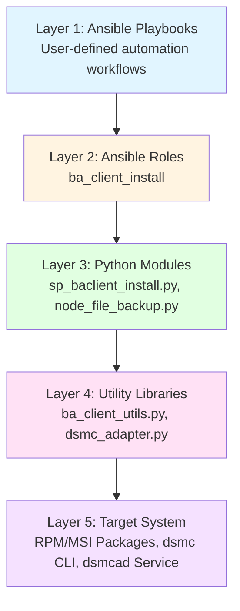

### 2. Component Relationships

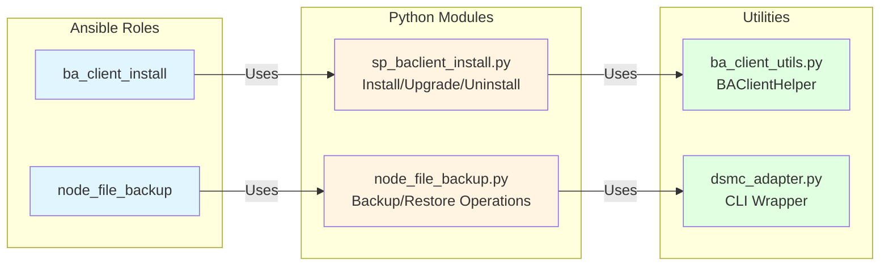

### 3. Target System Components

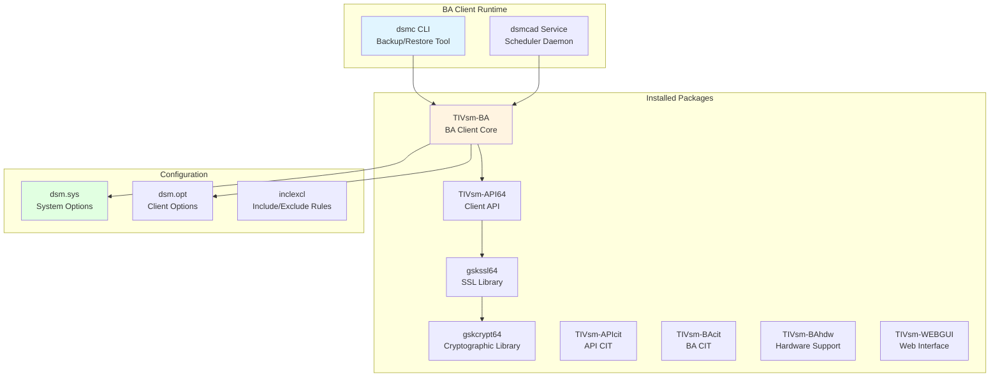

---

## Component Details

### 1. Python Modules

#### 1.1 sp_baclient_install.py

**Purpose**: Main module for BA Client lifecycle management (install/upgrade/uninstall)

**Key Classes**:
- [`BAClientHelper`](plugins/module_utils/ba_client_utils.py:41): Utility helper class
- `WinModuleShim`: Windows compatibility shim for non-Ansible environments

**Key Methods**:
- `check_installed()`: Verify BA Client installation status
- `verify_system_prereqs()`: Check system requirements
- `install()`: Fresh installation workflow
- `upgrade()`: Upgrade workflow
- `uninstall()`: Uninstallation workflow

**Supported States**:
- `present`: Install if not present, or verify if already installed
- `upgrade`: Upgrade to specified version
- `absent`: Uninstall BA Client

**Platform Support**:
- **Linux**: Full support via RPM packages
- **Windows**: Support via registry queries and silent installers

#### 1.2 node_file_backup.py

**Purpose**: Backup and restore operations for files and directories

**Key Operations**:
- Incremental backup
- Selective backup
- Archive
- Restore
- Retrieve

**Integration**: Uses [`dsmc_adapter.py`](plugins/module_utils/dsmc_adapter.py:1) for CLI operations

---

### 2. Module Utilities

#### 2.1 ba_client_utils.py

**Purpose**: Reusable utility functions for BA Client operations

**Key Class**: [`BAClientHelper`](plugins/module_utils/ba_client_utils.py:41)

**Key Methods**:

**Platform Detection**:
- [`is_windows()`](plugins/module_utils/ba_client_utils.py:63): Detect Windows platform
- `is_linux()`: Detect Linux platform

**Installation Checks**:
- [`check_installed()`](plugins/module_utils/ba_client_utils.py:72): Check if BA Client is installed
  - Linux: Uses `rpm -q TIVsm-BA`
  - Windows: Queries registry `HKLM\SOFTWARE\IBM\ADSM\CurrentVersion\Api64`

**Version Management**:
- [`is_newer_version()`](plugins/module_utils/ba_client_utils.py:66): Compare version strings
- `extract_version()`: Parse version from package name

**System Verification**:
- [`verify_system_prereqs()`](plugins/module_utils/ba_client_utils.py:96): Check prerequisites
  - Minimum disk space: 1500 MB
  - Compatible architectures: x86_64, AMD64
  - Administrator/root privileges

**File Operations**:
- [`file_exists()`](plugins/module_utils/ba_client_utils.py:60): Check file existence
- `extract_package()`: Extract tar/zip packages
- `cleanup_temp()`: Clean temporary files

**Command Execution**:
- [`run_cmd()`](plugins/module_utils/ba_client_utils.py:45): Execute shell commands with error handling

#### 2.2 dsmc_adapter.py

**Purpose**: Wrapper for dsmc CLI operations

**Key Functions**:
- Execute backup commands
- Execute restore commands
- Parse dsmc output
- Handle authentication

---

### 3. Ansible Roles

#### 3.1 ba_client_install

**Purpose**: Complete BA Client installation, upgrade, and uninstallation

**Main Tasks**: [`main.yml`](roles/ba_client_install/tasks/main.yml:1)

**Task Flow**:
1. [`local_repo_check.yml`](roles/ba_client_install/tasks/local_repo_check.yml:1): Validate package availability
2. [`determine_action.yml`](roles/ba_client_install/tasks/determine_action.yml:1): Determine install/upgrade action
3. `system_info`: Gather system facts
4. [`ba_client_install_linux.yml`](roles/ba_client_install/tasks/ba_client_install_linux.yml:1): Execute installation
5. [`ba_client_upgrade_linux.yml`](roles/ba_client_install/tasks/ba_client_upgrade_linux.yml:1): Execute upgrade
6. [`ba_client_uninstall_linux.yml`](roles/ba_client_install/tasks/ba_client_uninstall_linux.yml:1): Execute uninstallation

**Key Variables**:
- `ba_client_state`: present/absent
- `ba_client_version`: Target version
- `ba_client_bin_repo`: Binary repository path
- `ba_client_start_daemon`: Start dsmcad service (default: true)

**Installation Sequence** (Linux):
1. gskcrypt64 (Cryptographic library)
2. gskssl64 (SSL library)
3. TIVsm-API64 (Client API)
4. TIVsm-APIcit (API CIT)
5. TIVsm-BA (BA Client core)
6. TIVsm-BAcit (BA CIT)
7. TIVsm-BAhdw (Hardware support)
8. TIVsm-WEBGUI (Web interface)

#### 3.2 node_file_backup

**Purpose**: Execute backup and restore operations

**Main Tasks**: [`main.yml`](roles/node_file_backup/tasks/main.yml:1)

**Capabilities**:
- On-demand backups
- Scheduled backups
- Selective restore
- Archive management

---

## Data Flow Diagrams

### Installation Workflow (Linux)

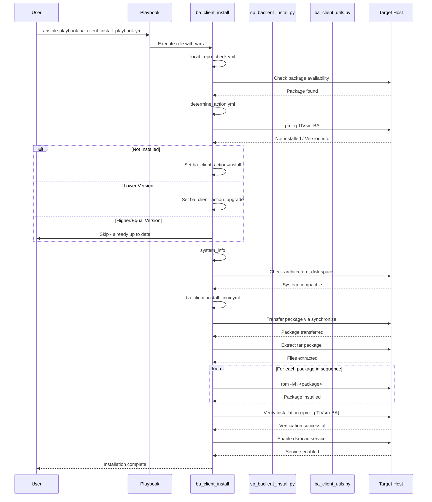

### Upgrade Workflow

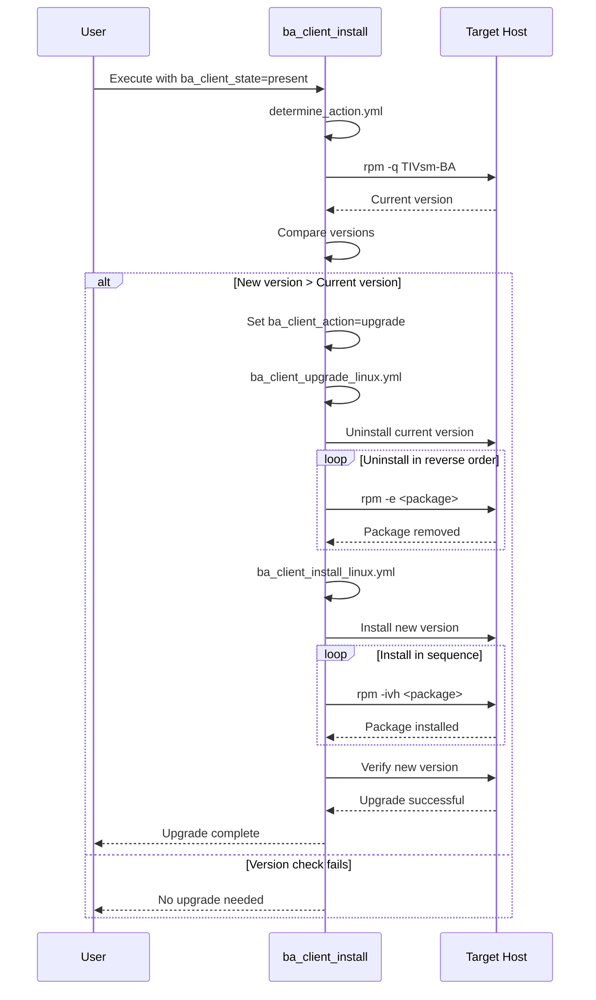

### Backup Operation Workflow

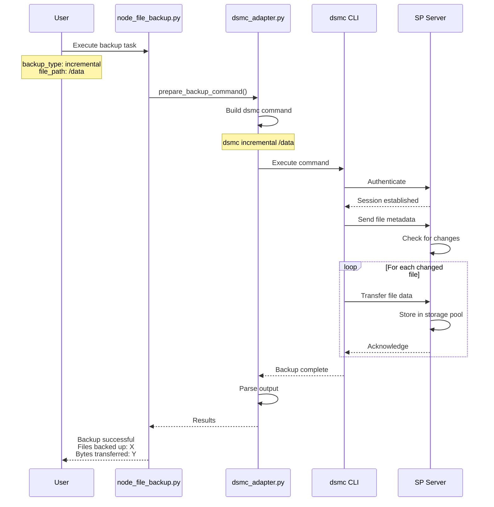

### Uninstallation Workflow

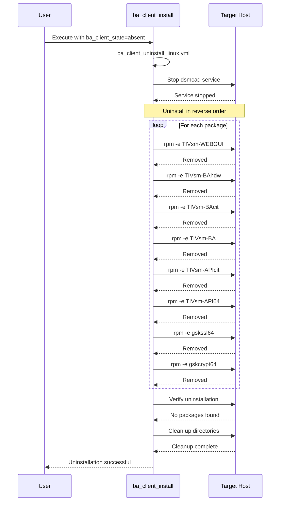

---

## Installation Package Structure

### 1. Package Extraction

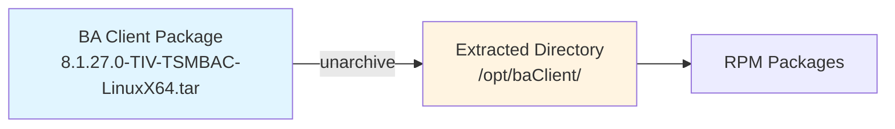

### 2. Package Dependencies

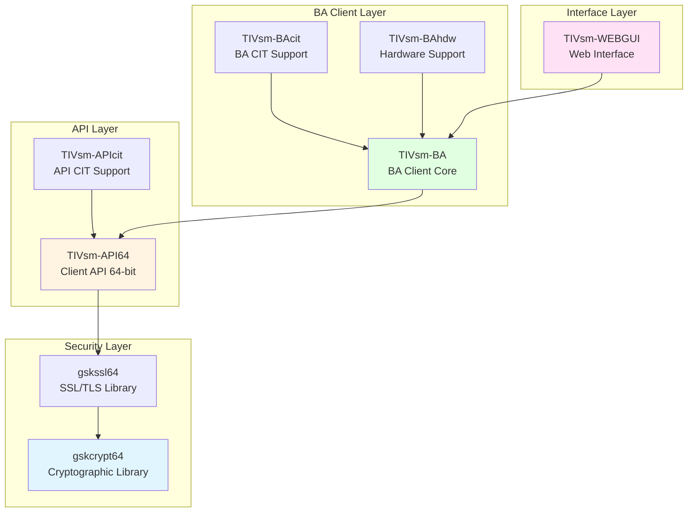

### 3. Installed Directory Structure

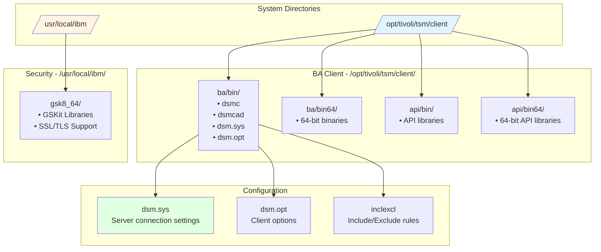

---

## Error Handling and Rollback

### Installation Failure Rollback

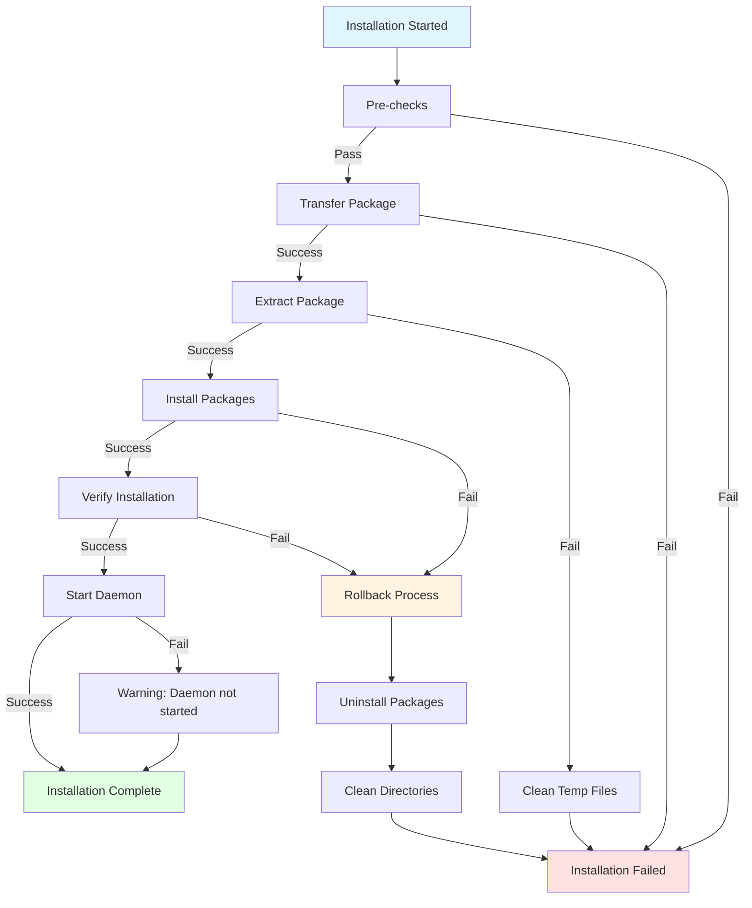

### Package Installation Sequence with Error Handling

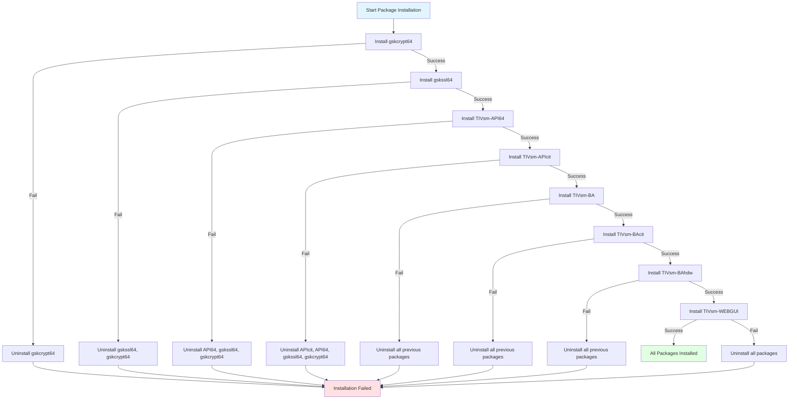

---

## Platform-Specific Implementation

### Linux Implementation

**Package Manager**: RPM (Red Hat Package Manager)

**Installation Method**:
- Extract tar package
- Install RPMs in sequence using `rpm -ivh`
- Verify using `rpm -q`

**Service Management**:
- systemd service: `dsmcad.service`
- Enable: `systemctl enable dsmcad.service`
- Start: `systemctl start dsmcad.service`

**Key Paths**:
- Binaries: `/opt/tivoli/tsm/client/ba/bin`
- Configuration: `/opt/tivoli/tsm/client/ba/bin/dsm.sys`
- GSKit: `/usr/local/ibm/gsk8_64`

### Windows Implementation

**Package Manager**: MSI/EXE installers

**Installation Method**:
- Silent installation using installer flags
- Registry-based detection
- WMI queries for verification

**Service Management**:
- Windows Service: `TSM Client Acceptor Daemon`
- Managed via Services console or `sc` command

**Key Paths**:
- Binaries: `C:\Program Files\Tivoli\TSM\baclient`
- Configuration: `C:\Program Files\Tivoli\TSM\baclient\dsm.opt`

**Registry Keys**:
- Installation detection: `HKLM\SOFTWARE\IBM\ADSM\CurrentVersion\Api64`
- Version info: `PtfLevel` value

---

## Testing Strategy

### Test Coverage

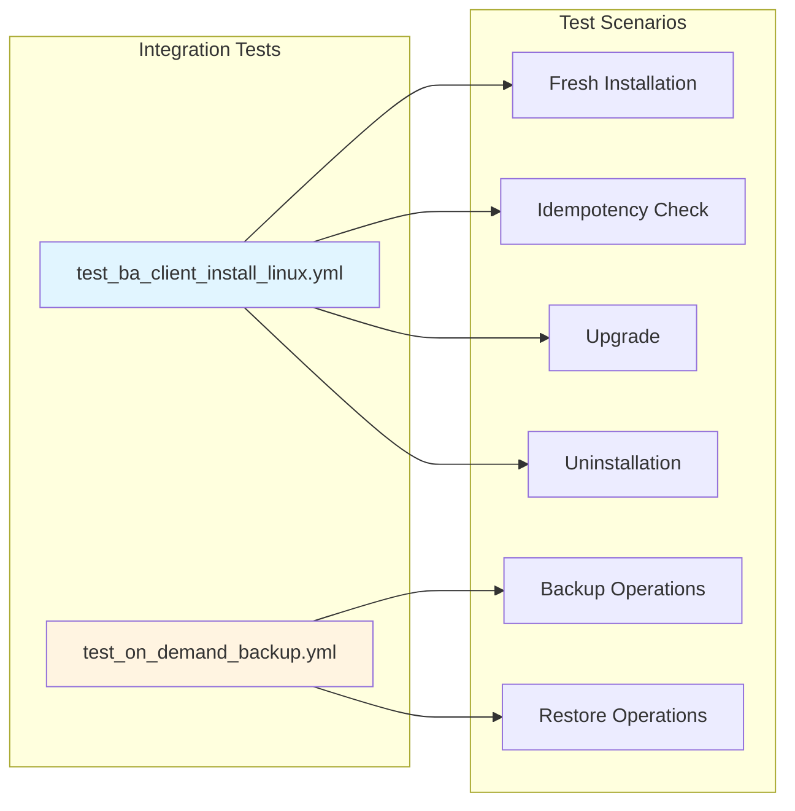

### Test Execution Flow

1. **Fresh Installation Test**
   - Verify package availability
   - Execute installation
   - Verify installed packages
   - Check service status

2. **Idempotency Test**
   - Run installation again
   - Verify no changes made
   - Confirm version unchanged

3. **Upgrade Test**
   - Install base version
   - Upgrade to newer version
   - Verify version change
   - Validate functionality

4. **Uninstallation Test**
   - Uninstall BA Client
   - Verify package removal
   - Check cleanup

5. **Backup/Restore Test**
   - Create test files
   - Execute backup
   - Delete test files
   - Execute restore
   - Verify file recovery

---

## Security Considerations

### Authentication

**Server Authentication**:
- Configured in `dsm.sys` file
- Server address and port
- Node name and password

**Password Management**:
- Stored in encrypted format
- Can use password file or prompt
- Environment variable support

### Data Security

**Encryption**:
- In-transit encryption via SSL/TLS
- GSKit libraries provide cryptographic support
- Certificate-based authentication supported

**Access Control**:
- Node-level access control
- File-level include/exclude rules
- Administrator privileges required for installation

---

## Performance Considerations

### Resource Requirements

**Minimum Requirements**:
- Disk Space: 1500 MB free
- Supported Architectures: x86_64, AMD64, s390x, ppc64le
- Memory: 512 MB minimum, 1 GB recommended
- Network: TCP/IP connectivity to SP Server

**Backup Performance**:
- Incremental backups reduce data transfer
- Compression reduces network usage
- Deduplication at server level
- Parallel sessions for large datasets

---

## Implementation Gaps and Analysis

### Current Implementation Status

✅ **Fully Implemented**:
- BA Client installation (Linux)
- BA Client upgrade (Linux)
- BA Client uninstallation (Linux)
- Version detection and comparison
- System compatibility checks
- Package dependency management
- Service management (dsmcad)
- Rollback on installation failure

### Identified Gaps

#### 1. Platform Support Gaps

| Platform | Installation | Configuration | Backup/Restore | Status |
|----------|-------------|---------------|----------------|---------|
| **Linux** | ✅ Complete | ⚠️ Partial | ✅ Complete | Production Ready |
| **Windows** | ⚠️ Partial | ❌ Missing | ⚠️ Partial | In Development |
| **AIX** | ❌ Missing | ❌ Missing | ❌ Missing | Not Started |

**Gap Details**:
- Windows implementation exists but lacks full integration testing
- AIX support mentioned in design but no implementation found
- Windows service management needs enhancement

#### 2. Configuration Management Gaps

**Missing Features**:
- ❌ Automated dsm.sys configuration
- ❌ Automated dsm.opt configuration
- ❌ Include/exclude rule management
- ❌ Schedule configuration automation
- ❌ SSL certificate configuration

**Current State**: Manual configuration required post-installation

#### 3. Backup/Restore Gaps

**Missing Modules**:
- ⚠️ Limited backup type support
- ❌ Archive management module
- ❌ Retrieve operations module
- ❌ Backup verification module
- ❌ Restore validation module

**Current State**: Basic backup/restore via [`node_file_backup`](roles/node_file_backup/tasks/main.yml:1) role

#### 4. Monitoring and Reporting Gaps

**Missing Features**:
- ❌ Backup status monitoring
- ❌ Storage usage reporting
- ❌ Failed backup alerts
- ❌ Performance metrics collection
- ❌ Integration with monitoring tools

#### 5. Testing Gaps

**Current Test Coverage**:
- ✅ Integration tests for Linux installation
- ✅ Integration tests for backup operations

**Missing Tests**:
- ❌ Unit tests for utility functions
- ❌ Windows platform tests
- ❌ AIX platform tests
- ❌ Configuration management tests
- ❌ Performance tests
- ❌ Security tests

#### 6. Documentation Gaps

**Missing Documentation**:
- ❌ Windows installation guide
- ❌ AIX installation guide
- ❌ Configuration best practices
- ❌ Backup strategy guide
- ❌ Troubleshooting playbooks
- ❌ Performance tuning guide

#### 7. Error Handling Gaps

**Areas Needing Improvement**:
- ⚠️ Limited error recovery for network failures
- ⚠️ Insufficient validation of configuration files
- ⚠️ Missing pre-flight checks for backup operations
- ⚠️ Incomplete logging for troubleshooting

---

## Next Steps and Roadmap

### Phase 1: Platform Completion (Priority: High)

**Timeline**: Q2 2026

1. **Windows Support Enhancement**
   - Complete Windows installation implementation
   - Add Windows service management
   - Create Windows-specific roles
   - Add Windows integration tests
   - Document Windows deployment

2. **AIX Support**
   - Implement AIX installation workflow
   - Add AIX package management
   - Create AIX-specific roles
   - Add AIX integration tests
   - Document AIX deployment

**Deliverables**:
- Fully functional Windows and AIX support
- Platform-specific documentation
- Integration test suites for all platforms

### Phase 2: Configuration Management (Priority: High)

**Timeline**: Q3 2026

1. **Configuration Automation**
   - Create dsm.sys configuration module
   - Implement dsm.opt management
   - Add include/exclude rule automation
   - Develop schedule configuration
   - Implement SSL certificate management

2. **Configuration Validation**
   - Add configuration syntax checking
   - Implement connectivity testing
   - Create configuration backup/restore

**Deliverables**:
- Complete configuration automation
- Configuration validation tools
- Best practices documentation

### Phase 3: Backup/Restore Enhancement (Priority: Medium)

**Timeline**: Q4 2026

1. **Extended Backup Operations**
   - Implement archive management
   - Add retrieve operations
   - Create backup verification
   - Develop restore validation
   - Add selective backup/restore

2. **Advanced Features**
   - Implement incremental forever
   - Add journal-based backup
   - Create image backup support
   - Develop VM backup integration

**Deliverables**:
- Complete backup/restore automation
- Advanced backup strategies
- Backup validation framework

### Phase 4: Monitoring and Reporting (Priority: Medium)

**Timeline**: Q1 2027

1. **Monitoring Integration**
   - Implement backup status monitoring
   - Add storage usage reporting
   - Create alert mechanisms
   - Develop performance metrics
   - Integrate with monitoring tools

2. **Reporting**
   - Create backup reports
   - Implement compliance reporting
   - Add capacity planning reports
   - Develop trend analysis

**Deliverables**:
- Monitoring and alerting framework
- Comprehensive reporting system
- Integration with external tools

### Phase 5: Testing and Quality (Priority: Ongoing)

**Timeline**: Continuous

1. **Test Coverage Expansion**
   - Add unit tests for all utilities
   - Expand integration test coverage
   - Implement performance tests
   - Add security tests
   - Create chaos engineering tests

2. **Quality Improvements**
   - Enhance error handling
   - Improve logging
   - Add input validation
   - Refactor code for maintainability

**Deliverables**:
- 80%+ test coverage
- Improved code quality metrics
- Enhanced reliability

### Quick Wins (Immediate Actions)

1. **Documentation**
   - Add inline code documentation
   - Create troubleshooting guides
   - Document best practices
   - Add more examples

2. **Error Handling**
   - Improve error messages
   - Add validation checks
   - Enhance logging
   - Add pre-flight checks

3. **Configuration**
   - Create configuration templates
   - Add validation scripts
   - Document common configurations
   - Provide example files

---

## Document Revision History

| Version | Date | Author | Changes |
|---------|------|--------|---------|
| 1.0 | 2026-03-26 | System | Initial comprehensive design document with architecture diagrams |

---

## References

- [IBM Storage Protect 8.1.27 Documentation](https://www.ibm.com/docs/en/storage-protect/8.1.27)
- [IBM Storage Protect BA Client Documentation](https://www.ibm.com/docs/en/storage-protect/8.1.27?topic=clients-backup-archive-client)
- [Ansible Collection: ibm.storage_protect](https://galaxy.ansible.com/ibm/storage_protect)
- [Ansible Best Practices](https://docs.ansible.com/ansible/latest/user_guide/playbooks_best_practices.html)
