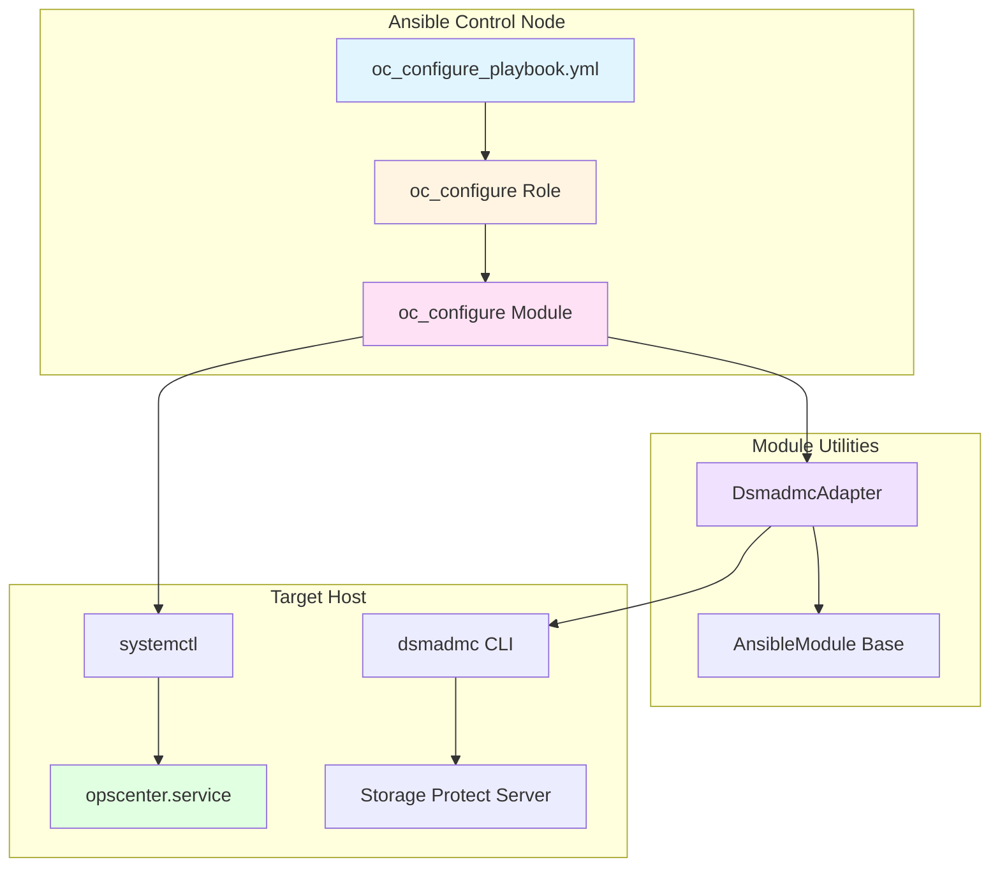
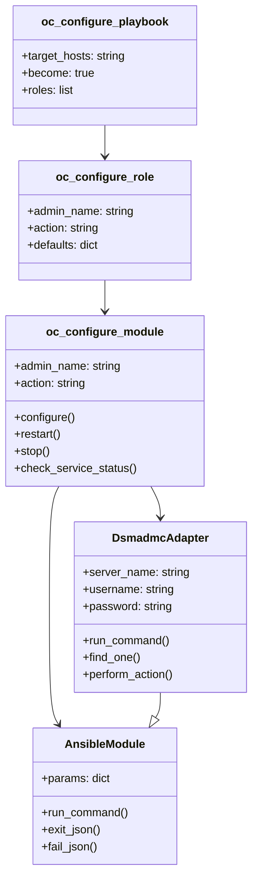
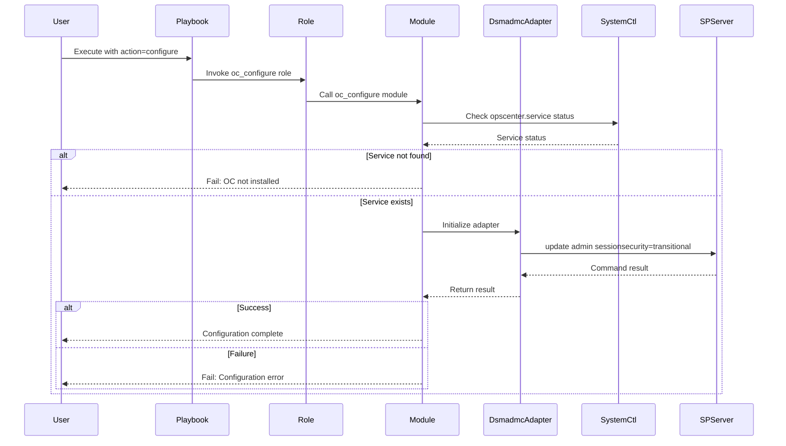
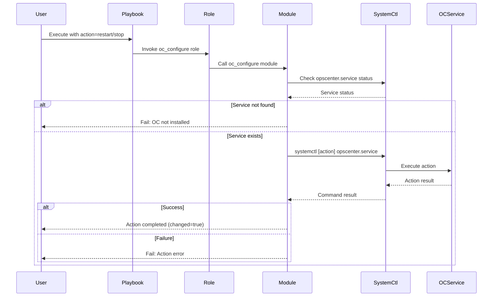
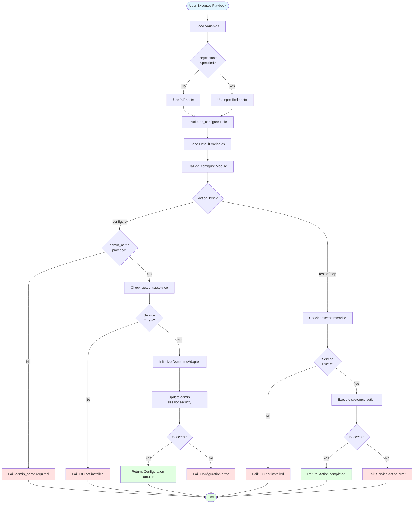
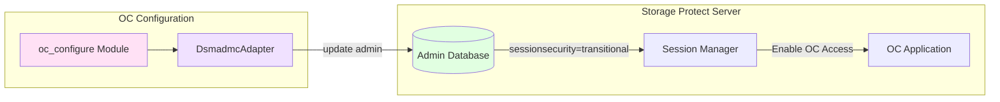
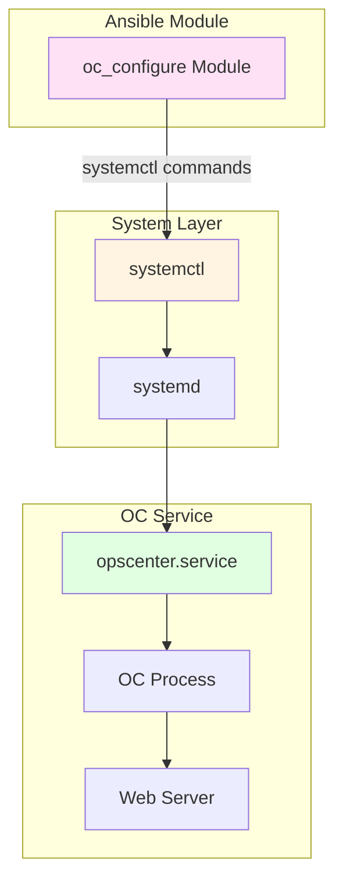

# IBM Storage Protect Operations Center (OC) Configuration Design

## Overview

The Operations Center (OC) configuration component provides Ansible automation for managing IBM Storage Protect Operations Center. It enables administrators to configure, start, stop, and restart the Operations Center service through a unified Ansible interface.

## Architecture

### Component Overview



### Component Relationships



## Data Flow

### Configuration Flow



### Service Control Flow



## Component Details

### 1. Playbook Layer

**File**: [`playbooks/oc_configure_playbook.yml`](../../playbooks/oc_configure_playbook.yml)

```yaml
Purpose: Entry point for OC operations
Features:
  - Dynamic host targeting via target_hosts variable
  - Privilege escalation (become: true)
  - Role-based execution
```

### 2. Role Layer

**Path**: [`roles/oc_configure/`](../../roles/oc_configure/)

#### Structure
```
roles/oc_configure/
├── README.md           # Role documentation
├── defaults/main.yml   # Default variables
├── meta/main.yml       # Role metadata
└── tasks/main.yml      # Main task file
```

#### Default Variables
| Variable | Default | Description |
|----------|---------|-------------|
| `admin_name` | "" | OC admin username (required for configure action) |
| `action` | "configure" | Action to perform (configure/restart/stop) |

#### Tasks
- Invokes [`oc_configure`](../../plugins/modules/oc_configure.py) module with parameters

### 3. Module Layer

**File**: [`plugins/modules/oc_configure.py`](../../plugins/modules/oc_configure.py)

#### Module Parameters

| Parameter | Type | Required | Choices | Description |
|-----------|------|----------|---------|-------------|
| `admin_name` | string | Conditional* | - | Admin user of the hub server |
| `action` | string | Yes | configure, restart, stop | Action to perform |

*Required when action is 'configure'

#### Module Operations

##### Configure Action
1. Validates `admin_name` is provided
2. Checks if `opscenter.service` exists via systemctl
3. Uses [`DsmadmcAdapter`](../../plugins/module_utils/dsmadmc_adapter.py) to execute:
   ```
   update admin {admin_name} sessionsecurity=transitional
   ```
4. Returns success message with OC access URL

##### Restart/Stop Actions
1. Checks if `opscenter.service` exists via systemctl
2. Executes: `systemctl [action] opscenter.service`
3. Returns result with changed status

#### Error Handling
- Service not found: Fails with "OC is not installed or service is not registered"
- Configuration failure: Returns dsmadmc command output
- Service control failure: Returns systemctl error details

### 4. Utility Layer

**File**: [`plugins/module_utils/dsmadmc_adapter.py`](../../plugins/module_utils/dsmadmc_adapter.py)

#### DsmadmcAdapter Class

Extends `AnsibleModule` to provide Storage Protect CLI integration.

##### Authentication Parameters
| Parameter | Environment Variable | Description |
|-----------|---------------------|-------------|
| `server_name` | `STORAGE_PROTECT_SERVERNAME` | Server name (default: 'local') |
| `username` | `STORAGE_PROTECT_USERNAME` | Admin username |
| `password` | `STORAGE_PROTECT_PASSWORD` | Admin password |
| `request_timeout` | `STORAGE_PROTECT_REQUEST_TIMEOUT` | Timeout in seconds (default: 10) |

##### Key Methods

###### `run_command(command, auto_exit=True, dataonly=True, exit_on_fail=True)`
- Constructs and executes dsmadmc commands
- Format: `dsmadmc -servername={server} -id={user} -pass={pass} [-dataonly=yes] {command}`
- Handles return codes:
  - 0: Success
  - 10: No changes needed (idempotent)
  - Other: Error

###### `find_one(object_type, name, fail_on_not_found=False)`
- Queries for specific Storage Protect objects
- Returns existence status and object details

###### `perform_action(action, object_type, object_identifier, options='', exists=False, existing=None, auto_exit=True)`
- Performs CRUD operations on Storage Protect objects
- Implements idempotency checking
- Handles object lifecycle management

## Execution Flow

### Complete Workflow



## Usage Examples

### Configure Operations Center

```bash
# Set environment variables
export STORAGE_PROTECT_SERVERNAME="your_server_name"
export STORAGE_PROTECT_USERNAME="your_username"
export STORAGE_PROTECT_PASSWORD="your_password"

# Execute configuration
ansible-playbook -i inventory.ini \
  ibm.storage_protect.oc_configure_playbook.yml \
  -e @vars.yml
```

**vars.yml**:
```yaml
admin_name: "tsmuser1"
action: "configure"
target_hosts: "oc_servers"
```

### Stop Operations Center

```bash
ansible-playbook -i inventory.ini \
  ibm.storage_protect.oc_configure_playbook.yml \
  -e 'action=stop'
```

### Restart Operations Center

```bash
ansible-playbook -i inventory.ini \
  ibm.storage_protect.oc_configure_playbook.yml \
  -e 'action=restart'
```

## Integration Points

### Storage Protect Server Integration



### System Service Integration



## Requirements

### Prerequisites
1. IBM Storage Protect Operations Center must be installed
2. `opscenter.service` must be registered with systemd
3. Storage Protect client must be installed and registered with the server
4. Valid admin credentials with appropriate permissions

### Environment Variables
```bash
STORAGE_PROTECT_SERVERNAME  # Server name (default: 'local')
STORAGE_PROTECT_USERNAME    # Admin username
STORAGE_PROTECT_PASSWORD    # Admin password
STORAGE_PROTECT_REQUEST_TIMEOUT  # Optional timeout in seconds
```

### Permissions
- Root or sudo access on target hosts (become: true)
- Storage Protect admin privileges for configuration actions
- systemctl permissions for service management

## Error Scenarios

### Common Errors and Resolutions

| Error | Cause | Resolution |
|-------|-------|------------|
| "OC is not installed or service is not registered" | opscenter.service not found | Install OC or register service with systemd |
| "'admin_name' is required when action is 'configure'" | Missing admin_name parameter | Provide admin_name in variables |
| "Failed to configure the OC" | dsmadmc command failed | Check admin credentials and permissions |
| "Failed to restart/stop the OC" | systemctl command failed | Check service status and system logs |

## Testing

**Test File**: [`tests/integration/targets/oc_configure/test_oc_configure.yml`](../../tests/integration/targets/oc_configure/test_oc_configure.yml)

### Test Coverage
- Service status verification
- Configuration action execution
- Service control actions (restart/stop)
- Error handling validation

## Security Considerations

1. **Credential Management**
   - Passwords stored in environment variables
   - No logging of sensitive parameters (no_log: true)
   - Credentials passed via secure channels

2. **Session Security**
   - Sets `sessionsecurity=transitional` for OC access
   - Enables secure communication between OC and Storage Protect server

3. **Access Control**
   - Requires admin-level privileges
   - Service operations require root/sudo access
   - OC accessible via HTTPS

## Performance Considerations

- **Idempotency**: Module checks current state before making changes
- **Timeout Handling**: Configurable request timeout (default: 10 seconds)
- **Service Management**: Uses systemctl for efficient service control
- **Command Execution**: Direct subprocess calls for minimal overhead

## Future Enhancements

1. **Configuration Options**
   - Support for additional OC configuration parameters
   - Custom port and hostname configuration
   - SSL/TLS certificate management

2. **Monitoring Integration**
   - Health check capabilities
   - Status reporting
   - Log aggregation

3. **Multi-Server Support**
   - Hub server configuration
   - Spoke server management
   - Distributed OC deployment

## References

- [IBM Storage Protect Operations Center Documentation](https://www.ibm.com/docs/en/storage-protect)
- [Ansible Module Development](https://docs.ansible.com/ansible/latest/dev_guide/developing_modules_general.html)
- [systemd Service Management](https://www.freedesktop.org/software/systemd/man/systemctl.html)

## Related Components

- [`sp_server_install`](design-sp-server.md) - Storage Protect Server installation
- [`ba_client_install`](design-ba-client.md) - Backup-Archive client installation
- [`dsmadmc_adapter`](../../plugins/module_utils/dsmadmc_adapter.py) - CLI adapter utility

---

**Document Version**: 1.0  
**Last Updated**: 2026-03-26  
**Author**: Reverse-engineered from codebase