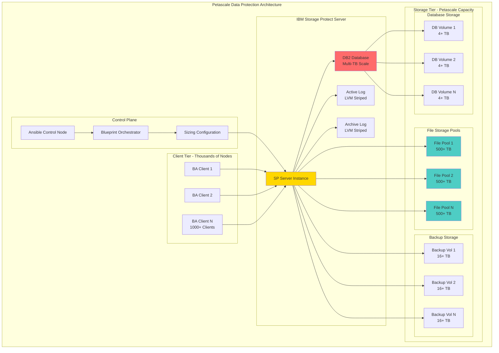
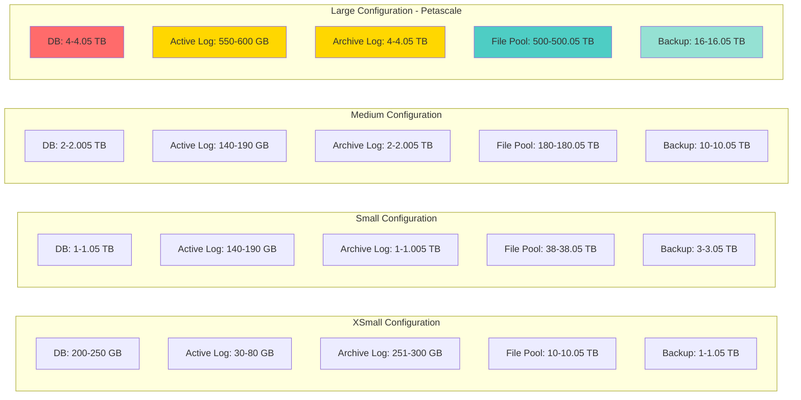
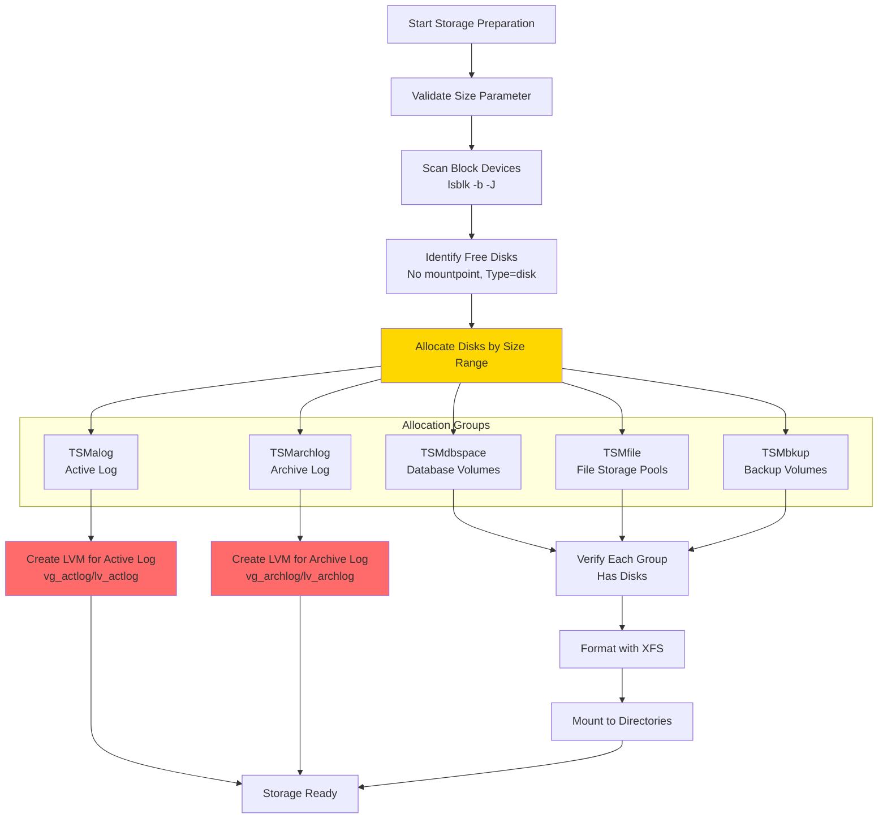
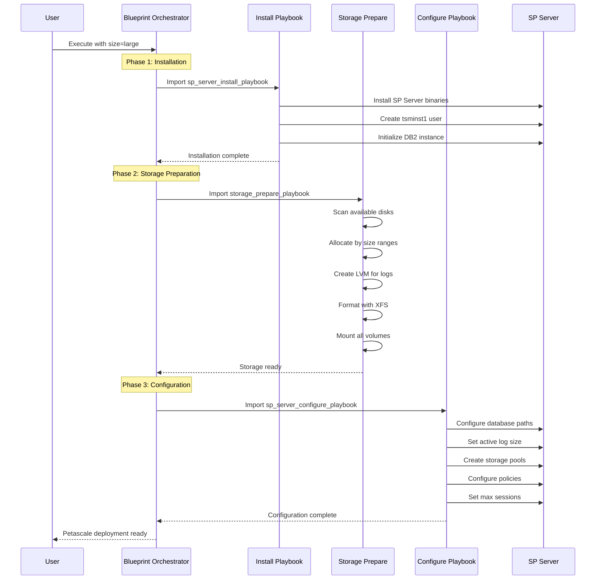
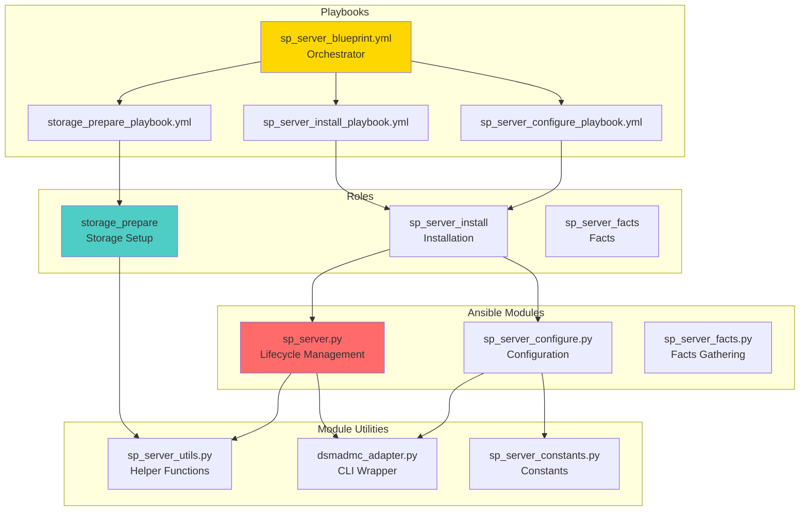
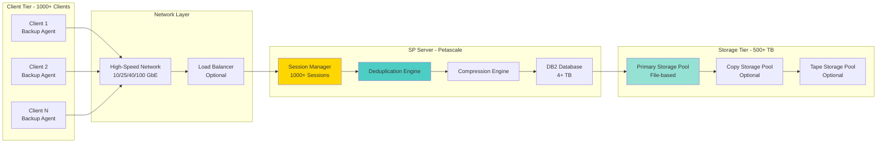
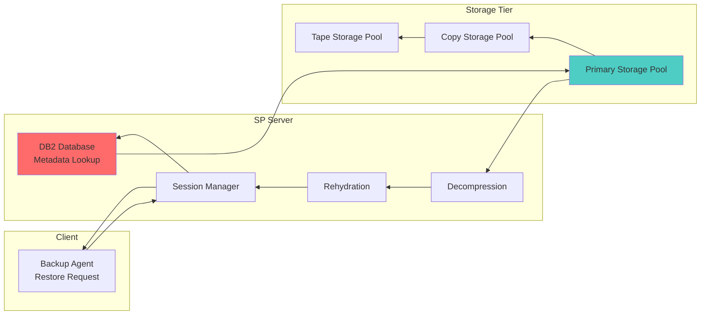
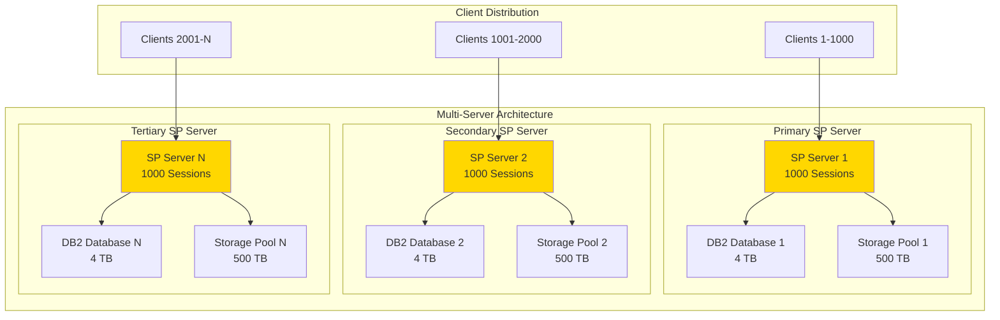
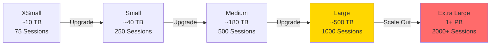

# Petascale Data Protection Design

## Document Information

**Document Version**: 1.0  
**Last Updated**: 2026-03-29  
**Status**: Active  
**Reference**: [IBM Petascale Data Protection White Paper](https://www.ibm.com/support/pages/system/files/inline-files/$FILE/Petascale_Data_Protection.pdf)

---

## Table of Contents

1. [Executive Summary](#executive-summary)
2. [Introduction](#introduction)
3. [Architecture Overview](#architecture-overview)
4. [Sizing Configurations](#sizing-configurations)
5. [Storage Architecture](#storage-architecture)
6. [Implementation Design](#implementation-design)
7. [Automation Components](#automation-components)
8. [Data Flow](#data-flow)
9. [Performance Optimization](#performance-optimization)
10. [Scalability Considerations](#scalability-considerations)
11. [Implementation Roadmap](#implementation-roadmap)
12. [References](#references)

---

## Executive Summary

### Purpose

This document describes the design and implementation of Petascale Data Protection capabilities using IBM Storage Protect, automated through Ansible. It addresses the challenges of protecting massive data volumes (petabytes to exabytes) with high performance, scalability, and reliability requirements.

### Key Objectives

1. **Massive Scale**: Support data protection at petabyte and exabyte scales
2. **High Performance**: Achieve high throughput for backup and restore operations
3. **Automation**: Provide fully automated deployment and configuration
4. **Flexibility**: Support multiple deployment sizes from development to production
5. **Reliability**: Ensure data integrity and availability at scale

### Business Value

- **Reduced TCO**: Automated deployment reduces manual effort and errors
- **Faster Time-to-Value**: Pre-configured blueprints accelerate deployment
- **Scalability**: Grow from small to petascale deployments seamlessly
- **Risk Mitigation**: Validated configurations reduce deployment risks
- **Operational Efficiency**: Standardized automation improves operations

---

## Introduction

### What is Petascale Data Protection?

Petascale Data Protection refers to the capability to protect data volumes measured in petabytes (10^15 bytes) or larger. This requires specialized architecture, storage configurations, and operational practices to achieve:

- **High Throughput**: Multiple TB/hour backup rates
- **Massive Capacity**: Petabytes to exabytes of protected data
- **Concurrent Operations**: Thousands of simultaneous client sessions
- **Efficient Storage**: Deduplication and compression at scale
- **Fast Recovery**: Rapid restore capabilities for large datasets

### Challenges at Petascale

1. **Storage Management**: Managing thousands of storage volumes
2. **Performance**: Maintaining throughput with massive data volumes
3. **Scalability**: Supporting thousands of concurrent clients
4. **Database Size**: Managing multi-terabyte SP Server databases
5. **Network Bandwidth**: Optimizing data transfer at scale
6. **Operational Complexity**: Automating complex configurations

### Solution Approach

The IBM Storage Protect Ansible Collection provides automated deployment of petascale-capable configurations through:

- **Blueprint-Based Deployment**: Pre-configured sizing templates
- **Automated Storage Provisioning**: Dynamic disk allocation and formatting
- **Optimized Configurations**: Performance-tuned settings for each scale
- **Modular Architecture**: Composable components for flexibility

---

## Architecture Overview

### High-Level Architecture



### Deployment Sizes

The collection supports four pre-configured deployment sizes:

| Size | Use Case | Max Sessions | DB Size | Storage Capacity | Clients |
|------|----------|--------------|---------|------------------|---------|
| **XSmall** | Development/Test | 75 | ~250 GB | ~10 TB | <100 |
| **Small** | Small Production | 250 | ~1 TB | ~40 TB | 100-500 |
| **Medium** | Medium Production | 500 | ~2 TB | ~180 TB | 500-1000 |
| **Large** | Petascale Production | 1000+ | ~4+ TB | ~500+ TB | 1000+ |

---

## Sizing Configurations

### Storage Allocation by Size

Based on [`roles/storage_prepare/defaults/main.yml`](../../roles/storage_prepare/defaults/main.yml):



### Session Limits by Size

From [`roles/sp_server_install/defaults/main.yml`](../../roles/sp_server_install/defaults/main.yml):

```yaml
max_sessions:
  xsmall: 75      # Development/Test
  small: 250      # Small Production
  medium: 500     # Medium Production
  large: 1000     # Petascale Production
```

### Active Log Sizing

```yaml
act_log_size:
  xsmall: 24576    # 24 GB
  small: 131072    # 128 GB
  medium: 131072   # 128 GB
  large: 524032    # 512 GB
```

---

## Storage Architecture

### Disk Allocation Strategy

The storage preparation role ([`roles/storage_prepare/tasks/storage_prepare_linux.yml`](../../roles/storage_prepare/tasks/storage_prepare_linux.yml)) implements intelligent disk allocation:



### Storage Layout

```mermaid
graph TB
    subgraph "Physical Storage Layer"
        DISK1[Physical Disk 1]
        DISK2[Physical Disk 2]
        DISKN[Physical Disk N]
    end
    
    subgraph "Logical Volume Management"
        VG_ALOG[Volume Group: vg_actlog]
        LV_ALOG[Logical Volume: lv_actlog]
        VG_ARCH[Volume Group: vg_archlog]
        LV_ARCH[Logical Volume: lv_archlog]
    end
    
    subgraph "Filesystem Layer - XFS"
        FS_DB[/tsminst1/TSMdbspace*]
        FS_ALOG[/tsminst1/TSMalog]
        FS_ARCH[/tsminst1/TSMarchlog]
        FS_FILE[/tsminst1/TSMfile*]
        FS_BKP[/tsminst1/TSMbkup*]
    end
    
    subgraph "SP Server Layer"
        DB2_DB[DB2 Database]
        ACTLOG[Active Log]
        ARCHLOG[Archive Log]
        STGPOOL[Storage Pools]
        DBBACKUP[DB Backup]
    end
    
    DISK1 --> VG_ALOG
    DISK2 --> VG_ARCH
    DISKN --> FS_DB
    DISKN --> FS_FILE
    DISKN --> FS_BKP
    
    VG_ALOG --> LV_ALOG
    VG_ARCH --> LV_ARCH
    
    LV_ALOG --> FS_ALOG
    LV_ARCH --> FS_ARCH
    
    FS_DB --> DB2_DB
    FS_ALOG --> ACTLOG
    FS_ARCH --> ARCHLOG
    FS_FILE --> STGPOOL
    FS_BKP --> DBBACKUP
    
    style VG_ALOG fill:#ff6b6b
    style VG_ARCH fill:#ff6b6b
    style DB2_DB fill:#ffd700
    style STGPOOL fill:#4ecdc4
```

### Directory Structure

```
/tsminst1/
├── TSMdbspace01/          # Database volume 1
├── TSMdbspace02/          # Database volume 2
├── TSMdbspace03/          # Database volume 3
├── TSMdbspace04/          # Database volume 4
├── TSMdbspaceNN/          # Additional DB volumes (large config)
├── TSMalog/               # Active log (LVM striped)
├── TSMarchlog/            # Archive log (LVM striped)
├── TSMfile01/             # File storage pool 1
├── TSMfile02/             # File storage pool 2
├── TSMfileNN/             # Additional file pools
├── TSMbkup01/             # DB backup volume 1
├── TSMbkup02/             # DB backup volume 2
└── TSMbkupNN/             # Additional backup volumes
```

---

## Implementation Design

### Blueprint Orchestration

The petascale deployment is orchestrated through [`playbooks/sp_server_blueprint.yml`](../../playbooks/sp_server_blueprint.yml):



### Configuration Templates

The collection uses Jinja2 templates for configuration generation:

1. **Basics Configuration** ([`roles/sp_server_install/templates/basics.j2`](../../roles/sp_server_install/templates/basics.j2))
   - Server name and passwords
   - SSL configuration
   - Session limits

2. **Storage Pool Configuration** ([`roles/sp_server_install/templates/cntrpool.j2`](../../roles/sp_server_install/templates/cntrpool.j2))
   - File storage pool definitions
   - Deduplication settings
   - Capacity management

3. **Policy Configuration** ([`roles/sp_server_install/templates/policy.j2`](../../roles/sp_server_install/templates/policy.j2))
   - Retention policies
   - Copy groups
   - Management classes

4. **Schedule Configuration** ([`roles/sp_server_install/templates/schedules.j2`](../../roles/sp_server_install/templates/schedules.j2))
   - Backup schedules
   - Maintenance windows
   - DB backup schedules

---

## Automation Components

### Module Architecture



### Key Components

#### 1. Storage Prepare Role

**Location**: [`roles/storage_prepare/`](../../roles/storage_prepare/)

**Responsibilities**:
- Scan and identify available disks
- Allocate disks based on size ranges
- Create LVM volume groups for logs
- Format filesystems (XFS)
- Mount volumes to designated paths
- Generate path variables for SP Server

**Key Features**:
- Dynamic disk discovery using `lsblk`
- Size-based allocation (xsmall, small, medium, large)
- LVM striping for active and archive logs
- Idempotent operations
- Validation of disk availability

#### 2. SP Server Install Role

**Location**: [`roles/sp_server_install/`](../../roles/sp_server_install/)

**Responsibilities**:
- Pre-installation checks
- IBM Installation Manager setup
- SP Server binary installation
- User and group creation
- DB2 instance initialization
- Post-installation validation

#### 3. SP Server Module

**Location**: [`plugins/modules/sp_server.py`](../../plugins/modules/sp_server.py)

**Capabilities**:
- Install/Upgrade/Uninstall operations
- Version management
- State management
- Error handling and rollback

---

## Data Flow

### Backup Data Flow - Petascale



### Restore Data Flow



---

## Performance Optimization

### Petascale Performance Factors

#### 1. Database Performance

```yaml
# Large configuration settings
act_log_size: 524032  # 512 GB active log
max_sessions: 1000    # Concurrent sessions
```

**Optimizations**:
- Large active log reduces log contention
- LVM striping for log I/O performance
- Multiple database volumes for parallelism
- DB2 tuning for large databases

#### 2. Storage Pool Performance

**File Storage Pool Configuration**:
- Multiple volumes (500+ TB each)
- XFS filesystem for large files
- Direct disk access (no LVM overhead)
- Parallel I/O operations

**Best Practices**:
- Use high-performance storage (NVMe, SSD)
- Separate storage pools by workload
- Enable deduplication for space efficiency
- Configure appropriate maxcapacity limits

#### 3. Network Performance

**Requirements**:
- 10 GbE minimum for petascale
- 25/40/100 GbE recommended
- Multiple network interfaces for load distribution
- Jumbo frames (MTU 9000) for large transfers

#### 4. Session Management

```yaml
# Session limits by size
max_sessions:
  large: 1000  # Petascale configuration
```

**Tuning**:
- Adjust based on workload patterns
- Monitor session utilization
- Configure session priorities
- Implement client scheduling

---

## Scalability Considerations

### Horizontal Scaling



### Vertical Scaling

**Database Scaling**:
- Add more database volumes
- Increase active log size
- Expand archive log capacity
- Optimize DB2 buffer pools

**Storage Scaling**:
- Add storage pool volumes
- Expand existing volumes
- Implement tiered storage
- Add tape libraries for long-term retention

**Compute Scaling**:
- Increase CPU cores
- Add memory (RAM)
- Optimize process affinity
- Enable parallel operations

### Growth Path



---

## Implementation Roadmap

### Phase 1: Foundation (Current)

**Status**: ✅ Implemented

**Components**:
- Blueprint orchestration framework
- Four sizing configurations (xsmall, small, medium, large)
- Automated storage preparation
- Basic SP Server installation and configuration
- Template-based configuration generation

**Deliverables**:
- [`playbooks/sp_server_blueprint.yml`](../../playbooks/sp_server_blueprint.yml)
- [`roles/storage_prepare/`](../../roles/storage_prepare/)
- [`roles/sp_server_install/`](../../roles/sp_server_install/)
- Size-specific variable files

### Phase 2: Enhanced Petascale Support (Q2 2026)

**Status**: 🔄 Planned

**Enhancements**:
1. **Extra-Large Configuration**
   - Support for 1+ PB deployments
   - 2000+ concurrent sessions
   - Enhanced database sizing

2. **Advanced Storage Management**
   - Automated storage pool expansion
   - Dynamic volume addition
   - Storage tiering support

3. **Performance Monitoring**
   - Built-in performance metrics collection
   - Capacity planning tools
   - Bottleneck identification

**Deliverables**:
- XLarge sizing configuration
- Storage expansion playbooks
- Performance monitoring role
- Capacity planning utilities

### Phase 3: Multi-Server Orchestration (Q3 2026)

**Status**: 📋 Planned

**Features**:
1. **Multi-Server Deployment**
   - Automated deployment of multiple SP Servers
   - Load distribution configuration
   - Centralized management

2. **Replication and DR**
   - Server-to-server replication setup
   - Disaster recovery automation
   - Failover procedures

3. **High Availability**
   - Cluster configuration
   - Automatic failover
   - Health monitoring

**Deliverables**:
- Multi-server blueprint
- Replication configuration role
- HA setup playbooks
- DR automation

### Phase 4: Advanced Features (Q4 2026)

**Status**: 📋 Planned

**Features**:
1. **Container Storage Pools**
   - Cloud object storage integration
   - Container pool automation
   - Deduplication optimization

2. **Advanced Deduplication**
   - Client-side deduplication
   - Server-side optimization
   - Deduplication reporting

3. **Tape Integration**
   - Automated tape library configuration
   - Tape pool management
   - Long-term retention automation

**Deliverables**:
- Container pool role
- Deduplication optimization playbooks
- Tape management automation

### Phase 5: Cloud Integration (Q1 2027)

**Status**: 📋 Planned

**Features**:
1. **Cloud Storage Tiers**
   - AWS S3 integration
   - Azure Blob integration
   - Google Cloud Storage integration

2. **Hybrid Cloud**
   - On-premises to cloud replication
   - Cloud-based DR
   - Cost optimization

3. **Cloud-Native Deployment**
   - Kubernetes deployment
   - Container-based SP Server
   - Cloud-native storage

**Deliverables**:
- Cloud storage integration roles
- Hybrid cloud playbooks
- Kubernetes deployment manifests

---

## Best Practices

### Deployment Best Practices

1. **Start Small, Scale Up**
   - Begin with xsmall or small configuration
   - Test thoroughly before scaling
   - Use blueprint for consistent deployments

2. **Storage Planning**
   - Plan for 3-5 years of growth
   - Use high-performance storage for database and logs
   - Separate storage pools by workload

3. **Network Design**
   - Use dedicated backup network
   - Implement QoS for backup traffic
   - Plan for bandwidth growth

4. **Security**
   - Use Ansible Vault for sensitive data
   - Implement SSL/TLS for all connections
   - Regular security audits

### Operational Best Practices

1. **Monitoring**
   - Monitor database size and growth
   - Track storage pool utilization
   - Monitor session performance

2. **Maintenance**
   - Regular database backups
   - Periodic database reorganization
   - Storage pool reclamation

3. **Capacity Planning**
   - Monitor growth trends
   - Plan storage expansion proactively
   - Review sizing periodically

4. **Documentation**
   - Document custom configurations
   - Maintain runbooks
   - Track changes

---

## Security Considerations

### Authentication and Authorization

```yaml
# Secure password management
ssl_password: "{{ vault_ssl_password }}"
server_password: "{{ vault_server_password }}"
admin_password: "{{ vault_admin_password }}"
dbbk_password: "{{ vault_dbbk_password }}"
```

**Best Practices**:
- Use Ansible Vault for all passwords
- Implement strong password policies
- Regular password rotation
- Role-based access control

### Network Security

**Recommendations**:
- Dedicated backup network (VLAN)
- Firewall rules for SP Server ports
- SSL/TLS for all client connections
- Certificate-based authentication

### Data Security

**Features**:
- Encryption at rest (storage pools)
- Encryption in transit (SSL/TLS)
- Deduplication with encryption
- Secure key management

---

## Troubleshooting

### Common Issues

#### 1. Insufficient Disk Space

**Symptom**: Storage preparation fails with "no disks available"

**Solution**:
```bash
# Check available disks
lsblk -b -J -o NAME,SIZE,MOUNTPOINT,TYPE

# Verify disk size ranges match configuration
# Adjust dsk_size ranges in defaults/main.yml
```

#### 2. Database Performance Issues

**Symptom**: Slow backup/restore operations

**Diagnosis**:
```bash
# Check active log utilization
dsmadmc -id=admin -pa=password "query log"

# Check database fragmentation
dsmadmc -id=admin -pa=password "query db f=d"
```

**Solution**:
- Increase active log size
- Run database reorganization
- Add more database volumes

#### 3. Session Limit Reached

**Symptom**: Clients cannot connect

**Diagnosis**:
```bash
# Check current sessions
dsmadmc -id=admin -pa=password "query session"

# Check max sessions setting
dsmadmc -id=admin -pa=password "query option maxsessions"
```

**Solution**:
```bash
# Increase max sessions
dsmadmc -id=admin -pa=password "set maxsessions 1500"
```

### Debug Mode

Enable debug logging:

```yaml
# In playbook or role
- name: Run with debug
  include_role:
    name: sp_server_install
  vars:
    debug_mode: true
```

---

## Performance Metrics

### Target Performance - Large Configuration

| Metric | Target | Notes |
|--------|--------|-------|
| **Backup Throughput** | 10-50 TB/hour | Depends on network and storage |
| **Concurrent Sessions** | 1000+ | Configurable |
| **Database Size** | 4+ TB | Scales with data volume |
| **Storage Capacity** | 500+ TB | Per storage pool |
| **Deduplication Ratio** | 10:1 to 50:1 | Workload dependent |
| **Restore Speed** | 5-25 TB/hour | Depends on data location |

### Monitoring Commands

```bash
# Check server status
dsmadmc -id=admin -pa=password "query status"

# Check storage pool utilization
dsmadmc -id=admin -pa=password "query stgpool f=d"

# Check database utilization
dsmadmc -id=admin -pa=password "query db f=d"

# Check active sessions
dsmadmc -id=admin -pa=password "query session"

# Check recent activity
dsmadmc -id=admin -pa=password "query actlog begind=today"
```

---

## References

### IBM Documentation

1. **IBM Storage Protect 8.1.27 Documentation**
   - [Product Documentation](https://www.ibm.com/docs/en/storage-protect/8.1.27)
   - [Installation Guide](https://www.ibm.com/docs/en/storage-protect/8.1.27?topic=servers-installing)
   - [Administrator's Guide](https://www.ibm.com/docs/en/storage-protect/8.1.27?topic=servers-administering)

2. **Petascale Data Protection**
   - [White Paper](https://www.ibm.com/support/pages/system/files/inline-files/$FILE/Petascale_Data_Protection.pdf)
   - Best practices for large-scale deployments
   - Performance tuning guidelines

3. **DB2 Documentation**
   - [DB2 Performance Tuning](https://www.ibm.com/docs/en/db2/11.5?topic=performance)
   - Database sizing guidelines
   - Optimization techniques

### Collection Documentation

1. **Design Documents**
   - [SP Server Design](design-sp-server.md)
   - [BA Client Design](design-ba-client.md)
   - [Blueprint Configuration Solution](sp-blueprint-conf-solution.md)

2. **User Guides**
   - [SP Server Lifecycle Guide](../guides/sp-server-lifecycle-guide.md)
   - [Blueprint Configuration Guide](../guides/sp-blueprint-conf-solution-guide.md)

3. **Code References**
   - [`playbooks/sp_server_blueprint.yml`](../../playbooks/sp_server_blueprint.yml)
   - [`roles/storage_prepare/`](../../roles/storage_prepare/)
   - [`roles/sp_server_install/`](../../roles/sp_server_install/)
   - [`playbooks/vars/large_server_vars.yml`](../../playbooks/vars/large_server_vars.yml)

### External Resources

1. **Ansible Documentation**
   - [Ansible Best Practices](https://docs.ansible.com/ansible/latest/user_guide/playbooks_best_practices.html)
   - [Ansible Vault](https://docs.ansible.com/ansible/latest/user_guide/vault.html)

2. **Linux Storage**
   - [LVM Administration](https://access.redhat.com/documentation/en-us/red_hat_enterprise_linux/8/html/configuring_and_managing_logical_volumes/)
   - [XFS Filesystem](https://access.redhat.com/documentation/en-us/red_hat_enterprise_linux/8/html/managing_file_systems/assembly_overview-of-available-file-systems_managing-file-systems)

---

## Appendix

### A. Variable Reference

#### Storage Sizing Variables

From [`roles/storage_prepare/defaults/main.yml`](../../roles/storage_prepare/defaults/main.yml):

```yaml
dsk_size:
  large:
    TSMdbspace: [4000, 4050]      # GB range
    TSMalog: [550, 600]            # GB range
    TSMarchlog: [4000, 4050]       # GB range
    TSMfile: [500000, 500050]      # GB range (500 TB)
    TSMbkup: [16000, 16050]        # GB range
```

#### Server Configuration Variables

From [`roles/sp_server_install/defaults/main.yml`](../../roles/sp_server_install/defaults/main.yml):

```yaml
server_size: 'large'
act_log_size:
  large: 524032  # MB (512 GB)
max_sessions:
  large: 1000
```

### B. Command Reference

#### Storage Preparation

```bash
# List available disks
lsblk -b -J -o NAME,SIZE,MOUNTPOINT,TYPE

# Check disk allocation
df -h /tsminst1/*

# Verify LVM configuration
lvdisplay
vgdisplay
pvdisplay
```

#### SP Server Administration

```bash
# Server status
dsmadmc -id=admin -pa=password "query status"

# Database information
dsmadmc -id=admin -pa=password "query db f=d"

# Storage pools
dsmadmc -id=admin -pa=password "query stgpool f=d"

# Active sessions
dsmadmc -id=admin -pa=password "query session f=d"

# Node information
dsmadmc -id=admin -pa=password "query node f=d"
```

### C. Glossary

| Term | Definition |
|------|------------|
| **Petascale** | Data volumes measured in petabytes (10^15 bytes) or larger |
| **Blueprint** | Pre-configured deployment template with optimized settings |
| **Active Log** | Transaction log for current database operations |
| **Archive Log** | Historical transaction logs for recovery |
| **Storage Pool** | Logical container for backup data |
| **Deduplication** | Elimination of redundant data to save storage space |
| **Session** | Connection between client and server for backup/restore |
| **Node** | Client system registered with SP Server |
| **Policy Domain** | Collection of policies for data management |
| **Management Class** | Rules for backup retention and migration |

---

## Document History

| Version | Date | Author | Changes |
|---------|------|--------|---------|
| 1.0 | 2026-03-29 | IBM Storage Protect Ansible Team | Initial release |

---

**End of Document**