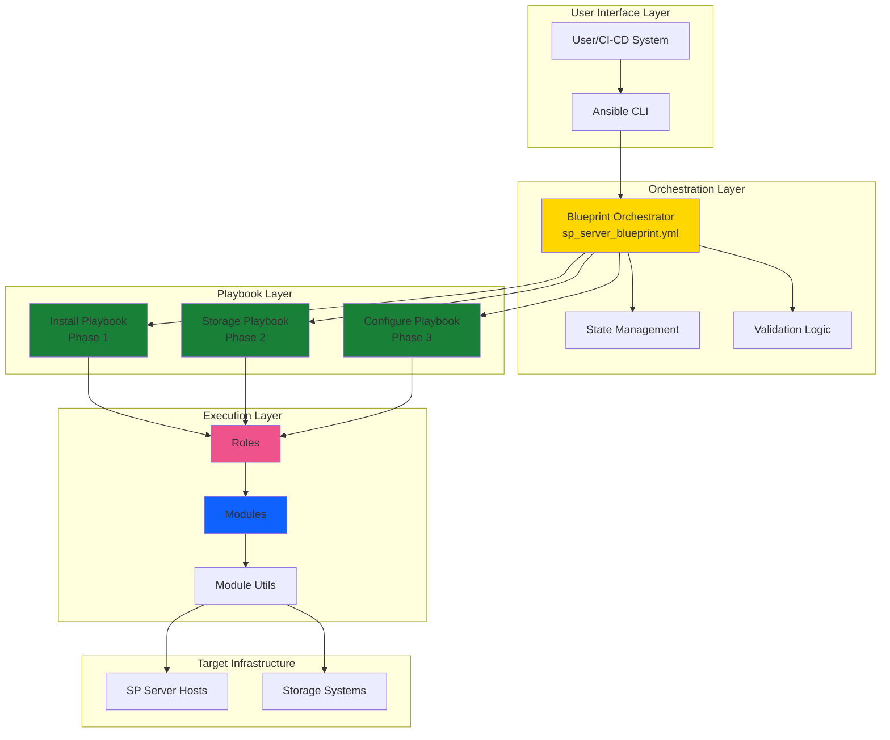
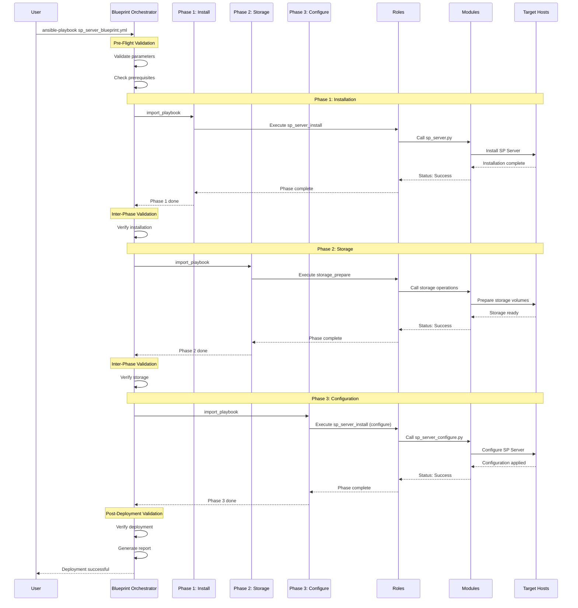
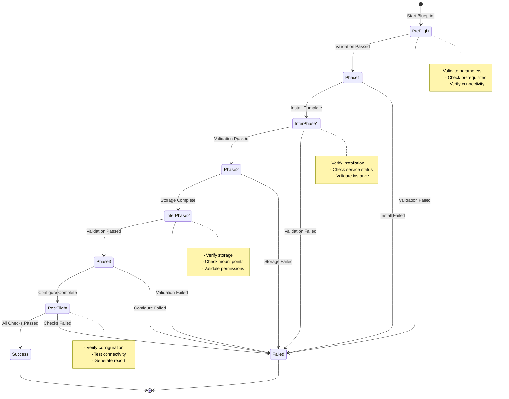
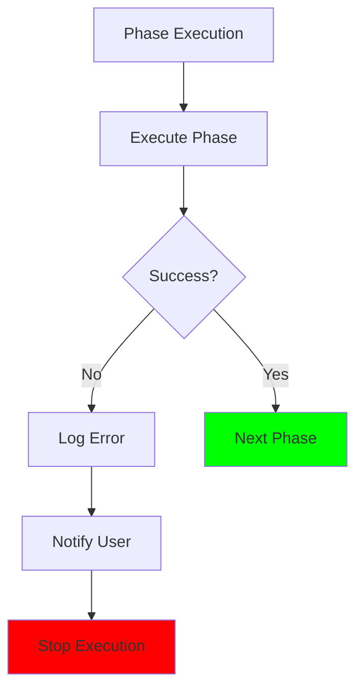

# IBM Storage Protect Blueprint Configuration Solution - Design Document

## Document Information

- **Document Title**: Blueprint Configuration Solution Design
- **Version**: 1.0
- **Date**: 2024-01-15
- **Status**: Active
- **Author**: IBM Storage Protect Ansible Team

---

## Table of Contents

1. [Executive Summary](#executive-summary)
2. [Solution Overview](#solution-overview)
3. [Architecture Design](#architecture-design)
4. [Component Specifications](#component-specifications)
5. [Execution Flow](#execution-flow)
6. [Implementation Details](#implementation-details)
7. [Security Considerations](#security-considerations)
8. [Performance & Scalability](#performance--scalability)
9. [Future Enhancements](#future-enhancements)
10. [References](#references)

---

## Executive Summary

### Purpose

The Blueprint Configuration Solution provides a higher-level orchestration framework for IBM Storage Protect deployments that require complex, multi-phase execution with precise dependency management. It serves as a reusable pattern for coordinating multiple Ansible playbooks, roles, and modules to achieve sophisticated deployment scenarios.

### Key Objectives

1. **Orchestration**: Coordinate multiple playbooks in specific sequences
2. **Reusability**: Provide a pattern applicable across different solutions
3. **Reliability**: Ensure consistent, repeatable deployments
4. **Maintainability**: Simplify complex deployment workflows
5. **Extensibility**: Support future blueprint variations

### Business Value

- **Reduced Complexity**: Simplifies multi-phase deployments
- **Improved Reliability**: Consistent execution patterns
- **Faster Deployment**: Automated orchestration reduces manual steps
- **Lower Risk**: Validated deployment sequences
- **Better Maintainability**: Centralized orchestration logic

---

## Solution Overview

### What is a Blueprint?

A **Blueprint** is an orchestration playbook that coordinates multiple solution playbooks in a specific sequence to achieve a complex deployment goal. It acts as a conductor, ensuring that each phase executes in the correct order with proper dependency management.

### Current Implementation

**File**: [`playbooks/sp_server_blueprint.yml`](../../playbooks/sp_server_blueprint.yml)

The SP Server Blueprint demonstrates the pattern by orchestrating a 3-phase deployment:

```yaml
---
# Phase 1: Initial Installation
- import_playbook: ibm.storage_protect.sp_server_install_playbook.yml

# Phase 2: Storage Preparation
- import_playbook: ibm.storage_protect.storage_prepare_playbook.yml

# Phase 3: Configuration
- import_playbook: ibm.storage_protect.sp_server_install_playbook.yml
```

### Design Principles

1. **Separation of Concerns**: Blueprint handles orchestration, not implementation
2. **Idempotency**: Can be run multiple times safely
3. **Fail-Fast**: Stops on first error
4. **Transparency**: Clear logging of each phase
5. **Flexibility**: Parameterized for different environments

---

## Architecture Design

### High-Level Architecture



### Component Layers

#### 1. Orchestration Layer
- **Blueprint Orchestrator**: Main coordination logic
- **State Management**: Tracks deployment progress
- **Validation Logic**: Pre-flight and inter-phase checks

#### 2. Playbook Layer
- **Phase Playbooks**: Individual deployment phases
- **Import Mechanism**: Dynamic playbook inclusion
- **Parameter Passing**: Variable propagation

#### 3. Execution Layer
- **Roles**: Reusable task collections
- **Modules**: Python-based operations
- **Module Utils**: Shared utility functions

#### 4. Target Infrastructure
- **SP Server Hosts**: Target deployment systems
- **Storage Systems**: Storage infrastructure

### Deployment Flow Architecture



---

## Component Specifications

### Blueprint Orchestrator

**File**: `playbooks/sp_server_blueprint.yml`

**Responsibilities**:
- Coordinate playbook execution sequence
- Manage inter-phase dependencies
- Handle error propagation
- Provide deployment status

**Interface**:
```yaml
# Input Parameters
sp_server_version: string          # Required
sp_server_state: string            # Required: present/absent
storage_size: string               # Required: xsmall/small/medium/large
target_hosts: string               # Required: host group
sp_server_bin_repo: string         # Required: repository path
instance_user: string              # Optional: default tsminst1
instance_dir: string               # Optional: default /tsminst1
ssl_password: string               # Required: vaulted

# Output
blueprint_status: string           # success/failed
phase_results: dict                # Per-phase status
deployment_info: dict              # Deployment details
```

### Phase Playbooks

#### Phase 1: Installation Playbook
**File**: `sp_server_install_playbook.yml`

**Purpose**: Install base SP Server components

**Operations**:
- System compatibility checks
- Package installation
- Initial configuration
- Service setup

**Dependencies**:
- None (first phase)

**Outputs**:
- Installation status
- Server version
- Instance information

#### Phase 2: Storage Playbook
**File**: `storage_prepare_playbook.yml`

**Purpose**: Prepare storage infrastructure

**Operations**:
- Create storage volumes
- Format filesystems
- Mount volumes
- Set permissions

**Dependencies**:
- Phase 1 must complete successfully
- Server instance must exist

**Outputs**:
- Storage configuration
- Volume paths
- Capacity information

#### Phase 3: Configuration Playbook
**File**: `sp_server_install_playbook.yml` (configure mode)

**Purpose**: Apply server configuration

**Operations**:
- Configure server settings
- Create storage pools
- Define policies
- Set up schedules

**Dependencies**:
- Phase 1 and 2 must complete
- Storage volumes must be available

**Outputs**:
- Configuration status
- Policy information
- Service status

### Associated Roles

#### sp_server_install Role
**Location**: `roles/sp_server_install/`

**Tasks**:
- `sp_server_prechecks_linux.yml`: Pre-installation validation
- `sp_server_install_linux.yml`: Installation operations
- `sp_server_configuration_linux.yml`: Configuration tasks
- `sp_server_postchecks_linux.yml`: Post-installation validation
- `sp_server_uninstall_linux.yml`: Uninstallation operations

**Templates**:
- `sp_server_install_response.xml.j2`: Installation response file
- `basics.j2`: Basic server configuration
- `policy.j2`: Policy definitions
- `schedules.j2`: Schedule definitions
- `cntrpool.j2`: Container pool configuration

#### storage_prepare Role
**Location**: `roles/storage_prepare/`

**Tasks**:
- `storage_prepare_linux.yml`: Storage preparation
- `storage_cleanup_linux.yml`: Storage cleanup

**Variables**:
- Storage size configurations (xsmall/small/medium/large)
- Volume paths and sizes
- Filesystem types

#### sp_server_facts Role
**Location**: `roles/sp_server_facts/`

**Purpose**: Gather server information for validation

**Operations**:
- Collect server version
- Check service status
- Verify configuration

### Associated Modules

#### sp_server.py
**Location**: `plugins/modules/sp_server.py`

**Operations**:
- install: Install SP Server
- configure: Configure server
- upgrade: Upgrade version
- uninstall: Remove server

**Parameters**:
- version: Server version
- state: present/absent/upgrade
- paths: Installation paths
- credentials: Admin credentials

#### sp_server_configure.py
**Location**: `plugins/modules/sp_server_configure.py`

**Operations**:
- Configure server settings
- Create storage pools
- Define policies
- Set up schedules

**Parameters**:
- configuration templates
- server settings
- policy definitions

#### sp_server_facts.py
**Location**: `plugins/modules/sp_server_facts.py`

**Operations**:
- Collect server information
- Gather version details
- Check service status

**Returns**:
- server_version
- service_status
- configuration_details

### Module Utilities

#### sp_server_utils.py
**Location**: `plugins/module_utils/sp_server_utils.py`

**Functions**:
- Server operation helpers
- Validation functions
- Error handling

#### dsmadmc_adapter.py
**Location**: `plugins/module_utils/dsmadmc_adapter.py`

**Functions**:
- Execute dsmadmc commands
- Parse command output
- Handle authentication

#### sp_utils.py
**Location**: `plugins/module_utils/sp_utils.py`

**Functions**:
- General utility functions
- Common operations
- Formatting helpers

---

## Execution Flow

### Phase Execution Model



### Error Handling



**Error Handling Strategy**:
1. **Fail-Fast**: Stop on first error
2. **Error Logging**: Detailed error messages
3. **User Notification**: Clear failure reasons
4. **No Rollback**: Manual intervention required (future: automatic rollback)

---

## Implementation Details

### Directory Structure

```
playbooks/
└── solutions/
    └── blueprint-configuration/
        ├── README.md                           # Solution documentation
        ├── sp-server-blueprint.yml             # Current implementation
        ├── ba-client-blueprint.yml             # Future: BA Client blueprint
        ├── full-stack-blueprint.yml            # Future: Full stack blueprint
        ├── vars/
        │   ├── sp-server-blueprint-vars.yml    # SP Server variables
        │   ├── dev.yml                         # Development environment
        │   ├── test.yml                        # Test environment
        │   ├── prod.yml                        # Production environment
        │   └── secrets.yml                     # Ansible Vault encrypted
        ├── templates/
        │   └── blueprint-architecture.md       # Architecture documentation
        └── COMPONENTS.md                       # Component mapping
```

### Variable Management

#### Blueprint Variables
```yaml
# vars/sp-server-blueprint-vars.yml
---
# Server Configuration
sp_server_version: "8.1.23.0"
sp_server_state: "present"
sp_server_bin_repo: "/data/sp-packages"

# Storage Configuration
storage_size: "medium"
storage_volumes:
  - name: "db"
    size: "100GB"
  - name: "activelog"
    size: "50GB"
  - name: "archivelog"
    size: "200GB"
  - name: "storage"
    size: "1TB"

# Instance Configuration
instance_user: "tsminst1"
instance_dir: "/tsminst1"
instance_password: "{{ vault_instance_password }}"

# SSL Configuration
ssl_password: "{{ vault_ssl_password }}"
```

#### Environment-Specific Variables
```yaml
# vars/prod.yml
---
target_hosts: "sp_servers_prod"
storage_size: "large"
backup_retention: 365

# vars/dev.yml
---
target_hosts: "sp_servers_dev"
storage_size: "small"
backup_retention: 30
```

### Ansible Vault Integration

```bash
# Create encrypted secrets
ansible-vault create vars/secrets.yml

# Content
---
vault_instance_password: "SecureInstancePass123!"
vault_ssl_password: "SecureSSLPass456!"
vault_admin_password: "SecureAdminPass789!"

# Usage
ansible-playbook sp-server-blueprint.yml \
  -e @vars/sp-server-blueprint-vars.yml \
  -e @vars/prod.yml \
  -e @vars/secrets.yml \
  --vault-password-file vault_pass.txt
```

---

## Security Considerations

### Credential Management

1. **Ansible Vault**: All passwords encrypted
2. **No Hardcoding**: No credentials in playbooks
3. **Vault Password File**: Secured with 600 permissions
4. **Rotation**: Regular password rotation supported

### Access Control

1. **SSH Keys**: Key-based authentication
2. **Sudo Access**: Privilege escalation required
3. **Audit Logging**: All operations logged
4. **Least Privilege**: Minimal required permissions

### Network Security

1. **Firewall Rules**: Only required ports open
2. **SSL/TLS**: Encrypted communications
3. **Certificate Validation**: Verify server certificates
4. **Network Segmentation**: Isolated deployment networks

---

## Performance & Scalability

### Performance Characteristics

| Metric | Small | Medium | Large |
|--------|-------|--------|-------|
| Deployment Time | 15-20 min | 30-45 min | 60-90 min |
| Storage Prep | 5 min | 10 min | 20 min |
| Configuration | 5 min | 10 min | 15 min |
| Total Hosts | 1-5 | 5-20 | 20-100 |

### Scalability Considerations

1. **Parallel Execution**: Future support for multi-host parallel deployment
2. **Resource Management**: Ansible forks configuration
3. **Network Bandwidth**: Consider data transfer times
4. **Storage I/O**: Storage preparation can be I/O intensive

### Optimization Strategies

1. **Caching**: Cache downloaded packages
2. **Parallel Tasks**: Use async where possible
3. **Incremental Updates**: Only update changed components
4. **Resource Pooling**: Reuse connections

---

## Future Enhancements

### Planned Features

#### 1. BA Client Blueprint
```yaml
# ba-client-blueprint.yml
---
- import_playbook: ibm.storage_protect.ba_client_install_playbook.yml
- import_playbook: ibm.storage_protect.node_registration_playbook.yml
- import_playbook: ibm.storage_protect.schedule_configuration_playbook.yml
```

#### 2. Full Stack Blueprint
```yaml
# full-stack-blueprint.yml
---
- import_playbook: sp-server-blueprint.yml
- import_playbook: ba-client-blueprint.yml
- import_playbook: storage-agent-blueprint.yml
- import_playbook: operations-center-blueprint.yml
```

#### 3. Rollback Support
- Automatic rollback on failure
- State snapshots before each phase
- Restore to last known good state

#### 4. State Persistence
- Save deployment state to file/database
- Resume interrupted deployments
- Track deployment history

#### 5. Health Checks
- Inter-phase validation
- Service health monitoring
- Automated remediation

#### 6. Dry-Run Mode
- Preview deployment without execution
- Validate parameters
- Check prerequisites

#### 7. Parallel Execution
- Multi-host parallel deployment
- Resource-aware scheduling
- Progress tracking

---

## References

### Internal Documentation
- [Playbook Analysis](../../playbooks/pb-analysis.md)
- [SP Server Design](design-sp-server.md)
- [BA Client Design](design-ba-client.md)
- [Storage Agent Design](design-storage-agent.md)

### External Documentation
- [IBM Storage Protect Documentation](https://www.ibm.com/docs/en/storage-protect)
- [Ansible Best Practices](https://docs.ansible.com/ansible/latest/user_guide/playbooks_best_practices.html)
- [Ansible Vault](https://docs.ansible.com/ansible/latest/user_guide/vault.html)

### Related Playbooks
- [`sp_server_blueprint.yml`](../../playbooks/sp_server_blueprint.yml)
- [`sp_server_install_playbook.yml`](../../playbooks/sp_server_install_playbook.yml)
- [`storage_prepare_playbook.yml`](../../playbooks/storage_prepare_playbook.yml)

---

*Document Version: 1.0*  
*Last Updated: 2024-01-15*  
*Status: Active*