# IBM Storage Protect Data Protection for DB2 Design

## Overview

The Data Protection for DB2 solution provides Ansible automation for complete DB2 database protection lifecycle using IBM Storage Protect. It enables administrators to install, configure, backup, restore, query, and delete DB2 database backups through a unified Ansible interface across AIX, Linux, and Windows platforms.

## Architecture

### Component Overview

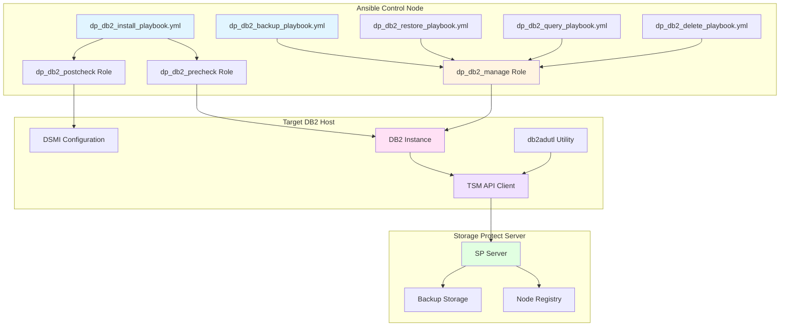

### Component Relationships

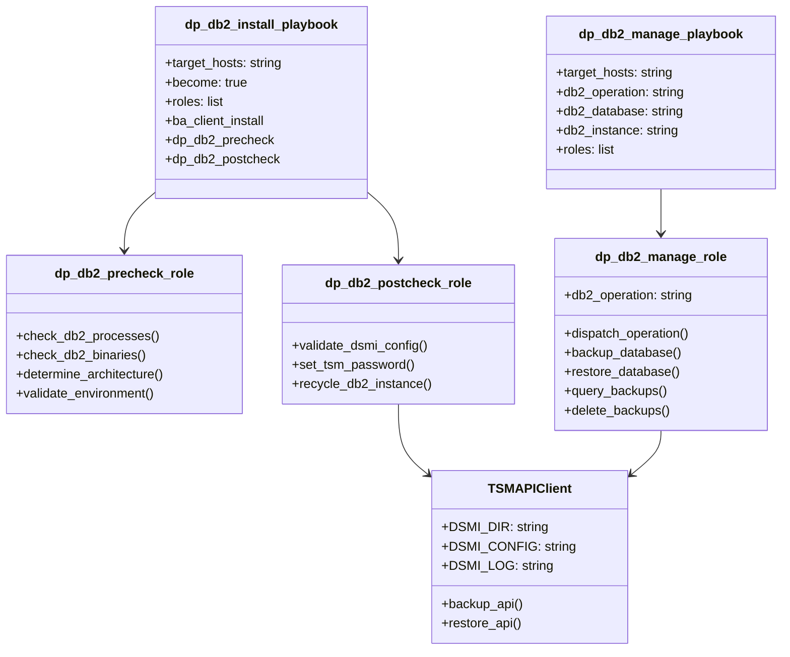

## Data Flow

### Installation Flow

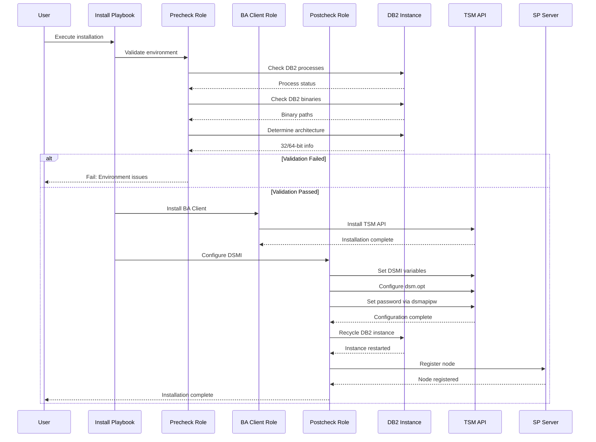

### Backup Flow

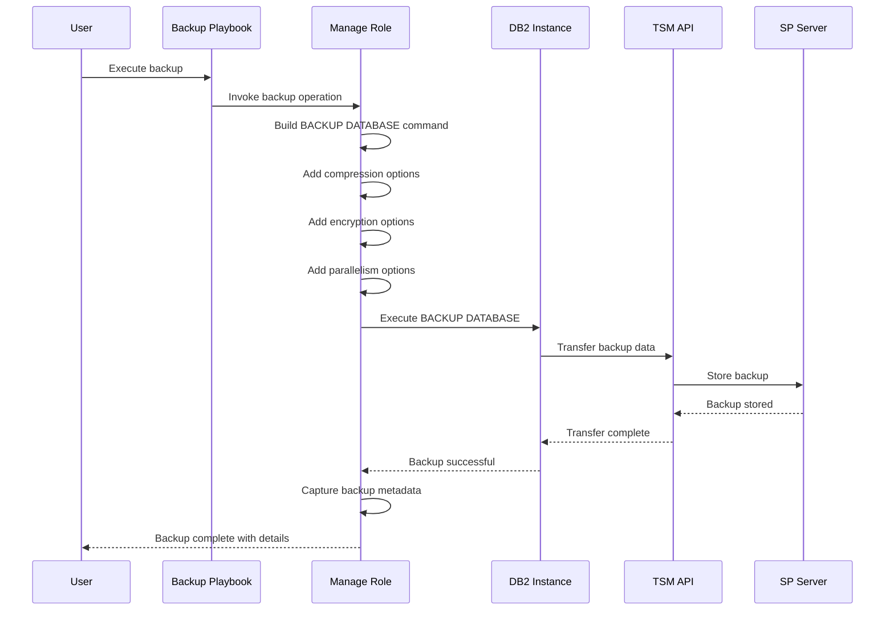

### Restore Flow

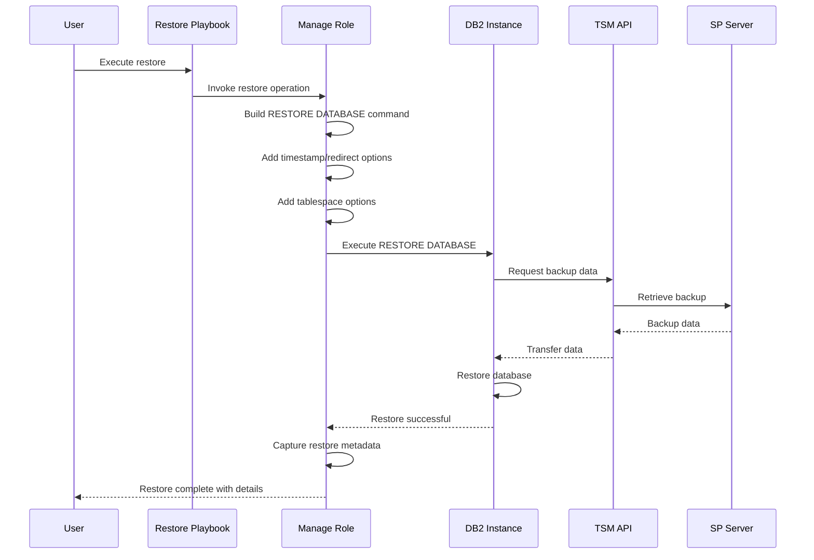

### Query Flow

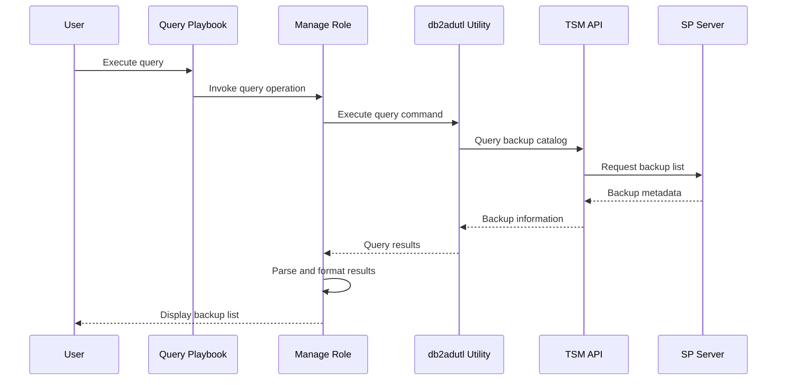

### Delete Flow

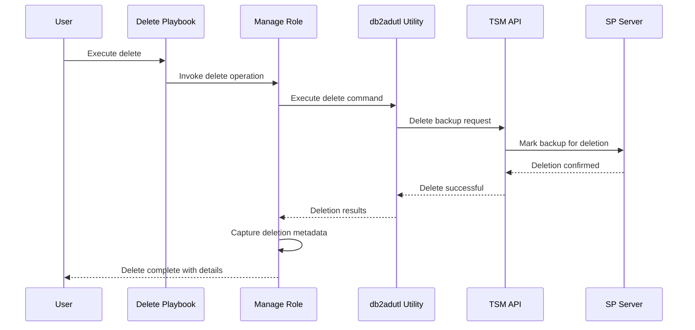

## Component Details

### 1. Playbook Layer

#### Installation Playbook

**File**: [`playbooks/dp_db2_install_playbook.yml`](../../playbooks/dp_db2_install_playbook.yml)

```yaml
Purpose: End-to-end DP for DB2 installation
Features:
  - BA Client installation
  - Pre-installation validation
  - DSMI configuration
  - Node registration
  - Post-installation validation
```

#### Backup Playbook

**File**: [`playbooks/dp_db2_backup_playbook.yml`](../../playbooks/dp_db2_backup_playbook.yml)

```yaml
Purpose: DB2 database backup operations
Features:
  - Full, incremental, delta backups
  - Online/offline backup support
  - Compression and encryption
  - Parallelism configuration
  - Tablespace-level backup
```

#### Restore Playbook

**File**: [`playbooks/dp_db2_restore_playbook.yml`](../../playbooks/dp_db2_restore_playbook.yml)

```yaml
Purpose: DB2 database restore operations
Features:
  - Complete database restore
  - Point-in-time recovery
  - Redirect restore
  - Tablespace restore
  - Log target configuration
```

#### Query Playbook

**File**: [`playbooks/dp_db2_query_playbook.yml`](../../playbooks/dp_db2_query_playbook.yml)

```yaml
Purpose: Query DB2 backup information
Features:
  - List available backups
  - Backup metadata retrieval
  - Timestamp information
  - Backup type identification
```

#### Delete Playbook

**File**: [`playbooks/dp_db2_delete_playbook.yml`](../../playbooks/dp_db2_delete_playbook.yml)

```yaml
Purpose: Delete DB2 backup data
Features:
  - Delete specific backups
  - Age-based deletion
  - Retention management
  - Deletion confirmation
```

### 2. Role Layer

**Path**: [`roles/`](../../roles/)

#### dp_db2_precheck Role

**Location**: [`roles/dp_db2_precheck/`](../../roles/dp_db2_precheck/)

##### Structure
```
roles/dp_db2_precheck/
├── README.md
├── defaults/main.yml
├── meta/main.yml
└── tasks/main.yml
```

##### Tasks
- Check DB2 processes are running
- Validate DB2 binary locations
- Determine 32-bit vs 64-bit architecture
- Verify DB2 instance ownership
- Validate environment variables

#### dp_db2_manage Role

**Location**: [`roles/dp_db2_manage/`](../../roles/dp_db2_manage/)

##### Structure
```
roles/dp_db2_manage/
├── README.md
├── defaults/main.yml
├── meta/main.yml
└── tasks/
    ├── main.yml
    ├── dp_db2_backup.yml
    ├── dp_db2_restore.yml
    ├── dp_db2_query.yml
    └── dp_db2_delete.yml
```

##### Default Variables

| Variable | Default | Description |
|----------|---------|-------------|
| `db2_operation` | "" | Operation type (backup/restore/query/delete) |
| `db2_database` | "" | Database name |
| `db2_instance` | "" | DB2 instance name |
| `db2_user` | "" | DB2 username |
| `db2_backup_online` | true | Online backup flag |
| `db2_backup_compress` | false | Enable compression |
| `db2_backup_encrypt` | false | Enable encryption |
| `db2_backup_parallelism` | 1 | Number of parallel streams |
| `db2_restore_replace_existing` | false | Replace existing database |
| `db2_restore_taken_at` | "" | Backup timestamp for restore |

##### Tasks
- Dispatch to operation-specific task file
- Build DB2 command with options
- Execute DB2 backup/restore/query/delete
- Capture and return results

#### dp_db2_postcheck Role

**Location**: [`roles/dp_db2_postcheck/`](../../roles/dp_db2_postcheck/)

##### Structure
```
roles/dp_db2_postcheck/
├── README.md
├── defaults/main.yml
├── meta/main.yml
└── tasks/main.yml
```

##### Tasks
- Validate DSMI environment variables
- Configure dsm.opt file
- Set TSM password via dsmapipw
- Recycle DB2 instance
- Verify TSM API connectivity

### 3. Module Layer

While this solution primarily uses roles and shell commands, it integrates with:

**BA Client Module**: [`plugins/modules/sp_baclient_install.py`](../../plugins/modules/sp_baclient_install.py)
- Installs BA Client for TSM API

**Node Module**: [`plugins/modules/node.py`](../../plugins/modules/node.py)
- Registers DB2 node on SP Server

### 4. Utility Layer

**DSMI Configuration**:
- `DSMI_DIR`: TSM API installation directory
- `DSMI_CONFIG`: Path to dsm.opt configuration file
- `DSMI_LOG`: Path to TSM API log directory

**db2adutl Utility**:
- Query backup catalog
- Delete backup images
- Manage backup retention

## Execution Flow

### Complete Installation Workflow

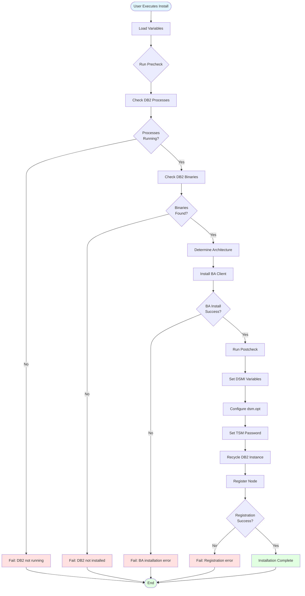

### Complete Backup Workflow

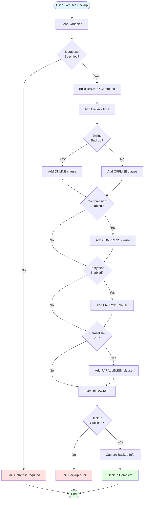

## Usage Examples

### Install Data Protection for DB2

```bash
# Set environment variables
export STORAGE_PROTECT_SERVERNAME="your_server_name"
export STORAGE_PROTECT_USERNAME="your_username"
export STORAGE_PROTECT_PASSWORD="your_password"

# Execute installation
ansible-playbook -i inventory.ini \
  ibm.storage_protect.dp_db2_install_playbook.yml \
  -e @vars/db2_install.yml
```

**vars/db2_install.yml**:
```yaml
target_hosts: "db2_servers"
db2_instance: "db2inst1"
db2_database: "SAMPLE"
ba_client_version: "8.1.27.0"
```

### Perform Full Online Backup

```bash
ansible-playbook -i inventory.ini \
  ibm.storage_protect.dp_db2_backup_playbook.yml \
  -e "target_hosts=db2_servers" \
  -e "db2_database=PRODDB" \
  -e "db2_instance=db2inst1" \
  -e "db2_backup_online=true" \
  -e "db2_backup_compress=true" \
  -e "db2_backup_parallelism=4"
```

### Restore Database to Point-in-Time

```bash
ansible-playbook -i inventory.ini \
  ibm.storage_protect.dp_db2_restore_playbook.yml \
  -e "target_hosts=db2_servers" \
  -e "db2_database=PRODDB" \
  -e "db2_restore_taken_at=20260330120000" \
  -e "db2_restore_replace_existing=true"
```

### Query Available Backups

```bash
ansible-playbook -i inventory.ini \
  ibm.storage_protect.dp_db2_query_playbook.yml \
  -e "target_hosts=db2_servers" \
  -e "db2_database=PRODDB"
```

### Delete Old Backups

```bash
ansible-playbook -i inventory.ini \
  ibm.storage_protect.dp_db2_delete_playbook.yml \
  -e "target_hosts=db2_servers" \
  -e "db2_database=PRODDB" \
  -e "db2_delete_older_than=30"
```

## Integration Points

### Storage Protect Server Integration

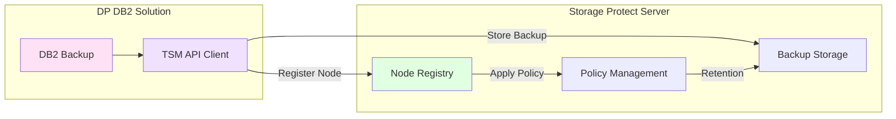

### BA Client Integration

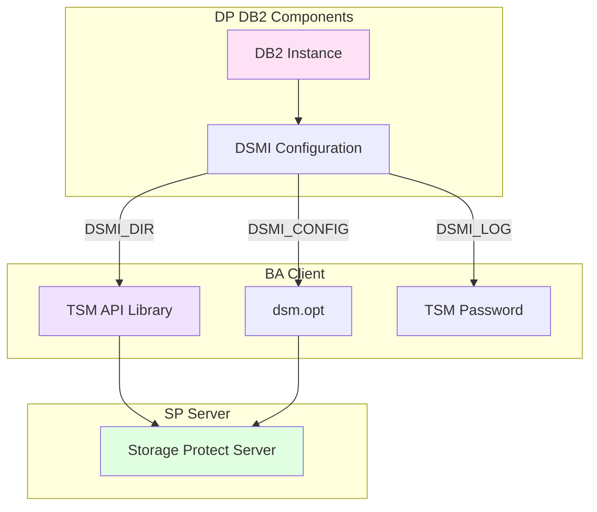

## Requirements

### Prerequisites
1. IBM DB2 Database installed and running
2. IBM Storage Protect Server installed and configured
3. Network connectivity between DB2 host and SP Server
4. Sufficient storage space for backups
5. Valid DB2 instance credentials
6. Valid Storage Protect admin credentials

### Environment Variables
```bash
STORAGE_PROTECT_SERVERNAME  # Server name (default: 'local')
STORAGE_PROTECT_USERNAME    # Admin username
STORAGE_PROTECT_PASSWORD    # Admin password
DSMI_DIR                    # TSM API installation directory
DSMI_CONFIG                 # Path to dsm.opt file
DSMI_LOG                    # Path to TSM API log directory
```

### Permissions
- Root or sudo access on DB2 host (become: true)
- DB2 instance owner permissions
- Storage Protect admin privileges for node registration
- File system permissions for DSMI configuration

### Platform Requirements

| Platform | DB2 Version | TSM API Version | Architecture |
|----------|-------------|-----------------|--------------|
| AIX | 10.5+ | 8.1.x | ppc64 |
| Linux | 10.5+ | 8.1.x | x86_64, s390x, ppc64le |
| Windows | 10.5+ | 8.1.x | x86_64 |

## Error Scenarios

### Common Errors and Resolutions

| Error | Cause | Resolution |
|-------|-------|------------|
| "DB2 instance not running" | DB2 processes not found | Start DB2 instance: `db2start` |
| "DB2 binaries not found" | DB2 not installed or PATH issue | Install DB2 or update PATH variable |
| "TSM API not found" | BA Client not installed | Install BA Client first |
| "DSMI variables not set" | Environment not configured | Run postcheck role to set DSMI variables |
| "Node not registered" | Node registration failed | Check SP Server connectivity and credentials |
| "Backup failed: insufficient space" | Storage full | Free up space or add storage |
| "Restore failed: backup not found" | Invalid timestamp or backup deleted | Query available backups first |
| "db2adutl command not found" | DB2 utilities not in PATH | Source DB2 profile: `. ~db2inst1/sqllib/db2profile` |

## Testing

**Test Files**: 
- [`tests/integration/targets/dp_db2/test_dp_db2_install.yml`](../../tests/integration/targets/dp_db2/test_dp_db2_install.yml)
- [`tests/integration/targets/dp_db2_manage/test_db2_operations.yml`](../../tests/integration/targets/dp_db2_manage/test_db2_operations.yml)

### Test Coverage
- Installation validation
- Backup operations (full, incremental, delta)
- Restore operations (complete, point-in-time)
- Query operations
- Delete operations
- Error handling validation
- Multi-platform testing (AIX, Linux, Windows)

## Security Considerations

1. **Credential Management**
   - DB2 passwords stored in Ansible Vault
   - TSM passwords set via dsmapipw (encrypted)
   - No logging of sensitive parameters (no_log: true)
   - Credentials passed via secure channels

2. **Encryption**
   - Support for backup encryption (db2_backup_encrypt)
   - SSL/TLS communication with SP Server
   - Encrypted password storage

3. **Access Control**
   - Requires DB2 instance owner privileges
   - Requires SP Server admin privileges
   - File permissions on DSMI configuration
   - Audit logging of all operations

4. **Network Security**
   - Secure communication between DB2 and SP Server
   - Firewall rules for TSM API ports
   - Network isolation for backup traffic

## Performance Considerations

- **Parallelism**: Configure `db2_backup_parallelism` for faster backups (default: 1)
- **Compression**: Enable `db2_backup_compress` to reduce backup size and network traffic
- **Buffer Sizes**: Tune DB2 backup buffer sizes for optimal performance
- **Network Bandwidth**: Ensure sufficient bandwidth for backup/restore operations
- **Storage Performance**: Use high-performance storage for backup staging
- **Idempotency**: All operations are idempotent and safe to re-run

## Future Enhancements

1. **Advanced Features**
   - Incremental forever backup strategy
   - Synthetic full backups
   - Backup validation and verification
   - Automated backup scheduling

2. **Monitoring Integration**
   - Backup success/failure notifications
   - Performance metrics collection
   - Capacity planning reports
   - SLA compliance tracking

3. **Multi-Database Support**
   - Parallel backup of multiple databases
   - Database group operations
   - Centralized backup management

4. **Cloud Integration**
   - Cloud-based backup storage
   - Hybrid cloud backup strategies
   - Cloud disaster recovery

## References

- [IBM Storage Protect Documentation](https://www.ibm.com/docs/en/storage-protect)
- [IBM DB2 Documentation](https://www.ibm.com/docs/en/db2)
- [DB2 Backup and Recovery Guide](https://www.ibm.com/docs/en/db2/11.5?topic=recovery-backing-up-databases)
- [TSM API Documentation](https://www.ibm.com/docs/en/storage-protect/8.1.27?topic=clients-api)
- [Ansible Module Development](https://docs.ansible.com/ansible/latest/dev_guide/developing_modules_general.html)

## Related Components

- [`sp_server_install`](design-sp-server.md) - Storage Protect Server installation
- [`ba_client_install`](design-ba-client.md) - Backup-Archive client installation
- [`storage_agent_config`](design-storage-agent.md) - Storage Agent configuration
- [`oc_configure`](design-oc.md) - Operations Center configuration
- [Data Protection DB2 Guide](../guides/data-protection-db2-guide.md) - User guide

## Related Documentation

- [Playbook Analysis](../pb-analysis.md) - Section 5: Data Protection - DB2 Solution
- [Complete Technical Design](design-db2.md) - Detailed implementation specifications

---

**Document Version**: 2.0  
**Last Updated**: 2026-04-12  
**Author**: Reverse-engineered from codebase  
**Status**: Component design document aligned with OC design structure