# IBM Storage Protect Server - Ansible Automation Design Document

## Introduction

This document captures the design of the Ansible modules for deploying, configuring, and managing IBM Storage Protect (SP) Server.

**Product Reference**: [IBM Storage Protect 8.1.27 Documentation](https://www.ibm.com/docs/en/storage-protect/8.1.27?topic=servers)

This design is based on IBM Storage Protect Product documentation version 8.1.27.

## Document Scope

This document describes:
- Python modules for SP Server
- Python module utilities for SP Server
- Ansible tasks and roles for SP Server
- Ansible playbooks for SP Server
- Component architecture and relationships
- Data flow and interaction patterns

### Supported Platforms

Based on IBM Storage Protect 8.1.27 product documentation and collection requirements:

**Operating Systems**:
- **Linux**: RHEL 7.x, 8.x, 9.x, SLES 12, 15, Ubuntu 18.04, 20.04, 22.04
- **AIX**: AIX 7.1, 7.2, 7.3
- **Windows**: Windows Server 2016, 2019, 2022

**Architectures**:
- **x86_64** (Intel/AMD 64-bit)
- **s390x** (IBM Z Systems)
- **ppc64le** (IBM Power Systems - Little Endian)

**IBM Storage Protect Versions**:
- Version 8.1.23 and higher
- Tested with version 8.1.27

**Ansible Requirements**:
- Ansible Core >= 2.15.0
- Python >= 3.9 on control node and managed nodes

### Lifecycle and Management Functions

- Server facts gathering
- Install and configure
- Upgrade
- Uninstall
- Certificate management
- Storage Pools management
- Policy management
- Node management
- Schedule management
- Storage Protect Resiliency

### Out of Scope

This design document does not cover:
- Storage Agent (separate component)
- BA Client (separate component)
- Operation Center (separate component)

---

## Architecture Overview

### High-Level Component Architecture

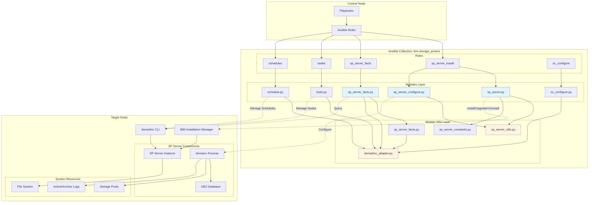

---

## Component Details

### 1. Python Modules

#### 1.1 sp_server.py (Installation Orchestrator)

**Purpose**: Main orchestration module for SP Server lifecycle management (install/upgrade/uninstall)

**Key Classes**:
- [`BA_SERVER_SETUP`](plugins/modules/sp_server.py:195): Main orchestration class

**Key Methods**:
- [`run(mode)`](plugins/modules/sp_server.py:207): Entry point for lifecycle operations
- [`_install()`](plugins/modules/sp_server.py:222): Fresh installation workflow
- [`_upgrade()`](plugins/modules/sp_server.py:261): Upgrade workflow
- [`_uninstall()`](plugins/modules/sp_server.py:312): Uninstallation workflow
- [`_deploy()`](plugins/modules/sp_server.py:352): Binary deployment and installation
- [`_undeploy()`](plugins/modules/sp_server.py:480): Uninstallation execution

**Responsibilities**:
- Artifact discovery and validation
- Binary extraction and preparation
- Response XML generation
- IBM Installation Manager interaction
- Version comparison and upgrade logic
- Rollback on failure

#### 1.2 sp_server_configure.py

**Purpose**: Server configuration management after installation

**Key Classes**:
- [`SPServerConfiguration`](plugins/modules/sp_server_configure.py:23): Configuration orchestrator

**Key Methods**:
- [`prepare_storage()`](plugins/modules/sp_server_configure.py:147): Storage preparation
- [`_ensure_directories()`](plugins/modules/sp_server_configure.py:99): Directory creation
- [`_run_cmd()`](plugins/modules/sp_server_configure.py:63): Command execution wrapper

**Responsibilities**:
- User and group creation
- Directory structure setup
- DB2 instance creation
- Database formatting
- Server options configuration
- Administrative user setup

#### 1.3 sp_server_facts.py

**Purpose**: Gather server facts and status information

**Key Functions**:
- [`main()`](plugins/modules/sp_server_facts.py:99): Module entry point

**Supported Queries**:
- Server status
- Monitor settings
- Database information
- Database space
- Log information
- Domain information
- Copy groups
- Replication rules
- Device classes
- Management classes
- Storage pools

#### 1.4 node.py

**Purpose**: Client node registration and management

**Capabilities**:
- Register new client nodes
- Update node configuration
- Deregister nodes
- Associate schedules with nodes
- Set node policies and options

#### 1.5 schedule.py

**Purpose**: Schedule management for backup operations

**Capabilities**:
- Define backup schedules
- Configure schedule timing
- Set schedule actions (incremental, selective, archive, etc.)
- Manage schedule lifecycle

---

### 2. Module Utilities

#### 2.1 sp_server_utils.py

**Purpose**: Reusable utility functions for SP Server operations

**Key Function Categories**:

**OS Helpers**:
- [`os_oskey()`](plugins/module_utils/sp_server_utils.py:75): OS detection and normalization
- [`get_os_info()`](plugins/module_utils/sp_server_utils.py:122): Detailed OS information
- [`get_system_info()`](plugins/module_utils/sp_server_utils.py:186): System resource information

**File System Helpers**:
- `fs_exists()`: Check file/directory existence
- `fs_ensure_dir()`: Create directories
- `fs_remove_tree()`: Remove directory trees
- `fs_require_free_mb()`: Check available disk space

**Execution Helpers**:
- `exec_run()`: Execute shell commands
- `extract_binary_package()`: Extract installation binaries

**Version Helpers**:
- `version_parse()`: Parse version strings
- `version_is_newer()`: Compare versions

**BA Server Helpers**:
- `ba_install_dir()`: Determine installation directory
- `ba_is_installed()`: Check installation status
- `find_installer()`: Locate installation artifacts

**XML Helpers**:
- [`AgentInputXMLBuilder`](plugins/module_utils/sp_server_utils.py:381): Generate installation response XML
- `update_xml_value()`: Update XML configuration
- `update_package_offering()`: Update package offerings in XML

#### 2.2 sp_server_constants.py

**Purpose**: Constants and metadata for SP Server components

**Key Data Structures**:
- [`offerings_metadata`](plugins/module_utils/sp_server_constants.py:31): Component metadata
  - `server`: SP Server core
  - `stagent`: Storage Agent
  - `devices`: Device drivers
  - `oc`: Operations Center
  - `ossm`: Open Systems Storage Manager
  - `license`: License component

- [`preferences`](plugins/module_utils/sp_server_constants.py:70): Installation Manager preferences

#### 2.3 sp_server_facts.py (Module Utils)

**Purpose**: Parse and transform dsmadmc output

**Key Classes**:
- [`DsmadmcAdapterExtended`](plugins/module_utils/sp_server_facts.py:5): Extended adapter with comma-delimited support
- [`DSMParser`](plugins/module_utils/sp_server_facts.py:35): Output parser
- [`SpServerResponseMapper`](plugins/module_utils/sp_server_facts.py:298): Response transformation

**Parser Methods**:
- [`parse_q_status()`](plugins/module_utils/sp_server_facts.py:41): Parse status output
- [`parse_q_db()`](plugins/module_utils/sp_server_facts.py:95): Parse database info
- [`parse_q_stgpool()`](plugins/module_utils/sp_server_facts.py:273): Parse storage pool info
- Additional parsers for various query types

#### 2.4 dsmadmc_adapter.py

**Purpose**: Base adapter for dsmadmc CLI interaction

**Key Classes**:
- [`DsmadmcAdapter`](plugins/module_utils/dsmadmc_adapter.py:9): Base adapter class

**Key Methods**:
- [`run_command()`](plugins/module_utils/dsmadmc_adapter.py:46): Execute dsmadmc commands
- [`find_one()`](plugins/module_utils/dsmadmc_adapter.py:71): Query single object
- [`perform_action()`](plugins/module_utils/dsmadmc_adapter.py:80): Perform CRUD operations

**Authentication**:
- Server name (env: `STORAGE_PROTECT_SERVERNAME`)
- Username (env: `STORAGE_PROTECT_USERNAME`)
- Password (env: `STORAGE_PROTECT_PASSWORD`)

---

### 3. Ansible Roles

#### 3.1 sp_server_install

**Purpose**: Complete SP Server installation, upgrade, and uninstallation

**Main Tasks**: [`main.yml`](roles/sp_server_install/tasks/main.yml)

**Task Files**:
- [`sp_server_prechecks_linux.yml`](roles/sp_server_install/tasks/sp_server_prechecks_linux.yml): Pre-installation validation
- [`sp_server_install_linux.yml`](roles/sp_server_install/tasks/sp_server_install_linux.yml): Installation execution
- [`sp_server_configuration_linux.yml`](roles/sp_server_install/tasks/sp_server_configuration_linux.yml): Post-install configuration
- [`sp_server_postchecks_linux.yml`](roles/sp_server_install/tasks/sp_server_postchecks_linux.yml): Installation verification
- [`sp_server_uninstall_linux.yml`](roles/sp_server_install/tasks/sp_server_uninstall_linux.yml): Uninstallation

**Key Variables**:
- `sp_server_state`: present/absent/upgrade
- `sp_server_version`: Target version
- `sp_server_bin_repo`: Binary repository path
- `ssl_password`: SSL password for server
- `tsm_user`: Instance user
- `tsm_group`: Instance group

#### 3.2 sp_server_facts

**Purpose**: Gather SP Server facts

**Main Tasks**: [`main.yml`](roles/sp_server_facts/tasks/main.yml)

**Usage**: Collects server information using [`sp_server_facts`](plugins/modules/sp_server_facts.py) module

#### 3.3 nodes

**Purpose**: Manage client nodes

**Main Tasks**: [`main.yml`](roles/nodes/tasks/main.yml)

**Capabilities**: Register, update, and deregister client nodes

#### 3.4 schedules

**Purpose**: Manage backup schedules

**Main Tasks**: [`main.yml`](roles/schedules/tasks/main.yml)

**Capabilities**: Create and manage backup schedules

---

## Data Flow Diagrams

### Installation Workflow

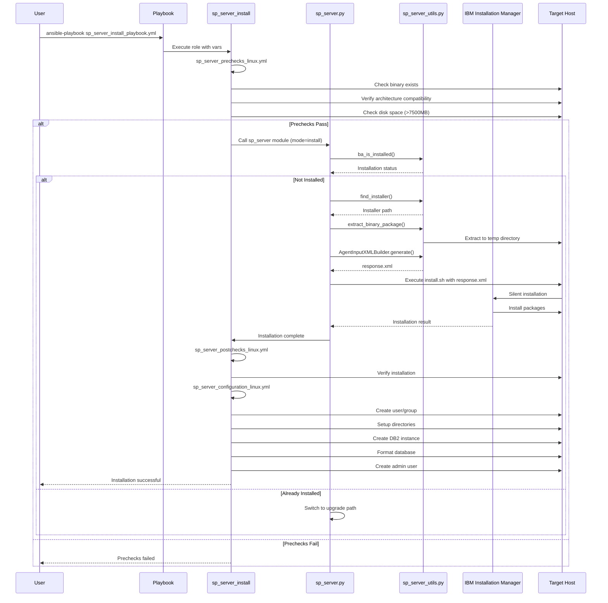

### Configuration Workflow

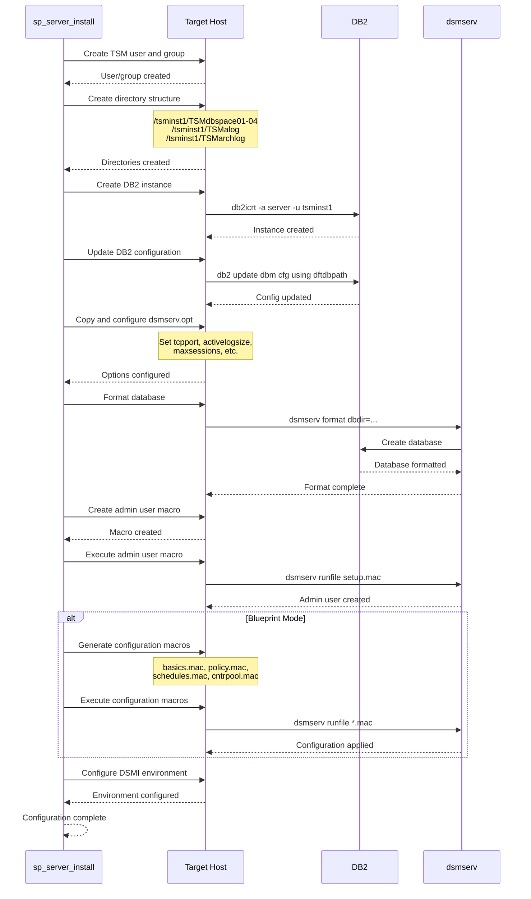

### Facts Gathering Workflow

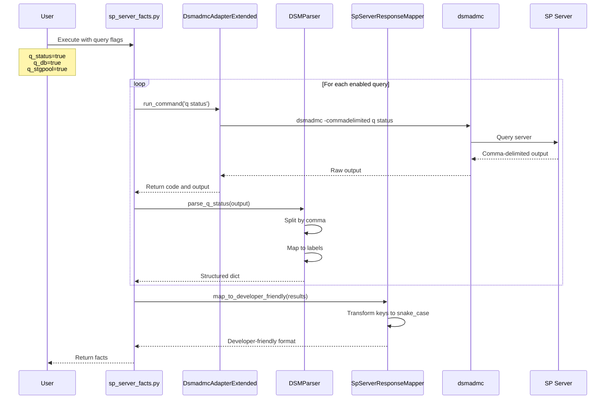

### Node Management Workflow

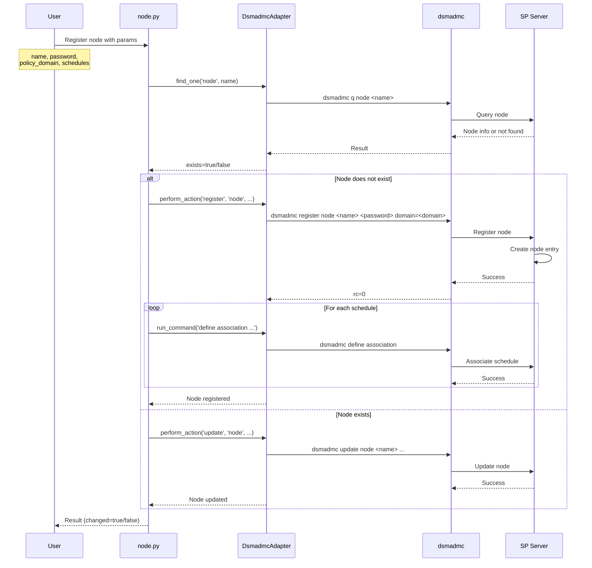

### Upgrade Workflow

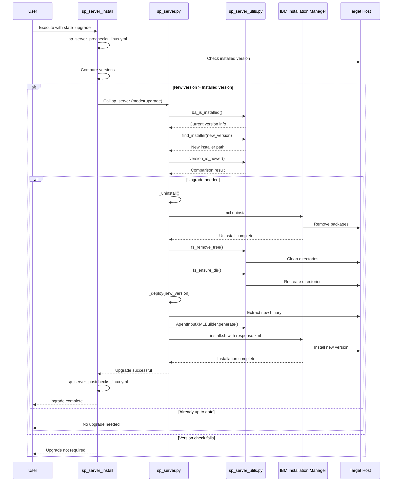

---

## Component Interaction Matrix

| Component | Interacts With | Purpose |
|-----------|---------------|---------|
| **sp_server.py** | sp_server_utils.py | Utility functions for installation |
| | sp_server_constants.py | Component metadata |
| | IBM Installation Manager | Binary installation/uninstallation |
| | File System | Binary extraction, directory management |
| **sp_server_configure.py** | sp_server_utils.py | Configuration utilities |
| | dsmserv | Database formatting, configuration |
| | DB2 | Instance creation, database setup |
| **sp_server_facts.py** | dsmadmc_adapter.py | CLI command execution |
| | sp_server_facts.py (utils) | Output parsing |
| | dsmadmc CLI | Server queries |
| **node.py** | dsmadmc_adapter.py | Node operations |
| | dsmadmc CLI | Node registration/management |
| **schedule.py** | dsmadmc_adapter.py | Schedule operations |
| | dsmadmc CLI | Schedule definition |
| **dsmadmc_adapter.py** | subprocess | Command execution |
| | AnsibleModule | Ansible integration |
| **sp_server_utils.py** | OS APIs | System information |
| | File System | File operations |
| | subprocess | Command execution |
| | XML libraries | Response file generation |

---

## Installation Package Structure

### 1. Binary Package Extraction

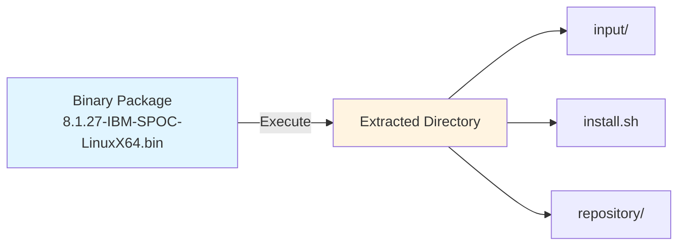

### 2. Response File Generation

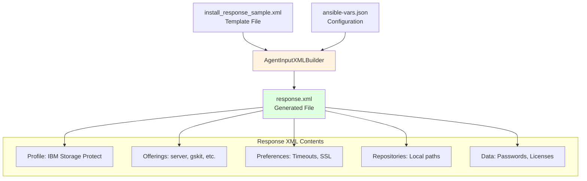

### 3. Installation Manager Workflow

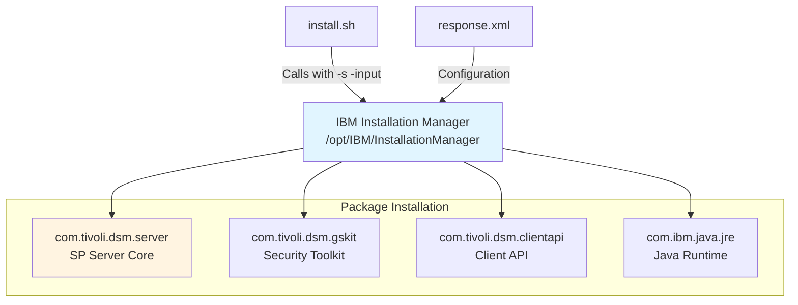

### 4. Installed Directory Structure

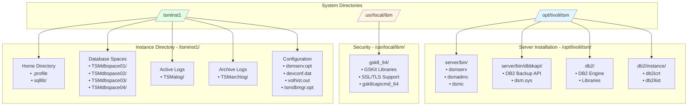

### 5. Package Metadata

| Package ID | Version | Features | Installation Path |
|------------|---------|----------|-------------------|
| **com.tivoli.dsm.server** | 8.1.27+ | server.main, gskit, clientapi, jre | /opt/tivoli/tsm/server |
| **com.tivoli.dsm.gskit** | 8.0.55+ | Security libraries | /usr/local/ibm/gsk8_64 |
| **com.tivoli.dsm.clientapi** | 8.1.27+ | Client API libraries | /opt/tivoli/tsm/server/bin/dbbkapi |
| **com.ibm.java.jre** | 8.0+ | Java Runtime Environment | /opt/tivoli/tsm/java |

---

## Database and Storage Architecture

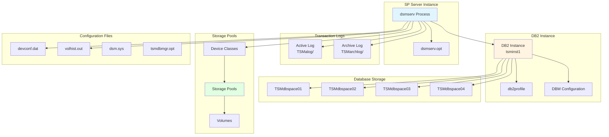

---

## Error Handling and Rollback

### Installation Failure Rollback

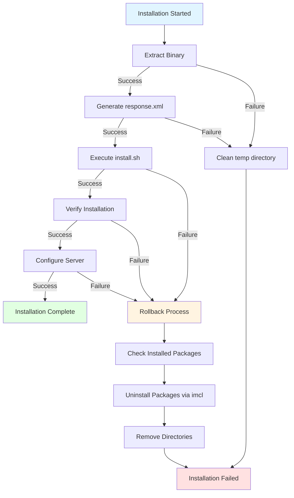

### Upgrade Failure Handling

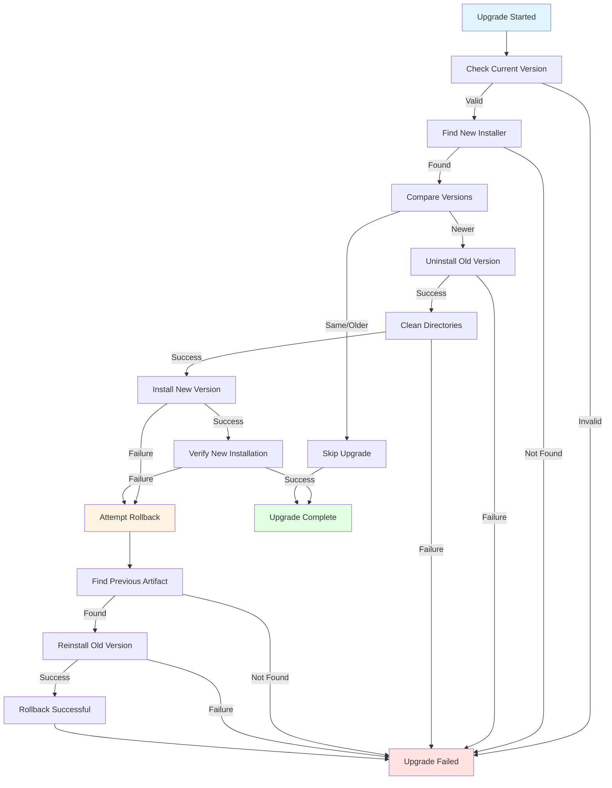

---

## Security Considerations

### Authentication Flow

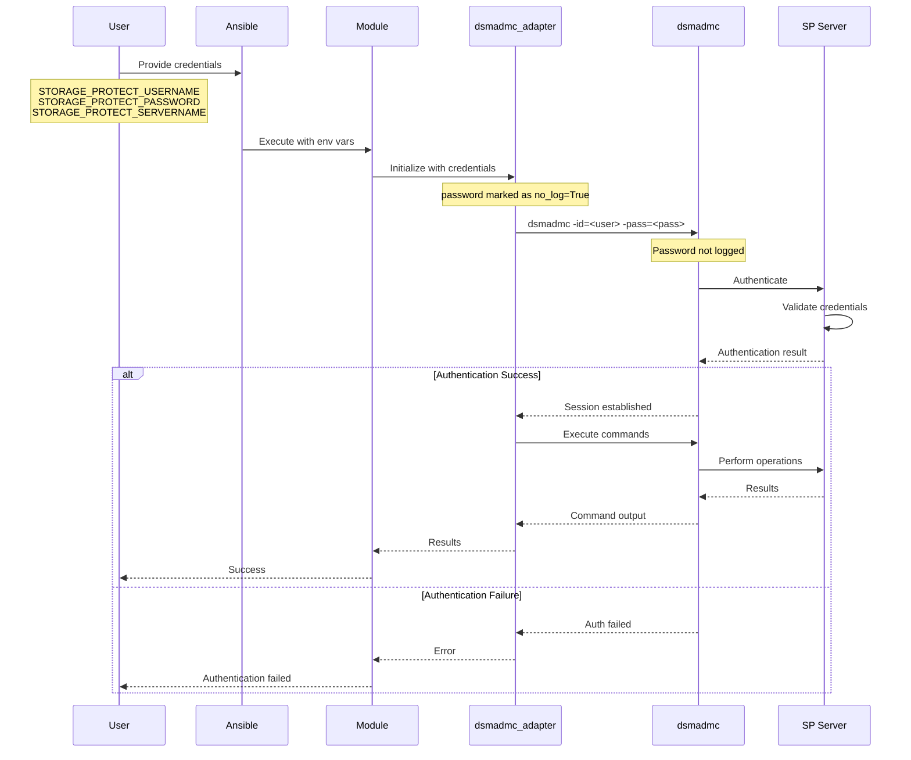

### Password Management

- **Installation Password**: Required for SSL configuration during installation
  - Provided via `--serverpassword` CLI argument or `SP_BA_SERVER_PASSWORD` environment variable
  - Used in response.xml for SSL password configuration
  - Marked as `no_log: true` in Ansible tasks

- **Admin User Password**: Created during configuration
  - Set in setup.mac file
  - Used for administrative operations

- **Node Passwords**: Managed through node registration
  - Minimum 15 characters (configurable)
  - Expiration period configurable (0-9999 days)

---

## Performance Considerations

### Server Sizing

The collection supports different server sizes with pre-configured parameters:

| Size | Active Log Size | Max Sessions | Use Case |
|------|----------------|--------------|----------|
| **xsmall** | 2048 MB | 25 | Development/Testing |
| **small** | 4096 MB | 50 | Small deployments |
| **medium** | 8192 MB | 100 | Medium deployments |
| **large** | 16384 MB | 200 | Large deployments |

### Resource Requirements

**Minimum Requirements**:
- Disk Space: 7500 MB free
- Supported Architectures: x86_64, s390x, ppc64le
- Memory: Varies by server size
- Network: TCP/IP connectivity

**Database Configuration**:
- Multiple database spaces (TSMdbspace01-04)
- Separate active and archive log directories
- Configurable log sizes based on server size

---

## Testing Strategy

### Test Coverage

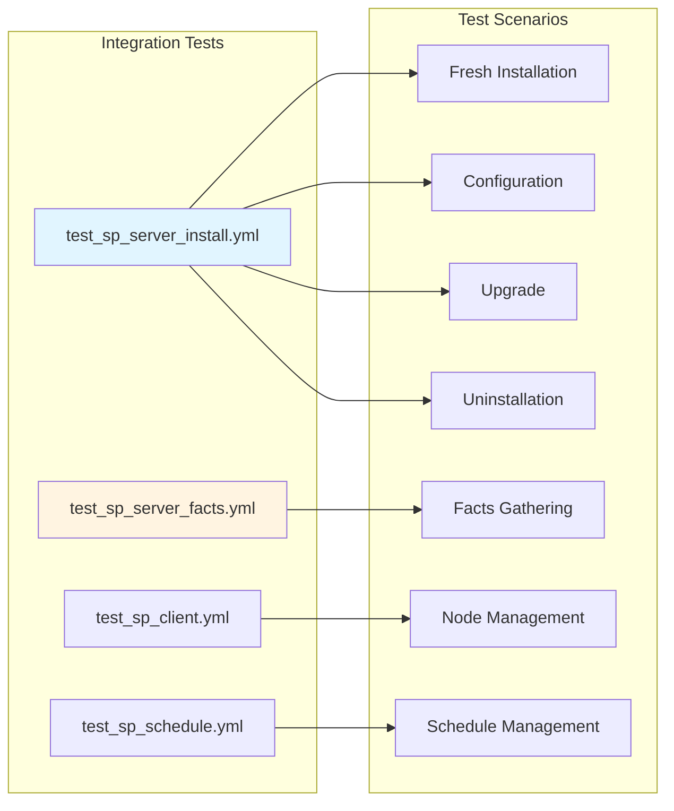

### Test Execution Flow

1. **Fresh Installation Test**
   - Verify binary availability
   - Execute installation
   - Verify installed components
   - Validate configuration

2. **Configuration Test**
   - Test on already installed server
   - Verify configuration application
   - Check database formatting
   - Validate admin user creation

3. **Upgrade Test**
   - Install base version
   - Upgrade to newer version
   - Verify version change
   - Validate functionality

4. **Uninstallation Test**
   - Uninstall server
   - Verify component removal
   - Check cleanup

5. **Facts Gathering Test**
   - Query various server facts
   - Validate output format
   - Check data accuracy

---

## Future Enhancements

### Planned Features

1. **High Availability Support**
   - Replication configuration
   - Failover automation
   - Load balancing

2. **Advanced Monitoring**
   - Performance metrics collection
   - Alert configuration
   - Dashboard integration

3. **Backup Automation**
   - Database backup scheduling
   - Configuration backup
   - Disaster recovery procedures

4. **Cloud Integration**
   - Cloud storage pool support
   - Container deployment
   - Kubernetes operators

5. **Enhanced Security**
   - Certificate automation
   - Key management integration
   - Audit logging

---

## Appendix

### A. File Locations

**Installation Directories**:
- Server binaries: `/opt/tivoli/tsm/server/bin`
- DB2 instance: `/opt/tivoli/tsm/db2`
- GSKit: `/usr/local/ibm/gsk8_64`
- Instance home: `/home/tsminst1`

**Configuration Files**:
- Server options: `/tsminst1/dsmserv.opt`
- Device configuration: `/tsminst1/devconf.dat`
- Volume history: `/tsminst1/volhist.out`
- DSM system file: `/opt/tivoli/tsm/server/bin/dbbkapi/dsm.sys`
- DSMI options: `/tsminst1/tsmdbmgr.opt`

**Database and Logs**:
- Database spaces: `/tsminst1/TSMdbspace01-04`
- Active logs: `/tsminst1/TSMalog`
- Archive logs: `/tsminst1/TSMarchlog`

### B. Environment Variables

**Required for Installation**:
- `SP_BA_SERVER_PASSWORD`: Server SSL password

**Required for Operations**:
- `STORAGE_PROTECT_SERVERNAME`: Server name (default: local)
- `STORAGE_PROTECT_USERNAME`: Admin username
- `STORAGE_PROTECT_PASSWORD`: Admin password

**DB2 Environment**:
- `DB2INSTANCE`: Instance name (e.g., tsminst1)
- `DSMI_CONFIG`: Path to tsmdbmgr.opt
- `DSMI_DIR`: Path to dbbkapi directory
- `DSMI_LOG`: Log directory path

### C. Command Reference

**Installation Manager Commands**:
```bash
# List installed packages
/opt/IBM/InstallationManager/eclipse/tools/imcl listInstalledPackages

# Install with response file
./install.sh -s -input response.xml -acceptLicense

# Uninstall packages
/opt/IBM/InstallationManager/eclipse/tools/imcl uninstall <package_id>
```

**DB2 Commands**:
```bash
# Create instance
/opt/tivoli/tsm/db2/instance/db2icrt -a server -u tsminst1 tsminst1

# Update DBM configuration
db2 update dbm cfg using dftdbpath /tsminst1

# Set registry variable
db2set DB2NOEXITLIST=ON
```

**Server Commands**:
```bash
# Format database
dsmserv format dbdir=/tsminst1/TSMdbspace01,... activelogsize=2048 \
  activelogdirectory=/tsminst1/TSMalog \
  archlogdirectory=/tsminst1/TSMarchlog

# Run macro file
dsmserv runfile setup.mac

# Query server
dsmadmc -id=admin -pass=password q status
```

### D. Troubleshooting Guide

**Common Issues**:

1. **Installation Fails**
   - Check disk space (>7500 MB required)
   - Verify binary file exists and is executable
   - Check architecture compatibility
   - Review installation logs

2. **Configuration Fails**
   - Verify user/group creation
   - Check directory permissions
   - Ensure DB2 instance created successfully
   - Review dsmserv.opt settings

3. **Facts Gathering Fails**
   - Verify dsmadmc is in PATH
   - Check authentication credentials
   - Ensure server is running
   - Verify network connectivity

4. **Upgrade Issues**
   - Confirm version comparison logic
   - Check for running processes
   - Verify backup before upgrade
   - Review rollback procedures

---

## Implementation Gaps and Analysis

### Current Implementation Status

Based on the codebase analysis, the following components are implemented:

✅ **Fully Implemented**:
- SP Server installation (Linux)
- SP Server upgrade (Linux)
- SP Server uninstallation (Linux)
- SP Server configuration (Linux)
- SP Server facts gathering
- Node management (register, update, deregister)
- Schedule management (define, update, delete)
- Storage pool queries
- Policy domain queries
- dsmadmc CLI adapter

### Identified Gaps

#### 1. Platform Support Gaps

| Platform | Installation | Configuration | Status |
|----------|-------------|---------------|---------|
| **Linux** | ✅ Complete | ✅ Complete | Production Ready |
| **Windows** | ⚠️ Partial | ❌ Missing | In Development |
| **AIX** | ❌ Missing | ❌ Missing | Not Started |

**Gap Details**:
- Windows installation logic exists in [`sp_server.py`](plugins/modules/sp_server.py:328) but lacks complete implementation
- AIX support is mentioned in design but no implementation found
- Windows-specific configuration tasks missing in roles

#### 2. Storage Management Gaps

**Missing Modules**:
- ❌ Storage pool creation/modification module
- ❌ Device class management module
- ❌ Volume management module
- ❌ Tape library configuration module

**Current State**: Only query operations available via [`sp_server_facts.py`](plugins/modules/sp_server_facts.py:1)

#### 3. Policy Management Gaps

**Missing Modules**:
- ❌ Policy domain creation/modification
- ❌ Policy set management
- ❌ Management class definition
- ❌ Copy group configuration

**Current State**: Only query operations available

#### 4. High Availability & Disaster Recovery Gaps

**Missing Features**:
- ❌ Replication configuration automation
- ❌ Failover automation
- ❌ Database backup automation
- ❌ Configuration backup/restore
- ❌ Multi-server orchestration

#### 5. Certificate Management Gaps

**Existing Implementation**:
- ✅ Certificate distribution playbook exists ([`cert_distribute.yml`](playbooks/cert_distribute.yml:1))
- ✅ Self-signed certificate creation via dsmadmc
- ✅ Certificate fetching from server
- ✅ Certificate distribution to multiple clients
- ✅ GSKit integration for keystore management
- ✅ Certificate verification

**Implementation Gaps**:
- ⚠️ **Not modularized**: Implemented as playbook only, no reusable module
- ❌ **No role abstraction**: Direct playbook implementation without role structure
- ❌ **Limited certificate types**: Only self-signed certificates supported
- ❌ **No CA integration**: Cannot import CA-signed certificates
- ❌ **Manual configuration**: Requires `data.ini` file with credentials
- ❌ **No certificate renewal**: No automation for expiring certificates
- ❌ **No certificate rotation**: No automated rotation workflow
- ❌ **Limited validation**: Basic verification only, no expiry checks
- ❌ **No Windows support**: Linux-only implementation
- ❌ **Hardcoded paths**: Uses fixed paths for GSKit and certificates

**Recommended Improvements**:
1. Create dedicated `certificate_management` role
2. Develop `sp_certificate` module for certificate operations
3. Add support for CA-signed certificates
4. Implement certificate expiry monitoring
5. Add automated renewal workflows
6. Support Windows certificate stores
7. Make paths configurable via variables
8. Add certificate validation and health checks
9. Implement certificate backup and recovery
10. Add integration with external PKI systems

#### 6. Monitoring and Alerting Gaps

**Missing Features**:
- ❌ Performance metrics collection
- ❌ Alert configuration automation
- ❌ Health check automation
- ❌ Capacity planning reports
- ❌ Integration with monitoring tools (Prometheus, Grafana)

#### 7. Testing Gaps

**Current Test Coverage**:
- ✅ Integration tests for installation
- ✅ Integration tests for facts gathering
- ✅ Integration tests for node management
- ✅ Integration tests for schedule management

**Missing Tests**:
- ❌ Unit tests for utility functions
- ❌ Windows platform tests
- ❌ AIX platform tests
- ❌ Upgrade rollback tests
- ❌ Performance tests
- ❌ Security tests

#### 8. Documentation Gaps

**Missing Documentation**:
- ❌ Windows installation guide
- ❌ AIX installation guide
- ❌ Troubleshooting playbooks
- ❌ Best practices guide
- ❌ Performance tuning guide
- ❌ Security hardening guide

#### 9. Error Handling Gaps

**Areas Needing Improvement**:
- ⚠️ Incomplete rollback for configuration failures
- ⚠️ Limited error recovery for network failures
- ⚠️ Insufficient validation of user inputs
- ⚠️ Missing pre-flight checks for some operations

#### 10. Idempotency Gaps

**Issues Identified**:
- ⚠️ Configuration tasks may not be fully idempotent
- ⚠️ Some operations lack proper state checking
- ⚠️ Repeated runs may cause inconsistent state

---

## Next Steps and Roadmap

### Phase 1: Platform Completion (Priority: High)

**Timeline**: Q2 2026

1. **Windows Support**
   - Complete Windows installation implementation
   - Add Windows configuration tasks
   - Create Windows-specific roles
   - Add Windows integration tests
   - Document Windows deployment

2. **AIX Support**
   - Implement AIX installation workflow
   - Add AIX configuration tasks
   - Create AIX-specific roles
   - Add AIX integration tests
   - Document AIX deployment

**Deliverables**:
- Fully functional Windows and AIX support
- Platform-specific documentation
- Integration test suites for all platforms

### Phase 2: Storage and Policy Management (Priority: High)

**Timeline**: Q3 2026

1. **Storage Management Modules**
   - Create storage pool management module
   - Implement device class management
   - Add volume management capabilities
   - Develop tape library configuration

2. **Policy Management Modules**
   - Implement policy domain management
   - Add policy set operations
   - Create management class module
   - Develop copy group configuration

**Deliverables**:
- Complete storage management automation
- Full policy lifecycle management
- Updated documentation and examples

### Phase 3: High Availability and DR (Priority: Medium)

**Timeline**: Q4 2026

1. **Replication and Failover**
   - Implement replication configuration
   - Add failover automation
   - Create multi-server orchestration
   - Develop health monitoring

2. **Backup and Recovery**
   - Automate database backups
   - Implement configuration backup
   - Add restore procedures
   - Create disaster recovery playbooks

**Deliverables**:
- HA/DR automation framework
- Disaster recovery documentation
- Failover testing procedures

### Phase 4: Security and Compliance (Priority: Medium)

**Timeline**: Q1 2027

1. **Certificate Management**
   - Implement SSL certificate automation
   - Add certificate renewal workflows
   - Create certificate distribution
   - Develop validation procedures

2. **Security Hardening**
   - Add security baseline configuration
   - Implement compliance checks
   - Create audit logging
   - Develop security scanning

**Deliverables**:
- Complete certificate lifecycle automation
- Security hardening playbooks
- Compliance reporting

### Phase 5: Monitoring and Operations (Priority: Low)

**Timeline**: Q2 2027

1. **Monitoring Integration**
   - Implement metrics collection
   - Add Prometheus exporters
   - Create Grafana dashboards
   - Develop alerting rules

2. **Operational Automation**
   - Add capacity planning tools
   - Implement performance tuning
   - Create maintenance playbooks
   - Develop troubleshooting automation

**Deliverables**:
- Monitoring and alerting framework
- Operational playbooks
- Performance optimization guides

### Phase 6: Testing and Quality (Ongoing)

**Timeline**: Continuous

1. **Test Coverage Expansion**
   - Add unit tests for all utilities
   - Expand integration test coverage
   - Implement performance tests
   - Add security tests

2. **Quality Improvements**
   - Enhance error handling
   - Improve idempotency
   - Add input validation
   - Refactor code for maintainability

**Deliverables**:
- 80%+ test coverage
- Improved code quality metrics
- Enhanced reliability

### Quick Wins (Immediate Actions)

1. **Documentation**
   - Add inline code documentation
   - Create troubleshooting guides
   - Document best practices
   - Add more examples

2. **Error Handling**
   - Improve error messages
   - Add validation checks
   - Enhance rollback procedures
   - Add pre-flight checks

3. **Idempotency**
   - Review all tasks for idempotency
   - Add state checking
   - Improve change detection
   - Add dry-run mode

### Success Metrics

**Phase 1-2 (Platform & Core Features)**:
- All 3 platforms (Linux, Windows, AIX) fully supported
- 100% of documented features implemented
- Integration tests passing on all platforms

**Phase 3-4 (HA/DR & Security)**:
- HA/DR automation functional
- Certificate management automated
- Security compliance checks passing

**Phase 5-6 (Monitoring & Quality)**:
- Monitoring integrated with 2+ platforms
- Test coverage > 80%
- Zero critical bugs in production

### Community Engagement

1. **Open Source Contribution**
   - Accept community pull requests
   - Provide contribution guidelines
   - Regular release cycles
   - Active issue management

2. **Documentation and Support**
   - Maintain up-to-date documentation
   - Provide example playbooks
   - Create video tutorials
   - Host community forums

---

## Document Revision History

| Version | Date | Author | Changes |
|---------|------|--------|---------|
| 1.0 | 2026-03-26 | System | Initial comprehensive design document with architecture diagrams |
| 1.1 | 2026-03-26 | System | Added implementation gaps analysis and next steps roadmap |

---

## References

- [IBM Storage Protect 8.1.27 Documentation](https://www.ibm.com/docs/en/storage-protect/8.1.27?topic=servers)
- [Ansible Collection: ibm.storage_protect](https://galaxy.ansible.com/ibm/storage_protect)
- [IBM Installation Manager Documentation](https://www.ibm.com/docs/en/installation-manager)
- [DB2 Database Documentation](https://www.ibm.com/docs/en/db2)
- [Ansible Best Practices](https://docs.ansible.com/ansible/latest/user_guide/playbooks_best_practices.html)
