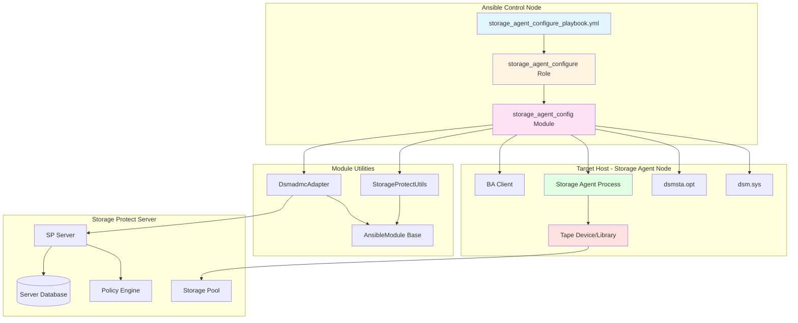
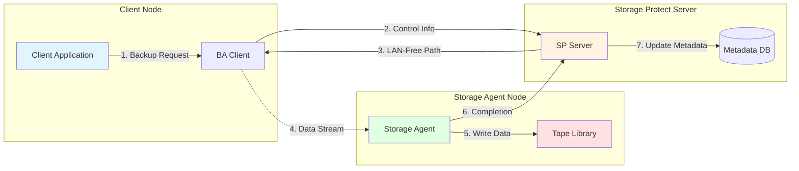
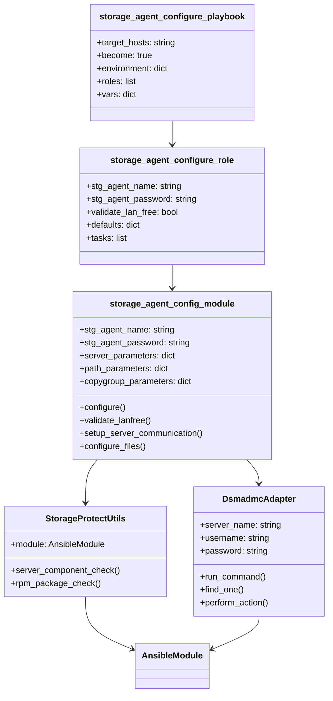
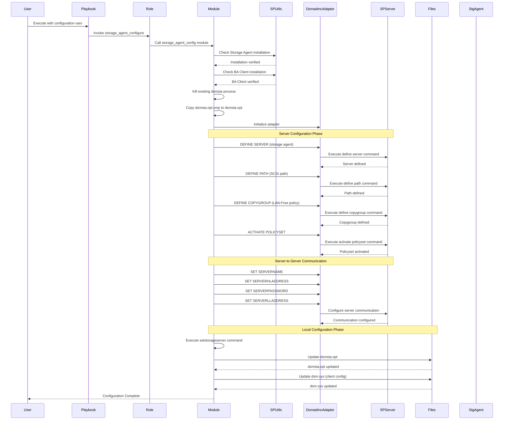
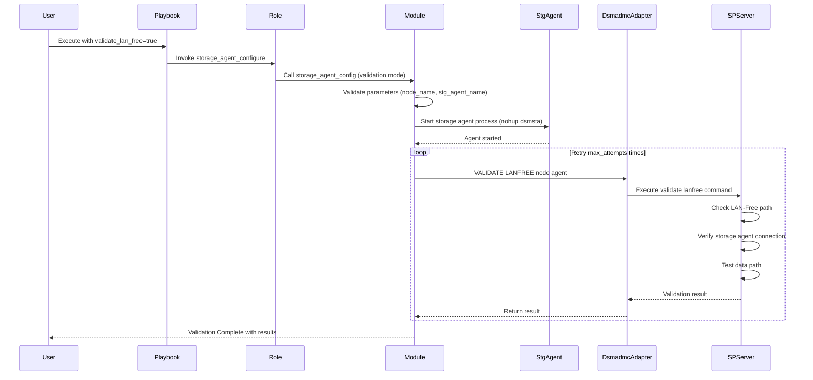
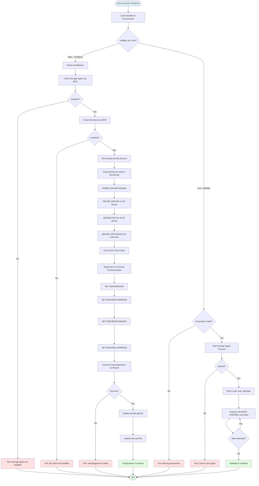
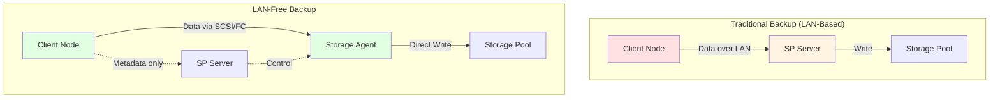
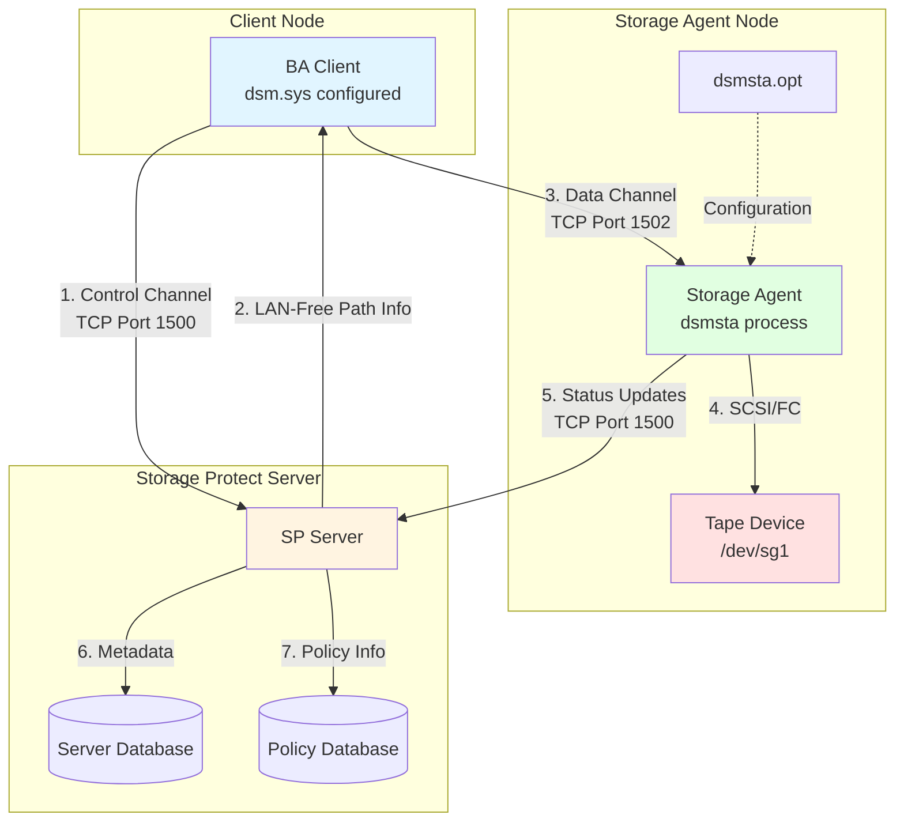
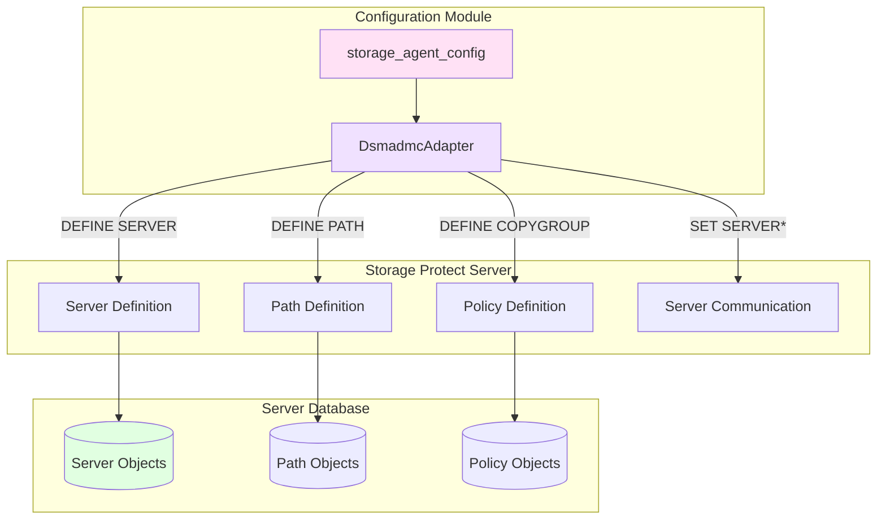
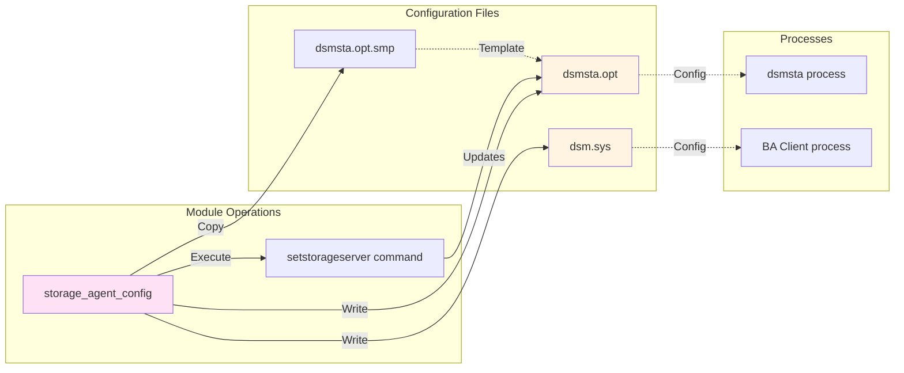

# IBM Storage Protect Storage Agent Configuration Design

## Overview

The Storage Agent configuration component provides Ansible automation for configuring IBM Storage Protect Storage Agents to enable LAN-Free backup operations. A Storage Agent acts as a data mover that allows client nodes to back up data directly to tape or other storage devices without sending the data through the Storage Protect server, significantly reducing network traffic and improving backup performance.

## Storage Agent Concept

### What is a Storage Agent?

According to [IBM Documentation](https://www.ibm.com/docs/en/tsmfsan/7.1.1?topic=storage-agent-overview), a Storage Agent is a licensed program that moves data between a client node and local storage devices (such as tape drives or libraries) on behalf of the Storage Protect server. This enables **LAN-Free data movement**, where backup and restore operations bypass the LAN and communicate directly with storage devices through SCSI or Fibre Channel connections.

### Key Benefits

1. **Reduced Network Load**: Data flows directly from client to storage device
2. **Improved Performance**: Eliminates server bottleneck for data transfer
3. **Scalability**: Distributes data movement across multiple storage agents
4. **Efficient Resource Utilization**: Offloads data movement from the server

## Architecture

### High-Level Architecture



### LAN-Free Data Flow



### Component Relationships



## Data Flow

### Configuration Flow



### Validation Flow



### Complete Workflow



## Component Details

### 1. Playbook Layer

**File**: [`playbooks/storage_agent_configure_playbook.yml`](../../playbooks/storage_agent_configure_playbook.yml)

```yaml
Purpose: Entry point for Storage Agent configuration and validation
Features:
  - Two-phase execution: Configuration and Validation
  - Dynamic host targeting via target_hosts variable
  - Environment variable support for credentials
  - Comprehensive variable configuration
```

### 2. Role Layer

**Path**: [`roles/storage_agent_configure/`](../../roles/storage_agent_configure/)

#### Structure
```
roles/storage_agent_configure/
├── README.md                           # Role documentation
├── defaults/main.yml                   # Default variables
├── meta/main.yml                       # Role metadata
└── tasks/
    ├── main.yml                        # Main task dispatcher
    ├── storage_agent_configure.yml     # Configuration tasks
    └── lanfree_client_validation.yml   # Validation tasks
```

#### Default Variables

| Variable | Default | Description |
|----------|---------|-------------|
| `stg_agent_name` | "" | Storage Agent name on server |
| `stg_agent_password` | "" | Storage Agent password |
| `stg_agent_server_name` | "" | Server name where agent is defined |
| `stg_agent_hl_add` | "" | High-level address of agent host |
| `lladdress` | "1502" | Low-level address (LAN-Free port) |
| `server_tcp_port` | "1500" | Server TCP/IP port |
| `server_hl_address` | "" | Server high-level address |
| `server_password` | "" | Server-to-server password |
| `stg_agent_path_name` | "" | SCSI path name (e.g., "drv1") |
| `stg_agent_path_dest` | "drive" | Path destination type (drive/library) |
| `library` | "" | Tape library name |
| `device` | "" | Device path (e.g., "/dev/sg1") |
| `copygroup_domain` | "" | Policy domain for LAN-Free |
| `copygroup_policyset` | "" | Policy set name |
| `copygroup_mngclass` | "" | Management class |
| `copygroup_destination` | "" | Storage pool destination |
| `validate_lan_free` | false | Enable validation mode |
| `node_name` | "" | Client node name for validation |
| `stg_pool` | "" | Storage pool name |
| `max_attempts` | 3 | Validation retry attempts |

### 3. Module Layer

**File**: [`plugins/modules/storage_agent_config.py`](../../plugins/modules/storage_agent_config.py)

#### Module Parameters

| Parameter | Type | Required | Default | Description |
|-----------|------|----------|---------|-------------|
| `stg_agent_name` | string | Yes | - | Storage Agent name |
| `stg_agent_password` | string | Conditional* | - | Storage Agent password |
| `stg_agent_server_name` | string | Conditional* | - | Server name |
| `stg_agent_hl_add` | string | Conditional* | - | Agent high-level address |
| `lladdress` | string | Conditional* | - | LAN-Free port |
| `server_tcp_port` | string | Conditional* | - | Server TCP port |
| `server_hl_address` | string | Conditional* | - | Server address |
| `server_password` | string | Conditional* | - | Server password |
| `stg_agent_path_name` | string | Conditional* | - | SCSI path name |
| `stg_agent_path_dest` | string | Conditional* | "drive" | Path destination type |
| `library` | string | Conditional* | - | Library name |
| `device` | string | Conditional* | - | Device path |
| `copygroup_domain` | string | Conditional* | - | Policy domain |
| `copygroup_policyset` | string | Conditional* | - | Policy set |
| `copygroup_mngclass` | string | Conditional* | - | Management class |
| `copygroup_destination` | string | Conditional* | - | Storage pool |
| `stg_pool` | string | Conditional* | - | Storage pool name |
| `validate_lan_free` | bool | No | false | Enable validation mode |
| `node_name` | string | Conditional** | - | Client node name |
| `max_attempts` | int | No | 3 | Validation retry count |
| `client_options_file_path` | string | No | /opt/tivoli/tsm/client/ba/bin/dsm.sys | Client config path |
| `stg_agent_options_file_path` | string | No | /opt/tivoli/tsm/StorageAgent/bin/dsmsta.opt | Agent config path |
| `stg_agent_bin_dir` | string | No | /opt/tivoli/tsm/StorageAgent/bin | Agent binary directory |
| `start_stg_agent` | bool | No | true | Start agent after config |
| `imcl_path` | string | No | /opt/IBM/InstallationManager/eclipse/tools/imcl | IMCL path |

*Required when `validate_lan_free` is false  
**Required when `validate_lan_free` is true

#### Module Operations

##### Configuration Mode (`validate_lan_free=false`)

**Phase 1: Prerequisites Check**
1. Verify Storage Agent installation via IMCL
2. Verify BA Client installation via RPM
3. Kill any existing dsmsta process
4. Copy `dsmsta.opt.smp` to `dsmsta.opt`

**Phase 2: Server Configuration**
```python
# Define Storage Agent as a server on SP Server
DEFINE SERVER {stg_agent_name} 
  SERVERPASSWORD={stg_agent_password} 
  HLADDRESS={stg_agent_hl_add} 
  LLADDRESS={lladdress} 
  SSL=YES

# Define SCSI path for storage device
DEFINE PATH {stg_agent_name} {stg_agent_path_name} 
  SRCTYPE=SERVER 
  DESTTYPE={stg_agent_path_dest} 
  LIBRARY={library} 
  DEVICE={device}

# Define LAN-Free copy group
DEFINE COPYGROUP {copygroup_domain} {copygroup_policyset} 
  {copygroup_mngclass} 
  TYPE=BACKUP 
  DESTINATION={stg_pool}

# Activate policy set
ACTIVATE POLICYSET {copygroup_domain} {copygroup_policyset}
```

**Phase 3: Server-to-Server Communication**
```python
SET SERVERNAME {stg_agent_server_name}
SET SERVERHLADDRESS {server_hl_address}
SET SERVERPASSWORD {server_password}
SET SERVERLLADDRESS {lladdress}
```

**Phase 4: Local Configuration**
```bash
# Configure storage agent
./dsmsta setstorageserver 
  myname={stg_agent_name} 
  mypassword={stg_agent_password} 
  myhladdress={stg_agent_hl_add} 
  servername={stg_agent_server_name} 
  serverpassword={server_password} 
  hladdress={server_hl_address} 
  lladdress={server_tcp_port} 
  ssl=yes
```

**Phase 5: File Updates**

`dsmsta.opt`:
```
Servername {stg_agent_server_name}
COMMmethod TCPip
TCPPort {server_tcp_port}
SSLTCPPort {server_tcp_port}
SSLTCPadminPort {lladdress}
DEVCONFIG devconfig.txt
```

`dsm.sys`:
```
Servername {stg_agent_server_name}
LANfreeCOMMmethod tcpip
enablelanfree yes
lanfreetcpserveraddress {server_hl_address}
lanfreetcpport {lladdress}
TCPServeraddress {server_hl_address}
```

##### Validation Mode (`validate_lan_free=true`)

1. Validate required parameters (`node_name`, `stg_agent_name`)
2. Start storage agent process: `nohup dsmsta > dsmsta.log 2>&1 &`
3. Retry validation up to `max_attempts` times:
   ```
   VALIDATE LANFREE {node_name} {stg_agent_name}
   ```
4. Return validation results

### 4. Utility Layer

#### StorageProtectUtils

**File**: [`plugins/module_utils/sp_utils.py`](../../plugins/module_utils/sp_utils.py)

##### Methods

###### `server_component_check(imcl_path, package_prefix)`
- Verifies Storage Agent installation via IBM Installation Manager
- Executes: `{imcl_path} listinstalledpackages`
- Searches for package prefix: `com.tivoli.dsm.stagent_`
- Fails if component not found

###### `rpm_package_check(package_name)`
- Verifies BA Client installation via RPM
- Executes: `rpm -q {package_name}`
- Checks for package: `TIVsm-BA`
- Fails if package not installed

#### DsmadmcAdapter

**File**: [`plugins/module_utils/dsmadmc_adapter.py`](../../plugins/module_utils/dsmadmc_adapter.py)

Provides Storage Protect CLI integration for executing administrative commands. See [OC Design](design-oc.md#dsmadmcadapter-class) for detailed documentation.

## LAN-Free Architecture

### Traditional vs LAN-Free Backup



### Storage Agent Communication Paths



## Configuration Files

### dsmsta.opt (Storage Agent Options)

```ini
# Server connection parameters
Servername SERVER2
COMMmethod TCPip
TCPPort 1500
SSLTCPPort 1500
SSLTCPadminPort 1502
DEVCONFIG devconfig.txt
```

**Purpose**: Configures how the storage agent connects to the Storage Protect server.

### dsm.sys (Client System Options)

```ini
# LAN-Free configuration for BA Client
Servername SERVER2
LANfreeCOMMmethod tcpip
enablelanfree yes
lanfreetcpserveraddress 9.47.89.61
lanfreetcpport 1502
TCPServeraddress 9.47.89.61
```

**Purpose**: Enables LAN-Free backup for the BA Client and specifies storage agent connection details.

## Usage Examples

### Complete Configuration

```bash
# Set environment variables
export STORAGE_PROTECT_SERVERNAME="server2"
export STORAGE_PROTECT_USERNAME="tsmuser1"
export STORAGE_PROTECT_PASSWORD="tsmuser1@@123456789"

# Execute configuration playbook
ansible-playbook -i inventory.ini \
  ibm.storage_protect.storage_agent_configure_playbook.yml \
  -e @storage_agent_vars.yml
```

**storage_agent_vars.yml**:
```yaml
target_hosts: "storage_agent_nodes"
stg_agent_name: "stgagent16"
stg_agent_password: "STGAGENT@123456789"
stg_agent_server_name: "server2"
stg_agent_hl_add: "9.11.69.158"
lladdress: "1502"
server_tcp_port: "1500"
server_hl_address: "9.47.89.61"
server_password: "ServerPassword@@12345"
stg_agent_path_name: "drv1"
stg_agent_path_dest: "drive"
library: "MSLG3LIB"
device: "/dev/sg1"
copygroup_domain: "lanfreedomain"
copygroup_policyset: "standard"
copygroup_mngclass: "LANFREEMGMT"
copygroup_destination: "LANFREEPOOL"
stg_pool: "LANFREEPOOL"
node_name: "lanfreeclient"
validate_lan_free: false
```

### LAN-Free Validation

```bash
ansible-playbook -i inventory.ini \
  ibm.storage_protect.storage_agent_configure_playbook.yml \
  -e "validate_lan_free=true" \
  -e "node_name=lanfreeclient" \
  -e "stg_agent_name=stgagent16" \
  -e "max_attempts=3"
```

## Integration Points

### Storage Protect Server Integration



### File System Integration



## Prerequisites

### System Requirements

1. **Storage Agent Installation**
   - IBM Storage Protect Storage Agent must be installed
   - Verified via IBM Installation Manager (IMCL)
   - Package prefix: `com.tivoli.dsm.stagent_`

2. **BA Client Installation**
   - IBM Storage Protect Backup-Archive Client must be installed
   - Verified via RPM: `TIVsm-BA`
   - Client must be registered with Storage Protect server

3. **Storage Hardware**
   - SCSI or Fibre Channel tape library
   - Tape drives accessible from storage agent node
   - Device paths configured (e.g., `/dev/sg1`, `/dev/st0`)

4. **Network Configuration**
   - TCP/IP connectivity between client, storage agent, and server
   - Port 1500: Server communication
   - Port 1502: LAN-Free data transfer
   - Firewall rules configured appropriately

5. **Storage Protect Server**
   - LAN-Free capable storage pool created
   - Policy domain and management class defined
   - Server-to-server communication enabled

### Environment Variables

```bash
STORAGE_PROTECT_SERVERNAME  # Server name for dsmadmc
STORAGE_PROTECT_USERNAME    # Admin username
STORAGE_PROTECT_PASSWORD    # Admin password
```

### Permissions

- Root or sudo access on target hosts (become: true)
- Storage Protect admin privileges for server configuration
- File system write permissions for configuration files
- Device access permissions for tape devices

## Error Scenarios

### Common Errors and Resolutions

| Error | Cause | Resolution |
|-------|-------|------------|
| "Server component with prefix 'com.tivoli.dsm.stagent_' not found" | Storage Agent not installed | Install Storage Agent using sp_server_install role |
| "BA client package 'TIVsm-BA' is not installed" | BA Client not installed | Install BA Client using ba_client_install role |
| "Failed to copy dsmsta.opt.smp file" | Missing template file | Verify Storage Agent installation integrity |
| "setstorageserver command failed" | Invalid parameters or connectivity | Check network connectivity and parameter values |
| "Failed to update dsmsta.opt" | Permission denied | Verify write permissions on /opt/tivoli/tsm/StorageAgent/bin/ |
| "Failed to update dsm.sys" | Permission denied | Verify write permissions on /opt/tivoli/tsm/client/ba/bin/ |
| "For LAN-Free validation, both stg_agent_name and node_name must be provided" | Missing validation parameters | Provide both parameters when validate_lan_free=true |
| "Failed to start storage agent" | Process startup failure | Check dsmsta.log for errors, verify configuration |
| "VALIDATE LANFREE failed" | Path not configured or agent not running | Verify storage agent is running and paths are defined |

## Validation Process

### VALIDATE LANFREE Command

The `VALIDATE LANFREE` command verifies that:

1. **Client Node Configuration**
   - Node is registered with the server
   - Node is assigned to LAN-Free policy domain
   - Client has enablelanfree=yes in dsm.sys

2. **Storage Agent Configuration**
   - Storage agent is defined on server
   - Storage agent process is running
   - Communication paths are established

3. **SCSI Path Configuration**
   - Path is defined between storage agent and device
   - Device is accessible and operational
   - Library configuration is correct

4. **Policy Configuration**
   - Copy group is defined with LAN-Free destination
   - Policy set is activated
   - Storage pool is LAN-Free capable

### Validation Output

```
ANR2017I Administrator ADMIN issued command: VALIDATE LANFREE lanfreeclient stgagent16
ANR2280I LAN-free data transfer is enabled for node LANFREECLIENT.
ANR2281I Storage agent STGAGENT16 is available for LAN-free data transfer.
ANR2282I Path STGAGENT16 DRV1 is available for LAN-free data transfer.
ANR2283I LAN-free validation completed successfully.
```

## Performance Considerations

1. **Network Bandwidth**
   - LAN-Free reduces network traffic on primary LAN
   - Data flows directly between client and storage agent
   - Control traffic still uses primary network

2. **Storage Agent Capacity**
   - Multiple clients can share a storage agent
   - Agent capacity depends on tape drive speed
   - Consider multiple agents for high-volume environments

3. **Retry Mechanism**
   - Validation retries (`max_attempts`) allow agent startup time
   - Default 3 attempts with delays between retries
   - Adjust based on environment and agent startup time

4. **Concurrent Operations**
   - Multiple LAN-Free backups can run simultaneously
   - Limited by number of tape drives and paths
   - Configure sufficient paths for concurrent operations

## Security Considerations

1. **Password Management**
   - Storage agent password stored in configuration
   - Server-to-server password for authentication
   - Use Ansible Vault for sensitive variables

2. **SSL/TLS Communication**
   - SSL enabled for server-to-agent communication
   - Certificate validation recommended
   - Secure ports: 1500 (SSL), 1502 (SSL admin)

3. **Access Control**
   - Device permissions restrict tape access
   - File permissions protect configuration files
   - Admin privileges required for configuration

4. **Network Security**
   - Firewall rules for LAN-Free ports
   - Separate network segments recommended
   - Monitor for unauthorized access

## Troubleshooting

### Diagnostic Commands

```bash
# Check storage agent process
ps aux | grep dsmsta

# View storage agent log
tail -f /opt/tivoli/tsm/StorageAgent/bin/dsmsta.log

# Test storage agent connectivity
dsmadmc -id=admin -pa=password "q server stgagent16"

# Check SCSI paths
dsmadmc -id=admin -pa=password "q path * * srctype=server"

# Verify LAN-Free policy
dsmadmc -id=admin -pa=password "q copygroup lanfreedomain standard *"

# Test device access
ls -l /dev/sg1
```

### Log Files

| Log File | Location | Purpose |
|----------|----------|---------|
| dsmsta.log | /opt/tivoli/tsm/StorageAgent/bin/ | Storage agent operations |
| dsmsched.log | /var/log/tsm/ | Client scheduler log |
| dsmerror.log | /var/log/tsm/ | Client error log |
| actlog.log | SP Server | Server activity log |

## Future Enhancements

1. **Multi-Path Support**
   - Configure multiple SCSI paths per agent
   - Load balancing across paths
   - Failover capabilities

2. **Dynamic Path Discovery**
   - Automatic device detection
   - Path optimization
   - Health monitoring

3. **Advanced Validation**
   - Performance testing
   - Throughput measurement
   - Path quality assessment

4. **Configuration Templates**
   - Pre-defined configurations for common scenarios
   - Best practice templates
   - Environment-specific profiles

## References

- [IBM Storage Protect Storage Agent Overview](https://www.ibm.com/docs/en/tsmfsan/7.1.1?topic=storage-agent-overview)
- [Configuring LAN-Free Data Movement](https://www.ibm.com/docs/en/storage-protect/8.1.x?topic=data-configuring-lan-free-movement)
- [Storage Agent Installation](https://www.ibm.com/docs/en/storage-protect/8.1.x?topic=agent-installing-storage)
- [VALIDATE LANFREE Command](https://www.ibm.com/docs/en/storage-protect/8.1.x?topic=commands-validate-lanfree)

## Related Components

- [`sp_server_install`](design-sp-server.md) - Storage Protect Server installation
- [`ba_client_install`](design-ba-client.md) - Backup-Archive client installation
- [`dsmadmc_adapter`](../../plugins/module_utils/dsmadmc_adapter.py) - CLI adapter utility
- [`sp_utils`](../../plugins/module_utils/sp_utils.py) - Common utilities

---

**Document Version**: 1.0  
**Last Updated**: 2026-03-26  
**Author**: Reverse-engineered from codebase with IBM documentation reference