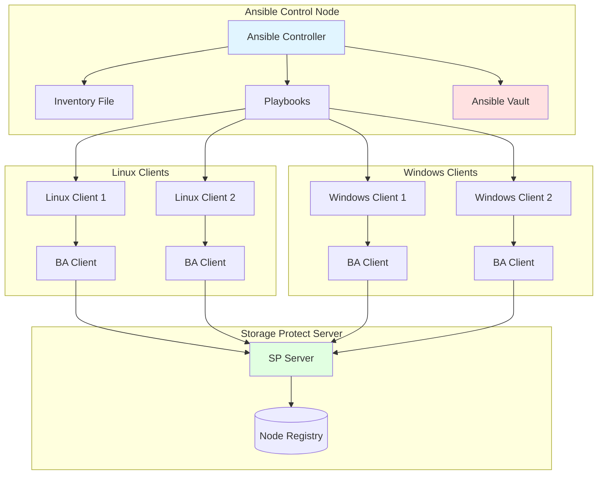
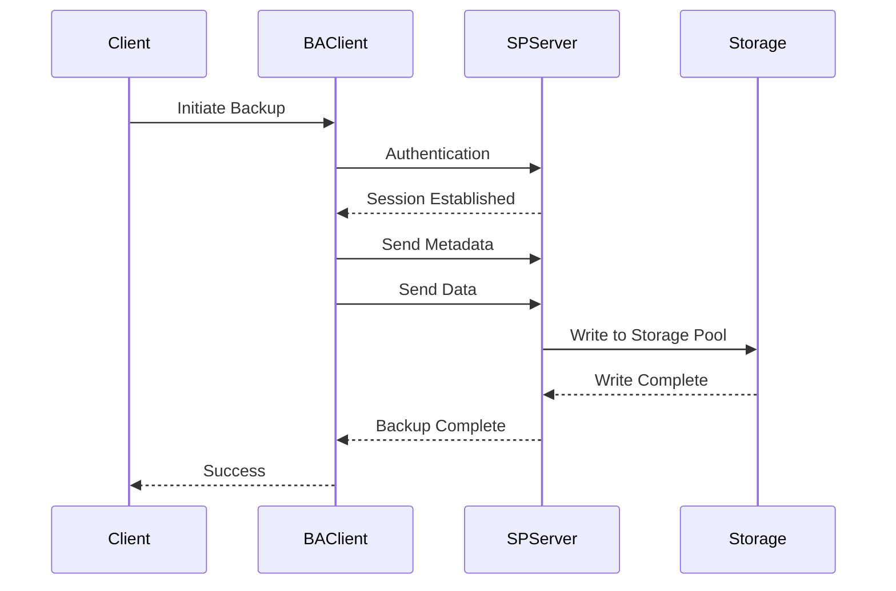

# IBM Storage Protect Backup-Archive Client Lifecycle Management - User Guide

## Table of Contents
1. [Overview](#overview)
2. [Prerequisites](#prerequisites)
3. [Solution Architecture](#solution-architecture)
4. [Operations Guide](#operations-guide)
5. [Configuration Reference](#configuration-reference)
6. [Troubleshooting](#troubleshooting)
7. [Best Practices](#best-practices)

## Overview

### Purpose
This solution provides complete lifecycle management for IBM Storage Protect Backup-Archive (BA) Client across Linux and Windows platforms, including installation, configuration, upgrade, and removal operations.

### Solution Components
- BA Client installation (Linux/Windows)
- Client configuration (dsm.opt, dsm.sys)
- Server registration
- Schedule configuration
- Client upgrade
- Complete uninstallation

### Supported Platforms

#### Linux
- Red Hat Enterprise Linux 7.x, 8.x, 9.x
- SUSE Linux Enterprise Server 12.x, 15.x
- Ubuntu 18.04, 20.04, 22.04
- CentOS 7.x, 8.x

#### Windows
- Windows Server 2016, 2019, 2022
- Windows 10, 11 (Professional/Enterprise)

## Prerequisites

### Ansible Requirements

#### Ansible Version Compatibility
This collection has been tested against Ansible versions **>= 2.15.0**.

```bash
# Check Ansible version
ansible --version
# Required: ansible [core 2.15.0] or higher
```

#### Python Version
- **Control Node**: Python 3.8 or higher
- **Managed Nodes**: Python 3.9 or higher (required for BA client installation)

**Important**: The BA client installation role requires Python 3.9+ on remote hosts. If your target systems use an older Python version, use the `python_version_install.yml` playbook first:

```bash
# Install Python 3.9+ on managed nodes
ansible-playbook ibm.storage_protect.python_version_install \
  -i inventory.ini \
  -e "target_hosts=ba_clients"
```

### IBM Storage Protect Requirements

#### Supported Versions
This collection supports IBM Storage Protect versions **>= 8.1.23**.

#### Required Components
- IBM Storage Protect BA Client installation packages (.tar files for Linux, .exe for Windows)
- Valid Storage Protect Server (>= 8.1.23)
- Node registration on SP Server (or admin credentials to register)

Refer to [IBM Documentation](https://www.ibm.com/docs/en/storage-protect/8.1.24?topic=windows-install-unix-linux-backup-archive-clients) for detailed installation requirements.

### Collection Installation

#### Install from Ansible Galaxy

```bash
# Install the collection
ansible-galaxy collection install ibm.storage_protect

# Verify installation
ansible-galaxy collection list | grep ibm.storage_protect
```

#### Install from requirements.yml

```yaml
# requirements.yml
collections:
  - name: ibm.storage_protect
  - name: ansible.posix
```

```bash
# Install collections
ansible-galaxy collection install -r requirements.yml
```

#### Upgrade Collection

```bash
# Upgrade to latest version
ansible-galaxy collection install ibm.storage_protect --upgrade

# Install specific version
ansible-galaxy collection install ibm.storage_protect:==1.0.0
```

### Ansible Vault Setup

#### Create Encrypted Vault File

This repository uses **Ansible Vault** to securely store sensitive data such as credentials and file paths.

```bash
# Create new vault file
ansible-vault create vars/vault.yml
```

Add your sensitive variables:

```yaml
# vars/vault.yml (before encryption)
---
storage_protect_username: admin
storage_protect_password: "AdminPass123!"
CLIENT_NAME: "client01.example.com"
CLIENT_PASSWORD: "ClientPass456!"
CLIENT_POLICY_DOMAIN: "STANDARD"
CLIENT_HOST: "10.10.10.101"
ba_client_version: "8.1.27.0"
BA_CLIENT_TAR_REPO_PATH: "/data/sp-packages/ba-client"
```

#### Encrypt Vault File

```bash
# Encrypt the vault file
ansible-vault encrypt vars/vault.yml

# You'll be prompted for a vault password
# Store this password securely!
```

#### Create Vault Password File

```bash
# Create vault password file (DO NOT COMMIT TO GIT)
echo "your-vault-password" > vault_pass.txt
chmod 600 vault_pass.txt

# Add to .gitignore
echo "vault_pass.txt" >> .gitignore
```

#### Vault Operations

```bash
# View encrypted vault
ansible-vault view vars/vault.yml

# Edit encrypted vault
ansible-vault edit vars/vault.yml

# Decrypt vault (temporary)
ansible-vault decrypt vars/vault.yml

# Re-encrypt vault
ansible-vault encrypt vars/vault.yml
```

#### Using Vault in Playbooks

```yaml
# playbook.yml
- name: Install BA Client
  hosts: ba_clients
  become: true
  vars_files:
    - vars/vault.yml  # Load encrypted variables
  roles:
    - role: ibm.storage_protect.ba_client_install
      vars:
        ba_client_version: "{{ ba_client_version }}"
        ba_client_tar_repo: "{{ BA_CLIENT_TAR_REPO_PATH }}"
```

```bash
# Run playbook with vault password
ansible-playbook playbook.yml --vault-password-file vault_pass.txt

# Or prompt for password
ansible-playbook playbook.yml --ask-vault-pass
```

### System Requirements

#### Linux Requirements
| Component | Requirement |
|-----------|-------------|
| CPU | 1 core minimum, 2 cores recommended |
| RAM | 2 GB minimum, 4 GB recommended |
| Disk Space | 500 MB for client, additional for cache |
| OS | 64-bit Linux distribution |
| Python | 3.9 or higher |

#### Windows Requirements
| Component | Requirement |
|-----------|-------------|
| CPU | 1 core minimum, 2 cores recommended |
| RAM | 2 GB minimum, 4 GB recommended |
| Disk Space | 1 GB for client, additional for cache |
| OS | 64-bit Windows |
| PowerShell | 5.1 or higher |

### Network Requirements
- Connectivity to Storage Protect Server (port 1500 or 1543 for SSL)
- DNS resolution or hosts file entry for server
- Firewall rules allowing outbound connections

### Permissions
- Root/Administrator access on target hosts
- Access to software repository
- Server admin credentials for node registration

### GitHub Actions Integration (Optional)

#### Storing Vault Password in GitHub Secrets

```yaml
# .github/workflows/deploy-ba-client.yml
name: Deploy BA Client

on:
  push:
    branches: [main]

jobs:
  deploy:
    runs-on: self-hosted
    
    steps:
      - name: Checkout Code
        uses: actions/checkout@v4
      
      - name: Set up Python and Ansible
        run: |
          python3 -m venv venv
          source venv/bin/activate
          pip install --upgrade pip
          pip install ansible
      
      - name: Install Ansible Collections
        run: |
          ansible-galaxy collection install ibm.storage_protect ansible.posix
      
      - name: Write Vault Password
        run: echo "$VAULT_PASSWORD" > vault_pass.txt
        env:
          VAULT_PASSWORD: ${{ secrets.VAULT_PASSWORD }}
      
      - name: Deploy BA Client
        run: |
          ansible-playbook -i inventory.yml playbooks/deploy.yml \
            --vault-password-file vault_pass.txt
```

### Best Practices for Vault Security

1. **Never commit `vault_pass.txt`** to the repository
2. Store vault passwords securely using GitHub Secrets or a secrets manager
3. Use separate vault files per environment (e.g., `dev/vault.yml`, `prod/vault.yml`)
4. Rotate vault passwords regularly
5. Validate playbooks with dry runs before production deployments
6. Use `ansible-vault rekey` to change vault passwords periodically

```bash
# Rekey vault with new password
ansible-vault rekey vars/vault.yml
```

## Solution Architecture

### Deployment Architecture



### Client-Server Communication



## Operations Guide

### 1. Complete Deployment (End-to-End)

#### Purpose
Performs complete BA Client deployment including installation, configuration, and server registration.

#### Step-by-Step Procedure

**Step 1: Prepare Inventory File**

Create `inventory.ini`:
```ini
[linux_clients]
linux-client-01 ansible_host=192.168.1.20 ansible_user=root
linux-client-02 ansible_host=192.168.1.21 ansible_user=root

[windows_clients]
win-client-01 ansible_host=192.168.1.30 ansible_user=Administrator
win-client-02 ansible_host=192.168.1.31 ansible_user=Administrator

[windows_clients:vars]
ansible_connection=winrm
ansible_winrm_transport=ntlm
ansible_winrm_server_cert_validation=ignore

[ba_clients:children]
linux_clients
windows_clients
```

**Step 2: Create Environment Variables**

Create `vars/prod.yml`:
```yaml
---
# Environment Configuration
environment: prod
target_hosts: ba_clients

# BA Client Configuration
ba_client_version: "8.1.23"
state: present

# Linux Configuration
linux_package_source: "/repository/ba-client/linux/8.1.23"
linux_install_path: "/opt/tivoli/tsm/client/ba/bin"

# Windows Configuration
windows_package_source: "\\\\fileserver\\repository\\ba-client\\windows\\8.1.23"
windows_install_path: "C:\\Program Files\\Tivoli\\TSM\\baclient"

# Server Configuration
server_name: SERVER1
tcp_server_address: 192.168.1.10
tcp_port: 1500

# Node Configuration
node_name: "{{ ansible_hostname }}"
node_password: "NodePassword@@123"
```

**Step 3: Create Encrypted Secrets**

```bash
ansible-vault create vars/secrets.yml
```

Content:
```yaml
---
# Server Admin Credentials (for node registration)
sp_server_username: admin
sp_server_password: "AdminPassword@@789"

# Node Passwords
default_node_password: "NodePassword@@123"

# Schedule Passwords
schedule_password: "SchedulePassword@@456"
```

**Step 4: Execute Deployment**

For Linux clients:
```bash
ansible-playbook solutions/ba-client-lifecycle/linux/deploy.yml \
  -i inventory.ini \
  -e @vars/prod.yml \
  -e @vars/secrets.yml \
  --ask-vault-pass \
  --limit linux_clients
```

For Windows clients:
```bash
ansible-playbook solutions/ba-client-lifecycle/windows/deploy.yml \
  -i inventory.ini \
  -e @vars/prod.yml \
  -e @vars/secrets.yml \
  --ask-vault-pass \
  --limit windows_clients
```

For all clients:
```bash
ansible-playbook solutions/ba-client-lifecycle/deploy.yml \
  -i inventory.ini \
  -e @vars/prod.yml \
  -e @vars/secrets.yml \
  --ask-vault-pass
```

**Step 5: Verify Deployment**

```bash
# Linux verification
ansible linux_clients -i inventory.ini -m shell \
  -a "dsmc query session"

# Windows verification
ansible windows_clients -i inventory.ini -m win_shell \
  -a "dsmc query session"

# Check node registration on server
ansible sp_servers -i inventory.ini -m shell \
  -a "dsmadmc -id=admin -pa=admin 'q node linux-client-01'"
```

#### Expected Output

```
PLAY [Complete BA Client Deployment] *******************************************

TASK [Phase 1 - Install BA Client] ********************************************
changed: [linux-client-01]
changed: [linux-client-02]

TASK [Phase 2 - Configure Client] **********************************************
changed: [linux-client-01]
changed: [linux-client-02]

TASK [Phase 3 - Register with Server] *****************************************
changed: [linux-client-01]
changed: [linux-client-02]

TASK [Phase 4 - Verify Installation] *******************************************
ok: [linux-client-01]
ok: [linux-client-02]

PLAY RECAP *********************************************************************
linux-client-01            : ok=4    changed=3    unreachable=0    failed=0
linux-client-02            : ok=4    changed=3    unreachable=0    failed=0
```

---

### 2. Installation Only (Linux)

#### Purpose
Installs BA Client on Linux systems without configuration.

#### Command

```bash
ansible-playbook solutions/ba-client-lifecycle/linux/install.yml \
  -i inventory.ini \
  -e @vars/prod.yml \
  --limit linux_clients
```

#### Parameters

| Parameter | Required | Default | Description |
|-----------|----------|---------|-------------|
| `ba_client_version` | Yes | - | Version to install |
| `linux_package_source` | Yes | - | Path to RPM packages |
| `linux_install_path` | No | /opt/tivoli/tsm/client/ba/bin | Installation directory |
| `state` | No | present | present/absent/upgrade |

#### Post-Installation

Verify installation:
```bash
ansible linux_clients -i inventory.ini -m shell \
  -a "/opt/tivoli/tsm/client/ba/bin/dsmc -version"
```

---

### 3. Installation Only (Windows)

#### Purpose
Installs BA Client on Windows systems without configuration.

#### Command

```bash
ansible-playbook solutions/ba-client-lifecycle/windows/install.yml \
  -i inventory.ini \
  -e @vars/prod.yml \
  --limit windows_clients
```

#### Parameters

| Parameter | Required | Default | Description |
|-----------|----------|---------|-------------|
| `ba_client_version` | Yes | - | Version to install |
| `windows_package_source` | Yes | - | Path to MSI installer |
| `windows_install_path` | No | C:\Program Files\Tivoli\TSM\baclient | Installation directory |
| `state` | No | present | present/absent/upgrade |

#### Post-Installation

Verify installation:
```bash
ansible windows_clients -i inventory.ini -m win_shell \
  -a '"C:\Program Files\Tivoli\TSM\baclient\dsmc.exe" -version'
```

---

### 4. Client Configuration

#### Purpose
Configures dsm.opt and dsm.sys files for BA Client.

#### Linux Configuration

Create `vars/linux-client-config.yml`:
```yaml
---
# dsm.sys configuration
dsm_sys_config:
  servername: SERVER1
  tcpserveraddress: 192.168.1.10
  tcpport: 1500
  nodename: "{{ ansible_hostname }}"
  passwordaccess: generate
  compression: yes
  subdir: yes
  
# dsm.opt configuration
dsm_opt_config:
  servername: SERVER1
  errorlogname: /var/log/tsm/dsmerror.log
  schedlogname: /var/log/tsm/dsmsched.log
  errorlogretention: 7
  schedlogretention: 7
```

Execute configuration:
```bash
ansible-playbook solutions/ba-client-lifecycle/linux/configure.yml \
  -i inventory.ini \
  -e @vars/prod.yml \
  -e @vars/linux-client-config.yml \
  --limit linux_clients
```

#### Windows Configuration

Create `vars/windows-client-config.yml`:
```yaml
---
# dsm.opt configuration
dsm_opt_config:
  servername: SERVER1
  tcpserveraddress: 192.168.1.10
  tcpport: 1500
  nodename: "{{ ansible_hostname }}"
  passwordaccess: generate
  compression: yes
  subdir: yes
  errorlogname: "C:\\TSM\\Logs\\dsmerror.log"
  schedlogname: "C:\\TSM\\Logs\\dsmsched.log"
```

Execute configuration:
```bash
ansible-playbook solutions/ba-client-lifecycle/windows/configure.yml \
  -i inventory.ini \
  -e @vars/prod.yml \
  -e @vars/windows-client-config.yml \
  --limit windows_clients
```

---

### 5. Client Upgrade

#### Purpose
Upgrades BA Client to a newer version.

#### Pre-Upgrade Checklist
- [ ] Current version documented
- [ ] Active backups completed
- [ ] Scheduled operations paused
- [ ] New version tested in non-production
- [ ] Rollback plan prepared

#### Linux Upgrade

```bash
ansible-playbook solutions/ba-client-lifecycle/linux/upgrade.yml \
  -i inventory.ini \
  -e "ba_client_version=8.1.25" \
  -e "linux_package_source=/repository/ba-client/linux/8.1.25" \
  -e @vars/prod.yml \
  --limit linux_clients
```

#### Windows Upgrade

```bash
ansible-playbook solutions/ba-client-lifecycle/windows/upgrade.yml \
  -i inventory.ini \
  -e "ba_client_version=8.1.25" \
  -e "windows_package_source=\\\\fileserver\\repository\\ba-client\\windows\\8.1.25" \
  -e @vars/prod.yml \
  --limit windows_clients
```

#### Post-Upgrade Verification

```bash
# Verify new version (Linux)
ansible linux_clients -i inventory.ini -m shell \
  -a "dsmc query session"

# Verify new version (Windows)
ansible windows_clients -i inventory.ini -m win_shell \
  -a "dsmc query session"

# Test backup operation
ansible ba_clients -i inventory.ini -m shell \
  -a "dsmc incremental /tmp/test"
```

---

### 6. Client Uninstallation

#### Purpose
Completely removes BA Client from target hosts.

#### Warning
⚠️ **Data Loss Risk**
- Backup data on server remains intact
- Local cache and logs will be deleted
- Client configuration will be removed

#### Linux Uninstallation

```bash
ansible-playbook solutions/ba-client-lifecycle/linux/uninstall.yml \
  -i inventory.ini \
  -e @vars/prod.yml \
  --limit linux_clients \
  --extra-vars "confirm_uninstall=yes"
```

#### Windows Uninstallation

```bash
ansible-playbook solutions/ba-client-lifecycle/windows/uninstall.yml \
  -i inventory.ini \
  -e @vars/prod.yml \
  --limit windows_clients \
  --extra-vars "confirm_uninstall=yes"
```

#### Complete Cleanup

To also remove configuration and logs:
```bash
ansible-playbook solutions/ba-client-lifecycle/uninstall.yml \
  -i inventory.ini \
  -e "remove_config=true" \
  -e "remove_logs=true" \
  --extra-vars "confirm_uninstall=yes"
```

---

### 7. Schedule Configuration

#### Purpose
Configures client scheduler for automated backups.

#### Create Schedule on Server

First, create schedule on Storage Protect Server:
```bash
dsmadmc -id=admin -pa=admin << EOF
define schedule STANDARD DAILY_BACKUP \
  type=client \
  action=incremental \
  objects="/home /opt /var" \
  startdate=today \
  starttime=22:00 \
  duration=4 \
  durunits=hours \
  period=1 \
  perunits=days
EOF
```

#### Configure Client Scheduler (Linux)

Create `vars/schedule-config.yml`:
```yaml
---
schedule_name: DAILY_BACKUP
schedule_password: "SchedulePassword@@456"
scheduler_service: true
```

Execute:
```bash
ansible-playbook solutions/ba-client-lifecycle/linux/configure-schedule.yml \
  -i inventory.ini \
  -e @vars/prod.yml \
  -e @vars/schedule-config.yml \
  -e @vars/secrets.yml \
  --ask-vault-pass \
  --limit linux_clients
```

#### Configure Client Scheduler (Windows)

```bash
ansible-playbook solutions/ba-client-lifecycle/windows/configure-schedule.yml \
  -i inventory.ini \
  -e @vars/prod.yml \
  -e @vars/schedule-config.yml \
  -e @vars/secrets.yml \
  --ask-vault-pass \
  --limit windows_clients
```

#### Verify Schedule

```bash
# Check schedule on server
dsmadmc -id=admin -pa=admin "q schedule STANDARD DAILY_BACKUP"

# Check client scheduler status (Linux)
ansible linux_clients -i inventory.ini -m shell \
  -a "systemctl status dsmcad"

# Check client scheduler status (Windows)
ansible windows_clients -i inventory.ini -m win_service \
  -a "name=TSM_CAD state=started"
```

---

## Configuration Reference

### dsm.sys Configuration (Linux)

```ini
# /opt/tivoli/tsm/client/ba/bin/dsm.sys

SErvername              SERVER1
   COMMmethod           TCPip
   TCPPort              1500
   TCPServeraddress     192.168.1.10
   NODename             linux-client-01
   PASSWORDAccess       generate
   COMPRESSION          yes
   SUBDir               yes
   DEDUPLICATION        clientormove
   RESOURCEUTILIZATION  5
   TCPWINDOWSIZE        256
   TCPBUFFSIZE          256
```

### dsm.opt Configuration (Linux)

```ini
# /opt/tivoli/tsm/client/ba/bin/dsm.opt

SErvername              SERVER1
ERRORLOGName            /var/log/tsm/dsmerror.log
SCHEDLOGName            /var/log/tsm/dsmsched.log
ERRORLOGRetention       7 D
SCHEDLOGRetention       7 D
MANageclasses           STANDARD
```

### dsm.opt Configuration (Windows)

```ini
# C:\Program Files\Tivoli\TSM\baclient\dsm.opt

SErvername              SERVER1
TCPServeraddress        192.168.1.10
TCPPort                 1500
NODename                win-client-01
PASSWORDAccess          generate
COMPRESSION             yes
SUBDir                  yes
ERRORLOGName            "C:\TSM\Logs\dsmerror.log"
SCHEDLOGName            "C:\TSM\Logs\dsmsched.log"
ERRORLOGRetention       7 D
SCHEDLOGRetention       7 D
```

### Environment-Specific Configurations

#### Development Environment
```yaml
# vars/dev.yml
---
environment: dev
ba_client_version: "8.1.23"
server_name: DEV-SERVER
tcp_server_address: 192.168.10.10
compression: no
deduplication: no
```

#### Production Environment
```yaml
# vars/prod.yml
---
environment: prod
ba_client_version: "8.1.23"
server_name: PROD-SERVER
tcp_server_address: 192.168.1.10
compression: yes
deduplication: clientormove
resource_utilization: 5
```

## Troubleshooting

### Common Issues and Solutions

#### Issue 1: Installation Fails - Package Not Found

**Symptoms:**
```
TASK [Install BA Client] *******************************************************
fatal: [linux-client-01]: FAILED! => {"msg": "Package not found"}
```

**Solution:**
```bash
# Verify package location
ls -la /repository/ba-client/linux/8.1.23/

# Check package name
rpm -qp /repository/ba-client/linux/8.1.23/*.rpm

# Verify repository access
ansible linux_clients -i inventory.ini -m shell \
  -a "ls -la /repository/ba-client/linux/8.1.23/"
```

#### Issue 2: Cannot Connect to Server

**Symptoms:**
```
ANS1017E Session rejected: TCP/IP connection failure
```

**Solution:**
```bash
# Test network connectivity
ansible ba_clients -i inventory.ini -m shell \
  -a "ping -c 3 192.168.1.10"

# Test port connectivity
ansible ba_clients -i inventory.ini -m shell \
  -a "telnet 192.168.1.10 1500"

# Check firewall rules
ansible ba_clients -i inventory.ini -m shell \
  -a "iptables -L -n | grep 1500"

# Verify server is listening
ansible sp_servers -i inventory.ini -m shell \
  -a "netstat -tuln | grep 1500"
```

#### Issue 3: Authentication Failed

**Symptoms:**
```
ANS1035S Options file could not be found
ANS1228E Sending of object failed
```

**Solution:**
```bash
# Check dsm.sys file
ansible linux_clients -i inventory.ini -m shell \
  -a "cat /opt/tivoli/tsm/client/ba/bin/dsm.sys"

# Verify node registration
dsmadmc -id=admin -pa=admin "q node linux-client-01"

# Reset node password
dsmadmc -id=admin -pa=admin "update node linux-client-01 newpassword"

# Update client password
dsmc set password oldpassword newpassword
```

#### Issue 4: Scheduler Not Running

**Symptoms:**
```
systemctl status dsmcad
● dsmcad.service - TSM Client Acceptor Daemon
   Active: failed
```

**Solution:**
```bash
# Check scheduler logs
tail -100 /var/log/tsm/dsmsched.log

# Verify schedule definition
dsmadmc -id=admin -pa=admin "q schedule * * node=linux-client-01"

# Restart scheduler
systemctl restart dsmcad

# Check for errors
journalctl -u dsmcad -n 50
```

#### Issue 5: Windows Service Won't Start

**Symptoms:**
```
Service 'TSM Client Acceptor' failed to start
```

**Solution:**
```powershell
# Check Windows Event Log
Get-EventLog -LogName Application -Source "TSM*" -Newest 20

# Verify service configuration
Get-Service -Name TSM_CAD | Format-List *

# Check dsm.opt file
Get-Content "C:\Program Files\Tivoli\TSM\baclient\dsm.opt"

# Reinstall service
"C:\Program Files\Tivoli\TSM\baclient\dsmcad.exe" /remove
"C:\Program Files\Tivoli\TSM\baclient\dsmcad.exe" /install

# Start service
Start-Service TSM_CAD
```

### Diagnostic Commands

#### Linux Diagnostics
```bash
# Check client version
dsmc -version

# Query session
dsmc query session

# Test backup
dsmc incremental /tmp/test -subdir=yes

# View error log
tail -100 /var/log/tsm/dsmerror.log

# Check scheduler log
tail -100 /var/log/tsm/dsmsched.log

# List backed up files
dsmc query backup "/home/*" -subdir=yes
```

#### Windows Diagnostics
```powershell
# Check client version
& "C:\Program Files\Tivoli\TSM\baclient\dsmc.exe" -version

# Query session
& "C:\Program Files\Tivoli\TSM\baclient\dsmc.exe" query session

# Test backup
& "C:\Program Files\Tivoli\TSM\baclient\dsmc.exe" incremental "C:\Test"

# View error log
Get-Content "C:\TSM\Logs\dsmerror.log" -Tail 100

# Check services
Get-Service -Name TSM*
```

### Log File Locations

#### Linux
| Log File | Location | Purpose |
|----------|----------|---------|
| Error Log | `/var/log/tsm/dsmerror.log` | Client errors |
| Schedule Log | `/var/log/tsm/dsmsched.log` | Scheduler operations |
| Installation Log | `/tmp/ba_client_install.log` | Installation details |

#### Windows
| Log File | Location | Purpose |
|----------|----------|---------|
| Error Log | `C:\TSM\Logs\dsmerror.log` | Client errors |
| Schedule Log | `C:\TSM\Logs\dsmsched.log` | Scheduler operations |
| Event Log | Windows Event Viewer | Service events |

## Best Practices

### 1. Standardized Configuration

Create configuration templates:

```yaml
# templates/standard-client-config.yml
---
standard_config:
  compression: yes
  deduplication: clientormove
  resource_utilization: 5
  subdir: yes
  errorlog_retention: 7
  schedlog_retention: 7
```

### 2. Automated Deployment

```bash
# Create deployment script
cat > /usr/local/bin/deploy-ba-client.sh << 'EOF'
#!/bin/bash
ENVIRONMENT=$1
HOSTS=$2

ansible-playbook solutions/ba-client-lifecycle/deploy.yml \
  -i inventory.ini \
  -e @vars/${ENVIRONMENT}.yml \
  -e @vars/secrets.yml \
  --ask-vault-pass \
  --limit ${HOSTS}
EOF

chmod +x /usr/local/bin/deploy-ba-client.sh

# Usage
/usr/local/bin/deploy-ba-client.sh prod linux_clients
```

### 3. Health Monitoring

```bash
# Create monitoring playbook
cat > monitor-clients.yml << 'EOF'
---
- name: Monitor BA Clients
  hosts: ba_clients
  tasks:
    - name: Check client version
      shell: dsmc -version
      register: version_check
    
    - name: Test server connectivity
      shell: dsmc query session
      register: session_check
    
    - name: Check scheduler status
      systemd:
        name: dsmcad
        state: started
      when: ansible_os_family == "RedHat"
    
    - name: Report status
      debug:
        msg: "Client {{ ansible_hostname }}: OK"
      when: session_check.rc == 0
EOF

# Schedule monitoring
echo "0 */6 * * * ansible-playbook /path/to/monitor-clients.yml" | crontab -
```

### 4. Backup Verification

```yaml
# Create verification playbook
---
- name: Verify Client Backups
  hosts: ba_clients
  tasks:
    - name: Query recent backups
      shell: dsmc query backup "/*" -subdir=yes -inactive
      register: backup_check
    
    - name: Alert if no recent backups
      mail:
        to: admin@example.com
        subject: "Alert: No recent backups for {{ ansible_hostname }}"
        body: "{{ backup_check.stdout }}"
      when: "'No files' in backup_check.stdout"
```

### 5. Disaster Recovery

Document recovery procedures:

```markdown
# BA Client Recovery Procedure

1. Install BA Client
2. Restore dsm.sys and dsm.opt from backup
3. Restore node password from secure storage
4. Test connectivity: `dsmc query session`
5. Restore data: `dsmc restore -pick`
```

### 6. Performance Tuning

```yaml
# Performance optimization settings
performance_config:
  tcpwindowsize: 256
  tcpbuffsize: 256
  txnbytelimit: 25600
  resourceutilization: 5
  compression: yes
  deduplication: clientormove
```

### 7. Security Hardening

```yaml
# Security settings
security_config:
  passwordaccess: generate
  encryptiontype: AES256
  ssl: yes
  sslport: 1543
  validateserver: yes
```

## Additional Resources

### Documentation
- [IBM BA Client Documentation](https://www.ibm.com/docs/en/storage-protect/8.1.x?topic=clients-backup-archive-client)
- [Client Installation Guide](https://www.ibm.com/docs/en/storage-protect/8.1.x?topic=clients-installing-backup-archive-client)
- [Configuration Options](https://www.ibm.com/docs/en/storage-protect/8.1.x?topic=reference-client-options)

### Support
- IBM Support Portal: https://www.ibm.com/support
- Community Forums: https://community.ibm.com/
- GitHub Issues: https://github.com/IBM/ansible-storage-protect/issues

### Training
- IBM Storage Protect Client Administration
- Ansible Automation Best Practices
- Backup and Recovery Strategies

---

**Document Version**: 1.0  
**Last Updated**: 2026-03-26  
**Maintained By**: IBM Storage Protect Ansible Team