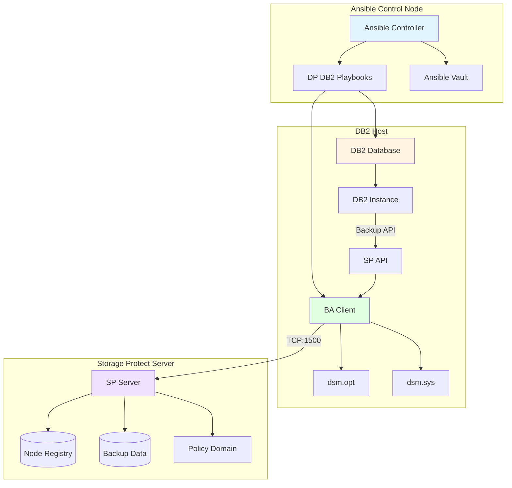
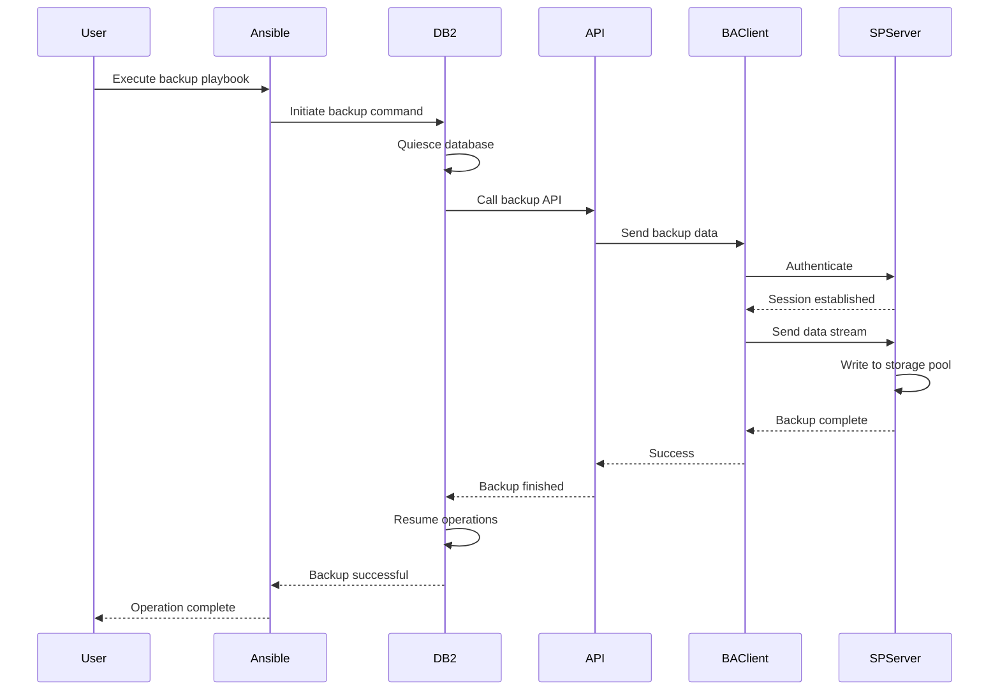
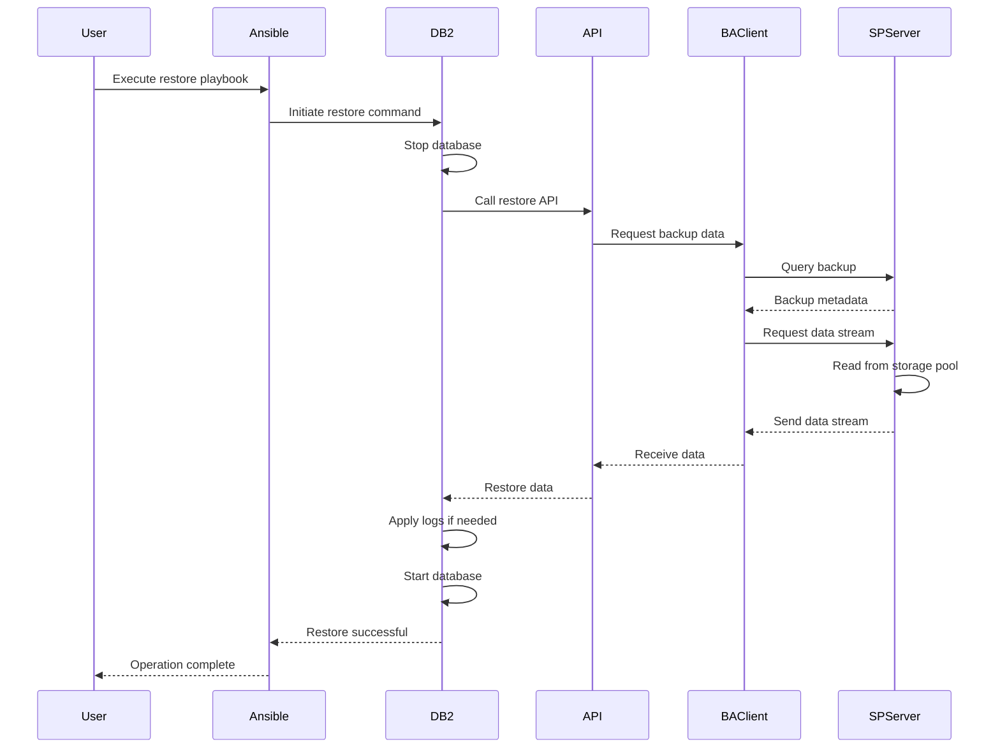

# IBM Storage Protect Data Protection for DB2 - User Guide

## Table of Contents
1. [Overview](#overview)
2. [Prerequisites](#prerequisites)
3. [Solution Architecture](#solution-architecture)
4. [Operations Guide](#operations-guide)
5. [Configuration Reference](#configuration-reference)
6. [Troubleshooting](#troubleshooting)
7. [Best Practices](#best-practices)

## Overview

### Purpose
This solution provides complete data protection lifecycle for IBM DB2 databases using IBM Storage Protect, including installation, backup, restore, query, and delete operations.

### What is Data Protection for DB2?

Data Protection for DB2 (DP for DB2) is an integrated solution that:
- **Protects DB2 Databases**: Automated backup and recovery
- **Integrates with DB2**: Uses DB2 backup APIs for consistency
- **Supports Multiple Backup Types**: Full, incremental, delta, log backups
- **Enables Point-in-Time Recovery**: Restore to specific timestamps
- **Provides Centralized Management**: Managed through Storage Protect
- **Reduces Backup Windows**: Incremental and parallel backups

### Solution Components
- Data Protection for DB2 installation
- BA Client installation and configuration
- Node registration on Storage Protect server
- Backup operations (full, incremental, delta, log)
- Restore operations (database, tablespace, logs)
- Query operations (backup history)
- Delete operations (backup cleanup)

### Supported Platforms
- Red Hat Enterprise Linux 7.x, 8.x, 9.x
- SUSE Linux Enterprise Server 12.x, 15.x
- AIX 7.1, 7.2
- DB2 versions 10.5, 11.1, 11.5

## Prerequisites

### System Requirements

#### Hardware Requirements
| Component | Minimum | Recommended |
|-----------|---------|-------------|
| CPU | 2 cores | 4 cores |
| RAM | 4 GB | 8 GB |
| Disk Space | 10 GB | 20 GB (for logs) |

#### Software Requirements
- IBM DB2 Database installed and running
- IBM Storage Protect BA Client
- IBM Storage Protect API
- Storage Protect Server accessible
- Python 3.6+ (for Ansible)
- Ansible 2.9+

### DB2 Requirements
- DB2 instance running
- Database created and accessible
- DB2 user with SYSADM or DBADM authority
- Archive logging enabled (for log backups)
- Sufficient tablespace for backup operations

### Network Requirements
- Port 1500: Storage Protect server communication
- Network connectivity between DB2 host and SP server
- Firewall rules configured

### Storage Protect Server Requirements
- Storage pool with sufficient capacity
- Policy domain for DB2 backups
- Node registered for DB2 client
- Backup retention policies defined

### Permissions
- Root access on DB2 host
- DB2 instance owner permissions
- Storage Protect admin credentials

## Solution Architecture

### Data Protection Architecture



### Backup Flow



### Restore Flow



## Operations Guide

### 1. Complete Deployment (End-to-End)

#### Purpose
Performs complete Data Protection for DB2 deployment including BA Client installation, API configuration, node registration, and verification.

#### Prerequisites Checklist
- [ ] DB2 database installed and running
- [ ] DB2 instance accessible
- [ ] Storage Protect server running
- [ ] Network connectivity verified
- [ ] Archive logging enabled on DB2

#### Step-by-Step Procedure

**Step 1: Prepare Inventory File**

Create `inventory.ini`:
```ini
[db2_clients]
db2-host-01 ansible_host=192.168.1.30 ansible_user=root

[sp_servers]
sp-server-01 ansible_host=192.168.1.10 ansible_user=root

[db2_clients:vars]
ansible_python_interpreter=/usr/bin/python3
db2_instance_owner=db2inst1
```

**Step 2: Create Configuration Variables**

Create `vars/dp-db2-config.yml`:
```yaml
---
# Environment Configuration
environment: prod
target_hosts: db2_clients

# DB2 Configuration
db2_instance: db2inst1
db2_database: SAMPLE
db2_user: db2inst1
db2_home: /home/db2inst1

# Storage Protect Configuration
storage_protect_server_name: SERVER1
storage_protect_server_ip: 192.168.1.10
tcp_port: 1500

# Node Configuration
node_name: DB2-CLIENT-01
node_domain: DB2DOMAIN

# BA Client Configuration
ba_client_version: "8.1.23"
ba_client_repo: "/repository/ba-client/8.1.23"

# API Configuration
api_install_path: "/opt/tivoli/tsm/client/api/bin64"
```

**Step 3: Create Encrypted Secrets**

```bash
ansible-vault create vars/secrets.yml
```

Content:
```yaml
---
# Storage Protect Credentials
sp_admin_username: admin
sp_admin_password: "AdminPassword@@789"

# Node Password
node_password: "NodePassword@@456"

# DB2 Credentials
db2_password: "DB2Password@@123"
```

**Step 4: Execute Deployment**

```bash
ansible-playbook solutions/data-protection-db2/deploy.yml \
  -i inventory.ini \
  -e @vars/dp-db2-config.yml \
  -e @vars/secrets.yml \
  --ask-vault-pass
```

**Step 5: Verify Deployment**

```bash
# Verify BA Client installation
ansible db2_clients -i inventory.ini -m shell \
  -a "rpm -q TIVsm-BA"

# Verify API installation
ansible db2_clients -i inventory.ini -m shell \
  -a "rpm -q TIVsm-API64"

# Test connectivity
ansible db2_clients -i inventory.ini -m shell \
  -a "dsmc query session"

# Verify node registration
ansible sp_servers -i inventory.ini -m shell \
  -a "dsmadmc -id=admin -pa=admin 'q node DB2-CLIENT-01'"
```

#### Expected Output

```
PLAY [Complete DP for DB2 Deployment] *****************************************

TASK [Phase 1 - Precheck] *****************************************************
ok: [db2-host-01]

TASK [Phase 2 - Install BA Client] ********************************************
changed: [db2-host-01]

TASK [Phase 3 - Configure dsm.opt] ********************************************
changed: [db2-host-01]

TASK [Phase 4 - Configure dsm.sys] ********************************************
changed: [db2-host-01]

TASK [Phase 5 - Register Node] ************************************************
changed: [sp-server-01]

TASK [Phase 6 - Postcheck] ****************************************************
ok: [db2-host-01]

PLAY RECAP *********************************************************************
db2-host-01                : ok=6    changed=4    unreachable=0    failed=0
sp-server-01               : ok=1    changed=1    unreachable=0    failed=0
```

---

### 2. Backup Operations

#### 2.1 Full Database Backup

**Purpose**: Creates a complete backup of the entire database.

**Command**:
```bash
ansible-playbook solutions/data-protection-db2/backup.yml \
  -i inventory.ini \
  -e "db2_database=SAMPLE" \
  -e "db2_instance=db2inst1" \
  -e "db2_backup_online=true" \
  -e @vars/secrets.yml \
  --ask-vault-pass
```

**Parameters**:
| Parameter | Required | Default | Description |
|-----------|----------|---------|-------------|
| `db2_database` | Yes | - | Database name |
| `db2_instance` | Yes | - | DB2 instance name |
| `db2_user` | No | instance owner | DB2 username |
| `db2_password` | Yes | - | DB2 password |
| `db2_backup_online` | No | false | Online backup flag |
| `db2_backup_include_logs` | No | false | Include logs |
| `db2_without_prompting` | No | true | Suppress prompts |

**Manual Backup**:
```bash
# Switch to DB2 instance owner
su - db2inst1

# Online full backup
db2 backup database SAMPLE online to TSM

# Offline full backup
db2 backup database SAMPLE to TSM

# With compression
db2 backup database SAMPLE online to TSM compress

# Include logs
db2 backup database SAMPLE online include logs to TSM
```

#### 2.2 Incremental Backup

**Purpose**: Backs up only data changed since last full or incremental backup.

**Command**:
```bash
ansible-playbook solutions/data-protection-db2/backup.yml \
  -i inventory.ini \
  -e "db2_database=SAMPLE" \
  -e "db2_instance=db2inst1" \
  -e "db2_backup_type=incremental" \
  -e "db2_backup_online=true"
```

**Manual Backup**:
```bash
su - db2inst1
db2 backup database SAMPLE online incremental to TSM
```

#### 2.3 Delta Backup

**Purpose**: Backs up only data changed since last successful backup of any type.

**Command**:
```bash
ansible-playbook solutions/data-protection-db2/backup.yml \
  -i inventory.ini \
  -e "db2_database=SAMPLE" \
  -e "db2_backup_type=delta" \
  -e "db2_backup_online=true"
```

**Manual Backup**:
```bash
su - db2inst1
db2 backup database SAMPLE online incremental delta to TSM
```

#### 2.4 Log Backup

**Purpose**: Backs up transaction logs for point-in-time recovery.

**Command**:
```bash
ansible-playbook solutions/data-protection-db2/backup.yml \
  -i inventory.ini \
  -e "db2_database=SAMPLE" \
  -e "db2_backup_type=log" \
  -e "db2_backup_online=true"
```

**Manual Backup**:
```bash
su - db2inst1
db2 backup database SAMPLE online include logs to TSM
```

#### 2.5 Tablespace Backup

**Purpose**: Backs up specific tablespaces.

**Command**:
```bash
ansible-playbook solutions/data-protection-db2/backup.yml \
  -i inventory.ini \
  -e "db2_database=SAMPLE" \
  -e "db2_backup_type=tablespace" \
  -e "db2_tablespaces=USERSPACE1,SYSTOOLSPACE" \
  -e "db2_backup_online=true"
```

**Manual Backup**:
```bash
su - db2inst1
db2 backup database SAMPLE tablespace USERSPACE1,SYSTOOLSPACE online to TSM
```

---

### 3. Restore Operations

#### 3.1 Full Database Restore

**Purpose**: Restores complete database from backup.

**Command**:
```bash
ansible-playbook solutions/data-protection-db2/restore.yml \
  -i inventory.ini \
  -e "db2_database=SAMPLE" \
  -e "db2_instance=db2inst1" \
  -e "db2_restore_replace_existing=true" \
  -e @vars/secrets.yml \
  --ask-vault-pass
```

**Parameters**:
| Parameter | Required | Default | Description |
|-----------|----------|---------|-------------|
| `db2_database` | Yes | - | Database name |
| `db2_instance` | Yes | - | DB2 instance name |
| `db2_restore_replace_existing` | No | false | Replace existing database |
| `db2_restore_taken_at` | No | latest | Backup timestamp (YYYYMMDDHHMMSS) |
| `db2_restore_redirect` | No | false | Redirect restore |
| `db2_restore_without_rolling_forward` | No | false | Skip log replay |

**Manual Restore**:
```bash
su - db2inst1

# Restore latest backup
db2 restore database SAMPLE from TSM replace existing

# Restore specific backup
db2 restore database SAMPLE from TSM taken at 20260326120000 replace existing

# Restore and rollforward
db2 restore database SAMPLE from TSM replace existing
db2 rollforward database SAMPLE to end of logs and complete
```

#### 3.2 Point-in-Time Restore

**Purpose**: Restores database to specific point in time.

**Command**:
```bash
ansible-playbook solutions/data-protection-db2/restore.yml \
  -i inventory.ini \
  -e "db2_database=SAMPLE" \
  -e "db2_restore_taken_at=20260326120000" \
  -e "db2_rollforward_to=20260326150000" \
  -e "db2_restore_replace_existing=true"
```

**Manual Restore**:
```bash
su - db2inst1

# Restore backup
db2 restore database SAMPLE from TSM taken at 20260326120000 replace existing

# Rollforward to specific time
db2 rollforward database SAMPLE to 2026-03-26-15.00.00 and complete
```

#### 3.3 Tablespace Restore

**Purpose**: Restores specific tablespaces.

**Command**:
```bash
ansible-playbook solutions/data-protection-db2/restore.yml \
  -i inventory.ini \
  -e "db2_database=SAMPLE" \
  -e "db2_restore_type=tablespace" \
  -e "db2_tablespaces=USERSPACE1"
```

**Manual Restore**:
```bash
su - db2inst1

# Restore tablespace
db2 restore database SAMPLE tablespace USERSPACE1 from TSM

# Rollforward tablespace
db2 rollforward database SAMPLE to end of logs tablespace USERSPACE1 and complete
```

#### 3.4 Redirect Restore

**Purpose**: Restores database to different location or configuration.

**Command**:
```bash
ansible-playbook solutions/data-protection-db2/restore.yml \
  -i inventory.ini \
  -e "db2_database=SAMPLE" \
  -e "db2_restore_redirect=true" \
  -e "db2_restore_into=NEWDB"
```

**Manual Restore**:
```bash
su - db2inst1

# Start redirect restore
db2 restore database SAMPLE from TSM into NEWDB redirect

# Set tablespace containers
db2 set tablespace containers for 0 using (path '/newpath/container1')

# Continue restore
db2 restore database SAMPLE continue
```

---

### 4. Query Operations

#### 4.1 Query Full Backups

**Purpose**: Lists all full database backups.

**Command**:
```bash
ansible-playbook solutions/data-protection-db2/query.yml \
  -i inventory.ini \
  -e "db2_database=SAMPLE" \
  -e "db2_query_type=full" \
  -e "db2_query_verbose=true"
```

**Manual Query**:
```bash
su - db2inst1

# List all backups
db2adutl query full db SAMPLE

# Detailed backup information
db2ckbkp -h /path/to/backup/image
```

#### 4.2 Query Incremental Backups

**Purpose**: Lists incremental backups.

**Command**:
```bash
ansible-playbook solutions/data-protection-db2/query.yml \
  -i inventory.ini \
  -e "db2_database=SAMPLE" \
  -e "db2_query_type=incremental"
```

**Manual Query**:
```bash
su - db2inst1
db2adutl query incremental db SAMPLE
```

#### 4.3 Query Log Backups

**Purpose**: Lists transaction log backups.

**Command**:
```bash
ansible-playbook solutions/data-protection-db2/query.yml \
  -i inventory.ini \
  -e "db2_database=SAMPLE" \
  -e "db2_query_type=log"
```

**Manual Query**:
```bash
su - db2inst1
db2adutl query logs db SAMPLE
```

#### 4.4 Query Backup History

**Purpose**: Displays backup history from DB2 catalog.

**Manual Query**:
```bash
su - db2inst1

# Connect to database
db2 connect to SAMPLE

# Query backup history
db2 "select * from sysibmadm.db_history where operation='B' order by start_time desc"

# Query specific backup
db2 "select * from sysibmadm.db_history where operation='B' and start_time > '2026-03-01'"
```

---

### 5. Delete Operations

#### 5.1 Delete Old Backups

**Purpose**: Removes old backup data from Storage Protect.

**Command**:
```bash
ansible-playbook solutions/data-protection-db2/delete.yml \
  -i inventory.ini \
  -e "db2_database=SAMPLE" \
  -e "db2_delete_type=full" \
  -e "db2_delete_filter_type=taken_at" \
  -e "db2_delete_filter_value=20260301000000"
```

**Parameters**:
| Parameter | Required | Description |
|-----------|----------|-------------|
| `db2_delete_type` | Yes | full, incremental, log |
| `db2_delete_filter_type` | Yes | taken_at, backup_level, tablespace |
| `db2_delete_filter_value` | Yes | Filter value |

**Manual Delete**:
```bash
su - db2inst1

# Delete specific backup
db2adutl delete full db SAMPLE taken at 20260301000000

# Delete backups older than date
db2adutl delete full db SAMPLE older than 20260301000000
```

#### 5.2 Prune Backup History

**Purpose**: Removes old entries from DB2 backup history.

**Manual Prune**:
```bash
su - db2inst1

# Connect to database
db2 connect to SAMPLE

# Prune history older than 90 days
db2 prune history 90

# Prune specific backup
db2 prune history and delete backup taken at 20260301000000
```

---

## Configuration Reference

### dsm.opt Configuration

```ini
# /opt/tivoli/tsm/client/api/bin64/dsm.opt

SErvername              SERVER1
COMMmethod              TCPip
TCPPort                 1500
TCPServeraddress        192.168.1.10
NODename                DB2-CLIENT-01
PASSWORDAccess          generate
COMPRESSION             yes
```

### dsm.sys Configuration

```ini
# /opt/tivoli/tsm/client/api/bin64/dsm.sys

SErvername              SERVER1
   COMMmethod           TCPip
   TCPPort              1500
   TCPServeraddress     192.168.1.10
   NODename             DB2-CLIENT-01
   PASSWORDAccess       generate
   COMPRESSION          yes
   DEDUPLICATION        clientormove
```

### DB2 Configuration

```bash
# Enable archive logging
db2 update db cfg for SAMPLE using LOGARCHMETH1 TSM

# Set log retention
db2 update db cfg for SAMPLE using LOGRETAIN ON

# Set user exit
db2 update db cfg for SAMPLE using USEREXIT ON

# Configure TSM parameters
db2 update db cfg for SAMPLE using TSMOWNER db2inst1
db2 update db cfg for SAMPLE using TSMPASSWORD password
db2 update db cfg for SAMPLE using TSMNODE DB2-CLIENT-01
```

### Environment-Specific Configurations

#### Development Environment
```yaml
# vars/dev.yml
---
environment: dev
db2_instance: db2inst1
db2_database: DEVDB
storage_protect_server_name: DEV-SERVER
node_name: DEV-DB2-CLIENT
backup_schedule: daily
retention_days: 30
```

#### Production Environment
```yaml
# vars/prod.yml
---
environment: prod
db2_instance: db2inst1
db2_database: PRODDB
storage_protect_server_name: PROD-SERVER
node_name: PROD-DB2-CLIENT
backup_schedule: hourly
retention_days: 90
compression: yes
deduplication: yes
```

## Troubleshooting

### Common Issues and Solutions

#### Issue 1: Backup Fails - API Not Found

**Symptoms:**
```
SQL2062N  An error occurred while accessing media "TSM"
```

**Solution:**
```bash
# Verify API installation
rpm -q TIVsm-API64

# Check dsm.opt location
ls -la /opt/tivoli/tsm/client/api/bin64/dsm.opt

# Set DSMI_CONFIG environment variable
export DSMI_CONFIG=/opt/tivoli/tsm/client/api/bin64/dsm.opt

# Add to DB2 instance profile
echo "export DSMI_CONFIG=/opt/tivoli/tsm/client/api/bin64/dsm.opt" >> /home/db2inst1/sqllib/userprofile

# Restart DB2
db2stop
db2start
```

#### Issue 2: Cannot Connect to Storage Protect Server

**Symptoms:**
```
ANS1017E Session rejected: TCP/IP connection failure
```

**Solution:**
```bash
# Test connectivity
ping 192.168.1.10
telnet 192.168.1.10 1500

# Verify dsm.sys configuration
cat /opt/tivoli/tsm/client/api/bin64/dsm.sys

# Test with dsmc
dsmc query session

# Check firewall
iptables -L -n | grep 1500

# Verify node registration
dsmadmc -id=admin -pa=admin "q node DB2-CLIENT-01"
```

#### Issue 3: Restore Fails - Insufficient Space

**Symptoms:**
```
SQL1024C  A database agent could not be started to service a request
```

**Solution:**
```bash
# Check available space
df -h

# Check tablespace sizes
db2 "select tbspace, sum(fpages)*4096/1024/1024 as size_mb from syscat.tablespaces group by tbspace"

# Extend filesystem if needed
lvextend -L +10G /dev/mapper/vg-lv_db2
resize2fs /dev/mapper/vg-lv_db2

# Or redirect restore to different location
db2 restore database SAMPLE from TSM redirect
```

#### Issue 4: Log Archive Fails

**Symptoms:**
```
SQL2042N  An unexpected error occurred while accessing the log
```

**Solution:**
```bash
# Check log configuration
db2 get db cfg for SAMPLE | grep -i log

# Verify TSM configuration
db2 get db cfg for SAMPLE | grep -i tsm

# Check log directory space
df -h /db2/logs

# Test log archive manually
db2 archive log for database SAMPLE

# Check DB2 diagnostic log
tail -100 /home/db2inst1/sqllib/db2dump/db2diag.log
```

#### Issue 5: Backup Hangs

**Symptoms:**
```
Backup appears to hang with no progress
```

**Solution:**
```bash
# Check active applications
db2 list applications

# Check for locks
db2 "select * from sysibmadm.locks_held"

# Force applications if needed
db2 force applications all

# Check TSM session
dsmc query session

# Check network throughput
iftop -i eth0

# Review DB2 backup progress
db2pd -db SAMPLE -utilities
```

### Diagnostic Commands

```bash
# DB2 Status
db2 get dbm cfg
db2 get db cfg for SAMPLE
db2 list applications
db2pd -db SAMPLE -utilities

# Backup History
db2 "select * from sysibmadm.db_history where operation='B' order by start_time desc fetch first 10 rows only"

# Log Configuration
db2 get db cfg for SAMPLE | grep -i log
db2 get db cfg for SAMPLE | grep -i tsm

# TSM Connectivity
dsmc query session
dsmc query filespace

# API Configuration
cat /opt/tivoli/tsm/client/api/bin64/dsm.opt
cat /opt/tivoli/tsm/client/api/bin64/dsm.sys

# System Resources
df -h
free -h
iostat -x 5 3
```

### Log File Locations

| Log File | Location | Purpose |
|----------|----------|---------|
| DB2 Diagnostic Log | `/home/db2inst1/sqllib/db2dump/db2diag.log` | DB2 errors |
| TSM Error Log | `/var/log/tsm/dsmerror.log` | TSM client errors |
| TSM Schedule Log | `/var/log/tsm/dsmsched.log` | Scheduled operations |
| DB2 Backup Log | Database directory | Backup details |

## Best Practices

### 1. Backup Strategy

```yaml
# Recommended backup schedule
backup_strategy:
  full_backup:
    frequency: weekly
    day: Sunday
    time: "02:00"
    retention: 4_weeks
    
  incremental_backup:
    frequency: daily
    time: "22:00"
    retention: 2_weeks
    
  log_backup:
    frequency: hourly
    retention: 7_days
    
  delta_backup:
    frequency: daily
    time: "12:00"
    retention: 1_week
```

### 2. Automated Backup Script

```bash
# Create backup script
cat > /usr/local/bin/db2-backup.sh << 'EOF'
#!/bin/bash
DB2INST=db2inst1
DATABASE=SAMPLE
LOG_FILE=/var/log/db2-backup.log

# Switch to DB2 instance
su - $DB2INST << EOSQL
# Full backup on Sunday
if [ $(date +%u) -eq 7 ]; then
  db2 backup database $DATABASE online to TSM compress >> $LOG_FILE 2>&1
# Incremental backup on other days
else
  db2 backup database $DATABASE online incremental to TSM compress >> $LOG_FILE 2>&1
fi

# Archive logs
db2 archive log for database $DATABASE >> $LOG_FILE 2>&1
EOSQL

# Check result
if [ $? -eq 0 ]; then
  echo "$(date): Backup successful" >> $LOG_FILE
else
  echo "$(date): Backup failed" >> $LOG_FILE
  echo "DB2 backup failed for $DATABASE" | mail -s "Alert: DB2 Backup Failed" admin@example.com
fi
EOF

chmod +x /usr/local/bin/db2-backup.sh

# Schedule with cron
echo "0 22 * * * /usr/local/bin/db2-backup.sh" | crontab -u db2inst1 -
```

### 3. Monitoring and Alerting

```bash
# Create monitoring script
cat > /usr/local/bin/monitor-db2-backups.sh << 'EOF'
#!/bin/bash
DB2INST=db2inst1
DATABASE=SAMPLE

# Check last backup
LAST_BACKUP=$(su - $DB2INST -c "db2 connect to $DATABASE; db2 \"select max(start_time) from sysibmadm.db_history where operation='B'\"" | grep -v "^$" | tail -1)

# Calculate hours since last backup
HOURS_AGO=$(( ($(date +%s) - $(date -d "$LAST_BACKUP" +%s)) / 3600 ))

# Alert if no backup in 25 hours
if [ $HOURS_AGO -gt 25 ]; then
  echo "Last backup was $HOURS_AGO hours ago" | mail -s "Alert: No Recent DB2 Backup" admin@example.com
fi
EOF

chmod +x /usr/local/bin/monitor-db2-backups.sh

# Schedule monitoring
echo "0 */6 * * * /usr/local/bin/monitor-db2-backups.sh" | crontab -
```

### 4. Performance Tuning

```bash
# Optimize backup performance
db2 update db cfg for SAMPLE using NUM_DB_BACKUPS 4
db2 update db cfg for SAMPLE using BACKUP_PENDING_COMM_AGENTS 4
db2 update db cfg for SAMPLE using UTIL_HEAP_SZ 10000

# Optimize restore performance
db2 update db cfg for SAMPLE using RESTORE_PENDING_COMM_AGENTS 4

# Enable compression
db2 update db cfg for SAMPLE using BACKUP_COMPRESS YES
```

### 5. Disaster Recovery

```markdown
# DB2 Disaster Recovery Procedure

1. **Prepare Target System**
   - Install DB2 same version
   - Create instance
   - Install TSM client

2. **Restore Database**
   ```bash
   su - db2inst1
   db2 restore database SAMPLE from TSM replace existing
   ```

3. **Rollforward Logs**
   ```bash
   db2 rollforward database SAMPLE to end of logs and complete
   ```

4. **Verify Database**
   ```bash
   db2 connect to SAMPLE
   db2 "select count(*) from syscat.tables"
   ```

5. **Resume Operations**
   - Start applications
   - Verify connectivity
   - Monitor performance
```

### 6. Capacity Planning

```yaml
# Capacity planning guidelines
capacity_planning:
  # Backup size estimation
  full_backup_size: database_size * 0.7  # With compression
  incremental_backup_size: daily_changes * 0.7
  log_backup_size: transaction_volume * 0.5
  
  # Storage requirements
  retention_storage: (full_backup_size * 4) + (incremental_backup_size * 14) + (log_backup_size * 7)
  
  # Network bandwidth
  backup_window: 8_hours
  required_bandwidth: full_backup_size / backup_window
```

### 7. Security Hardening

```bash
# Secure TSM password
db2 update db cfg for SAMPLE using TSMPASSWORD password

# Encrypt backups
db2 update db cfg for SAMPLE using BACKUP_ENCRYPT YES

# Set encryption key
db2 update db cfg for SAMPLE using BACKUP_ENCRYPT_KEYSTORE /secure/path/keystore

# Restrict access
chmod 600 /opt/tivoli/tsm/client/api/bin64/dsm.opt
chown db2inst1:db2iadm1 /opt/tivoli/tsm/client/api/bin64/dsm.opt
```

## Additional Resources

### Documentation
- [IBM DB2 Backup and Recovery](https://www.ibm.com/docs/en/db2/11.5?topic=recovery-backup)
- [Data Protection for DB2](https://www.ibm.com/docs/en/storage-protect/8.1.x?topic=databases-protecting-db2)
- [DB2 TSM Integration](https://www.ibm.com/docs/en/db2/11.5?topic=utilities-using-tivoli-storage-manager)

### Support
- IBM Support Portal: https://www.ibm.com/support
- DB2 Community: https://community.ibm.com/community/user/datamanagement/communities/community-home?CommunityKey=ea909850-39ea-4ac4-9512-8e2eb37ea09a
- GitHub Issues: https://github.com/IBM/ansible-storage-protect/issues

### Training
- IBM DB2 Database Administration
- IBM Storage Protect for Databases
- Backup and Recovery Best Practices

---

**Document Version**: 1.0  
**Last Updated**: 2026-03-26  
**Maintained By**: IBM Storage Protect Ansible Team