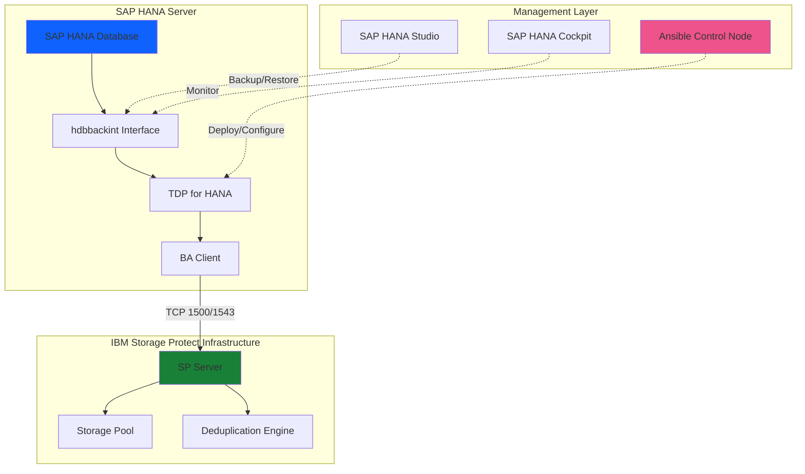
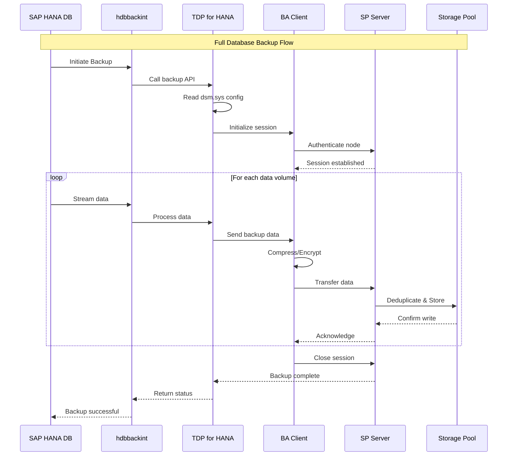

# IBM Storage Protect Data Protection for SAP HANA - User Guide

## Table of Contents
1. [Overview](#overview)
2. [Prerequisites](#prerequisites)
3. [Solution Architecture](#solution-architecture)
4. [Operations Guide](#operations-guide)
5. [Configuration Reference](#configuration-reference)
6. [Troubleshooting](#troubleshooting)
7. [Best Practices](#best-practices)

---

## Overview

### Purpose
This guide provides comprehensive instructions for deploying and managing IBM Storage Protect Data Protection for SAP HANA (SP ERP for HANA). This solution enables enterprise-grade backup and recovery capabilities for SAP HANA databases through native integration with IBM Storage Protect infrastructure.

### What is SP ERP for HANA?
IBM Storage Protect Data Protection for SAP HANA is an integrated backup solution that:
- Provides native SAP HANA backup integration via `hdbbackint` interface
- Enables automated backup scheduling and retention management
- Supports full, incremental, and differential backup strategies
- Integrates with SAP HANA Studio and Cockpit for management
- Leverages IBM Storage Protect deduplication and compression
- Ensures application-consistent backups with minimal performance impact

### Key Features
- **Native Integration**: Uses SAP HANA's `hdbbackint` API for seamless backup operations
- **Automated Workflows**: Ansible-driven installation and configuration
- **Multi-Language Support**: Installation wizard supports 6 languages
- **System Validation**: Pre-flight checks for architecture, disk space, and HANA utilities
- **BA Client Foundation**: Built on IBM Storage Protect Backup-Archive Client
- **Enterprise Scalability**: Supports large SAP HANA databases with efficient data transfer

### Supported Platforms
- **Architecture**: IBM Power Systems (ppc64le)
- **Operating Systems**: SUSE Linux Enterprise Server (SLES)
- **SAP HANA Versions**: Compatible with SAP HANA 1.0 and 2.0
- **Minimum Disk Space**: 420 MB for installation
- **Required HANA Components**: Index Server, Name Server, XS Engine, Web Dispatcher

---

## Prerequisites

### Infrastructure Requirements

#### SAP HANA System
```yaml
# HANA System Configuration
hana_sid: "FR2"                    # System ID (3 characters)
hana_instance_number: "00"         # Instance number (00-99)
hana_db_role: "SYSTEM"             # Database user with privileges

# Required HANA Services
required_services:
  - hdbindexserver                 # Index server process
  - hdbnameserver                  # Name server process
  - hdbxsengine                    # XS Engine process
  - hdbwebdispatcher               # Web dispatcher
  - hdbcompileserver               # Compile server
  - hdbpreprocessor                # Preprocessor service

# Minimum System Requirements
architecture: "ppc64le"            # IBM Power architecture
disk_space: "420 MB"               # Free space required
memory: "4 GB"                     # Recommended minimum RAM
```

#### IBM Storage Protect Infrastructure
```yaml
# SP Server Configuration
sp_server_address: "sp-server.example.com"
sp_server_port: 1500
sp_server_ssl_port: 1543

# Node Configuration
node_name: "HANA_{{ hana_sid }}_{{ ansible_hostname }}"
node_password: "{{ vault_node_password }}"
domain_name: "HANA_DOMAIN"
policy_set: "HANA_POLICY"
```

---

## Solution Architecture

### Component Overview



### Data Flow Architecture



---

## Operations Guide

### 4.1 Initial Deployment

#### Step 1: Prepare Control Node

```bash
# Set up directory structure
mkdir -p ~/sap-hana-backup/{inventory,playbooks,group_vars}
cd ~/sap-hana-backup

# Install Ansible collection
ansible-galaxy collection install ibm.storage_protect

# Set environment variables
export BA_CLIENT_TAR_REPO_PATH="/data/sp-packages/ba-client"
export ERP_INSTALLER_REPO_PATH="/data/sp-packages/erp-hana"

# Verify repositories
ls -lh $BA_CLIENT_TAR_REPO_PATH
# Expected: 8.1.23.0-TIV-TSMBAC-LinuxPPC64le.tar

ls -lh $ERP_INSTALLER_REPO_PATH
# Expected: TDP_HANA_8.1.11.1_LIN_PPC64LE.bin
```

#### Step 2: Create Inventory

```ini
# inventory/hana_servers.ini
[hana_production]
hana-prod-01 ansible_host=10.10.10.101 hana_sid=PR1 hana_instance_number=00

[hana_servers:vars]
ansible_user=ansible
ansible_become=yes
sp_server_address=sp-server.example.com
sperp_language="2"
node_name="HANA_{{ hana_sid }}_{{ ansible_hostname }}"
```

#### Step 3: Deploy Solution

```bash
# Create deployment playbook
cat > playbooks/deploy_sap_hana_backup.yml << 'EOF'
---
- name: Deploy SP Data Protection for SAP HANA
  hosts: hana_servers
  become: true
  roles:
    - role: ibm.storage_protect.erp_install
...
EOF

# Execute deployment
ansible-playbook playbooks/deploy_sap_hana_backup.yml
```

### 4.2 Backup Operations

#### Full Database Backup

```sql
-- Using HANA SQL
BACKUP DATA USING BACKINT ('full_backup_20240115');

-- Verify backup
SELECT BACKUP_ID, STATE_NAME, START_TIME, BACKUP_SIZE
FROM M_BACKUP_CATALOG
WHERE ENTRY_TYPE_NAME = 'complete data backup'
ORDER BY START_TIME DESC LIMIT 5;
```

#### Incremental Backup

```sql
-- Incremental backup (changed data only)
BACKUP DATA INCREMENTAL USING BACKINT ('incr_backup_20240115');
```

#### Automated Backup Script

```bash
#!/bin/bash
# /usr/local/bin/hana_backup.sh
BACKUP_TYPE="${1:-incremental}"
HANA_SID="${2:-PR1}"
BACKUP_COMMENT="auto_backup_$(date +%Y%m%d_%H%M%S)"

case "$BACKUP_TYPE" in
    full)
        SQL="BACKUP DATA USING BACKINT ('${BACKUP_COMMENT}');"
        ;;
    incremental)
        SQL="BACKUP DATA INCREMENTAL USING BACKINT ('${BACKUP_COMMENT}');"
        ;;
esac

su - $(echo "$HANA_SID" | tr '[:upper:]' '[:lower:]')adm -c \
  "hdbsql -u SYSTEM -p \$HANA_PASSWORD -d SYSTEMDB \"$SQL\""
```

### 4.3 Restore Operations

#### Full Database Restore

```sql
-- Stop HANA database
-- As <sid>adm user:
HDB stop

-- Start in recovery mode
HDB start --nostart

-- Connect and restore
hdbsql -u SYSTEM -p <password> -d SYSTEMDB

RECOVER DATABASE UNTIL TIMESTAMP '2024-01-15 12:00:00' 
USING BACKINT 
CLEAR LOG;
```

---

## Configuration Reference

### HANA Backup Parameters

```sql
-- Configure backup to use backint
ALTER SYSTEM ALTER CONFIGURATION ('global.ini', 'SYSTEM') 
SET ('backup', 'catalog_backup_using_backint') = 'true';

ALTER SYSTEM ALTER CONFIGURATION ('global.ini', 'SYSTEM') 
SET ('backup', 'data_backup_parameter_file') = '/opt/tivoli/tsm/tdp_hana/dsm.opt';

ALTER SYSTEM ALTER CONFIGURATION ('global.ini', 'SYSTEM') 
SET ('backup', 'log_backup_using_backint') = 'true';
```

### TDP Options File

```ini
# /opt/tivoli/tsm/tdp_hana/dsm.opt
SERVERNAME      SP-SERVER
NODENAME        HANA_PR1_hostname
PASSWORDACCESS  GENERATE
COMPRESSION     YES
TCPPORT         1500
TCPSERVERADDRESS sp-server.example.com
```

---

## Troubleshooting

### Installation Issues

#### Problem: Architecture Not Supported
```bash
# Error: System architecture not compatible
# Solution: Verify architecture
uname -m
# Must be: ppc64le
```

#### Problem: Insufficient Disk Space
```bash
# Error: Not enough disk space
# Solution: Check and free space
df -h /opt /tmp
# Required: 420 MB minimum
```

### Backup Issues

#### Problem: Backup Fails with Connection Error
```bash
# Check BA Client connectivity
dsmc query session

# Test hdbbackint
/opt/tivoli/tsm/tdp_hana/hdbbackint -f diagnose \
  -p /opt/tivoli/tsm/tdp_hana/dsm.opt
```

#### Problem: Slow Backup Performance
```sql
-- Increase parallel streams
ALTER SYSTEM ALTER CONFIGURATION ('global.ini', 'SYSTEM') 
SET ('backup', 'max_parallel_data_backup_jobs') = '8';
```

---

## Best Practices

### Backup Strategy

1. **Full Backups**: Weekly on weekends
2. **Incremental Backups**: Daily during business hours
3. **Log Backups**: Continuous (automatic)
4. **Retention**: 30 days active, 7 years archive

### Performance Optimization

```sql
-- Optimize parallel streams based on system size
-- Small systems (< 500 GB): 2-4 streams
-- Medium systems (500 GB - 2 TB): 4-8 streams
-- Large systems (> 2 TB): 8-16 streams

ALTER SYSTEM ALTER CONFIGURATION ('global.ini', 'SYSTEM') 
SET ('backup', 'max_parallel_data_backup_jobs') = '8';
```

### Security

```bash
# Secure password file
chmod 600 /opt/tivoli/tsm/tdp_hana/dsm.opt
chown <sid>adm:sapsys /opt/tivoli/tsm/tdp_hana/dsm.opt

# Use SSL for SP Server connection
# Add to dsm.opt:
SSLTCPPORT 1543
SSLCOMPRESSION YES
```

### Monitoring

```sql
-- Monitor backup status
SELECT 
    BACKUP_ID,
    ENTRY_TYPE_NAME,
    STATE_NAME,
    START_TIME,
    END_TIME,
    BACKUP_SIZE,
    COMMENT
FROM M_BACKUP_CATALOG
WHERE START_TIME > ADD_DAYS(CURRENT_TIMESTAMP, -7)
ORDER BY START_TIME DESC;

-- Check failed backups
SELECT * FROM M_BACKUP_CATALOG
WHERE STATE_NAME IN ('failed', 'cancel requested', 'canceled')
AND START_TIME > ADD_DAYS(CURRENT_TIMESTAMP, -7);
```

### Disaster Recovery

1. **Document Configuration**: Keep copies of dsm.opt and global.ini
2. **Test Restores**: Perform quarterly restore tests
3. **Offsite Copies**: Replicate backups to secondary SP Server
4. **Recovery Procedures**: Document and test recovery runbooks

---

## Additional Resources

- **IBM Documentation**: [IBM Storage Protect for SAP HANA](https://www.ibm.com/docs/en/storage-protect)
- **SAP Documentation**: [SAP HANA Backup and Recovery](https://help.sap.com/hana)
- **Ansible Collection**: [`ibm.storage_protect`](https://galaxy.ansible.com/ibm/storage_protect)

---

*Last Updated: 2024-01-15*
*Version: 1.0*