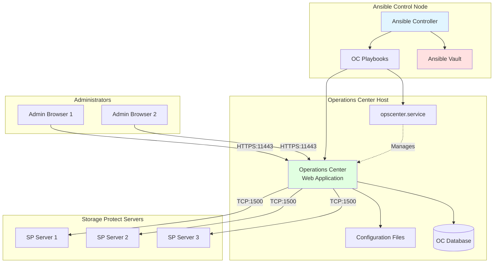
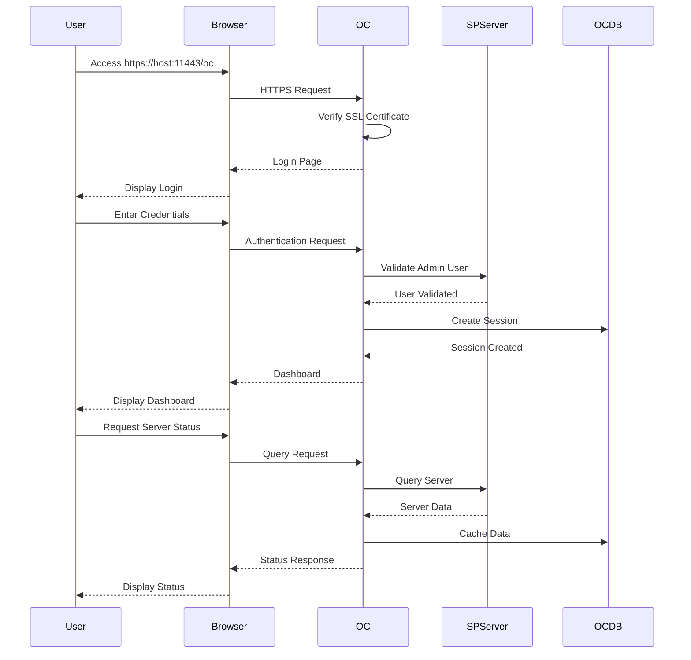
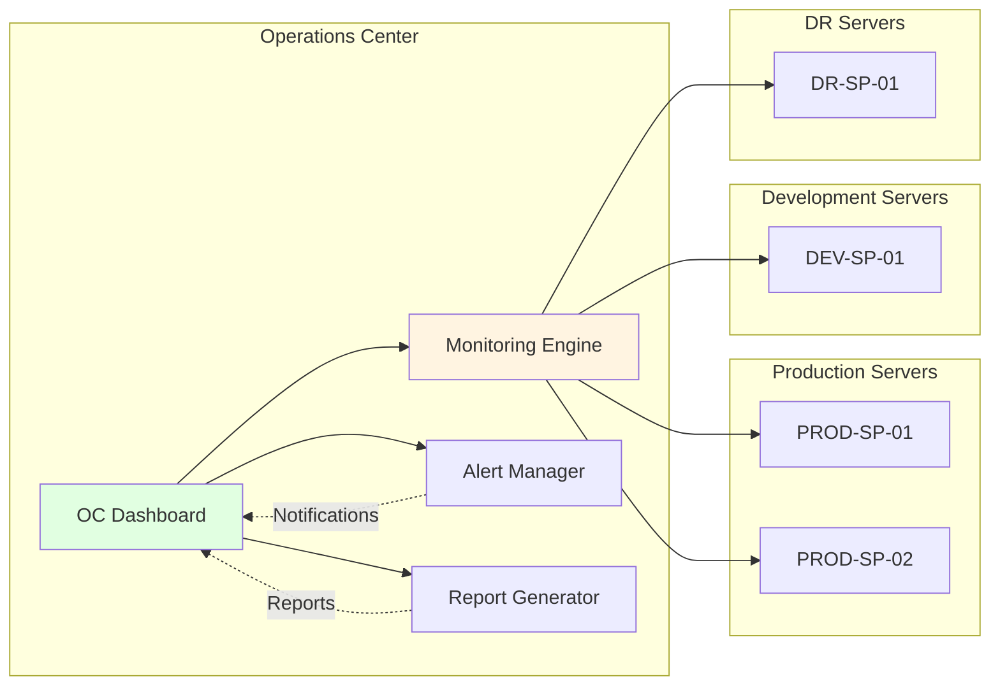

# IBM Storage Protect Operations Center Management - User Guide

## Table of Contents
1. [Overview](#overview)
2. [Prerequisites](#prerequisites)
3. [Solution Architecture](#solution-architecture)
4. [Operations Guide](#operations-guide)
5. [Configuration Reference](#configuration-reference)
6. [Troubleshooting](#troubleshooting)
7. [Best Practices](#best-practices)

## Overview

### Purpose
This solution provides management capabilities for IBM Storage Protect Operations Center (OC), a web-based administrative interface that provides centralized monitoring, reporting, and management of Storage Protect environments.

### What is Operations Center?

Operations Center is a web-based application that provides:
- **Centralized Dashboard**: Single pane of glass for multiple SP servers
- **Real-time Monitoring**: Server health, capacity, and performance metrics
- **Alerting**: Proactive notifications for issues and thresholds
- **Reporting**: Built-in and custom reports for compliance and analysis
- **Task Management**: Simplified administrative operations
- **Multi-Server Management**: Manage multiple SP servers from one interface

### Solution Components
- Operations Center installation verification
- OC configuration and setup
- Service management (start/stop/restart)
- Admin user configuration
- SSL/TLS certificate management
- Multi-server registration

### Supported Platforms
- Red Hat Enterprise Linux 7.x, 8.x, 9.x
- SUSE Linux Enterprise Server 12.x, 15.x

## Prerequisites

### System Requirements

#### Hardware Requirements
| Component | Minimum | Recommended |
|-----------|---------|-------------|
| CPU | 2 cores | 4 cores |
| RAM | 4 GB | 8 GB |
| Disk Space | 10 GB | 20 GB |

#### Software Requirements
- IBM Storage Protect Server 8.1.x or higher
- IBM Storage Protect Operations Center installed
- Java Runtime Environment (included with OC)
- Web browser (Chrome, Firefox, Edge)

### Network Requirements
- Port 11443: HTTPS access to Operations Center
- Port 1500: Communication with Storage Protect servers
- DNS resolution or hosts file entries
- Firewall rules configured

### Storage Protect Server Requirements
- Server version 8.1.x or higher
- Admin user with appropriate privileges
- Session security set to transitional or strict
- Server accessible from OC host

### Permissions
- Root access on OC host
- Storage Protect admin credentials
- SSL certificate management permissions

## Solution Architecture

### Operations Center Architecture



### User Access Flow



### Multi-Server Management



## Operations Guide

### 1. Complete Deployment (End-to-End)

#### Purpose
Performs complete Operations Center deployment including configuration, admin setup, and service initialization.

#### Prerequisites Checklist
- [ ] Operations Center software installed
- [ ] Storage Protect Server running
- [ ] Admin user credentials available
- [ ] Network connectivity verified
- [ ] Firewall rules configured

#### Step-by-Step Procedure

**Step 1: Prepare Inventory File**

Create `inventory.ini`:
```ini
[oc_hosts]
oc-server-01 ansible_host=192.168.1.100 ansible_user=root

[sp_servers]
sp-server-01 ansible_host=192.168.1.10 ansible_user=root
sp-server-02 ansible_host=192.168.1.11 ansible_user=root

[oc_hosts:vars]
ansible_python_interpreter=/usr/bin/python3
```

**Step 2: Create Configuration Variables**

Create `vars/oc-config.yml`:
```yaml
---
# Environment Configuration
environment: prod
target_hosts: oc_hosts

# Operations Center Configuration
admin_name: admin
action: configure

# Server Configuration
sp_servers:
  - name: PROD-SP-01
    address: 192.168.1.10
    port: 1500
    admin_user: admin
  - name: PROD-SP-02
    address: 192.168.1.11
    port: 1500
    admin_user: admin

# Network Configuration
oc_port: 11443
oc_hostname: oc-server-01.example.com

# SSL Configuration
ssl_enabled: true
ssl_cert_path: /opt/tivoli/tsm/ui/ssl
```

**Step 3: Create Encrypted Secrets**

```bash
ansible-vault create vars/secrets.yml
```

Content:
```yaml
---
# Storage Protect Admin Credentials
sp_admin_password: "AdminPassword@@789"

# Operations Center Admin Password
oc_admin_password: "OCAdminPassword@@456"

# SSL Certificate Password
ssl_cert_password: "SSLPassword@@123"
```

**Step 4: Execute Deployment**

```bash
ansible-playbook solutions/operations-center/deploy.yml \
  -i inventory.ini \
  -e @vars/oc-config.yml \
  -e @vars/secrets.yml \
  --ask-vault-pass
```

**Step 5: Verify Deployment**

```bash
# Check OC service status
ansible oc_hosts -i inventory.ini -m shell \
  -a "systemctl status opscenter.service"

# Verify OC is listening
ansible oc_hosts -i inventory.ini -m shell \
  -a "netstat -tuln | grep 11443"

# Test web access
curl -k https://oc-server-01.example.com:11443/oc
```

**Step 6: Access Operations Center**

1. Open web browser
2. Navigate to: `https://oc-server-01.example.com:11443/oc`
3. Accept SSL certificate (if self-signed)
4. Login with admin credentials
5. Verify dashboard loads

#### Expected Output

```
PLAY [Complete Operations Center Deployment] **********************************

TASK [Phase 1 - Verify OC Installation] ***************************************
ok: [oc-server-01]

TASK [Phase 2 - Configure Admin User] *****************************************
changed: [oc-server-01]

TASK [Phase 3 - Register SP Servers] ******************************************
changed: [oc-server-01]

TASK [Phase 4 - Start OC Service] *********************************************
changed: [oc-server-01]

TASK [Phase 5 - Verify OC Access] *********************************************
ok: [oc-server-01]

PLAY RECAP *********************************************************************
oc-server-01               : ok=5    changed=3    unreachable=0    failed=0

Operations Center URL: https://oc-server-01.example.com:11443/oc
```

---

### 2. Configure Operations Center

#### Purpose
Configures Operations Center admin user and session security settings.

#### Command

```bash
ansible-playbook solutions/operations-center/configure.yml \
  -i inventory.ini \
  -e "admin_name=admin" \
  -e "action=configure" \
  -e @vars/secrets.yml \
  --ask-vault-pass
```

#### Configuration Steps

The playbook performs:

1. **Check OC Service**
```bash
systemctl status opscenter.service
```

2. **Update Admin User**
```sql
UPDATE ADMIN admin SESSIONSECURITY=transitional
```

3. **Verify Configuration**
```bash
# Check admin settings
dsmadmc -id=admin -pa=password "q admin admin f=d"
```

#### Post-Configuration

Access Operations Center:
```
URL: https://<hostname>:11443/oc
Username: admin
Password: <admin_password>
```

---

### 3. Service Management

#### Purpose
Manages Operations Center service lifecycle (start/stop/restart).

#### Start Operations Center

```bash
ansible-playbook solutions/operations-center/manage.yml \
  -i inventory.ini \
  -e "action=restart"
```

#### Stop Operations Center

```bash
ansible-playbook solutions/operations-center/manage.yml \
  -i inventory.ini \
  -e "action=stop"
```

#### Restart Operations Center

```bash
ansible-playbook solutions/operations-center/manage.yml \
  -i inventory.ini \
  -e "action=restart"
```

#### Manual Service Management

```bash
# Start service
systemctl start opscenter.service

# Stop service
systemctl stop opscenter.service

# Restart service
systemctl restart opscenter.service

# Check status
systemctl status opscenter.service

# Enable auto-start
systemctl enable opscenter.service

# View logs
journalctl -u opscenter.service -f
```

---

### 4. Register Storage Protect Servers

#### Purpose
Registers multiple Storage Protect servers with Operations Center for centralized management.

#### Configuration

Create `vars/server-registration.yml`:
```yaml
---
sp_servers:
  - name: PROD-SP-01
    address: 192.168.1.10
    port: 1500
    admin_user: admin
    admin_password: "{{ sp_admin_password }}"
    description: "Production Server 1"
    
  - name: PROD-SP-02
    address: 192.168.1.11
    port: 1500
    admin_user: admin
    admin_password: "{{ sp_admin_password }}"
    description: "Production Server 2"
    
  - name: DEV-SP-01
    address: 192.168.10.10
    port: 1500
    admin_user: admin
    admin_password: "{{ sp_admin_password }}"
    description: "Development Server"
```

#### Execute Registration

```bash
ansible-playbook solutions/operations-center/register-servers.yml \
  -i inventory.ini \
  -e @vars/server-registration.yml \
  -e @vars/secrets.yml \
  --ask-vault-pass
```

#### Verify Registration

1. Login to Operations Center
2. Navigate to: **Servers** → **All Servers**
3. Verify all servers appear in list
4. Check server status (should be "Online")

---

### 5. Configure Alerts and Notifications

#### Purpose
Sets up alerting for proactive monitoring of Storage Protect environment.

#### Alert Configuration

Create `vars/alert-config.yml`:
```yaml
---
alerts:
  - name: "Server Down"
    type: server_status
    threshold: offline
    severity: critical
    notification:
      email: admin@example.com
      
  - name: "Database Full"
    type: database_utilization
    threshold: 90
    severity: high
    notification:
      email: admin@example.com
      
  - name: "Storage Pool Full"
    type: storage_pool_utilization
    threshold: 85
    severity: medium
    notification:
      email: admin@example.com
      
  - name: "Failed Backups"
    type: backup_failures
    threshold: 5
    period: 24h
    severity: high
    notification:
      email: admin@example.com
```

#### Configure via Web Interface

1. Login to Operations Center
2. Navigate to: **Administration** → **Alerts**
3. Click **Create Alert**
4. Configure alert parameters
5. Set notification recipients
6. Save and enable alert

---

### 6. Generate Reports

#### Purpose
Creates and schedules reports for compliance and analysis.

#### Available Report Types

| Report Type | Description | Frequency |
|-------------|-------------|-----------|
| Server Summary | Overall server health and capacity | Daily |
| Backup Status | Success/failure rates by node | Daily |
| Storage Utilization | Pool usage and trends | Weekly |
| Client Inventory | All registered clients | Monthly |
| Failed Operations | All failed operations | Daily |
| Capacity Planning | Growth trends and projections | Monthly |

#### Generate Report via Web Interface

1. Login to Operations Center
2. Navigate to: **Reporting** → **Reports**
3. Select report type
4. Configure parameters:
   - Date range
   - Servers to include
   - Output format (PDF/CSV/HTML)
5. Click **Generate**
6. Download or email report

#### Schedule Automated Reports

1. Navigate to: **Reporting** → **Scheduled Reports**
2. Click **Create Schedule**
3. Configure:
   - Report type
   - Frequency (daily/weekly/monthly)
   - Time to run
   - Email recipients
4. Save schedule

---

### 7. User Management

#### Purpose
Manages Operations Center user accounts and permissions.

#### Create New User

Via Web Interface:
1. Login as admin
2. Navigate to: **Administration** → **Users**
3. Click **Create User**
4. Enter user details:
   - Username
   - Password
   - Email
   - Role (Admin/Operator/Viewer)
5. Assign server permissions
6. Save user

#### User Roles

| Role | Permissions |
|------|-------------|
| **Admin** | Full access to all features and servers |
| **Operator** | Can perform operations, view reports |
| **Viewer** | Read-only access to dashboards and reports |
| **Custom** | Specific permissions defined by admin |

#### Reset User Password

```bash
# Via command line
cd /opt/tivoli/tsm/ui/bin
./resetPassword.sh -username admin -newpassword NewPassword@@123
```

---

## Configuration Reference

### Operations Center Configuration Files

#### Main Configuration
```
/opt/tivoli/tsm/ui/conf/server.xml
```

Key settings:
```xml
<Server port="11443" protocol="HTTP/1.1"
        SSLEnabled="true"
        keystoreFile="/opt/tivoli/tsm/ui/ssl/keystore.jks"
        keystorePass="encrypted_password"
        clientAuth="false"
        sslProtocol="TLS"/>
```

#### Database Configuration
```
/opt/tivoli/tsm/ui/conf/database.properties
```

Settings:
```properties
db.url=jdbc:derby:/opt/tivoli/tsm/ui/db/ocdb
db.driver=org.apache.derby.jdbc.EmbeddedDriver
db.username=ocadmin
db.password=encrypted_password
```

#### Logging Configuration
```
/opt/tivoli/tsm/ui/conf/logging.properties
```

Settings:
```properties
log.level=INFO
log.file=/opt/tivoli/tsm/ui/logs/opscenter.log
log.max.size=10MB
log.max.files=10
```

### Environment-Specific Configurations

#### Development Environment
```yaml
# vars/dev.yml
---
environment: dev
oc_hostname: dev-oc.example.com
oc_port: 11443
admin_name: admin
sp_servers:
  - name: DEV-SP-01
    address: 192.168.10.10
```

#### Production Environment
```yaml
# vars/prod.yml
---
environment: prod
oc_hostname: prod-oc.example.com
oc_port: 11443
admin_name: admin
ssl_enabled: true
sp_servers:
  - name: PROD-SP-01
    address: 192.168.1.10
  - name: PROD-SP-02
    address: 192.168.1.11
  - name: DR-SP-01
    address: 192.168.2.10
```

### SSL Certificate Configuration

#### Generate Self-Signed Certificate

```bash
# Generate keystore
keytool -genkey -alias opscenter \
  -keyalg RSA -keysize 2048 \
  -keystore /opt/tivoli/tsm/ui/ssl/keystore.jks \
  -validity 365 \
  -dname "CN=oc-server-01.example.com,OU=IT,O=Company,L=City,ST=State,C=US"

# Export certificate
keytool -export -alias opscenter \
  -file /opt/tivoli/tsm/ui/ssl/opscenter.cer \
  -keystore /opt/tivoli/tsm/ui/ssl/keystore.jks
```

#### Import CA-Signed Certificate

```bash
# Import CA certificate
keytool -import -trustcacerts \
  -alias root -file ca-cert.cer \
  -keystore /opt/tivoli/tsm/ui/ssl/keystore.jks

# Import signed certificate
keytool -import -alias opscenter \
  -file signed-cert.cer \
  -keystore /opt/tivoli/tsm/ui/ssl/keystore.jks
```

## Troubleshooting

### Common Issues and Solutions

#### Issue 1: Operations Center Won't Start

**Symptoms:**
```bash
$ systemctl status opscenter.service
● opscenter.service - IBM Storage Protect Operations Center
   Active: failed
```

**Solution:**
```bash
# Check logs
tail -100 /opt/tivoli/tsm/ui/logs/opscenter.log

# Check port availability
netstat -tuln | grep 11443

# Verify Java installation
java -version

# Check file permissions
ls -la /opt/tivoli/tsm/ui/

# Restart service
systemctl restart opscenter.service

# Check for errors
journalctl -u opscenter.service -n 50
```

#### Issue 2: Cannot Access Web Interface

**Symptoms:**
```
Browser: "This site can't be reached"
```

**Solution:**
```bash
# Verify service is running
systemctl status opscenter.service

# Check if port is listening
netstat -tuln | grep 11443

# Test local access
curl -k https://localhost:11443/oc

# Check firewall
firewall-cmd --list-ports
firewall-cmd --add-port=11443/tcp --permanent
firewall-cmd --reload

# Verify SSL certificate
openssl s_client -connect localhost:11443

# Check SELinux
getenforce
setenforce 0  # Temporary disable for testing
```

#### Issue 3: Cannot Connect to Storage Protect Server

**Symptoms:**
```
OC Dashboard: "Server PROD-SP-01 is offline"
```

**Solution:**
```bash
# Test network connectivity
ping 192.168.1.10
telnet 192.168.1.10 1500

# Verify server is running
ssh root@192.168.1.10 "systemctl status tsminst1"

# Check admin credentials
dsmadmc -id=admin -pa=password -se=192.168.1.10 "q status"

# Verify session security
dsmadmc -id=admin -pa=password "q admin admin f=d" | grep SESSION

# Update session security if needed
dsmadmc -id=admin -pa=password "update admin admin sessionsecurity=transitional"

# Re-register server in OC
# Via web interface: Servers → Add Server
```

#### Issue 4: SSL Certificate Errors

**Symptoms:**
```
Browser: "Your connection is not private"
OC Log: "Certificate validation failed"
```

**Solution:**
```bash
# Check certificate validity
keytool -list -v -keystore /opt/tivoli/tsm/ui/ssl/keystore.jks

# Verify certificate dates
openssl x509 -in /opt/tivoli/tsm/ui/ssl/opscenter.cer -noout -dates

# Check certificate chain
openssl s_client -connect localhost:11443 -showcerts

# Regenerate certificate if expired
keytool -genkey -alias opscenter \
  -keyalg RSA -keysize 2048 \
  -keystore /opt/tivoli/tsm/ui/ssl/keystore.jks \
  -validity 365

# Restart OC
systemctl restart opscenter.service
```

#### Issue 5: Database Errors

**Symptoms:**
```
OC Log: "Database connection failed"
```

**Solution:**
```bash
# Check database files
ls -la /opt/tivoli/tsm/ui/db/

# Verify database integrity
cd /opt/tivoli/tsm/ui/bin
./verifyDatabase.sh

# Backup and repair database
./backupDatabase.sh
./repairDatabase.sh

# Check disk space
df -h /opt/tivoli/tsm/ui/

# Restart OC
systemctl restart opscenter.service
```

### Diagnostic Commands

```bash
# Service Status
systemctl status opscenter.service
systemctl is-active opscenter.service
systemctl is-enabled opscenter.service

# Process Information
ps aux | grep opscenter
pgrep -f opscenter

# Network Status
netstat -tuln | grep 11443
ss -tuln | grep 11443
lsof -i :11443

# Log Files
tail -f /opt/tivoli/tsm/ui/logs/opscenter.log
tail -f /opt/tivoli/tsm/ui/logs/error.log
journalctl -u opscenter.service -f

# Configuration Verification
cat /opt/tivoli/tsm/ui/conf/server.xml
cat /opt/tivoli/tsm/ui/conf/database.properties

# SSL Certificate
keytool -list -keystore /opt/tivoli/tsm/ui/ssl/keystore.jks
openssl s_client -connect localhost:11443

# Database Status
cd /opt/tivoli/tsm/ui/bin
./checkDatabase.sh

# Disk Space
df -h /opt/tivoli/tsm/ui/
du -sh /opt/tivoli/tsm/ui/*
```

### Log File Locations

| Log File | Location | Purpose |
|----------|----------|---------|
| Main Log | `/opt/tivoli/tsm/ui/logs/opscenter.log` | OC operations |
| Error Log | `/opt/tivoli/tsm/ui/logs/error.log` | Error messages |
| Access Log | `/opt/tivoli/tsm/ui/logs/access.log` | Web access |
| System Log | `/var/log/messages` | System events |
| Service Log | `journalctl -u opscenter.service` | Service events |

## Best Practices

### 1. High Availability Setup

```yaml
# HA configuration
ha_setup:
  primary_oc:
    hostname: oc-primary.example.com
    address: 192.168.1.100
    
  secondary_oc:
    hostname: oc-secondary.example.com
    address: 192.168.1.101
    
  load_balancer:
    vip: 192.168.1.99
    method: round_robin
    
  database_replication:
    enabled: true
    sync_interval: 300
```

### 2. Backup and Recovery

```bash
# Create backup script
cat > /usr/local/bin/backup-oc.sh << 'EOF'
#!/bin/bash
BACKUP_DIR=/backup/opscenter
DATE=$(date +%Y%m%d_%H%M%S)

# Stop OC
systemctl stop opscenter.service

# Backup database
cd /opt/tivoli/tsm/ui/bin
./backupDatabase.sh $BACKUP_DIR/db_$DATE

# Backup configuration
tar -czf $BACKUP_DIR/config_$DATE.tar.gz /opt/tivoli/tsm/ui/conf/

# Backup SSL certificates
tar -czf $BACKUP_DIR/ssl_$DATE.tar.gz /opt/tivoli/tsm/ui/ssl/

# Start OC
systemctl start opscenter.service

# Cleanup old backups (keep 30 days)
find $BACKUP_DIR -name "*.tar.gz" -mtime +30 -delete
find $BACKUP_DIR -name "db_*" -mtime +30 -delete

echo "Backup completed: $DATE"
EOF

chmod +x /usr/local/bin/backup-oc.sh

# Schedule daily backups
echo "0 2 * * * /usr/local/bin/backup-oc.sh" | crontab -
```

### 3. Performance Tuning

```xml
<!-- /opt/tivoli/tsm/ui/conf/server.xml -->
<Server>
  <!-- Increase thread pool -->
  <Executor name="tomcatThreadPool" 
            namePrefix="catalina-exec-"
            maxThreads="200" 
            minSpareThreads="25"/>
  
  <!-- Increase connection timeout -->
  <Connector port="11443" 
             protocol="HTTP/1.1"
             connectionTimeout="60000"
             maxConnections="200"/>
</Server>
```

```properties
# /opt/tivoli/tsm/ui/conf/database.properties
# Increase connection pool
db.pool.min=10
db.pool.max=50
db.pool.timeout=30000
```

### 4. Security Hardening

```yaml
# Security configuration
security_hardening:
  # Strong SSL/TLS
  ssl_protocol: TLSv1.2
  ssl_ciphers: HIGH:!aNULL:!MD5
  
  # Session management
  session_timeout: 30
  max_sessions_per_user: 3
  
  # Password policy
  password_min_length: 12
  password_complexity: high
  password_expiration: 90
  
  # Access control
  allowed_ips:
    - 192.168.1.0/24
    - 10.0.0.0/8
  
  # Audit logging
  audit_enabled: true
  audit_level: detailed
```

### 5. Monitoring and Alerting

```bash
# Create monitoring script
cat > /usr/local/bin/monitor-oc.sh << 'EOF'
#!/bin/bash

# Check service status
if ! systemctl is-active --quiet opscenter.service; then
  echo "OC service is down" | mail -s "Alert: OC Down" admin@example.com
  exit 1
fi

# Check web access
if ! curl -k -s https://localhost:11443/oc > /dev/null; then
  echo "OC web interface not accessible" | mail -s "Alert: OC Web Down" admin@example.com
  exit 1
fi

# Check disk space
USAGE=$(df -h /opt/tivoli/tsm/ui | awk 'NR==2 {print $5}' | sed 's/%//')
if [ $USAGE -gt 80 ]; then
  echo "OC disk usage is ${USAGE}%" | mail -s "Alert: OC Disk Space" admin@example.com
fi

# Check database size
DB_SIZE=$(du -sh /opt/tivoli/tsm/ui/db | awk '{print $1}')
echo "OC monitoring: OK (DB size: $DB_SIZE)"
EOF

chmod +x /usr/local/bin/monitor-oc.sh

# Schedule monitoring
echo "*/15 * * * * /usr/local/bin/monitor-oc.sh" | crontab -
```

### 6. Capacity Planning

```yaml
# Capacity planning guidelines
capacity_planning:
  # Database growth
  db_growth_rate: 100MB_per_month_per_server
  
  # Disk space requirements
  minimum_free_space: 5GB
  recommended_free_space: 10GB
  
  # Memory requirements
  base_memory: 4GB
  per_server_memory: 100MB
  
  # CPU requirements
  base_cpu: 2_cores
  per_100_servers: 1_core
```

### 7. Disaster Recovery

```markdown
# Operations Center Recovery Procedure

1. **Restore OC Host**
   - Reinstall OS if needed
   - Install OC software

2. **Restore Configuration**
   ```bash
   tar -xzf config_backup.tar.gz -C /
   ```

3. **Restore Database**
   ```bash
   cd /opt/tivoli/tsm/ui/bin
   ./restoreDatabase.sh /backup/opscenter/db_latest
   ```

4. **Restore SSL Certificates**
   ```bash
   tar -xzf ssl_backup.tar.gz -C /
   ```

5. **Start OC Service**
   ```bash
   systemctl start opscenter.service
   ```

6. **Verify Access**
   - Test web interface
   - Verify server connections
   - Check alerts and reports

7. **Re-register Servers if Needed**
   - Add any missing servers
   - Verify connectivity
```

## Additional Resources

### Documentation
- [IBM Operations Center Documentation](https://www.ibm.com/docs/en/storage-protect/8.1.x?topic=center-operations-overview)
- [OC Installation Guide](https://www.ibm.com/docs/en/storage-protect/8.1.x?topic=center-installing-operations)
- [OC Administration Guide](https://www.ibm.com/docs/en/storage-protect/8.1.x?topic=center-administering-operations)

### Support
- IBM Support Portal: https://www.ibm.com/support
- Community Forums: https://community.ibm.com/
- GitHub Issues: https://github.com/IBM/ansible-storage-protect/issues

### Training
- IBM Storage Protect Operations Center Administration
- Web-Based Monitoring and Reporting
- Multi-Server Management

---

**Document Version**: 1.0  
**Last Updated**: 2026-03-26  
**Maintained By**: IBM Storage Protect Ansible Team