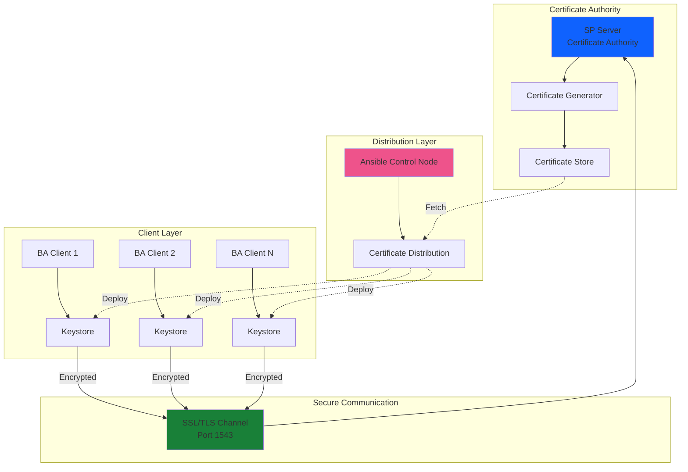
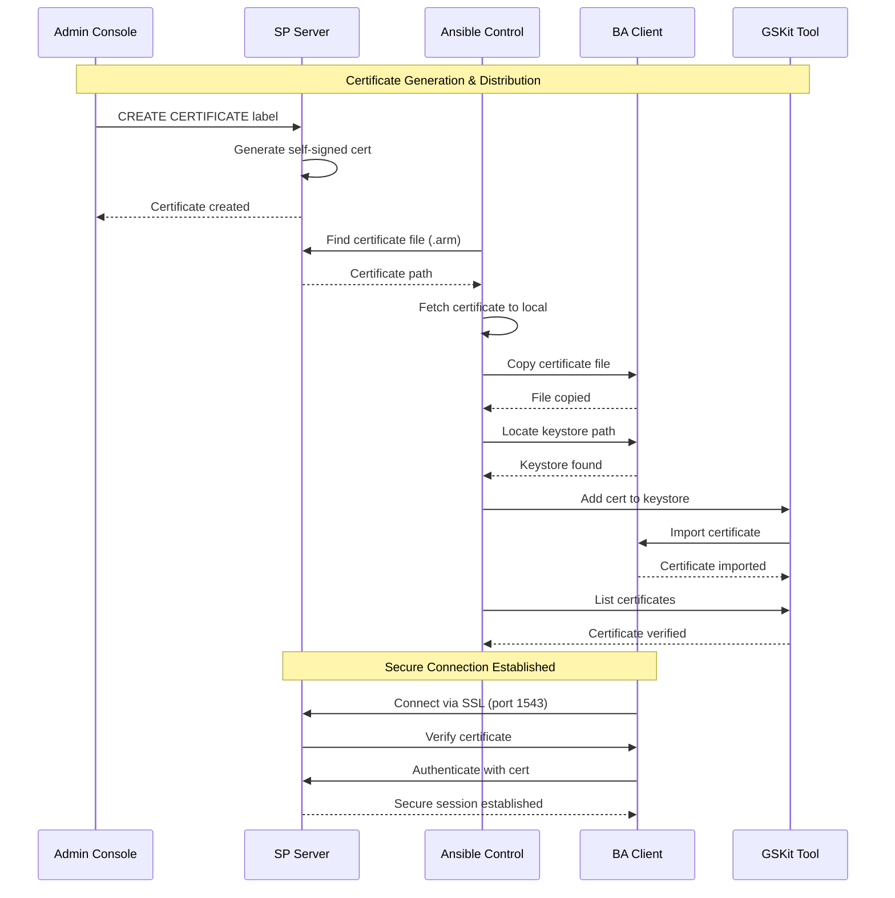
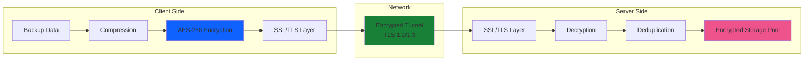

# IBM Storage Protect Security Management - User Guide

## Table of Contents
1. [Overview](#overview)
2. [Prerequisites](#prerequisites)
3. [Solution Architecture](#solution-architecture)
4. [Operations Guide](#operations-guide)
5. [Configuration Reference](#configuration-reference)
6. [Troubleshooting](#troubleshooting)
7. [Best Practices](#best-practices)

---

## Overview

### Purpose
This guide provides comprehensive instructions for implementing and managing security features in IBM Storage Protect environments. It covers SSL/TLS certificate management, secure client configuration, encryption, authentication, and compliance requirements for enterprise backup infrastructure.

### Security Components
IBM Storage Protect security management encompasses:
- **SSL/TLS Certificates**: Secure communication between clients and servers
- **Certificate Distribution**: Automated certificate deployment to clients
- **Client Configuration**: Secure dsm.opt and dsm.sys configuration
- **Password Management**: Secure credential storage and rotation
- **Encryption**: Data-at-rest and data-in-transit encryption
- **Authentication**: Node authentication and access control
- **Audit Logging**: Security event tracking and compliance

### Key Features
- **Automated Certificate Management**: Ansible-driven certificate generation and distribution
- **GSKit Integration**: IBM Global Security Kit for certificate operations
- **Keystore Management**: Secure certificate storage and retrieval
- **SSL/TLS Enforcement**: Mandatory encrypted communications
- **Password Generation**: Secure password storage with PASSWORDACCESS GENERATE
- **FIPS Compliance**: Federal Information Processing Standards support
- **Audit Trail**: Comprehensive security event logging

### Supported Security Standards
- **SSL/TLS**: TLS 1.2 and TLS 1.3
- **Encryption**: AES-256, 3DES
- **Certificates**: X.509 v3 certificates
- **FIPS 140-2**: Federal cryptographic standards
- **Key Length**: 2048-bit and 4096-bit RSA keys

---

## Prerequisites

### Infrastructure Requirements

#### IBM Storage Protect Server
```yaml
# SP Server Security Configuration
sp_server_address: "sp-server.example.com"
sp_server_port: 1500              # Standard TCP port
sp_server_ssl_port: 1543          # SSL/TLS port
ssl_required: true                # Enforce SSL connections

# Certificate Configuration
cert_label_prefix: "SP_CERT"
cert_validity_days: 365
cert_key_size: 2048               # or 4096 for higher security

# Admin Credentials
admin_username: "admin"
admin_password: "{{ vault_admin_password }}"
```

#### Client Systems
```yaml
# Client Security Requirements
ba_client_version: "8.1.23.0"
gskit_version: "8.0.55.x"         # IBM Global Security Kit
openssl_version: "1.1.1+"         # For certificate operations

# Certificate Paths
cert_directory: "/opt/tivoli/tsm/client/ba/bin"
keystore_path: "/opt/tivoli/tsm/client/ba/bin/dsmcert.kdb"
stash_file: "/opt/tivoli/tsm/client/ba/bin/dsmcert.sth"

# Configuration Files
dsm_sys_path: "/opt/tivoli/tsm/client/ba/bin/dsm.sys"
dsm_opt_path: "/opt/tivoli/tsm/client/ba/bin/dsm.opt"
```

#### Network Requirements
```yaml
# Firewall Rules
required_ports:
  - port: 1500                    # Standard TCP
    protocol: TCP
    direction: outbound
  - port: 1543                    # SSL/TLS
    protocol: TCP
    direction: outbound

# DNS Requirements
- SP Server hostname must resolve correctly
- Certificate CN must match server hostname
- Reverse DNS lookup recommended for audit logs
```

### Software Requirements

#### Control Node (Ansible)
```bash
# Ansible Version
ansible --version
# ansible [core 2.12+]

# Required Collections
ansible-galaxy collection install ibm.storage_protect

# Python Requirements
pip3 install cryptography pyOpenSSL

# Verify GSKit availability
ls -l /usr/local/ibm/gsk8_64/bin/gsk8capicmd_64
```

#### Managed Nodes
```bash
# IBM Global Security Kit (GSKit)
# Verify installation
/usr/local/ibm/gsk8_64/bin/gsk8ver_64

# Expected output:
# IBM GSKit version: 8.0.55.xx
# IBM GSKit build date: Jan 15 2024

# OpenSSL (for certificate operations)
openssl version
# OpenSSL 1.1.1k  25 Mar 2021

# BA Client with SSL support
dsmc query session
# Should show SSL capability
```

### Access Requirements

#### Ansible Control Node
```yaml
# SSH Access
ssh_user: "ansible"
ssh_key: "~/.ssh/id_rsa"
become_method: "sudo"
become_user: "root"

# Required Privileges
- Certificate file operations
- Keystore management
- Service restart (dsmcad)
- Configuration file updates
```

#### SP Server Access
```bash
# Administrative Console Access
dsmadmc -id=admin -password=admin

# Required Privileges
- SYSTEM privilege for certificate operations
- POLICY privilege for node management
- STORAGE privilege for encryption settings

# Verify privileges
QUERY ADMIN admin FORMAT=DETAILED
```

### Ansible Vault Setup

#### Create Security Vault
```bash
# Create encrypted vault for security credentials
ansible-vault create group_vars/all/security_vault.yml

# Vault content
---
vault_admin_password: "SPAdminSecurePass123!"
vault_sp_server_password: "ServerSecurePass456!"
vault_cert_password: "CertSecurePass789!"
vault_keystore_password: "KeystorePass012!"

# Save and exit

# Create vault password file
echo "MySecurityVaultPassword" > ~/.ansible_security_vault_pass
chmod 600 ~/.ansible_security_vault_pass
```

---

## Solution Architecture

### Security Architecture Overview



### Certificate Lifecycle Flow



### Encryption Architecture



### Security Configuration Hierarchy

```
Security Configuration Hierarchy
├── Server Level
│   ├── SSL Configuration
│   │   ├── Certificate Authority
│   │   ├── Server Certificates
│   │   └── SSL Port Configuration
│   ├── Encryption Settings
│   │   ├── Storage Pool Encryption
│   │   ├── Deduplication Encryption
│   │   └── Key Management
│   └── Authentication
│       ├── Admin Passwords
│       ├── Node Passwords
│       └── LDAP Integration
│
├── Client Level
│   ├── SSL/TLS Configuration
│   │   ├── Certificate Import
│   │   ├── Keystore Management
│   │   └── SSL Enforcement
│   ├── Password Management
│   │   ├── PASSWORDACCESS GENERATE
│   │   ├── Password Files
│   │   └── Credential Rotation
│   └── Encryption Options
│       ├── Client-side Encryption
│       ├── Compression
│       └── FIPS Mode
│
└── Network Level
    ├── Firewall Rules
    ├── Port Configuration
    └── Network Segmentation
```

---

## Operations Guide

### 4.1 Certificate Management

#### Step 1: Prepare Certificate Infrastructure

```bash
# Create directory structure on control node
mkdir -p ~/sp-security/{certificates,inventory,playbooks,group_vars}
cd ~/sp-security

# Create data.ini configuration file
cat > data.ini << 'EOF'
[DEFAULT]
SP_SERVER_USERNAME = admin
SP_SERVER_PASSWORD = {{ vault_admin_password }}
LOCAL_CERT_DIR = /tmp/sp-certificates
EOF

# Create local certificate directory
mkdir -p /tmp/sp-certificates
chmod 700 /tmp/sp-certificates
```

#### Step 2: Create Certificate Distribution Inventory

```ini
# inventory/security_hosts.ini
[CERT_ADMIN_CLIENT]
admin-client ansible_host=10.10.10.50

[CERT_SP_SERVER]
sp-server ansible_host=10.10.10.100

[CERT_SP_CLIENTS]
client-01 ansible_host=10.10.10.101
client-02 ansible_host=10.10.10.102
client-03 ansible_host=10.10.10.103

[all:vars]
ansible_user=ansible
ansible_become=yes
ansible_python_interpreter=/usr/bin/python3
```

#### Step 3: Generate Server Certificate

```bash
# Method 1: Using Ansible Playbook
cat > playbooks/generate_certificate.yml << 'EOF'
---
- name: Generate IBM Storage Protect Server Certificate
  hosts: CERT_ADMIN_CLIENT
  gather_facts: no
  
  tasks:
    - name: Generate certificate label with timestamp
      ansible.builtin.shell: "echo SP_CERT_$(date '+%b_%d_%Y_%H_%M_%S')"
      register: sp_server_date_time
    
    - name: Display certificate label
      ansible.builtin.debug:
        msg: "Certificate Label: {{ sp_server_date_time.stdout }}"
    
    - name: Create self-signed certificate on SP Server
      ansible.builtin.shell: |
        cd /opt/tivoli/tsm/client/ba/bin/
        dsmadmc -id={{ lookup('ini', 'SP_SERVER_USERNAME', file='data.ini') }} \
                -password={{ lookup('ini', 'SP_SERVER_PASSWORD', file='data.ini') }} \
                "create certificate \"{{ sp_server_date_time.stdout }}\""
      register: cert_info
    
    - name: Display certificate creation output
      ansible.builtin.debug:
        var: cert_info.stdout_lines
...
EOF

# Run certificate generation
ansible-playbook -i inventory/security_hosts.ini \
  playbooks/generate_certificate.yml

# Expected output:
# TASK [Display certificate label] ***********************************************
# ok: [admin-client] => {
#     "msg": "Certificate Label: SP_CERT_Jan_15_2024_10_30_45"
# }
# 
# TASK [Display certificate creation output] *************************************
# ok: [admin-client] => {
#     "cert_info.stdout_lines": [
#         "IBM Storage Protect",
#         "Command Line Administrative Interface - Version 8, Release 1, Level 23.0",
#         "ANR2900I Certificate SP_CERT_Jan_15_2024_10_30_45 created.",
#         "ANR2017I Administrator ADMIN issued command: CREATE CERTIFICATE"
#     ]
# }

# Method 2: Manual Certificate Generation
ssh admin-client
dsmadmc -id=admin -password=admin

# Create certificate
CREATE CERTIFICATE "SP_CERT_MANUAL_20240115"

# Expected output:
# ANR2900I Certificate SP_CERT_MANUAL_20240115 created.

# Verify certificate
QUERY CERTIFICATE

# Expected output:
# Certificate Label: SP_CERT_MANUAL_20240115
# Certificate Type: Self-signed
# Expiration Date: 2025-01-15
# Key Size: 2048 bits
```

#### Step 4: Distribute Certificates to Clients

```bash
# Complete certificate distribution playbook
cat > playbooks/cert_distribute.yml << 'EOF'
---
- name: Generate SP Server Certificate
  hosts: CERT_ADMIN_CLIENT
  gather_facts: no
  tasks:
    - name: Generate certificate label with timestamp
      ansible.builtin.shell: "echo SP_CERT_$(date '+%b_%d_%Y_%H_%M_%S')"
      register: sp_server_date_time
    
    - name: Create self-signed certificate
      ansible.builtin.shell: |
        cd /opt/tivoli/tsm/client/ba/bin/
        dsmadmc -id={{ lookup('ini', 'SP_SERVER_USERNAME', file='data.ini') }} \
                -password={{ lookup('ini', 'SP_SERVER_PASSWORD', file='data.ini') }} \
                "create certificate \"{{ sp_server_date_time.stdout }}\""
      register: cert_info

- name: Fetch Certificate from SP Server
  hosts: CERT_SP_SERVER
  gather_facts: no
  tasks:
    - name: Find certificate file
      ansible.builtin.shell: |
        find / -name '{{ hostvars['CERT_ADMIN_CLIENT']['sp_server_date_time'].stdout }}.arm' 2>/dev/null | grep "."
      register: search_result
    
    - name: Display certificate path
      ansible.builtin.debug:
        var: search_result.stdout
    
    - name: Fetch certificate to local machine
      ansible.builtin.fetch:
        src: "{{ search_result.stdout }}"
        dest: "{{ lookup('ini', 'LOCAL_CERT_DIR', file='data.ini') }}"
        flat: yes

- name: Distribute Certificate to Clients
  hosts: CERT_SP_CLIENTS
  gather_facts: no
  tasks:
    - name: Copy certificate to client
      ansible.builtin.copy:
        src: "{{ lookup('ini', 'LOCAL_CERT_DIR', file='data.ini') }}/{{ hostvars['CERT_ADMIN_CLIENT']['sp_server_date_time'].stdout }}.arm"
        dest: /opt/tivoli/tsm/client/ba/bin/
    
    - name: Locate keystore path
      ansible.builtin.shell: |
        z='/dsmcert.kdb'
        y='/opt/tivoli/tsm/client/'
        a=$PASSWORDDIR$z
        b=$DSM_DIR$z
        c=~'/IBM/StorageProtect/certs'$z
        d=$y'ba/bin64'$z
        e=$y'ba/bin'$z
        f=$y'api/bin64'$z
        g=$y'api/bin'$z
        if [ -f $a ]; then h=$a
        elif [ -f $b ]; then h=$b
        elif [ -f $c ]; then h=$c
        elif [ -f $d ]; then h=$d
        elif [ -f $e ]; then h=$e
        elif [ -f $f ]; then h=$f
        else h=$g
        fi
        echo $h
      register: key_store_path
    
    - name: Display keystore path
      ansible.builtin.debug:
        var: key_store_path.stdout
    
    - name: Add certificate to keystore using GSKit
      ansible.builtin.shell: |
        /usr/local/ibm/gsk8_64/bin/gsk8capicmd_64 \
          -cert -add \
          -label {{ hostvars['CERT_ADMIN_CLIENT']['sp_server_date_time'].stdout }} \
          -file /opt/tivoli/tsm/client/ba/bin/{{ hostvars['CERT_ADMIN_CLIENT']['sp_server_date_time'].stdout }}.arm \
          -db {{ key_store_path.stdout }} \
          -stashed
      register: gskit_cmd_result
    
    - name: Verify certificate in keystore
      ansible.builtin.shell: |
        /usr/local/ibm/gsk8_64/bin/gsk8capicmd_64 \
          -cert -list \
          -db {{ key_store_path.stdout }} \
          -stashed
      register: gskit_list_result
    
    - name: Display certificates in keystore
      ansible.builtin.debug:
        var: gskit_list_result.stdout_lines
...
EOF

# Execute certificate distribution
ansible-playbook -i inventory/security_hosts.ini \
  playbooks/cert_distribute.yml

# Expected output:
# PLAY [Generate SP Server Certificate] ******************************************
# TASK [Generate certificate label with timestamp] *******************************
# ok: [admin-client]
# 
# PLAY [Fetch Certificate from SP Server] ****************************************
# TASK [Find certificate file] ****************************************************
# ok: [sp-server]
# TASK [Fetch certificate to local machine] **************************************
# changed: [sp-server]
# 
# PLAY [Distribute Certificate to Clients] ***************************************
# TASK [Copy certificate to client] ***********************************************
# changed: [client-01]
# changed: [client-02]
# changed: [client-03]
# 
# TASK [Add certificate to keystore using GSKit] *********************************
# changed: [client-01]
# changed: [client-02]
# changed: [client-03]
# 
# TASK [Display certificates in keystore] ****************************************
# ok: [client-01] => {
#     "gskit_list_result.stdout_lines": [
#         "Certificates found",
#         "* default",
#         "- SP_CERT_Jan_15_2024_10_30_45"
#     ]
# }
```

#### Step 5: Verify Certificate Installation

```bash
# Verify on each client
ansible CERT_SP_CLIENTS -i inventory/security_hosts.ini -m shell -a \
  "/usr/local/ibm/gsk8_64/bin/gsk8capicmd_64 -cert -list -db /opt/tivoli/tsm/client/ba/bin/dsmcert.kdb -stashed"

# Expected output:
# client-01 | CHANGED | rc=0 >>
# Certificates found
# * default
# - SP_CERT_Jan_15_2024_10_30_45
# 
# client-02 | CHANGED | rc=0 >>
# Certificates found
# * default
# - SP_CERT_Jan_15_2024_10_30_45

# Test SSL connection
ansible CERT_SP_CLIENTS -i inventory/security_hosts.ini -m shell -a \
  "dsmc query session"

# Expected output showing SSL:
# client-01 | CHANGED | rc=0 >>
# IBM Storage Protect
# Command Line Backup-Archive Client Interface
# Client Version 8, Release 1, Level 23.0
# 
# Session established with server SP-SERVER: Linux/x86_64
#   Server Version 8, Release 1, Level 23.0
#   Server date/time: 01/15/2024 10:45:00  Last access: 01/15/2024 10:30:00
#   Using SSL connection: Yes
#   SSL Version: TLSv1.2
```

### 4.2 Client Configuration Security

#### Step 1: Secure dsm.opt Configuration

```bash
# Create secure dsm.opt playbook
cat > playbooks/configure_secure_dsm_opt.yml << 'EOF'
---
- name: Configure Secure dsm.opt
  hosts: sp_clients
  become: true
  
  vars:
    dsm_opt_parameters:
      dsm_opt_servername: "SP-SERVER"
      dsm_opt_nodename: "{{ inventory_hostname }}"
      dsm_opt_passwordaccess: "GENERATE"
      dsm_opt_compression: "YES"
      dsm_opt_sslrequired: "YES"
      dsm_opt_sslfipsmode: "YES"
      dsm_opt_deduplication: "YES"
  
  roles:
    - role: ibm.storage_protect.dsm_opt
...
EOF

# Execute configuration
ansible-playbook -i inventory/security_hosts.ini \
  playbooks/configure_secure_dsm_opt.yml

# Expected output:
# PLAY [Configure Secure dsm.opt] *************************************************
# 
# TASK [ibm.storage_protect.dsm_opt : Write the updated dsm.opt file] ************
# changed: [client-01]
# changed: [client-02]
# changed: [client-03]
# 
# PLAY RECAP **********************************************************************
# client-01 : ok=5    changed=1    unreachable=0    failed=0
# client-02 : ok=5    changed=1    unreachable=0    failed=0
# client-03 : ok=5    changed=1    unreachable=0    failed=0
```

#### Step 2: Generate and Store Passwords Securely

```bash
# Generate password on client
ansible sp_clients -i inventory/security_hosts.ini -m shell -a \
  "dsmc set password OldPassword NewSecurePassword123!"

# Expected output:
# client-01 | CHANGED | rc=0 >>
# IBM Storage Protect
# Command Line Backup-Archive Client Interface
# Client Version 8, Release 1, Level 23.0
# 
# Your new password has been accepted and stored.

# Verify password storage
ansible sp_clients -i inventory/security_hosts.ini -m shell -a \
  "ls -l /opt/tivoli/tsm/client/ba/bin/TSM.PWD"

# Expected output:
# client-01 | CHANGED | rc=0 >>
# -rw------- 1 root root 256 Jan 15 10:50 /opt/tivoli/tsm/client/ba/bin/TSM.PWD
```

#### Step 3: Configure SSL Enforcement

```bash
# Update dsm.sys for SSL enforcement
cat > playbooks/enforce_ssl.yml << 'EOF'
---
- name: Enforce SSL on SP Clients
  hosts: sp_clients
  become: true
  
  tasks:
    - name: Backup dsm.sys
      ansible.builtin.copy:
        src: /opt/tivoli/tsm/client/ba/bin/dsm.sys
        dest: /opt/tivoli/tsm/client/ba/bin/dsm.sys.backup
        remote_src: yes
    
    - name: Configure SSL in dsm.sys
      ansible.builtin.lineinfile:
        path: /opt/tivoli/tsm/client/ba/bin/dsm.sys
        regexp: "^\\s*{{ item.key }}"
        line: "   {{ item.key }} {{ item.value }}"
        insertafter: "^SERVERNAME"
      loop:
        - { key: "SSLTCPPORT", value: "1543" }
        - { key: "SSLCOMPRESSION", value: "YES" }
        - { key: "SSLFIPSMODE", value: "YES" }
    
    - name: Restart dsmcad service
      ansible.builtin.systemd:
        name: dsmcad
        state: restarted
...
EOF

# Execute SSL enforcement
ansible-playbook -i inventory/security_hosts.ini \
  playbooks/enforce_ssl.yml
```

### 4.3 Encryption Management

#### Enable Client-Side Encryption

```bash
# Configure encryption in dsm.opt
cat > playbooks/enable_encryption.yml << 'EOF'
---
- name: Enable Client-Side Encryption
  hosts: sp_clients
  become: true
  
  vars:
    dsm_opt_parameters:
      dsm_opt_encryptiontype: "AES256"
      dsm_opt_encryptkey: "GENERATE"
      dsm_opt_compression: "NO"  # Compress before encrypt
  
  tasks:
    - name: Configure encryption options
      ansible.builtin.include_role:
        name: ibm.storage_protect.dsm_opt
    
    - name: Generate encryption key
      ansible.builtin.shell: |
        dsmc generate encryptionkey
      register: key_gen_result
    
    - name: Display encryption key info
      ansible.builtin.debug:
        msg: "{{ key_gen_result.stdout_lines }}"
...
EOF

# Execute encryption configuration
ansible-playbook -i inventory/security_hosts.ini \
  playbooks/enable_encryption.yml
```

### 4.4 Security Auditing

#### Configure Audit Logging

```bash
# Enable comprehensive logging
cat > playbooks/configure_audit_logging.yml << 'EOF'
---
- name: Configure Security Audit Logging
  hosts: sp_clients
  become: true
  
  vars:
    dsm_opt_parameters:
      dsm_opt_errorlogname: "/var/log/dsmerror.log"
      dsm_opt_schedlogname: "/var/log/dsmsched.log"
      dsm_opt_errorlogretention: "30 D"
      dsm_opt_schedlogretention: "30 D"
  
  tasks:
    - name: Create log directory
      ansible.builtin.file:
        path: /var/log/sp-audit
        state: directory
        mode: '0750'
        owner: root
        group: root
    
    - name: Configure logging options
      ansible.builtin.include_role:
        name: ibm.storage_protect.dsm_opt
    
    - name: Configure logrotate for SP logs
      ansible.builtin.copy:
        dest: /etc/logrotate.d/sp-client
        content: |
          /var/log/dsm*.log {
              daily
              rotate 30
              compress
              delaycompress
              missingok
              notifempty
              create 0640 root root
          }
...
EOF

# Execute audit logging configuration
ansible-playbook -i inventory/security_hosts.ini \
  playbooks/configure_audit_logging.yml
```

---

## Configuration Reference

### SSL/TLS Configuration

#### Server Configuration (dsm.sys)
```ini
# /opt/tivoli/tsm/client/ba/bin/dsm.sys
SERVERNAME  SP-SERVER
   COMMMETHOD         TCPIP
   TCPPORT            1500
   TCPSERVERADDRESS   sp-server.example.com
   NODENAME           CLIENT-01
   
   # SSL Configuration
   SSLTCPPORT         1543
   SSLCOMPRESSION     YES
   SSLFIPSMODE        YES
   
   # Certificate Configuration
   CERTPATH           /opt/tivoli/tsm/client/ba/bin
   CERTNAME           dsmcert.kdb
```

#### Client Options (dsm.opt)
```ini
# /opt/tivoli/tsm/client/ba/bin/dsm.opt
SERVERNAME SP-SERVER
NODENAME CLIENT-01
PASSWORDACCESS GENERATE
COMPRESSION YES
SSLREQUIRED YES
SSLFIPSMODE YES
DEDUPLICATION YES
ENCRYPTIONTYPE AES256
```

### Encryption Configuration

#### AES-256 Encryption
```ini
# dsm.opt - AES-256 encryption
ENCRYPTIONTYPE AES256
ENCRYPTKEY GENERATE
ENCRYPTKEYHISTORY 5
```

#### FIPS Mode
```ini
# dsm.opt - FIPS 140-2 compliance
SSLFIPSMODE YES
ENCRYPTIONFIPSMODE YES
```

### Password Management

#### Password Generation
```bash
# Generate and store password
dsmc set password <old_password> <new_password>

# Verify password file
ls -l /opt/tivoli/tsm/client/ba/bin/TSM.PWD
# -rw------- 1 root root 256 Jan 15 10:50 TSM.PWD
```

#### Password Rotation Script
```bash
#!/bin/bash
# /usr/local/bin/rotate_sp_password.sh

OLD_PASSWORD="$1"
NEW_PASSWORD="$2"
NODE_NAME="$3"

# Rotate password
dsmc set password "$OLD_PASSWORD" "$NEW_PASSWORD"

# Update on server
dsmadmc -id=admin -password=admin \
  "UPDATE NODE $NODE_NAME $NEW_PASSWORD"

# Log rotation
logger -t sp-security "Password rotated for node $NODE_NAME"
```

---

## Troubleshooting

### Certificate Issues

#### Problem: Certificate Not Found
```bash
# Error: ANS1398E Cannot find certificate
# Solution: Verify certificate in keystore
/usr/local/ibm/gsk8_64/bin/gsk8capicmd_64 \
  -cert -list \
  -db /opt/tivoli/tsm/client/ba/bin/dsmcert.kdb \
  -stashed

# If missing, re-import certificate
/usr/local/ibm/gsk8_64/bin/gsk8capicmd_64 \
  -cert -add \
  -label SP_CERT_LABEL \
  -file /path/to/certificate.arm \
  -db /opt/tivoli/tsm/client/ba/bin/dsmcert.kdb \
  -stashed
```

#### Problem: SSL Handshake Failure
```bash
# Error: ANS1344E SSL connection failure
# Solution: Check SSL configuration
dsmc query session -VERBOSE

# Verify server certificate
openssl s_client -connect sp-server.example.com:1543 \
  -showcerts

# Check FIPS mode compatibility
grep SSLFIPSMODE /opt/tivoli/tsm/client/ba/bin/dsm.sys
```

### Encryption Issues

#### Problem: Encryption Key Not Found
```bash
# Error: ANS1329E Encryption key not found
# Solution: Regenerate encryption key
dsmc generate encryptionkey

# Verify key file
ls -l /opt/tivoli/tsm/client/ba/bin/TSM.KDB
```

#### Problem: Performance Degradation with Encryption
```bash
# Solution: Disable compression (encrypt after compress)
# Edit dsm.opt:
COMPRESSION NO
ENCRYPTIONTYPE AES256

# Or use hardware acceleration if available
SSLFIPSMODE NO  # If FIPS not required
```

### Authentication Issues

#### Problem: Password Authentication Failed
```bash
# Error: ANS1017E Session rejected
# Solution: Reset password
dsmc set password <old> <new>

# Or regenerate password file
rm /opt/tivoli/tsm/client/ba/bin/TSM.PWD
dsmc set password <password> <password>
```

---

## Best Practices

### Certificate Management

1. **Regular Rotation**: Rotate certificates annually
2. **Centralized Storage**: Keep certificate backups in secure location
3. **Automated Distribution**: Use Ansible for consistent deployment
4. **Monitoring**: Track certificate expiration dates

```bash
# Certificate expiration monitoring script
#!/bin/bash
# /usr/local/bin/check_cert_expiry.sh

CERT_LABEL="SP_CERT_Jan_15_2024_10_30_45"
KEYSTORE="/opt/tivoli/tsm/client/ba/bin/dsmcert.kdb"

# Extract certificate
/usr/local/ibm/gsk8_64/bin/gsk8capicmd_64 \
  -cert -extract \
  -label "$CERT_LABEL" \
  -db "$KEYSTORE" \
  -stashed \
  -target /tmp/cert.pem

# Check expiration
EXPIRY=$(openssl x509 -in /tmp/cert.pem -noout -enddate | cut -d= -f2)
EXPIRY_EPOCH=$(date -d "$EXPIRY" +%s)
NOW_EPOCH=$(date +%s)
DAYS_LEFT=$(( ($EXPIRY_EPOCH - $NOW_EPOCH) / 86400 ))

if [ $DAYS_LEFT -lt 30 ]; then
    echo "WARNING: Certificate expires in $DAYS_LEFT days"
    # Send alert
fi

rm /tmp/cert.pem
```

### Encryption Strategy

1. **Client-Side Encryption**: For sensitive data
2. **AES-256**: Use strongest available encryption
3. **Key Management**: Secure key storage and rotation
4. **Performance**: Balance security with performance needs

### Password Security

1. **Strong Passwords**: Minimum 12 characters, mixed case, numbers, symbols
2. **Regular Rotation**: Change passwords quarterly
3. **Secure Storage**: Use PASSWORDACCESS GENERATE
4. **Audit Trail**: Log all password changes

### Compliance

1. **FIPS 140-2**: Enable for government/regulated industries
2. **Audit Logging**: Comprehensive security event logging
3. **Access Control**: Principle of least privilege
4. **Documentation**: Maintain security procedures

---

## Additional Resources

- **IBM Documentation**: [IBM Storage Protect Security](https://www.ibm.com/docs/en/storage-protect/8.1.23?topic=security)
- **GSKit Documentation**: [IBM Global Security Kit](https://www.ibm.com/docs/en/gskit)
- **SSL/TLS Best Practices**: [NIST Guidelines](https://csrc.nist.gov/publications)
- **Ansible Collection**: [`ibm.storage_protect`](https://galaxy.ansible.com/ibm/storage_protect)

---

*Last Updated: 2024-01-15*
*Version: 1.0*