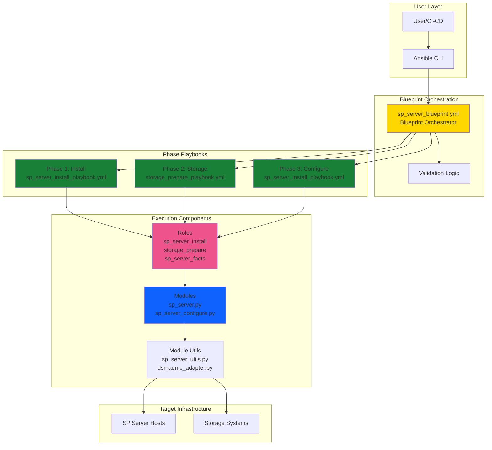
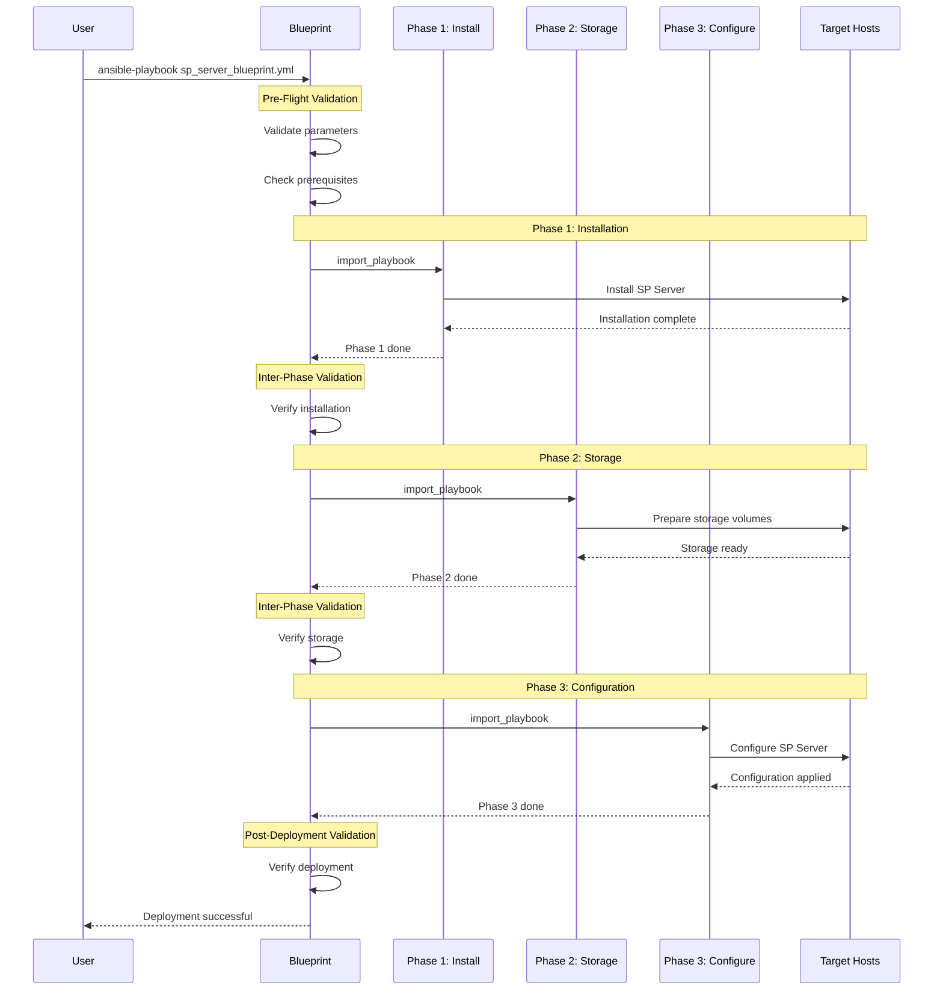

# IBM Storage Protect Blueprint Configuration Solution - User Guide

## Table of Contents
1. [Overview](#overview)
2. [Prerequisites](#prerequisites)
3. [Solution Architecture](#solution-architecture)
4. [Operations Guide](#operations-guide)
5. [Configuration Reference](#configuration-reference)
6. [Troubleshooting](#troubleshooting)
7. [Best Practices](#best-practices)

---

## Overview

### Purpose
This guide provides comprehensive instructions for using the IBM Storage Protect Blueprint Configuration Solution - an orchestration pattern for complex, multi-phase deployments that coordinates multiple playbooks, roles, and modules in a specific sequence.

### What is a Blueprint?
A **Blueprint** is an orchestration playbook that acts as a conductor, coordinating multiple solution playbooks to achieve complex deployment goals. It ensures each phase executes in the correct order with proper dependency management.

### Key Features
- **Multi-Phase Orchestration**: Coordinates install → storage → configure sequences
- **Dependency Management**: Ensures proper execution order
- **Fail-Fast Behavior**: Stops on first error for safety
- **Reusable Pattern**: Applicable across different solutions
- **Transparent Logging**: Clear visibility into each phase
- **Parameterized Execution**: Flexible for different environments

### Current Implementation
**Blueprint**: [`playbooks/sp_server_blueprint.yml`](../../playbooks/sp_server_blueprint.yml)

The SP Server Blueprint demonstrates the pattern with a 3-phase deployment:
1. **Phase 1**: Initial server installation
2. **Phase 2**: Storage volume preparation
3. **Phase 3**: Server configuration and finalization

### Related Documentation
- **Design Document**: [Blueprint Configuration Solution Design](../design/sp-blueprint-conf-solution.md)
- **Playbook Analysis**: [Playbook Analysis Document](../../playbooks/pb-analysis.md)
- **SP Server Guide**: [SP Server Lifecycle Guide](sp-server-lifecycle-guide.md)

---

## Prerequisites

### Ansible Requirements

#### Ansible Version Compatibility
This collection has been tested against Ansible versions **>= 2.15.0**.

```bash
# Check Ansible version
ansible --version
# Required: ansible [core 2.15.0] or higher
```

#### Python Version
- **Control Node**: Python 3.8 or higher
- **Managed Nodes**: Python 3.9 or higher

**Note**: If your target systems use an older Python version, use the `python_version_install.yml` playbook first:

```bash
# Install Python 3.9+ on managed nodes
ansible-playbook ibm.storage_protect.python_version_install \
  -i inventory.ini \
  -e "target_hosts=sp_servers"
```

### IBM Storage Protect Requirements

#### Supported Versions
This collection supports IBM Storage Protect versions **>= 8.1.23**.

#### Required Components
- IBM Storage Protect Server installation packages
- Valid Storage Protect license
- Access to IBM software repository

Refer to [IBM Documentation](https://www.ibm.com/docs/en/storage-protect/8.1.24) for detailed requirements.

### Collection Installation

#### Install from Ansible Galaxy

```bash
# Install the collection
ansible-galaxy collection install ibm.storage_protect

# Verify installation
ansible-galaxy collection list | grep ibm.storage_protect
```

#### Install from requirements.yml

```yaml
# requirements.yml
collections:
  - name: ibm.storage_protect
  - name: ansible.posix
```

```bash
# Install collections
ansible-galaxy collection install -r requirements.yml
```

### Ansible Vault Setup

#### Create Encrypted Vault File

```bash
# Create new vault file
ansible-vault create vars/blueprint-secrets.yml
```

Add your sensitive variables:

```yaml
# vars/blueprint-secrets.yml (before encryption)
---
vault_instance_password: "SecureInstancePass123!"
vault_ssl_password: "SecureSSLPass456!"
vault_admin_password: "SecureAdminPass789!"
```

#### Encrypt Vault File

```bash
# Encrypt the vault file
ansible-vault encrypt vars/blueprint-secrets.yml

# Create vault password file (DO NOT COMMIT TO GIT)
echo "your-vault-password" > vault_pass.txt
chmod 600 vault_pass.txt

# Add to .gitignore
echo "vault_pass.txt" >> .gitignore
```

### System Requirements

#### Hardware Requirements
| Server Size | CPU Cores | RAM | Storage |
|-------------|-----------|-----|---------|
| XSmall | 2 | 8 GB | 100 GB |
| Small | 4 | 16 GB | 500 GB |
| Medium | 8 | 32 GB | 2 TB |
| Large | 16 | 64 GB | 10 TB |

#### Network Requirements
- Port 1500: TCP/IP communication
- Port 1543: Administrative console (HTTPS)
- Firewall rules configured for client access

### Permissions
- Root or sudo access on target hosts
- Access to IBM software repository
- Valid credentials for IBM Passport Advantage

---

## Solution Architecture

### Blueprint Orchestration Architecture



### Execution Flow



---

## Operations Guide

### 4.1 Initial Setup

#### Step 1: Prepare Directory Structure

```bash
# Create project directory
mkdir -p ~/sp-blueprint-deployment/{inventory,vars,playbooks}
cd ~/sp-blueprint-deployment

# Verify collection installation
ansible-galaxy collection list | grep ibm.storage_protect
```

#### Step 2: Create Inventory

```ini
# inventory/sp_servers.ini
[sp_servers]
sp-server-01 ansible_host=10.10.10.101
sp-server-02 ansible_host=10.10.10.102

[sp_servers:vars]
ansible_user=ansible
ansible_become=yes
ansible_python_interpreter=/usr/bin/python3
```

#### Step 3: Create Variable Files

```yaml
# vars/blueprint-vars.yml
---
# Server Configuration
sp_server_version: "8.1.23.0"
sp_server_state: "present"
sp_server_bin_repo: "/data/sp-packages"

# Storage Configuration
storage_size: "medium"  # xsmall/small/medium/large

# Instance Configuration
instance_user: "tsminst1"
instance_dir: "/tsminst1"

# Target Configuration
target_hosts: "sp_servers"
```

```yaml
# vars/blueprint-secrets.yml (encrypted with ansible-vault)
---
vault_instance_password: "SecureInstancePass123!"
vault_ssl_password: "SecureSSLPass456!"
vault_admin_password: "SecureAdminPass789!"
```

#### Step 4: Encrypt Secrets

```bash
# Encrypt secrets file
ansible-vault encrypt vars/blueprint-secrets.yml

# Create vault password file
echo "MyVaultPassword" > vault_pass.txt
chmod 600 vault_pass.txt
```

### 4.2 Blueprint Deployment

#### Complete Deployment (All Phases)

```bash
# Deploy using blueprint
ansible-playbook ibm.storage_protect.sp_server_blueprint \
  -i inventory/sp_servers.ini \
  -e @vars/blueprint-vars.yml \
  -e @vars/blueprint-secrets.yml \
  --vault-password-file vault_pass.txt

# Expected output:
# PLAY [Phase 1: Install SP Server] ******************************************
# 
# TASK [Gathering Facts] ******************************************************
# ok: [sp-server-01]
# 
# TASK [sp_server_install : Pre-installation checks] *************************
# ok: [sp-server-01]
# 
# TASK [sp_server_install : Install SP Server] *******************************
# changed: [sp-server-01]
# 
# PLAY [Phase 2: Prepare Storage] *********************************************
# 
# TASK [storage_prepare : Create storage volumes] ****************************
# changed: [sp-server-01]
# 
# TASK [storage_prepare : Mount volumes] **************************************
# changed: [sp-server-01]
# 
# PLAY [Phase 3: Configure SP Server] *****************************************
# 
# TASK [sp_server_install : Configure server] ********************************
# changed: [sp-server-01]
# 
# TASK [sp_server_install : Create storage pools] ****************************
# changed: [sp-server-01]
# 
# PLAY RECAP ******************************************************************
# sp-server-01 : ok=25   changed=15   unreachable=0    failed=0    skipped=3
```

#### Environment-Specific Deployment

```bash
# Development environment
ansible-playbook ibm.storage_protect.sp_server_blueprint \
  -i inventory/sp_servers.ini \
  -e @vars/blueprint-vars.yml \
  -e @vars/dev.yml \
  -e @vars/blueprint-secrets.yml \
  --vault-password-file vault_pass.txt

# Production environment
ansible-playbook ibm.storage_protect.sp_server_blueprint \
  -i inventory/sp_servers.ini \
  -e @vars/blueprint-vars.yml \
  -e @vars/prod.yml \
  -e @vars/blueprint-secrets.yml \
  --vault-password-file vault_pass.txt
```

### 4.3 Phase-by-Phase Execution

#### Phase 1: Installation Only

```bash
# Run only installation phase
ansible-playbook ibm.storage_protect.sp_server_install_playbook \
  -i inventory/sp_servers.ini \
  -e @vars/blueprint-vars.yml \
  -e @vars/blueprint-secrets.yml \
  --vault-password-file vault_pass.txt

# Expected output:
# PLAY [Install SP Server] ****************************************************
# 
# TASK [sp_server_install : Install SP Server] *******************************
# changed: [sp-server-01]
# 
# PLAY RECAP ******************************************************************
# sp-server-01 : ok=10   changed=5   unreachable=0    failed=0
```

#### Phase 2: Storage Preparation Only

```bash
# Run only storage preparation
ansible-playbook ibm.storage_protect.storage_prepare_playbook \
  -i inventory/sp_servers.ini \
  -e "storage_size=medium" \
  -e "target_hosts=sp_servers" \
  --vault-password-file vault_pass.txt

# Expected output:
# PLAY [Prepare Storage] ******************************************************
# 
# TASK [storage_prepare : Create volumes] ************************************
# changed: [sp-server-01]
# 
# PLAY RECAP ******************************************************************
# sp-server-01 : ok=8   changed=4   unreachable=0    failed=0
```

#### Phase 3: Configuration Only

```bash
# Run only configuration phase
ansible-playbook ibm.storage_protect.sp_server_configure_playbook \
  -i inventory/sp_servers.ini \
  -e @vars/blueprint-vars.yml \
  -e @vars/blueprint-secrets.yml \
  --vault-password-file vault_pass.txt

# Expected output:
# PLAY [Configure SP Server] **************************************************
# 
# TASK [sp_server_install : Configure server] ********************************
# changed: [sp-server-01]
# 
# PLAY RECAP ******************************************************************
# sp-server-01 : ok=7   changed=3   unreachable=0    failed=0
```

### 4.4 Validation and Verification

#### Verify Deployment Status

```bash
# Check server status
ansible sp_servers -i inventory/sp_servers.ini -m shell -a \
  "systemctl status dsmserv"

# Expected output:
# sp-server-01 | CHANGED | rc=0 >>
# ● dsmserv.service - IBM Storage Protect Server
#    Loaded: loaded (/etc/systemd/system/dsmserv.service; enabled)
#    Active: active (running) since Mon 2024-01-15 10:30:00 UTC
#    Main PID: 12345 (dsmserv)

# Check server version
ansible sp_servers -i inventory/sp_servers.ini -m shell -a \
  "su - tsminst1 -c 'dsmadmc -id=admin -password=admin query status'"

# Expected output:
# sp-server-01 | CHANGED | rc=0 >>
# Server Version: 8.1.23.0
# Server State: Run
```

#### Verify Storage Configuration

```bash
# Check mounted volumes
ansible sp_servers -i inventory/sp_servers.ini -m shell -a \
  "df -h | grep tsminst1"

# Expected output:
# sp-server-01 | CHANGED | rc=0 >>
# /dev/sdb1       100G   10G   90G  10% /tsminst1/db
# /dev/sdc1        50G    5G   45G  10% /tsminst1/activelog
# /dev/sdd1       200G   20G  180G  10% /tsminst1/archivelog
# /dev/sde1       1.0T  100G  900G  10% /tsminst1/storage
```

### 4.5 Monitoring and Maintenance

#### Monitor Deployment Progress

```bash
# Run with verbose output
ansible-playbook ibm.storage_protect.sp_server_blueprint \
  -i inventory/sp_servers.ini \
  -e @vars/blueprint-vars.yml \
  -e @vars/blueprint-secrets.yml \
  --vault-password-file vault_pass.txt \
  -vv

# Monitor logs in real-time (separate terminal)
tail -f /var/log/ansible.log
```

#### Health Check Script

```bash
#!/bin/bash
# health_check.sh - Verify blueprint deployment

echo "=== SP Server Health Check ==="

# Check service status
echo "1. Checking service status..."
systemctl status dsmserv | grep "Active:"

# Check server version
echo "2. Checking server version..."
su - tsminst1 -c "dsmadmc -id=admin -password=admin 'query status'" | grep "Server Version"

# Check storage
echo "3. Checking storage volumes..."
df -h | grep tsminst1

# Check database
echo "4. Checking database..."
su - tsminst1 -c "dsmadmc -id=admin -password=admin 'query db'" | grep "Database Name"

echo "=== Health Check Complete ==="
```

---

## Configuration Reference

### Blueprint Variables

#### Server Configuration
```yaml
# Server version and state
sp_server_version: "8.1.23.0"       # SP Server version
sp_server_state: "present"          # present/absent/upgrade
sp_server_bin_repo: "/data/sp-repo" # Binary repository path

# Instance configuration
instance_user: "tsminst1"           # Instance user name
instance_dir: "/tsminst1"           # Instance directory
instance_password: "{{ vault_instance_password }}"  # Vaulted password
```

#### Storage Configuration
```yaml
# Storage size (determines volume sizes)
storage_size: "medium"              # xsmall/small/medium/large

# Storage size definitions
storage_sizes:
  xsmall:
    db: "50GB"
    activelog: "25GB"
    archivelog: "100GB"
    storage: "500GB"
  small:
    db: "100GB"
    activelog: "50GB"
    archivelog: "200GB"
    storage: "1TB"
  medium:
    db: "200GB"
    activelog: "100GB"
    archivelog: "500GB"
    storage: "5TB"
  large:
    db: "500GB"
    activelog: "250GB"
    archivelog: "1TB"
    storage: "20TB"
```

#### Network Configuration
```yaml
# Server network settings
tcp_port: 1500                      # TCP communication port
ssl_port: 1543                      # SSL communication port
admin_port: 1543                    # Admin console port
```

### Environment-Specific Variables

#### Development Environment
```yaml
# vars/dev.yml
---
target_hosts: "sp_servers_dev"
storage_size: "small"
backup_retention_days: 30
log_level: "debug"
```

#### Production Environment
```yaml
# vars/prod.yml
---
target_hosts: "sp_servers_prod"
storage_size: "large"
backup_retention_days: 365
log_level: "info"
```

---

## Troubleshooting

### Common Issues

#### Issue: Blueprint Fails at Phase 1

**Symptoms**:
```
TASK [sp_server_install : Install SP Server] *******************************
fatal: [sp-server-01]: FAILED! => {"msg": "Installation failed"}
```

**Solutions**:
```bash
# Check prerequisites
ansible sp_servers -i inventory/sp_servers.ini -m shell -a "python3 --version"
ansible sp_servers -i inventory/sp_servers.ini -m shell -a "df -h /opt"

# Verify repository access
ansible sp_servers -i inventory/sp_servers.ini -m shell -a \
  "ls -l /data/sp-packages"

# Check logs
ansible sp_servers -i inventory/sp_servers.ini -m shell -a \
  "tail -100 /var/log/sp_install.log"
```

#### Issue: Storage Preparation Fails

**Symptoms**:
```
TASK [storage_prepare : Create volumes] ************************************
fatal: [sp-server-01]: FAILED! => {"msg": "Insufficient disk space"}
```

**Solutions**:
```bash
# Check available disk space
ansible sp_servers -i inventory/sp_servers.ini -m shell -a "df -h"

# Check volume group
ansible sp_servers -i inventory/sp_servers.ini -m shell -a "vgs"

# Verify storage configuration
ansible sp_servers -i inventory/sp_servers.ini -m shell -a \
  "lsblk"
```

#### Issue: Configuration Phase Fails

**Symptoms**:
```
TASK [sp_server_install : Configure server] ********************************
fatal: [sp-server-01]: FAILED! => {"msg": "Configuration error"}
```

**Solutions**:
```bash
# Check server status
ansible sp_servers -i inventory/sp_servers.ini -m shell -a \
  "systemctl status dsmserv"

# Verify database
ansible sp_servers -i inventory/sp_servers.ini -m shell -a \
  "su - tsminst1 -c 'dsmadmc -id=admin -password=admin query db'"

# Check configuration files
ansible sp_servers -i inventory/sp_servers.ini -m shell -a \
  "cat /tsminst1/dsmserv.opt"
```

### Debug Mode

```bash
# Run with maximum verbosity
ansible-playbook ibm.storage_protect.sp_server_blueprint \
  -i inventory/sp_servers.ini \
  -e @vars/blueprint-vars.yml \
  -e @vars/blueprint-secrets.yml \
  --vault-password-file vault_pass.txt \
  -vvv

# Enable step-by-step execution
ansible-playbook ibm.storage_protect.sp_server_blueprint \
  -i inventory/sp_servers.ini \
  -e @vars/blueprint-vars.yml \
  -e @vars/blueprint-secrets.yml \
  --vault-password-file vault_pass.txt \
  --step
```

---

## Best Practices

### Deployment Strategy

1. **Test in Development First**: Always test blueprints in dev environment
2. **Use Version Control**: Track all variable files in Git
3. **Encrypt Secrets**: Always use Ansible Vault for passwords
4. **Document Changes**: Maintain changelog for blueprint modifications
5. **Backup Before Deployment**: Backup existing configurations

### Variable Management

```bash
# Organize variables by environment
vars/
├── blueprint-vars.yml          # Common variables
├── dev.yml                     # Development overrides
├── test.yml                    # Test overrides
├── prod.yml                    # Production overrides
└── blueprint-secrets.yml       # Encrypted secrets
```

### Security Best Practices

1. **Vault Password**: Never commit vault_pass.txt to Git
2. **SSH Keys**: Use key-based authentication
3. **Least Privilege**: Use minimal required permissions
4. **Audit Logging**: Enable comprehensive logging
5. **Regular Rotation**: Rotate passwords quarterly

### Performance Optimization

```yaml
# Optimize Ansible performance
# ansible.cfg
[defaults]
forks = 10                      # Parallel execution
gathering = smart               # Smart fact gathering
fact_caching = jsonfile         # Cache facts
fact_caching_timeout = 3600     # Cache timeout
```

### Monitoring and Alerting

```bash
# Set up monitoring script
cat > /usr/local/bin/monitor_blueprint.sh << 'EOF'
#!/bin/bash
# Monitor blueprint deployment

# Check deployment status
STATUS=$(systemctl is-active dsmserv)

if [ "$STATUS" != "active" ]; then
    echo "ALERT: SP Server is not running" | mail -s "SP Server Alert" admin@example.com
fi

# Check disk space
USAGE=$(df -h /tsminst1 | awk 'NR==2 {print $5}' | sed 's/%//')
if [ "$USAGE" -gt 80 ]; then
    echo "ALERT: Disk usage is ${USAGE}%" | mail -s "Disk Space Alert" admin@example.com
fi
EOF

chmod +x /usr/local/bin/monitor_blueprint.sh

# Add to crontab
echo "*/5 * * * * /usr/local/bin/monitor_blueprint.sh" | crontab -
```

---

## Additional Resources

### Documentation
- **Design Document**: [Blueprint Configuration Solution Design](../design/sp-blueprint-conf-solution.md)
- **Playbook Analysis**: [Playbook Analysis Document](../../playbooks/pb-analysis.md)
- **IBM Documentation**: [IBM Storage Protect](https://www.ibm.com/docs/en/storage-protect)
- **Ansible Documentation**: [Ansible Best Practices](https://docs.ansible.com/ansible/latest/user_guide/playbooks_best_practices.html)

### Related Guides
- [SP Server Lifecycle Guide](sp-server-lifecycle-guide.md)
- [BA Client Lifecycle Guide](ba-client-lifecycle-guide.md)
- [Storage Agent Lifecycle Guide](storage-agent-lifecycle-guide.md)

### Support
- **GitHub Issues**: [IBM Storage Protect Ansible Collection](https://github.com/IBM/ansible-storage-protect/issues)
- **IBM Support**: [IBM Support Portal](https://www.ibm.com/support)

---

*Last Updated: 2024-01-15*
*Version: 1.0*