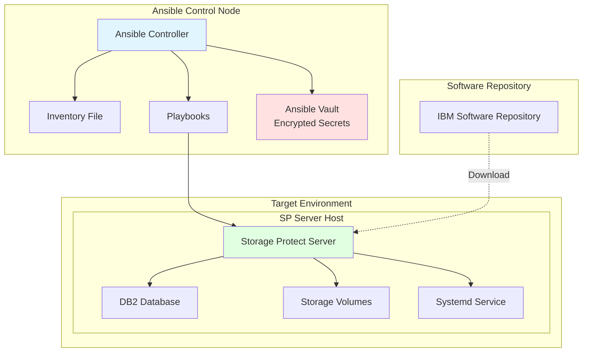
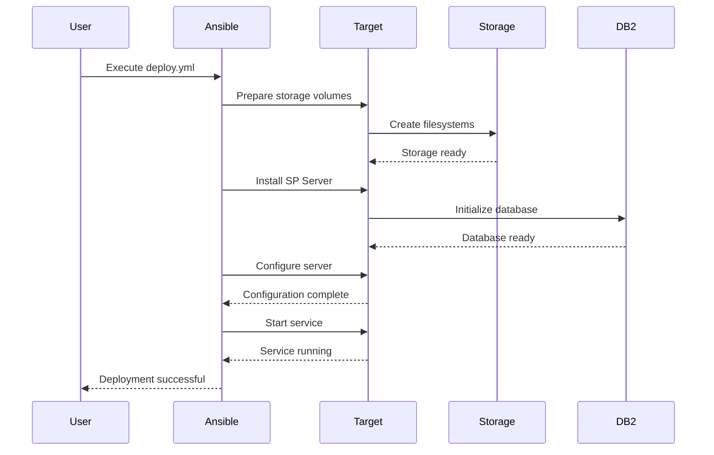
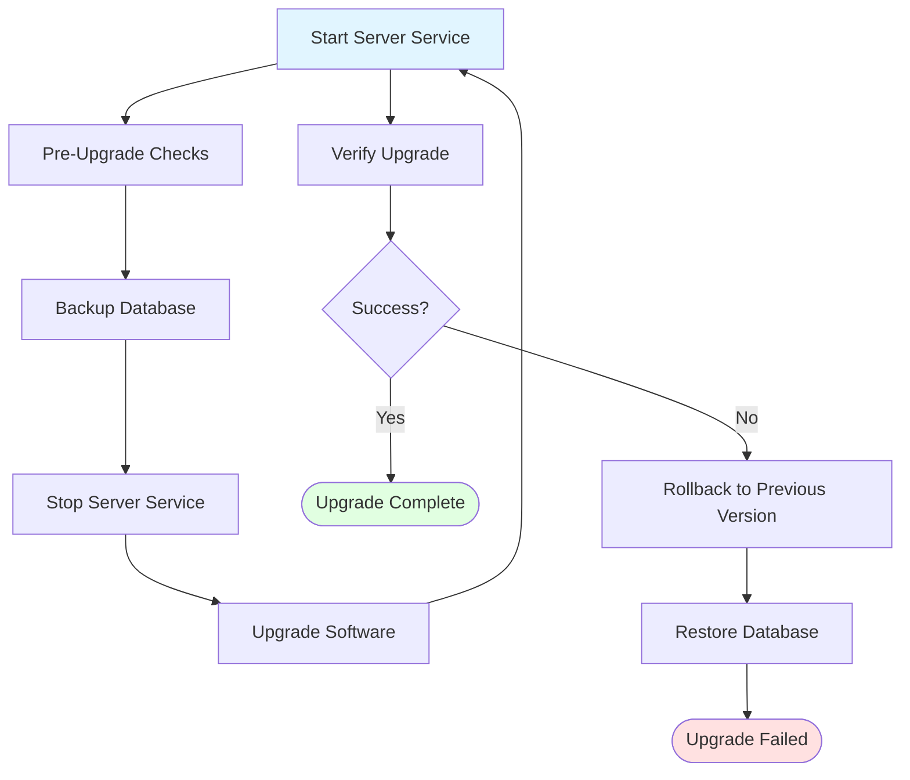

# IBM Storage Protect Server Lifecycle Management - User Guide

## Table of Contents
1. [Overview](#overview)
2. [Prerequisites](#prerequisites)
3. [Solution Architecture](#solution-architecture)
4. [Operations Guide](#operations-guide)
5. [Configuration Reference](#configuration-reference)
6. [Troubleshooting](#troubleshooting)
7. [Best Practices](#best-practices)

## Overview

### Purpose
This solution provides complete lifecycle management for IBM Storage Protect Server, including installation, configuration, monitoring, upgrade, and removal operations.

### Solution Components
- Storage Protect Server installation
- Storage volume preparation
- Server configuration
- Systemd service management
- Monitoring and health checks
- Version upgrades
- Complete uninstallation

### Supported Platforms
- Red Hat Enterprise Linux 7.x, 8.x, 9.x
- SUSE Linux Enterprise Server 12.x, 15.x
- Ubuntu 18.04, 20.04, 22.04

## Prerequisites

### Ansible Requirements

#### Ansible Version Compatibility
This collection has been tested against Ansible versions **>= 2.15.0**.

```bash
# Check Ansible version
ansible --version
# Required: ansible [core 2.15.0] or higher
```

#### Python Version
- **Control Node**: Python 3.8 or higher
- **Managed Nodes**: Python 3.9 or higher (required for some roles)

**Note**: Some Ansible collections (including BA client installation) require Python 3.9+ on remote hosts. If your target systems (e.g., RHEL 8) use an older Python version (like 3.6), use the `python_version_install.yml` playbook to automatically install Python 3.9+ from source.

```bash
# Install Python 3.9+ on managed nodes if needed
ansible-playbook ibm.storage_protect.python_version_install \
  -i inventory.ini \
  -e "target_hosts=sp_servers"
```

### IBM Storage Protect Requirements

#### Supported Versions
This collection supports IBM Storage Protect versions **>= 8.1.23**.

#### Required Components
- IBM Storage Protect Server installation packages
- IBM Installation Manager
- Valid IBM Storage Protect license
- Storage Protect Client (including dsmadmc CLI) must be pre-installed on target nodes

Refer to [IBM Documentation](https://www.ibm.com/docs/en/storage-protect/8.1.24) for detailed installation requirements.

### Collection Installation

#### Install from Ansible Galaxy

```bash
# Install the collection
ansible-galaxy collection install ibm.storage_protect

# Verify installation
ansible-galaxy collection list | grep ibm.storage_protect
```

#### Install from requirements.yml

```yaml
# requirements.yml
collections:
  - name: ibm.storage_protect
  - name: ansible.posix
```

```bash
# Install collections
ansible-galaxy collection install -r requirements.yml
```

#### Upgrade Collection

```bash
# Upgrade to latest version
ansible-galaxy collection install ibm.storage_protect --upgrade

# Install specific version
ansible-galaxy collection install ibm.storage_protect:==1.0.0
```

### Ansible Vault Setup

#### Create Encrypted Vault File

This repository uses **Ansible Vault** to securely store sensitive data such as credentials and file paths.

```bash
# Create new vault file
ansible-vault create vars/vault.yml
```

Add your sensitive variables:

```yaml
# vars/vault.yml (before encryption)
---
storage_protect_username: admin
storage_protect_password: "SecureAdminPass123!"
sp_server_admin_password: "ServerAdminPass456!"
sp_db_password: "DB2Password789!"
sp_license_key: "XXXX-XXXX-XXXX-XXXX"
```

#### Encrypt Vault File

```bash
# Encrypt the vault file
ansible-vault encrypt vars/vault.yml

# You'll be prompted for a vault password
# Store this password securely!
```

#### Create Vault Password File

```bash
# Create vault password file (DO NOT COMMIT TO GIT)
echo "your-vault-password" > vault_pass.txt
chmod 600 vault_pass.txt

# Add to .gitignore
echo "vault_pass.txt" >> .gitignore
```

#### Vault Operations

```bash
# View encrypted vault
ansible-vault view vars/vault.yml

# Edit encrypted vault
ansible-vault edit vars/vault.yml

# Decrypt vault (temporary)
ansible-vault decrypt vars/vault.yml

# Re-encrypt vault
ansible-vault encrypt vars/vault.yml
```

#### Using Vault in Playbooks

```yaml
# playbook.yml
- name: Deploy SP Server
  hosts: sp_servers
  become: true
  vars_files:
    - vars/vault.yml  # Load encrypted variables
  roles:
    - role: ibm.storage_protect.sp_server_install
      vars:
        sp_admin_password: "{{ storage_protect_password }}"
```

```bash
# Run playbook with vault password
ansible-playbook playbook.yml --vault-password-file vault_pass.txt

# Or prompt for password
ansible-playbook playbook.yml --ask-vault-pass
```

### System Requirements

#### Hardware Requirements
| Server Size | CPU Cores | RAM | Storage |
|-------------|-----------|-----|---------|
| XSmall | 2 | 8 GB | 100 GB |
| Small | 4 | 16 GB | 500 GB |
| Medium | 8 | 32 GB | 2 TB |
| Large | 16 | 64 GB | 10 TB |

#### Software Requirements
- Python 3.9 or higher (managed nodes)
- Ansible >= 2.15.0 (control node)
- IBM Installation Manager
- Valid IBM Storage Protect license (>= 8.1.23)

### Network Requirements
- Port 1500: TCP/IP communication
- Port 1543: Administrative console (HTTPS)
- Firewall rules configured for client access

### Permissions
- Root or sudo access on target hosts
- Access to IBM software repository
- Valid credentials for IBM Passport Advantage

### GitHub Actions Integration (Optional)

#### Storing Vault Password in GitHub Secrets

```yaml
# .github/workflows/deploy-sp-server.yml
name: Deploy SP Server

on:
  push:
    branches: [main]

jobs:
  deploy:
    runs-on: self-hosted
    
    steps:
      - name: Checkout Code
        uses: actions/checkout@v4
      
      - name: Set up Python and Ansible
        run: |
          python3 -m venv venv
          source venv/bin/activate
          pip install --upgrade pip
          pip install ansible
      
      - name: Install Ansible Collections
        run: |
          ansible-galaxy collection install ibm.storage_protect ansible.posix
      
      - name: Write Vault Password
        run: echo "$VAULT_PASSWORD" > vault_pass.txt
        env:
          VAULT_PASSWORD: ${{ secrets.VAULT_PASSWORD }}
      
      - name: Deploy SP Server
        run: |
          ansible-playbook -i inventory.yml playbooks/deploy.yml \
            --vault-password-file vault_pass.txt
```

### Best Practices for Vault Security

1. **Never commit `vault_pass.txt`** to the repository
2. Store vault passwords securely using GitHub Secrets or a secrets manager
3. Use separate vault files per environment (e.g., `dev/vault.yml`, `prod/vault.yml`)
4. Rotate vault passwords regularly
5. Validate playbooks with dry runs before production deployments
6. Use `ansible-vault rekey` to change vault passwords periodically

```bash
# Rekey vault with new password
ansible-vault rekey vars/vault.yml
```

## Solution Architecture

### Deployment Architecture



### Component Interaction



## Operations Guide

### 1. Complete Deployment (End-to-End)

#### Purpose
Performs complete Storage Protect Server deployment from scratch, including storage preparation, installation, configuration, and service setup.

#### Prerequisites Checklist
- [ ] Target host meets hardware requirements
- [ ] Network connectivity verified
- [ ] Software repository accessible
- [ ] Ansible Vault password available
- [ ] Inventory file configured

#### Step-by-Step Procedure

**Step 1: Prepare Inventory File**

Create `inventory.ini`:
```ini
[sp_servers]
sp-server-01 ansible_host=192.168.1.10 ansible_user=root

[sp_servers:vars]
ansible_python_interpreter=/usr/bin/python3
```

**Step 2: Create Environment Variables File**

Create `vars/prod.yml`:
```yaml
---
# Environment Configuration
environment: prod
target_hosts: sp_servers

# Server Configuration
sp_server_version: "8.1.23"
sp_server_state: present
sp_server_bin_repo: "/repository/sp-server/8.1.23"

# Instance Configuration
instance_user: tsminst1
instance_dir: /tsminst1
service_name: tsminst1

# Storage Configuration
storage_size: medium  # xsmall, small, medium, large

# Network Configuration
server_tcp_port: 1500
admin_port: 1543
```

**Step 3: Create Encrypted Secrets File**

```bash
# Create encrypted secrets file
ansible-vault create vars/secrets.yml
```

Add content:
```yaml
---
# SSL Configuration
ssl_password: "YourSecurePassword@@123"

# Database Credentials
db2_password: "DB2Password@@456"

# Admin Credentials
admin_password: "AdminPassword@@789"
```

**Step 4: Execute Deployment**

```bash
ansible-playbook solutions/sp-server-lifecycle/deploy.yml \
  -i inventory.ini \
  -e @vars/prod.yml \
  -e @vars/secrets.yml \
  --ask-vault-pass
```

**Step 5: Verify Deployment**

```bash
# Check service status
ansible sp_servers -i inventory.ini -m shell \
  -a "systemctl status tsminst1"

# Verify server version
ansible sp_servers -i inventory.ini -m shell \
  -a "dsmadmc -id=admin -pa=admin 'q status'"
```

#### Expected Output

```
PLAY [Complete SP Server Deployment] *******************************************

TASK [Phase 1 - Prepare Storage] ***********************************************
changed: [sp-server-01]

TASK [Phase 2 - Install SP Server] *********************************************
changed: [sp-server-01]

TASK [Phase 3 - Configure SP Server] *******************************************
changed: [sp-server-01]

TASK [Phase 4 - Setup Systemd Service] *****************************************
changed: [sp-server-01]

TASK [Phase 5 - Verify Installation] *******************************************
ok: [sp-server-01]

PLAY RECAP *********************************************************************
sp-server-01               : ok=5    changed=4    unreachable=0    failed=0
```

#### Rollback Procedure

If deployment fails:

```bash
# Execute uninstall playbook
ansible-playbook solutions/sp-server-lifecycle/uninstall.yml \
  -i inventory.ini \
  -e @vars/prod.yml \
  --ask-vault-pass

# Clean up storage
ansible-playbook shared/storage-management/cleanup.yml \
  -i inventory.ini \
  -e "instance_dir=/tsminst1" \
  -e "clean_up=true"
```

---

### 2. Installation Only

#### Purpose
Installs Storage Protect Server software without storage preparation or configuration.

#### When to Use
- Storage already prepared
- Manual configuration preferred
- Upgrade from existing installation

#### Command

```bash
ansible-playbook solutions/sp-server-lifecycle/install.yml \
  -i inventory.ini \
  -e @vars/prod.yml \
  -e @vars/secrets.yml \
  --ask-vault-pass
```

#### Parameters

| Parameter | Required | Default | Description |
|-----------|----------|---------|-------------|
| `sp_server_version` | Yes | - | Version to install (e.g., "8.1.23") |
| `sp_server_bin_repo` | Yes | - | Path to installation binaries |
| `ssl_password` | Yes | - | SSL certificate password |
| `target_hosts` | No | all | Target host group |

#### Post-Installation Steps

1. Verify installation:
```bash
ansible sp_servers -i inventory.ini -m shell \
  -a "/opt/tivoli/tsm/server/bin/dsmserv version"
```

2. Check installation logs:
```bash
ansible sp_servers -i inventory.ini -m shell \
  -a "tail -50 /tmp/sp_server_install.log"
```

---

### 3. Configuration Only

#### Purpose
Configures an already installed Storage Protect Server.

#### Prerequisites
- Storage Protect Server installed
- Storage volumes prepared
- Instance directory created

#### Command

```bash
ansible-playbook solutions/sp-server-lifecycle/configure.yml \
  -i inventory.ini \
  -e @vars/prod.yml \
  -e @vars/secrets.yml \
  --ask-vault-pass
```

#### Configuration Options

Create `vars/server-config.yml`:
```yaml
---
# Server Options
server_name: SERVER1
tcp_port: 1500
admin_port: 1543

# Database Options
db_backup_trigger: 80
db_backup_period: 1

# Storage Pools
storage_pools:
  - name: DISKPOOL
    type: disk
    maxsize: 500G
  - name: TAPEPOOL
    type: tape
    device: /dev/st0

# Policy Configuration
policy_domains:
  - name: STANDARD
    description: "Standard backup policy"
```

Execute with configuration:
```bash
ansible-playbook solutions/sp-server-lifecycle/configure.yml \
  -i inventory.ini \
  -e @vars/prod.yml \
  -e @vars/server-config.yml \
  -e @vars/secrets.yml \
  --ask-vault-pass
```

---

### 4. Monitoring and Health Checks

#### Purpose
Gathers server facts, status, and health information.

#### Command

```bash
ansible-playbook solutions/sp-server-lifecycle/monitor.yml \
  -i inventory.ini \
  -e @vars/prod.yml \
  --ask-vault-pass
```

#### Collected Information

- Server version and build
- Database status and size
- Storage pool utilization
- Active sessions
- Recent activity log entries
- System resource usage

#### Output Example

```json
{
  "sp_server_facts": {
    "version": "8.1.23.0",
    "server_name": "SERVER1",
    "platform": "LINUX86",
    "database": {
      "total_space": "500 GB",
      "used_space": "250 GB",
      "utilization": "50%"
    },
    "storage_pools": [
      {
        "name": "DISKPOOL",
        "type": "DISK",
        "capacity": "1000 GB",
        "used": "600 GB"
      }
    ],
    "active_sessions": 5,
    "service_status": "active"
  }
}
```

#### Automated Monitoring

Set up periodic monitoring with cron:

```bash
# Add to crontab
0 */6 * * * ansible-playbook /path/to/monitor.yml -i inventory.ini > /var/log/sp-monitor.log 2>&1
```

---

### 5. Server Upgrade

#### Purpose
Upgrades Storage Protect Server to a newer version.

#### Prerequisites
- Current server running and healthy
- Backup of server database completed
- New version binaries available
- Maintenance window scheduled

#### Pre-Upgrade Checklist
- [ ] Database backup completed
- [ ] Active sessions terminated
- [ ] Maintenance window communicated
- [ ] Rollback plan prepared
- [ ] New version tested in non-production

#### Command

```bash
ansible-playbook solutions/sp-server-lifecycle/upgrade.yml \
  -i inventory.ini \
  -e "sp_server_version=8.1.25" \
  -e "sp_server_bin_repo=/repository/sp-server/8.1.25" \
  -e @vars/prod.yml \
  -e @vars/secrets.yml \
  --ask-vault-pass
```

#### Upgrade Process



#### Post-Upgrade Verification

```bash
# Verify new version
ansible sp_servers -i inventory.ini -m shell \
  -a "dsmadmc -id=admin -pa=admin 'q status'"

# Check for errors
ansible sp_servers -i inventory.ini -m shell \
  -a "tail -100 /tsminst1/actlog/dsmserv.log | grep -i error"

# Test basic operations
ansible sp_servers -i inventory.ini -m shell \
  -a "dsmadmc -id=admin -pa=admin 'q session'"
```

---

### 6. Server Uninstallation

#### Purpose
Completely removes Storage Protect Server from target hosts.

#### Warning
⚠️ **This operation is destructive and irreversible!**
- All server data will be lost
- Client backups will become inaccessible
- Ensure proper backups before proceeding

#### Pre-Uninstall Checklist
- [ ] All data exported or backed up
- [ ] Clients notified and migrated
- [ ] Database backup completed
- [ ] Approval obtained
- [ ] Maintenance window scheduled

#### Command

```bash
ansible-playbook solutions/sp-server-lifecycle/uninstall.yml \
  -i inventory.ini \
  -e @vars/prod.yml \
  -e @vars/secrets.yml \
  --ask-vault-pass \
  --extra-vars "confirm_uninstall=yes"
```

#### Uninstall Process

1. Stop all client sessions
2. Stop server service
3. Remove systemd service
4. Uninstall server software
5. Remove instance directory
6. Clean up storage volumes (optional)

#### Complete Cleanup

To also remove storage volumes:

```bash
ansible-playbook solutions/sp-server-lifecycle/uninstall.yml \
  -i inventory.ini \
  -e @vars/prod.yml \
  -e "clean_up_storage=true" \
  --ask-vault-pass \
  --extra-vars "confirm_uninstall=yes"
```

---

## Configuration Reference

### Environment Variables Files

#### Development Environment (`vars/dev.yml`)
```yaml
---
environment: dev
target_hosts: dev_sp_servers
sp_server_version: "8.1.23"
storage_size: xsmall
instance_user: tsminst1
instance_dir: /tsminst1
server_tcp_port: 1500
```

#### Test Environment (`vars/test.yml`)
```yaml
---
environment: test
target_hosts: test_sp_servers
sp_server_version: "8.1.23"
storage_size: small
instance_user: tsminst1
instance_dir: /tsminst1
server_tcp_port: 1500
```

#### Production Environment (`vars/prod.yml`)
```yaml
---
environment: prod
target_hosts: prod_sp_servers
sp_server_version: "8.1.23"
storage_size: large
instance_user: tsminst1
instance_dir: /tsminst1
server_tcp_port: 1500
admin_port: 1543
enable_ssl: true
```

### Secrets File (`vars/secrets.yml`)

```yaml
---
# Encrypt with: ansible-vault encrypt vars/secrets.yml

# SSL Configuration
ssl_password: "YourSecureSSLPassword@@123"
ssl_key_size: 2048

# Database Credentials
db2_instance_password: "DB2Password@@456"
db2_fenced_password: "FencedPassword@@789"

# Server Admin Credentials
admin_password: "AdminPassword@@012"

# License Information
license_key: "XXXX-XXXX-XXXX-XXXX"
```

### Storage Size Configurations

#### XSmall Configuration
```yaml
storage_size: xsmall
storage_volumes:
  - mount_point: /tsminst1
    size: 100G
  - mount_point: /tsminst1/db
    size: 50G
  - mount_point: /tsminst1/archlog
    size: 20G
```

#### Small Configuration
```yaml
storage_size: small
storage_volumes:
  - mount_point: /tsminst1
    size: 500G
  - mount_point: /tsminst1/db
    size: 200G
  - mount_point: /tsminst1/archlog
    size: 100G
```

#### Medium Configuration
```yaml
storage_size: medium
storage_volumes:
  - mount_point: /tsminst1
    size: 2T
  - mount_point: /tsminst1/db
    size: 500G
  - mount_point: /tsminst1/archlog
    size: 200G
```

#### Large Configuration
```yaml
storage_size: large
storage_volumes:
  - mount_point: /tsminst1
    size: 10T
  - mount_point: /tsminst1/db
    size: 2T
  - mount_point: /tsminst1/archlog
    size: 500G
```

## Troubleshooting

### Common Issues and Solutions

#### Issue 1: Installation Fails - Repository Not Accessible

**Symptoms:**
```
TASK [Install SP Server] *******************************************************
fatal: [sp-server-01]: FAILED! => {"msg": "Repository path not accessible"}
```

**Solution:**
```bash
# Verify repository path
ls -la /repository/sp-server/8.1.23

# Check permissions
chmod -R 755 /repository/sp-server/8.1.23

# Verify network connectivity
ansible sp_servers -i inventory.ini -m ping
```

#### Issue 2: Service Fails to Start

**Symptoms:**
```
systemctl status tsminst1
● tsminst1.service - IBM Storage Protect Server
   Loaded: loaded
   Active: failed
```

**Solution:**
```bash
# Check server logs
tail -100 /tsminst1/actlog/dsmserv.log

# Verify database
su - tsminst1
db2 list applications

# Check port availability
netstat -tuln | grep 1500

# Restart service
systemctl restart tsminst1
```

#### Issue 3: Database Initialization Fails

**Symptoms:**
```
ANR0162W Database initialization failed
```

**Solution:**
```bash
# Check DB2 status
su - tsminst1
db2 get dbm cfg

# Verify storage space
df -h /tsminst1/db

# Check DB2 logs
cat /home/tsminst1/sqllib/db2dump/db2diag.log

# Reinitialize if needed
dsmserv format dbdir=/tsminst1/db
```

#### Issue 4: Upgrade Fails Midway

**Symptoms:**
```
TASK [Upgrade Software] ********************************************************
fatal: [sp-server-01]: FAILED! => {"msg": "Upgrade process interrupted"}
```

**Solution:**
```bash
# Check current version
dsmadmc -id=admin -pa=admin 'q status'

# Review upgrade log
tail -200 /tmp/sp_server_upgrade.log

# Rollback if necessary
ansible-playbook solutions/sp-server-lifecycle/install.yml \
  -i inventory.ini \
  -e "sp_server_version=8.1.23" \
  -e "sp_server_state=present" \
  --ask-vault-pass

# Restore database backup
db2 restore database tsmdb1 from /backup/path
```

### Diagnostic Commands

```bash
# Check server status
dsmadmc -id=admin -pa=admin 'q status'

# View active sessions
dsmadmc -id=admin -pa=admin 'q session'

# Check database space
dsmadmc -id=admin -pa=admin 'q db'

# View storage pools
dsmadmc -id=admin -pa=admin 'q stgpool'

# Check activity log
dsmadmc -id=admin -pa=admin 'q actlog begind=today'

# System resource usage
top -b -n 1 | head -20
df -h
free -h
```

### Log File Locations

| Log File | Location | Purpose |
|----------|----------|---------|
| Activity Log | `/tsminst1/actlog/dsmserv.log` | Server operations |
| DB2 Diagnostic | `/home/tsminst1/sqllib/db2dump/db2diag.log` | Database issues |
| Installation Log | `/tmp/sp_server_install.log` | Installation details |
| Ansible Log | `/var/log/ansible.log` | Playbook execution |

## Best Practices

### 1. Pre-Deployment Planning

- **Capacity Planning**: Size storage based on expected data growth
- **Network Design**: Ensure adequate bandwidth for client connections
- **Backup Strategy**: Plan for server database backups
- **Disaster Recovery**: Document recovery procedures

### 2. Security Hardening

```yaml
# Recommended security settings
security_settings:
  enable_ssl: true
  ssl_protocol: TLSv1.2
  password_policy:
    min_length: 12
    complexity: high
    expiration_days: 90
  session_timeout: 30
  max_failed_logins: 3
```

### 3. Performance Optimization

```yaml
# Performance tuning
performance_settings:
  db_buffer_pool: 32768  # MB
  max_sessions: 100
  tcp_window_size: 262144
  compression: yes
  deduplication: yes
```

### 4. Monitoring and Alerting

Set up automated monitoring:

```bash
# Create monitoring script
cat > /usr/local/bin/sp-monitor.sh << 'EOF'
#!/bin/bash
ansible-playbook /path/to/monitor.yml -i /path/to/inventory.ini
if [ $? -ne 0 ]; then
  echo "SP Server monitoring failed" | mail -s "Alert: SP Server" admin@example.com
fi
EOF

chmod +x /usr/local/bin/sp-monitor.sh

# Add to cron
echo "0 */6 * * * /usr/local/bin/sp-monitor.sh" | crontab -
```

### 5. Backup and Recovery

```bash
# Automated database backup
cat > /usr/local/bin/sp-db-backup.sh << 'EOF'
#!/bin/bash
BACKUP_DIR=/backup/sp-server
DATE=$(date +%Y%m%d)
su - tsminst1 -c "db2 backup database tsmdb1 to $BACKUP_DIR"
find $BACKUP_DIR -name "*.001" -mtime +7 -delete
EOF

chmod +x /usr/local/bin/sp-db-backup.sh

# Schedule daily backups
echo "0 2 * * * /usr/local/bin/sp-db-backup.sh" | crontab -
```

### 6. Change Management

- **Version Control**: Store all playbooks and variables in Git
- **Testing**: Test all changes in non-production first
- **Documentation**: Document all customizations
- **Approval Process**: Require approval for production changes

### 7. Maintenance Windows

Schedule regular maintenance:

```yaml
# Maintenance schedule
maintenance_windows:
  - day: Sunday
    time: "02:00-06:00"
    activities:
      - database_backup
      - log_rotation
      - health_checks
  - day: First Saturday
    time: "00:00-08:00"
    activities:
      - system_updates
      - performance_tuning
```

## Additional Resources

### Documentation
- [IBM Storage Protect Documentation](https://www.ibm.com/docs/en/storage-protect)
- [Ansible Documentation](https://docs.ansible.com/)
- [Collection GitHub Repository](https://github.com/IBM/ansible-storage-protect)

### Support
- IBM Support Portal: https://www.ibm.com/support
- Community Forums: https://community.ibm.com/
- GitHub Issues: https://github.com/IBM/ansible-storage-protect/issues

### Training
- IBM Storage Protect Administration Course
- Ansible Automation Platform Training
- Red Hat Certified Specialist in Ansible Automation

---

**Document Version**: 1.0  
**Last Updated**: 2026-03-26  
**Maintained By**: IBM Storage Protect Ansible Team