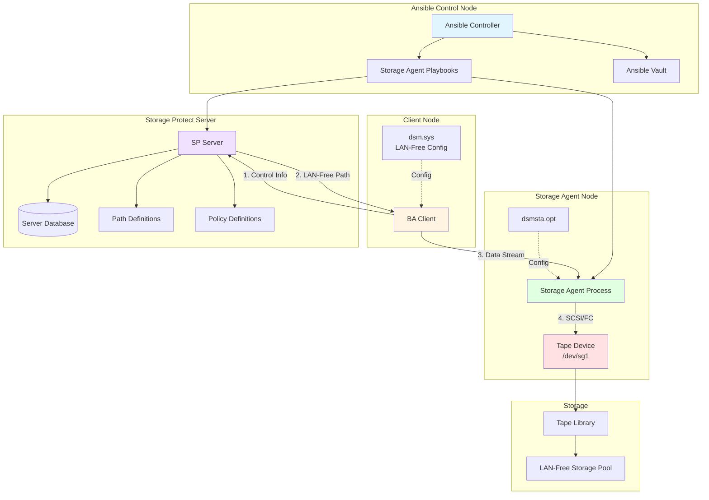
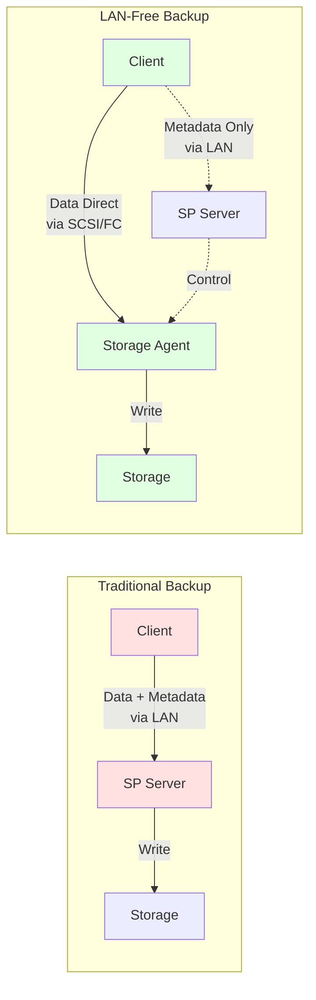
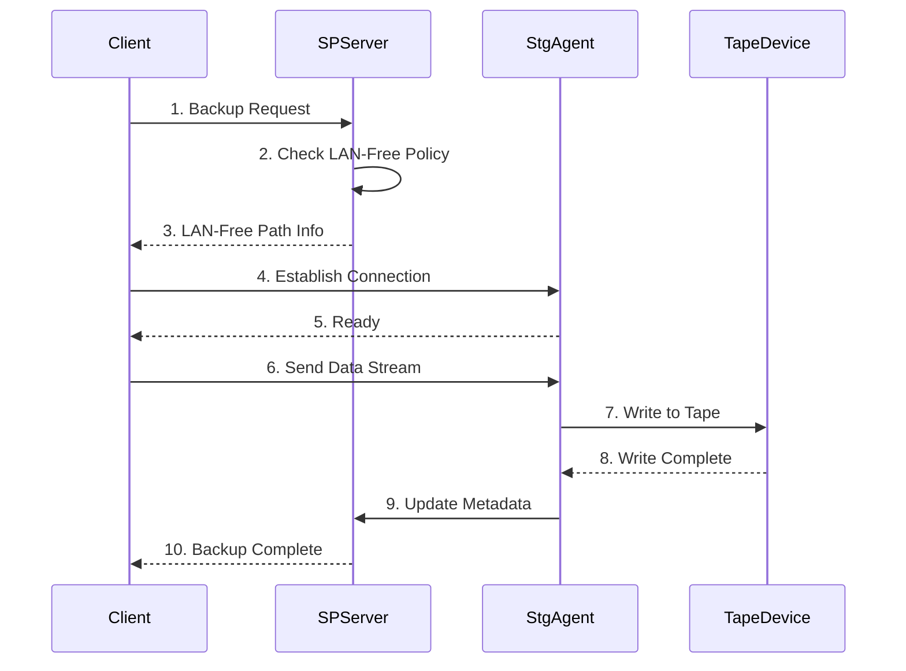
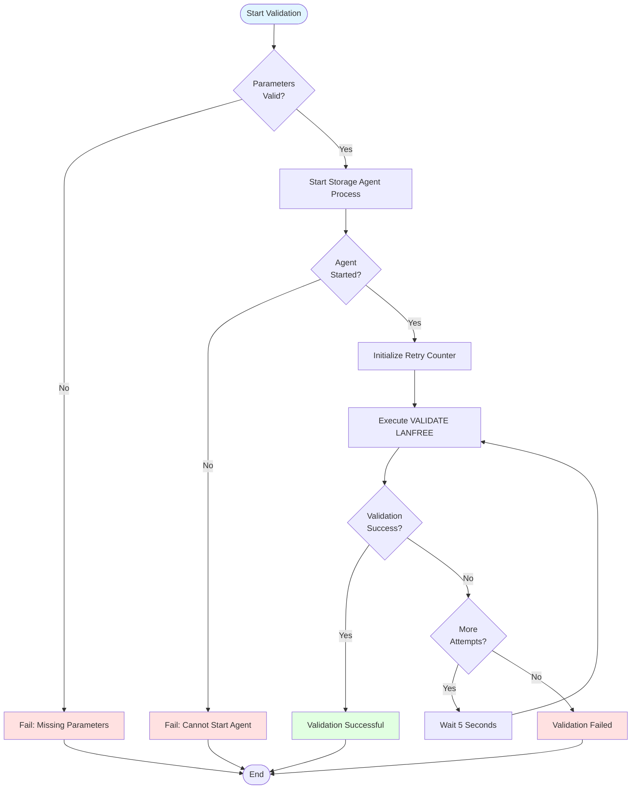

# IBM Storage Protect Storage Agent Lifecycle Management - User Guide

## Table of Contents
1. [Overview](#overview)
2. [Prerequisites](#prerequisites)
3. [Solution Architecture](#solution-architecture)
4. [Operations Guide](#operations-guide)
5. [Configuration Reference](#configuration-reference)
6. [Troubleshooting](#troubleshooting)
7. [Best Practices](#best-practices)

## Overview

### Purpose
This solution provides complete lifecycle management for IBM Storage Protect Storage Agent, enabling LAN-Free backup operations where data flows directly from client nodes to storage devices without traversing the Storage Protect server.

### What is LAN-Free Backup?

LAN-Free backup is a data protection architecture where:
- Client data bypasses the Storage Protect server's LAN
- Data flows directly from client to storage devices via SCSI or Fibre Channel
- Server handles only metadata and control information
- Significantly reduces network traffic and improves backup performance

### Solution Components
- Storage Agent installation verification
- Server-to-server communication setup
- SCSI path configuration
- LAN-Free policy configuration
- Copy group management
- Validation and testing

### Supported Platforms
- Red Hat Enterprise Linux 7.x, 8.x, 9.x
- SUSE Linux Enterprise Server 12.x, 15.x
- Ubuntu 18.04, 20.04, 22.04

## Prerequisites

### System Requirements

#### Hardware Requirements
| Component | Requirement |
|-----------|-------------|
| CPU | 2 cores minimum, 4 cores recommended |
| RAM | 4 GB minimum, 8 GB recommended |
| Disk Space | 2 GB for agent software |
| Storage Device | SCSI or FC tape library/drive |

#### Storage Hardware
- Tape library with SCSI or Fibre Channel interface
- Tape drives accessible from storage agent host
- Proper cabling and zoning configured
- Device drivers installed

### Software Requirements
- IBM Storage Protect Storage Agent installed
- IBM Storage Protect BA Client installed
- Storage Protect Server with LAN-Free capability
- Python 3.6+ (for Ansible)
- Ansible 2.9+

### Network Requirements
- Port 1500: Server TCP/IP communication
- Port 1502: LAN-Free data transfer (configurable)
- Direct network path between client and storage agent
- Firewall rules configured

### Storage Protect Server Requirements
- LAN-Free capable storage pool created
- Policy domain for LAN-Free backups defined
- Server-to-server communication enabled
- Sufficient tape resources available

### Permissions
- Root access on storage agent host
- Root access on client hosts
- Storage Protect admin credentials
- Device access permissions (e.g., /dev/sg*, /dev/st*)

## Solution Architecture

### LAN-Free Architecture Overview



### Data Flow: Traditional vs LAN-Free



### Component Communication



## Operations Guide

### 1. Complete Deployment (End-to-End)

#### Purpose
Performs complete Storage Agent configuration including server definitions, path setup, policy configuration, and validation.

#### Prerequisites Checklist
- [ ] Storage Agent software installed
- [ ] BA Client installed on agent host
- [ ] Tape library accessible
- [ ] Device paths identified (e.g., /dev/sg1)
- [ ] Storage pool created on server
- [ ] Policy domain defined
- [ ] Network connectivity verified

#### Step-by-Step Procedure

**Step 1: Identify Storage Devices**

```bash
# List SCSI devices
lsscsi

# List tape devices
ls -l /dev/st* /dev/sg*

# Check device status
mt -f /dev/st0 status

# Verify device access
sg_inq /dev/sg1
```

**Step 2: Prepare Inventory File**

Create `inventory.ini`:
```ini
[storage_agent_nodes]
stg-agent-01 ansible_host=192.168.1.50 ansible_user=root

[sp_servers]
sp-server-01 ansible_host=192.168.1.10 ansible_user=root

[lanfree_clients]
client-01 ansible_host=192.168.1.20 ansible_user=root
client-02 ansible_host=192.168.1.21 ansible_user=root
```

**Step 3: Create Configuration Variables**

Create `vars/storage-agent-config.yml`:
```yaml
---
# Environment Configuration
environment: prod
target_hosts: storage_agent_nodes

# Storage Agent Configuration
stg_agent_name: "STGAGENT01"
stg_agent_password: "StgAgent@@123"
stg_agent_server_name: "SERVER1"
stg_agent_hl_add: "192.168.1.50"

# Network Configuration
lladdress: "1502"                    # LAN-Free port
server_tcp_port: "1500"              # Server port
server_hl_address: "192.168.1.10"    # Server IP

# SCSI Path Configuration
stg_agent_path_name: "DRV1"          # Path name
stg_agent_path_dest: "drive"         # drive or library
library: "TAPELIB01"                 # Library name
device: "/dev/sg1"                   # Device path

# Policy Configuration
copygroup_domain: "LANFREEDOMAIN"
copygroup_policyset: "STANDARD"
copygroup_mngclass: "LANFREEMGMT"
copygroup_destination: "LANFREEPOOL"
stg_pool: "LANFREEPOOL"

# Client Configuration
node_name: "CLIENT01"
```

**Step 4: Create Encrypted Secrets**

```bash
ansible-vault create vars/secrets.yml
```

Content:
```yaml
---
# Server Admin Credentials
sp_server_username: admin
sp_server_password: "AdminPassword@@789"

# Storage Agent Password
stg_agent_password: "StgAgent@@123"

# Server-to-Server Password
server_password: "ServerPassword@@456"
```

**Step 5: Execute Deployment**

```bash
ansible-playbook solutions/storage-agent-lifecycle/deploy.yml \
  -i inventory.ini \
  -e @vars/storage-agent-config.yml \
  -e @vars/secrets.yml \
  --ask-vault-pass
```

**Step 6: Verify Deployment**

```bash
# Check storage agent process
ansible storage_agent_nodes -i inventory.ini -m shell \
  -a "ps aux | grep dsmsta"

# Verify server definition
ansible sp_servers -i inventory.ini -m shell \
  -a "dsmadmc -id=admin -pa=admin 'q server STGAGENT01'"

# Check SCSI path
ansible sp_servers -i inventory.ini -m shell \
  -a "dsmadmc -id=admin -pa=admin 'q path STGAGENT01 DRV1'"

# Verify policy
ansible sp_servers -i inventory.ini -m shell \
  -a "dsmadmc -id=admin -pa=admin 'q copygroup LANFREEDOMAIN STANDARD *'"
```

#### Expected Output

```
PLAY [Complete Storage Agent Deployment] **************************************

TASK [Phase 1 - Verify Prerequisites] *****************************************
ok: [stg-agent-01]

TASK [Phase 2 - Define Storage Agent on Server] *******************************
changed: [stg-agent-01]

TASK [Phase 3 - Define SCSI Path] *********************************************
changed: [stg-agent-01]

TASK [Phase 4 - Configure Copy Group] *****************************************
changed: [stg-agent-01]

TASK [Phase 5 - Setup Server Communication] ***********************************
changed: [stg-agent-01]

TASK [Phase 6 - Configure Local Files] ****************************************
changed: [stg-agent-01]

PLAY RECAP *********************************************************************
stg-agent-01               : ok=6    changed=5    unreachable=0    failed=0
```

---

### 2. Configuration Only

#### Purpose
Configures Storage Agent without validation, useful for initial setup or reconfiguration.

#### Command

```bash
ansible-playbook solutions/storage-agent-lifecycle/configure.yml \
  -i inventory.ini \
  -e @vars/storage-agent-config.yml \
  -e @vars/secrets.yml \
  --ask-vault-pass
```

#### Configuration Steps

The playbook performs these operations:

1. **Server Definition**
```sql
DEFINE SERVER STGAGENT01 
  SERVERPASSWORD=StgAgent@@123 
  HLADDRESS=192.168.1.50 
  LLADDRESS=1502 
  SSL=YES
```

2. **Path Definition**
```sql
DEFINE PATH STGAGENT01 DRV1 
  SRCTYPE=SERVER 
  DESTTYPE=DRIVE 
  LIBRARY=TAPELIB01 
  DEVICE=/dev/sg1
```

3. **Copy Group Definition**
```sql
DEFINE COPYGROUP LANFREEDOMAIN STANDARD LANFREEMGMT 
  TYPE=BACKUP 
  DESTINATION=LANFREEPOOL
```

4. **Policy Activation**
```sql
ACTIVATE POLICYSET LANFREEDOMAIN STANDARD
```

5. **Server Communication Setup**
```sql
SET SERVERNAME SERVER1
SET SERVERHLADDRESS 192.168.1.10
SET SERVERPASSWORD ServerPassword@@456
SET SERVERLLADDRESS 1502
```

6. **Local Configuration**
- Updates `dsmsta.opt` on storage agent
- Updates `dsm.sys` on client for LAN-Free

---

### 3. LAN-Free Validation

#### Purpose
Validates that LAN-Free backup path is correctly configured and operational.

#### Prerequisites
- Storage Agent configured
- Client configured for LAN-Free
- Storage Agent process running
- Node registered on server

#### Command

```bash
ansible-playbook solutions/storage-agent-lifecycle/validate.yml \
  -i inventory.ini \
  -e "validate_lan_free=true" \
  -e "node_name=CLIENT01" \
  -e "stg_agent_name=STGAGENT01" \
  -e "max_attempts=3" \
  -e @vars/secrets.yml \
  --ask-vault-pass
```

#### Validation Process



#### Validation Output

Successful validation:
```
ANR2017I Administrator ADMIN issued command: VALIDATE LANFREE CLIENT01 STGAGENT01
ANR2280I LAN-free data transfer is enabled for node CLIENT01.
ANR2281I Storage agent STGAGENT01 is available for LAN-free data transfer.
ANR2282I Path STGAGENT01 DRV1 is available for LAN-free data transfer.
ANR2283I LAN-free validation completed successfully.
```

Failed validation:
```
ANR2017I Administrator ADMIN issued command: VALIDATE LANFREE CLIENT01 STGAGENT01
ANR2284E LAN-free validation failed: Storage agent STGAGENT01 is not available.
ANR2285E Path STGAGENT01 DRV1 is not accessible.
```

#### Post-Validation Steps

If validation succeeds:
```bash
# Test actual backup
dsmc incremental /tmp/test -lanfree=yes

# Verify data went through storage agent
dsmadmc -id=admin -pa=admin "q actlog search=STGAGENT01"
```

If validation fails, see [Troubleshooting](#troubleshooting) section.

---

### 4. Multiple Path Configuration

#### Purpose
Configures multiple SCSI paths for load balancing and redundancy.

#### Configuration

Create `vars/multi-path-config.yml`:
```yaml
---
stg_agent_name: "STGAGENT01"
stg_agent_paths:
  - name: "DRV1"
    dest: "drive"
    device: "/dev/sg1"
  - name: "DRV2"
    dest: "drive"
    device: "/dev/sg2"
  - name: "DRV3"
    dest: "drive"
    device: "/dev/sg3"
library: "TAPELIB01"
```

#### Command

```bash
ansible-playbook solutions/storage-agent-lifecycle/configure-multi-path.yml \
  -i inventory.ini \
  -e @vars/multi-path-config.yml \
  -e @vars/secrets.yml \
  --ask-vault-pass
```

#### Verification

```bash
# List all paths
dsmadmc -id=admin -pa=admin "q path * * srctype=server"

# Check path status
dsmadmc -id=admin -pa=admin "q path STGAGENT01 * f=d"
```

---

### 5. Client Configuration for LAN-Free

#### Purpose
Configures BA Client to use LAN-Free backup path.

#### Client Configuration File (dsm.sys)

```ini
SErvername              SERVER1
   COMMmethod           TCPip
   TCPPort              1500
   TCPServeraddress     192.168.1.10
   NODename             CLIENT01
   
   # LAN-Free Configuration
   LANfreeCOMMmethod    tcpip
   ENablelanfree        yes
   LANfreetcpserveraddress  192.168.1.50
   LANfreetcpport       1502
```

#### Apply Configuration

```bash
ansible-playbook solutions/storage-agent-lifecycle/configure-client.yml \
  -i inventory.ini \
  -e "node_name=CLIENT01" \
  -e "stg_agent_hl_add=192.168.1.50" \
  -e "lladdress=1502" \
  --limit lanfree_clients
```

#### Test LAN-Free Backup

```bash
# Force LAN-Free backup
dsmc incremental /home -lanfree=yes

# Check if LAN-Free was used
dsmc query filespace -detail | grep "LAN-free"
```

---

## Configuration Reference

### dsmsta.opt Configuration

```ini
# /opt/tivoli/tsm/StorageAgent/bin/dsmsta.opt

SErvername           SERVER1
COMMmethod           TCPip
TCPPort              1500
SSLTCPPort           1500
SSLTCPadminPort      1502
DEVCONFIG            devconfig.txt
```

### dsm.sys Configuration (Client)

```ini
# /opt/tivoli/tsm/client/ba/bin/dsm.sys

SErvername              SERVER1
   COMMmethod           TCPip
   TCPPort              1500
   TCPServeraddress     192.168.1.10
   NODename             CLIENT01
   
   # LAN-Free Settings
   LANfreeCOMMmethod    tcpip
   ENablelanfree        yes
   LANfreetcpserveraddress  192.168.1.50
   LANfreetcpport       1502
   
   # Performance Tuning
   RESOURCEUTILIZATION  5
   TCPWINDOWSIZE        256
   TCPBUFFSIZE          256
```

### Server Configuration Commands

```sql
-- Define Storage Agent
DEFINE SERVER STGAGENT01 
  SERVERPASSWORD=password 
  HLADDRESS=192.168.1.50 
  LLADDRESS=1502 
  SSL=YES

-- Define SCSI Path
DEFINE PATH STGAGENT01 DRV1 
  SRCTYPE=SERVER 
  DESTTYPE=DRIVE 
  LIBRARY=TAPELIB01 
  DEVICE=/dev/sg1

-- Create LAN-Free Storage Pool
DEFINE STGPOOL LANFREEPOOL 
  POOLTYPE=PRIMARY 
  DEVCLASS=TAPECLASS

-- Define Copy Group
DEFINE COPYGROUP LANFREEDOMAIN STANDARD LANFREEMGMT 
  TYPE=BACKUP 
  DESTINATION=LANFREEPOOL 
  VEREXISTS=NOLIMIT 
  VERDELETED=30 
  RETEXTRA=30 
  RETONLY=60

-- Activate Policy
ACTIVATE POLICYSET LANFREEDOMAIN STANDARD

-- Assign Node to Domain
UPDATE NODE CLIENT01 DOMAIN=LANFREEDOMAIN

-- Enable Server-to-Server Communication
SET SERVERNAME SERVER1
SET SERVERHLADDRESS 192.168.1.10
SET SERVERPASSWORD password
SET SERVERLLADDRESS 1502
```

### Environment-Specific Configurations

#### Development Environment
```yaml
# vars/dev.yml
---
environment: dev
stg_agent_name: "DEVSTGAGENT"
stg_agent_hl_add: "192.168.10.50"
server_hl_address: "192.168.10.10"
library: "DEVTAPELIB"
device: "/dev/sg0"
stg_pool: "DEVLANFREEPOOL"
```

#### Production Environment
```yaml
# vars/prod.yml
---
environment: prod
stg_agent_name: "PRODSTGAGENT"
stg_agent_hl_add: "192.168.1.50"
server_hl_address: "192.168.1.10"
library: "PRODTAPELIB"
device: "/dev/sg1"
stg_pool: "PRODLANFREEPOOL"
# Multiple paths for redundancy
additional_paths:
  - name: "DRV2"
    device: "/dev/sg2"
  - name: "DRV3"
    device: "/dev/sg3"
```

## Troubleshooting

### Common Issues and Solutions

#### Issue 1: Storage Agent Process Won't Start

**Symptoms:**
```bash
$ ps aux | grep dsmsta
# No process found
```

**Solution:**
```bash
# Check dsmsta.opt configuration
cat /opt/tivoli/tsm/StorageAgent/bin/dsmsta.opt

# Verify server connectivity
ping 192.168.1.10
telnet 192.168.1.10 1500

# Check for port conflicts
netstat -tuln | grep 1502

# Start agent manually
cd /opt/tivoli/tsm/StorageAgent/bin
nohup ./dsmsta > dsmsta.log 2>&1 &

# Check log for errors
tail -100 dsmsta.log
```

#### Issue 2: VALIDATE LANFREE Fails

**Symptoms:**
```
ANR2284E LAN-free validation failed: Storage agent STGAGENT01 is not available.
```

**Solution:**
```bash
# 1. Verify storage agent is running
ps aux | grep dsmsta

# 2. Check server definition
dsmadmc -id=admin -pa=admin "q server STGAGENT01"

# 3. Verify path definition
dsmadmc -id=admin -pa=admin "q path STGAGENT01 * f=d"

# 4. Test agent connectivity
telnet 192.168.1.50 1502

# 5. Check agent log
tail -100 /opt/tivoli/tsm/StorageAgent/bin/dsmsta.log

# 6. Restart agent
pkill dsmsta
cd /opt/tivoli/tsm/StorageAgent/bin
nohup ./dsmsta > dsmsta.log 2>&1 &

# 7. Wait and retry validation
sleep 10
dsmadmc -id=admin -pa=admin "validate lanfree CLIENT01 STGAGENT01"
```

#### Issue 3: Device Not Accessible

**Symptoms:**
```
ANR2285E Path STGAGENT01 DRV1 is not accessible.
```

**Solution:**
```bash
# Check device exists
ls -l /dev/sg1

# Verify device permissions
ls -l /dev/sg* /dev/st*

# Check device status
mt -f /dev/st0 status

# Test device access
sg_inq /dev/sg1

# Check for device errors
dmesg | grep -i scsi
dmesg | grep -i tape

# Verify device driver
lsmod | grep st
lsmod | grep sg

# Load drivers if needed
modprobe st
modprobe sg

# Check SCSI devices
lsscsi
lsscsi -g

# Test tape operations
mt -f /dev/st0 rewind
mt -f /dev/st0 status
```

#### Issue 4: Client Backup Not Using LAN-Free

**Symptoms:**
```bash
$ dsmc incremental /home
# Backup completes but doesn't use LAN-Free path
```

**Solution:**
```bash
# 1. Check client configuration
cat /opt/tivoli/tsm/client/ba/bin/dsm.sys | grep -i lanfree

# 2. Verify LAN-Free is enabled
dsmc query option | grep -i lanfree

# 3. Check node domain assignment
dsmadmc -id=admin -pa=admin "q node CLIENT01 f=d"

# 4. Verify copy group destination
dsmadmc -id=admin -pa=admin "q copygroup LANFREEDOMAIN STANDARD * f=d"

# 5. Force LAN-Free backup
dsmc incremental /home -lanfree=yes

# 6. Check activity log
dsmadmc -id=admin -pa=admin "q actlog search=CLIENT01 search=lanfree"

# 7. Verify storage pool type
dsmadmc -id=admin -pa=admin "q stgpool LANFREEPOOL f=d"
```

#### Issue 5: Server-to-Server Communication Fails

**Symptoms:**
```
ANR2017E Server STGAGENT01 is not responding.
```

**Solution:**
```bash
# 1. Check server definition
dsmadmc -id=admin -pa=admin "q server STGAGENT01 f=d"

# 2. Verify server password
dsmadmc -id=admin -pa=admin "update server STGAGENT01 serverpassword=newpassword"

# 3. Check network connectivity
ping 192.168.1.50
telnet 192.168.1.50 1502

# 4. Verify firewall rules
iptables -L -n | grep 1502

# 5. Check SSL configuration
dsmadmc -id=admin -pa=admin "q server STGAGENT01" | grep SSL

# 6. Test server communication
dsmadmc -id=admin -pa=admin "ping server STGAGENT01"
```

### Diagnostic Commands

```bash
# Storage Agent Status
ps aux | grep dsmsta
netstat -tuln | grep 1502
tail -100 /opt/tivoli/tsm/StorageAgent/bin/dsmsta.log

# Server Definitions
dsmadmc -id=admin -pa=admin "q server * f=d"
dsmadmc -id=admin -pa=admin "q path * * srctype=server f=d"

# Policy Configuration
dsmadmc -id=admin -pa=admin "q domain LANFREEDOMAIN f=d"
dsmadmc -id=admin -pa=admin "q policyset LANFREEDOMAIN * f=d"
dsmadmc -id=admin -pa=admin "q copygroup LANFREEDOMAIN STANDARD * f=d"

# Storage Pool Status
dsmadmc -id=admin -pa=admin "q stgpool LANFREEPOOL f=d"
dsmadmc -id=admin -pa=admin "q path * * desttype=drive"

# Device Status
lsscsi
lsscsi -g
mt -f /dev/st0 status
sg_inq /dev/sg1

# Client Configuration
cat /opt/tivoli/tsm/client/ba/bin/dsm.sys | grep -i lanfree
dsmc query option | grep -i lanfree

# Activity Log
dsmadmc -id=admin -pa=admin "q actlog begind=today search=lanfree"
dsmadmc -id=admin -pa=admin "q actlog begind=today search=STGAGENT01"
```

### Log File Locations

| Log File | Location | Purpose |
|----------|----------|---------|
| Storage Agent Log | `/opt/tivoli/tsm/StorageAgent/bin/dsmsta.log` | Agent operations |
| Client Error Log | `/var/log/tsm/dsmerror.log` | Client errors |
| Server Activity Log | Server actlog | Server operations |
| System Log | `/var/log/messages` | System events |

## Best Practices

### 1. Capacity Planning

```yaml
# Calculate required resources
capacity_planning:
  # Tape drives needed
  drives_needed: "concurrent_backups / drives_per_agent"
  
  # Network bandwidth (LAN-Free port)
  bandwidth_required: "backup_data_size / backup_window"
  
  # Storage agent resources
  cpu_cores: 2-4
  memory_gb: 4-8
  
  # Tape library capacity
  tape_slots: "retention_days * daily_backup_size / tape_capacity"
```

### 2. High Availability Configuration

```yaml
# Multiple storage agents for redundancy
ha_configuration:
  primary_agent:
    name: "STGAGENT01"
    address: "192.168.1.50"
    paths: ["DRV1", "DRV2"]
  
  secondary_agent:
    name: "STGAGENT02"
    address: "192.168.1.51"
    paths: ["DRV3", "DRV4"]
  
  failover_policy:
    automatic: true
    retry_attempts: 3
    retry_delay: 60
```

### 3. Performance Tuning

```yaml
# Optimize LAN-Free performance
performance_tuning:
  # Client settings
  client:
    resourceutilization: 5
    tcpwindowsize: 256
    tcpbuffsize: 256
    txnbytelimit: 25600
  
  # Storage agent settings
  agent:
    max_sessions: 10
    buffer_size: 512
  
  # Tape drive settings
  tape:
    block_size: 262144
    compression: hardware
```

### 4. Monitoring and Alerting

```bash
# Create monitoring script
cat > /usr/local/bin/monitor-storage-agent.sh << 'EOF'
#!/bin/bash

# Check agent process
if ! pgrep -f dsmsta > /dev/null; then
  echo "Storage Agent not running" | mail -s "Alert: Storage Agent Down" admin@example.com
  exit 1
fi

# Check path availability
PATHS=$(dsmadmc -id=admin -pa=admin -comma "q path * * srctype=server" | grep -c "STGAGENT")
if [ $PATHS -eq 0 ]; then
  echo "No paths available" | mail -s "Alert: No Storage Agent Paths" admin@example.com
  exit 1
fi

# Check tape library
DRIVES=$(dsmadmc -id=admin -pa=admin -comma "q drive * *" | grep -c "ONLINE")
if [ $DRIVES -eq 0 ]; then
  echo "No drives online" | mail -s "Alert: No Tape Drives Online" admin@example.com
  exit 1
fi

echo "Storage Agent monitoring: OK"
EOF

chmod +x /usr/local/bin/monitor-storage-agent.sh

# Schedule monitoring
echo "*/15 * * * * /usr/local/bin/monitor-storage-agent.sh" | crontab -
```

### 5. Backup Verification

```bash
# Verify LAN-Free backups
cat > /usr/local/bin/verify-lanfree-backups.sh << 'EOF'
#!/bin/bash

# Get list of LAN-Free clients
CLIENTS=$(dsmadmc -id=admin -pa=admin -comma "q node * domain=LANFREEDOMAIN" | cut -d, -f1)

for CLIENT in $CLIENTS; do
  # Check last backup
  LAST_BACKUP=$(dsmadmc -id=admin -pa=admin -comma "q event * * node=$CLIENT" | head -1)
  
  # Verify LAN-Free was used
  LANFREE=$(dsmadmc -id=admin -pa=admin "q actlog search=$CLIENT search=lanfree begind=today" | grep -c "LAN-free")
  
  if [ $LANFREE -eq 0 ]; then
    echo "Client $CLIENT did not use LAN-Free" | mail -s "Warning: LAN-Free Not Used" admin@example.com
  fi
done
EOF

chmod +x /usr/local/bin/verify-lanfree-backups.sh

# Schedule daily verification
echo "0 8 * * * /usr/local/bin/verify-lanfree-backups.sh" | crontab -
```

### 6. Disaster Recovery

```markdown
# Storage Agent Recovery Procedure

1. **Reinstall Storage Agent Software**
   - Install from repository
   - Verify installation

2. **Restore Configuration Files**
   - Restore dsmsta.opt from backup
   - Verify server connectivity

3. **Reconfigure on Server**
   ```sql
   DEFINE SERVER STGAGENT01 ...
   DEFINE PATH STGAGENT01 DRV1 ...
   ```

4. **Verify Device Access**
   - Check device permissions
   - Test device operations

5. **Start Storage Agent**
   ```bash
   cd /opt/tivoli/tsm/StorageAgent/bin
   nohup ./dsmsta > dsmsta.log 2>&1 &
   ```

6. **Validate Configuration**
   ```sql
   VALIDATE LANFREE CLIENT01 STGAGENT01
   ```

7. **Test Backup**
   ```bash
   dsmc incremental /tmp/test -lanfree=yes
   ```
```

### 7. Security Hardening

```yaml
# Security best practices
security_hardening:
  # Use SSL for all communications
  ssl_enabled: true
  ssl_protocol: TLSv1.2
  
  # Strong passwords
  password_policy:
    min_length: 16
    complexity: high
    rotation_days: 90
  
  # Restrict device access
  device_permissions:
    owner: root
    group: tape
    mode: "0660"
  
  # Network security
  firewall_rules:
    - port: 1502
      source: "client_subnet"
      protocol: tcp
```

## Additional Resources

### Documentation
- [IBM Storage Protect Storage Agent Documentation](https://www.ibm.com/docs/en/storage-protect/8.1.x?topic=agent-storage-overview)
- [LAN-Free Data Movement](https://www.ibm.com/docs/en/storage-protect/8.1.x?topic=data-configuring-lan-free-movement)
- [SCSI Device Configuration](https://www.ibm.com/docs/en/storage-protect/8.1.x?topic=devices-configuring-scsi)

### Support
- IBM Support Portal: https://www.ibm.com/support
- Community Forums: https://community.ibm.com/
- GitHub Issues: https://github.com/IBM/ansible-storage-protect/issues

### Training
- IBM Storage Protect Advanced Administration
- SAN and Storage Networking
- Tape Library Management

---

**Document Version**: 1.0  
**Last Updated**: 2026-03-26  
**Maintained By**: IBM Storage Protect Ansible Team