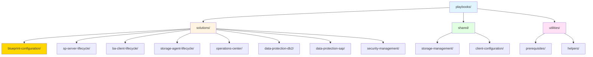
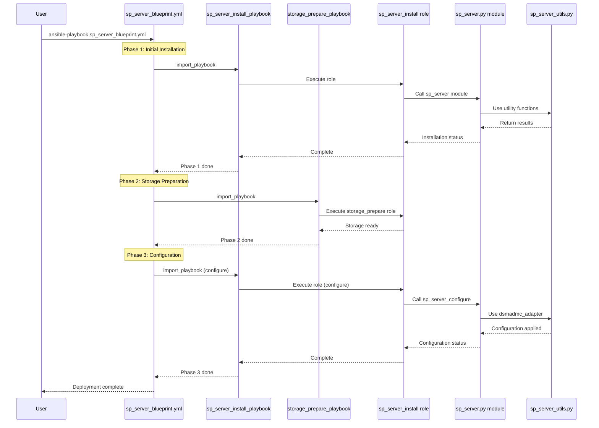
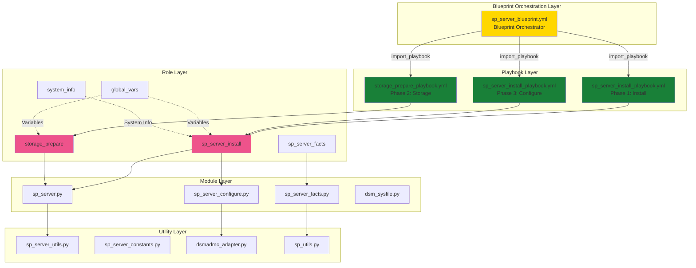
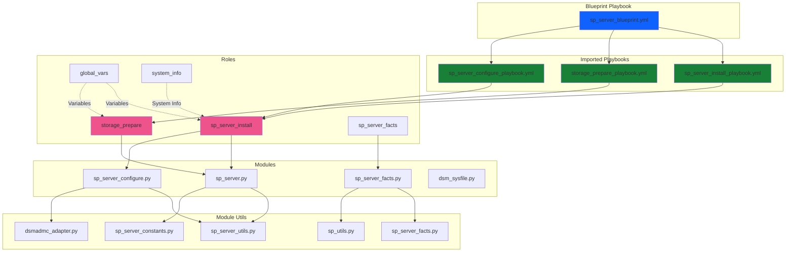

# IBM Storage Protect Ansible Playbooks Analysis

## Executive Summary

This document provides a comprehensive analysis of all playbooks in the IBM Storage Protect Ansible collection, including their current organization, functionality, and recommendations for reorganization into solution-based structures that follow end-to-end lifecycle management principles.

## Current Playbook Inventory

### Playbook Catalog

| # | Playbook Name | Location | Solution Area | Lifecycle Phase | Description |
|---|---------------|----------|---------------|-----------------|-------------|
| 1 | `sp_server_install_playbook.yml` | `playbooks/` | SP Server Management | Install | Installs IBM Storage Protect Server with specified version and configuration |
| 2 | `sp_server_configure_playbook.yml` | `playbooks/` | SP Server Management | Configure | Configures Storage Protect Server post-installation |
| 3 | `sp_server_uninstall_playbook.yml` | `playbooks/` | SP Server Management | Uninstall | Removes Storage Protect Server from target hosts |
| 4 | `sp_server_upgrade_playbook.yml` | `playbooks/` | SP Server Management | Upgrade | Upgrades Storage Protect Server to a newer version |
| 5 | `sp_server_facts_playbook.yml` | `playbooks/` | SP Server Management | Monitor | Gathers facts and status information from Storage Protect Server |
| 6 | `sp_server_blueprint.yml` | `playbooks/` | SP Server Management | Deploy | End-to-end server deployment using blueprint approach |
| 7 | `server_config2_playbook.yml` | `playbooks/` | SP Server Management | Configure | Creates systemd service for SP Server instance |
| 8 | `storage_prepare_playbook.yml` | `playbooks/` | Storage Management | Prepare | Prepares storage volumes for Storage Protect Server |
| 9 | `storage_cleanup_playbook.yml` | `playbooks/` | Storage Management | Cleanup | Cleans up storage volumes and instance directories |
| 10 | `ba_client_install_playbook.yml` | `playbooks/ba_client_install/playbooks/linux/` | BA Client Management | Install | Installs Backup-Archive client on Linux systems |
| 11 | `ba_client_uninstall_playbook.yml` | `playbooks/ba_client_install/playbooks/linux/` | BA Client Management | Uninstall | Uninstalls Backup-Archive client from Linux systems |
| 12 | `ba_client_install_playbook.yml` | `playbooks/ba_client_install/playbooks/windows/` | BA Client Management | Install | Installs Backup-Archive client on Windows systems |
| 13 | `ba_client_uninstall_playbook.yml` | `playbooks/ba_client_install/playbooks/windows/` | BA Client Management | Uninstall | Uninstalls Backup-Archive client from Windows systems |
| 14 | `storage_agent_configure_playbook.yml` | `playbooks/` | Storage Agent Management | Configure | Configures Storage Agent for LAN-Free backup operations |
| 15 | `oc_configure_playbook.yml` | `playbooks/` | Operations Center | Configure | Configures, starts, stops, or restarts Operations Center |
| 16 | `dp_db2_install_playbook.yml` | `playbooks/` | Data Protection - DB2 | Install | Installs and configures Data Protection for DB2 |
| 17 | `dp_db2_backup_playbook.yml` | `playbooks/` | Data Protection - DB2 | Backup | Performs DB2 database backup operations |
| 18 | `dp_db2_restore_playbook.yml` | `playbooks/` | Data Protection - DB2 | Restore | Restores DB2 database from Storage Protect backups |
| 19 | `dp_db2_query_playbook.yml` | `playbooks/` | Data Protection - DB2 | Query | Queries DB2 backup information from Storage Protect |
| 20 | `dp_db2_delete_playbook.yml` | `playbooks/` | Data Protection - DB2 | Delete | Deletes DB2 backup data from Storage Protect |
| 21 | `dsm_opt_playbook.yml` | `playbooks/` | Client Configuration | Configure | Configures dsm.opt parameters for clients |
| 22 | `cert_distribute.yml` | `playbooks/` | Security Management | Configure | Generates and distributes SSL certificates to clients |
| 23 | `python_version_install.yml` | `playbooks/` | Prerequisites | Install | Installs Python 3.9+ on various platforms (AIX, Linux, Windows) |
| 24 | `sperp_install_configure_hana.yml` | `playbooks/erp_install/` | Data Protection - SAP | Install | Installs and configures Data Protection for SAP HANA |

### Current Organization Issues

1. **Flat Structure**: Most playbooks are in the root `playbooks/` directory without logical grouping
2. **Inconsistent Naming**: Mix of naming conventions (e.g., `_playbook.yml` suffix not consistent)
3. **Scattered Related Playbooks**: Related lifecycle operations (install, configure, uninstall) are not grouped
4. **No Solution Context**: Playbooks lack README files explaining their role in end-to-end solutions
5. **Missing Security**: No consistent use of Ansible Vault for sensitive data
6. **Limited Parameterization**: Some playbooks have hardcoded values instead of parameters
7. **No Deployment Diagrams**: Missing visual representation of solution architectures

## Recommended Solution-Based Organization

### Solution Categories

Based on analysis, playbooks should be reorganized into the following solution categories:



**Note**: The **Blueprint Configuration Solution** is highlighted as it represents the orchestration pattern that can be applied across multiple solutions for complex, multi-phase deployments.

### Proposed Folder Structure

#### Current Implementation Example: SP Server Blueprint

The **SP Server Blueprint** (`playbooks/sp_server_blueprint.yml`) serves as a reference implementation of the proposed solution-based organization. It demonstrates how multiple playbooks, roles, modules, and utilities work together to deliver an end-to-end solution.

**Current Blueprint Structure:**
```
playbooks/
├── sp_server_blueprint.yml                      # Blueprint orchestrator (CURRENT)
├── sp_server_install_playbook.yml              # Installation playbook
├── sp_server_configure_playbook.yml            # Configuration playbook
├── storage_prepare_playbook.yml                # Storage preparation
└── sp_server/                                   # Legacy structure
    ├── playbook.yml
    ├── playbook_configure.yml
    └── vars/
        └── sp_server.yml

roles/
├── sp_server_install/                           # Primary role
│   ├── tasks/
│   │   ├── main.yml
│   │   ├── sp_server_install_linux.yml
│   │   ├── sp_server_configuration_linux.yml
│   │   ├── sp_server_prechecks_linux.yml
│   │   ├── sp_server_postchecks_linux.yml
│   │   ├── sp_server_uninstall_linux.yml
│   │   └── sp_server_clean_config.yml
│   ├── templates/
│   │   ├── sp_server_install_response.xml.j2
│   │   ├── sp_server_uninstall_response.xml.j2
│   │   ├── basics.j2
│   │   ├── policy.j2
│   │   ├── schedules.j2
│   │   ├── cntrpool.j2
│   │   └── cntrmaintenance.j2
│   └── vars/
│       └── main.yml
├── storage_prepare/                             # Storage management role
│   ├── tasks/
│   │   ├── main.yml
│   │   ├── storage_prepare_linux.yml
│   │   └── storage_cleanup_linux.yml
│   └── defaults/
│       └── main.yml
├── sp_server_facts/                             # Facts gathering role
│   ├── tasks/
│   │   └── main.yml
│   └── defaults/
│       └── main.yml
├── global_vars/                                 # Global variables
│   └── vars/
│       └── main.yml
└── system_info/                                 # System information
    └── tasks/
        └── main.yml

plugins/
├── modules/
│   ├── sp_server.py                            # Core server module
│   ├── sp_server_configure.py                 # Configuration module
│   ├── sp_server_facts.py                     # Facts module
│   └── dsm_sysfile.py                         # Client config module
└── module_utils/
    ├── sp_server_utils.py                      # Server utilities
    ├── sp_server_constants.py                 # Constants
    ├── sp_server_facts.py                     # Facts utilities
    ├── dsmadmc_adapter.py                     # CLI adapter
    └── sp_utils.py                            # General utilities
```

**Blueprint Execution Flow:**


#### Proposed Reorganized Structure

```
playbooks/
├── README.md                                    # Overview of all solutions
├── solutions/                                   # End-to-end solution playbooks
│   │
│   ├── blueprint-configuration/                # Blueprint Configuration Solution
│   │   ├── README.md                           # Blueprint orchestration documentation
│   │   ├── sp-server-blueprint.yml             # SP Server blueprint orchestrator (maps to sp_server_blueprint.yml)
│   │   ├── ba-client-blueprint.yml             # BA Client blueprint orchestrator (future)
│   │   ├── full-stack-blueprint.yml            # Full stack deployment blueprint (future)
│   │   ├── vars/
│   │   │   ├── sp-server-blueprint-vars.yml    # SP Server blueprint variables
│   │   │   ├── dev.yml                         # Development environment
│   │   │   ├── test.yml                        # Test environment
│   │   │   ├── prod.yml                        # Production environment
│   │   │   └── secrets.yml                     # Ansible Vault encrypted
│   │   ├── templates/
│   │   │   └── blueprint-architecture.md       # Blueprint pattern documentation
│   │   └── COMPONENTS.md                       # Component mapping documentation
│   │       # Documents:
│   │       # - Orchestrated Playbooks: sp_server_install_playbook, storage_prepare_playbook
│   │       # - Roles: sp_server_install, storage_prepare, sp_server_facts, global_vars, system_info
│   │       # - Modules: sp_server.py, sp_server_configure.py, sp_server_facts.py, dsm_sysfile.py
│   │       # - Module Utils: sp_server_utils.py, sp_server_constants.py, dsmadmc_adapter.py, sp_utils.py
│   │       # - Execution Flow: 3-phase deployment (install → storage → configure)
│   │
│   ├── sp-server-lifecycle/                    # Storage Protect Server lifecycle
│   │   ├── README.md                           # Solution documentation
│   │   ├── deploy.yml                          # Complete deployment
│   │   ├── install.yml                         # Installation only (maps to sp_server_install_playbook.yml)
│   │   ├── configure.yml                       # Configuration only (maps to sp_server_configure_playbook.yml)
│   │   ├── upgrade.yml                         # Upgrade operations (maps to sp_server_upgrade_playbook.yml)
│   │   ├── uninstall.yml                       # Removal operations (maps to sp_server_uninstall_playbook.yml)
│   │   ├── monitor.yml                         # Monitoring and facts (maps to sp_server_facts_playbook.yml)
│   │   ├── vars/
│   │   │   ├── dev.yml                         # Development environment
│   │   │   ├── test.yml                        # Test environment
│   │   │   ├── prod.yml                        # Production environment
│   │   │   └── secrets.yml                     # Ansible Vault encrypted
│   │   ├── templates/
│   │   │   └── deployment-diagram.md           # Mermaid deployment diagram
│   │   └── COMPONENTS.md                       # Component mapping documentation
│   │       # Documents:
│   │       # - Roles: sp_server_install, storage_prepare, sp_server_facts
│   │       # - Modules: sp_server.py, sp_server_configure.py, sp_server_facts.py
│   │       # - Module Utils: sp_server_utils.py, dsmadmc_adapter.py, sp_utils.py
│   │       # Note: For blueprint-based deployment, use blueprint-configuration/sp-server-blueprint.yml
│   │
│   ├── ba-client-lifecycle/                    # Backup-Archive Client lifecycle
│   │   ├── README.md
│   │   ├── deploy.yml                          # Complete deployment
│   │   ├── linux/
│   │   │   ├── install.yml
│   │   │   ├── configure.yml
│   │   │   ├── upgrade.yml
│   │   │   └── uninstall.yml
│   │   ├── windows/
│   │   │   ├── install.yml
│   │   │   ├── configure.yml
│   │   │   ├── upgrade.yml
│   │   │   └── uninstall.yml
│   │   ├── vars/
│   │   │   ├── linux-defaults.yml
│   │   │   ├── windows-defaults.yml
│   │   │   └── secrets.yml                     # Ansible Vault encrypted
│   │   └── templates/
│   │       └── deployment-diagram.md
│   │
│   ├── storage-agent-lifecycle/                # Storage Agent lifecycle
│   │   ├── README.md
│   │   ├── deploy.yml                          # Complete deployment
│   │   ├── configure.yml                       # Configuration
│   │   ├── validate.yml                        # LAN-Free validation
│   │   ├── vars/
│   │   │   ├── defaults.yml
│   │   │   └── secrets.yml                     # Ansible Vault encrypted
│   │   └── templates/
│   │       └── deployment-diagram.md
│   │
│   ├── operations-center/                      # Operations Center lifecycle
│   │   ├── README.md
│   │   ├── deploy.yml                          # Complete deployment
│   │   ├── configure.yml                       # Configuration
│   │   ├── manage.yml                          # Start/stop/restart
│   │   ├── vars/
│   │   │   ├── defaults.yml
│   │   │   └── secrets.yml                     # Ansible Vault encrypted
│   │   └── templates/
│   │       └── deployment-diagram.md
│   │
│   ├── data-protection-db2/                    # DB2 Data Protection lifecycle
│   │   ├── README.md
│   │   ├── deploy.yml                          # Complete deployment
│   │   ├── install.yml                         # Installation
│   │   ├── backup.yml                          # Backup operations
│   │   ├── restore.yml                         # Restore operations
│   │   ├── query.yml                           # Query operations
│   │   ├── delete.yml                          # Delete operations
│   │   ├── vars/
│   │   │   ├── client-defaults.yml
│   │   │   ├── server-defaults.yml
│   │   │   └── secrets.yml                     # Ansible Vault encrypted
│   │   └── templates/
│   │       └── deployment-diagram.md
│   │
│   ├── data-protection-sap/                    # SAP Data Protection lifecycle
│   │   ├── README.md
│   │   ├── deploy.yml                          # Complete deployment
│   │   ├── hana/
│   │   │   ├── install.yml
│   │   │   ├── configure.yml
│   │   │   └── backup.yml
│   │   ├── vars/
│   │   │   ├── defaults.yml
│   │   │   └── secrets.yml                     # Ansible Vault encrypted
│   │   └── templates/
│   │       └── deployment-diagram.md
│   │
│   └── security-management/                    # Security lifecycle
│       ├── README.md
│       ├── deploy.yml                          # Complete deployment
│       ├── certificate-management.yml          # Certificate operations
│       ├── vars/
│       │   ├── defaults.yml
│       │   └── secrets.yml                     # Ansible Vault encrypted
│       └── templates/
│           └── deployment-diagram.md
│
├── shared/                                      # Shared infrastructure playbooks
│   ├── storage-management/
│   │   ├── README.md
│   │   ├── prepare.yml                         # Storage preparation
│   │   ├── cleanup.yml                         # Storage cleanup
│   │   └── vars/
│   │       ├── xsmall.yml
│   │       ├── small.yml
│   │       ├── medium.yml
│   │       └── large.yml
│   │
│   └── client-configuration/
│       ├── README.md
│       ├── dsm-opt-configure.yml               # dsm.opt configuration
│       └── vars/
│           └── defaults.yml
│
└── utilities/                                   # Utility playbooks
    ├── prerequisites/
    │   ├── README.md
    │   ├── python-install.yml                  # Python installation
    │   └── vars/
    │       └── defaults.yml
    │
    └── helpers/
        ├── README.md
        └── systemd-service-setup.yml           # Service configuration
```

## Solution Definitions

### 1. Blueprint Configuration Solution

**Design Document**: [Blueprint Configuration Solution Design](../docs/design/sp-blueprint-conf-solution.md)

**Purpose**: Orchestration pattern for complex, multi-phase deployments that combine multiple playbooks, roles, and modules in a coordinated sequence.

**Description**: The Blueprint Configuration Solution provides a higher-level orchestration layer that coordinates multiple solution playbooks to achieve complex deployment scenarios. It serves as a reference implementation for building sophisticated deployment workflows that require precise sequencing and dependency management.

**Key Characteristics**:
- **Orchestration Layer**: Coordinates multiple playbooks in specific sequences
- **Multi-Phase Execution**: Supports complex deployment flows with dependencies
- **Reusable Pattern**: Can be applied across different solutions
- **State Management**: Maintains deployment state across phases
- **Rollback Support**: Enables rollback on failure (future enhancement)

**Current Implementation**: [`playbooks/sp_server_blueprint.yml`](sp_server_blueprint.yml)

#### Blueprint Architecture



#### Blueprint Components

**Orchestrated Playbooks**:
1. **sp_server_install_playbook.yml** (Phase 1 & 3)
   - Phase 1: Initial server installation
   - Phase 3: Server configuration and finalization

2. **storage_prepare_playbook.yml** (Phase 2)
   - Storage volume preparation
   - Filesystem creation and mounting
   - Size-based configuration (xsmall/small/medium/large)

**Associated Roles**:
- **sp_server_install**: Primary installation and configuration role
- **storage_prepare**: Storage management role
- **sp_server_facts**: Facts gathering and validation
- **global_vars**: Global variable management
- **system_info**: System information collection

**Associated Modules**:
- **sp_server.py**: Core server operations
- **sp_server_configure.py**: Configuration management
- **sp_server_facts.py**: Facts collection
- **dsm_sysfile.py**: Client configuration

**Associated Module Utils**:
- **sp_server_utils.py**: Server utility functions
- **sp_server_constants.py**: Constants and defaults
- **dsmadmc_adapter.py**: CLI command adapter
- **sp_utils.py**: General utilities

#### Blueprint Execution Flow

```yaml
---
# SP Server Blueprint Orchestrator
# Coordinates multi-phase deployment

# Phase 1: Initial Installation
- import_playbook: ibm.storage_protect.sp_server_install_playbook.yml

# Phase 2: Storage Preparation
- import_playbook: ibm.storage_protect.storage_prepare_playbook.yml

# Phase 3: Configuration
- import_playbook: ibm.storage_protect.sp_server_install_playbook.yml
```

**Execution Sequence**:
1. **Phase 1 - Installation**: Deploy base SP Server components
2. **Phase 2 - Storage**: Prepare storage volumes based on blueprint specifications
3. **Phase 3 - Configuration**: Apply server configuration and policies

#### Input Parameters

```yaml
# Blueprint Variables
sp_server_version: "8.1.23.0"           # Server version
sp_server_state: "present"              # Desired state
sp_server_bin_repo: "/data/sp-repo"     # Binary repository
storage_size: "medium"                  # Storage blueprint size
instance_user: "tsminst1"               # Instance user
instance_dir: "/tsminst1"               # Instance directory
ssl_password: "{{ vault_ssl_password }}" # SSL password (vaulted)
target_hosts: "sp_servers"              # Target host group
```

#### Output Parameters

```yaml
# Blueprint Results
blueprint_status: "success"             # Overall status
phase1_status: "completed"              # Installation phase
phase2_status: "completed"              # Storage phase
phase3_status: "completed"              # Configuration phase
server_version: "8.1.23.0"              # Installed version
instance_info:                          # Instance details
  user: "tsminst1"
  directory: "/tsminst1"
  port: 1500
storage_info:                           # Storage details
  size: "medium"
  volumes: ["/db", "/activelog", "/archivelog", "/storage"]
```

#### Example Usage

```bash
# Deploy using blueprint
ansible-playbook playbooks/sp_server_blueprint.yml \
  -i inventory.ini \
  -e "sp_server_version=8.1.23.0" \
  -e "storage_size=medium" \
  -e "target_hosts=sp_servers" \
  --vault-password-file vault_pass.txt

# Expected output:
# PLAY [Phase 1: Install SP Server] ******************************************
# TASK [sp_server_install : Install SP Server] *******************************
# changed: [sp-server-01]
#
# PLAY [Phase 2: Prepare Storage] *********************************************
# TASK [storage_prepare : Create storage volumes] ****************************
# changed: [sp-server-01]
#
# PLAY [Phase 3: Configure SP Server] *****************************************
# TASK [sp_server_install : Configure server] ********************************
# changed: [sp-server-01]
#
# PLAY RECAP ******************************************************************
# sp-server-01 : ok=25   changed=15   unreachable=0    failed=0
```

#### Future Enhancements

**Planned Blueprint Features**:
- **ba-client-blueprint.yml**: BA Client orchestrated deployment
- **full-stack-blueprint.yml**: Complete SP infrastructure deployment
- **Rollback Support**: Automatic rollback on phase failure
- **State Persistence**: Save/restore deployment state
- **Parallel Execution**: Multi-host parallel deployment
- **Health Checks**: Inter-phase validation
- **Dry-Run Mode**: Preview deployment without execution

---

### 2. SP Server Lifecycle Solution

**Purpose**: Complete lifecycle management of IBM Storage Protect Server

**Components**:
- Server installation
- Storage preparation
- Server configuration
- Systemd service setup
- Monitoring and facts gathering
- Upgrade operations
- Uninstallation

**Lifecycle Phases**:
1. **Deploy**: End-to-end deployment (storage prep → install → configure → service setup)
2. **Install**: Installation only
3. **Configure**: Configuration only
4. **Monitor**: Facts gathering and health checks
5. **Upgrade**: Version upgrades
6. **Uninstall**: Complete removal

#### Blueprint-Based Deployment

**Blueprint Playbook**: [`playbooks/sp_server_blueprint.yml`](sp_server_blueprint.yml)

The blueprint playbook provides an orchestrated, end-to-end deployment approach that combines multiple playbooks in a specific sequence:

```yaml
---
# Prepares storage and configures the server as specified in blueprint
# installs the server
- import_playbook: ibm.storage_protect.sp_server_install_playbook.yml
# prepare storage for server blueprint implementation
- import_playbook: ibm.storage_protect.storage_prepare_playbook.yml
# configures server as specified in blueprint
- import_playbook: ibm.storage_protect.sp_server_install_playbook.yml
```

**Blueprint Execution Flow**:
1. **Phase 1**: Initial server installation
2. **Phase 2**: Storage volume preparation based on blueprint specifications
3. **Phase 3**: Server configuration and finalization

#### Associated Roles

**Primary Roles**:
- **[`sp_server_install`](../roles/sp_server_install/)**: Handles SP Server installation, configuration, and uninstallation
  - Tasks: Pre-checks, installation, post-checks, configuration, uninstallation
  - Templates: Response XML files, configuration templates (basics, policies, schedules, etc.)
  - Variables: Server version, state, paths, credentials

- **[`storage_prepare`](../roles/storage_prepare/)**: Prepares storage volumes for SP Server
  - Tasks: Storage preparation for Linux, cleanup operations
  - Variables: Storage size (xsmall/small/medium/large), volume paths

- **[`sp_server_facts`](../roles/sp_server_facts/)**: Gathers SP Server facts and status
  - Tasks: Collects server information, version, status
  - Used for monitoring and validation

- **[`global_vars`](../roles/global_vars/)**: Provides global variables and defaults
  - Variables: Common configuration across all roles

- **[`system_info`](../roles/system_info/)**: Collects system information
  - Tasks: Gathers OS, architecture, disk space information
  - Used for compatibility checks

#### Associated Modules

**Core Modules**:
- **[`sp_server.py`](../plugins/modules/sp_server.py)**: Main module for SP Server operations
  - Operations: install, configure, upgrade, uninstall
  - Parameters: version, state, paths, credentials
  - Returns: installation status, version info

- **[`sp_server_configure.py`](../plugins/modules/sp_server_configure.py)**: Server configuration module
  - Operations: Configure server settings, policies, storage pools
  - Parameters: configuration templates, server settings
  - Returns: configuration status

- **[`sp_server_facts.py`](../plugins/modules/sp_server_facts.py)**: Facts gathering module
  - Operations: Collect server information
  - Returns: server version, status, configuration details

- **[`dsm_sysfile.py`](../plugins/modules/dsm_sysfile.py)**: Client system options file management
  - Operations: Create/modify dsm.sys file
  - Parameters: server details, communication settings
  - Returns: configuration status

#### Associated Module Utils

**Utility Modules**:
- **[`sp_server_utils.py`](../plugins/module_utils/sp_server_utils.py)**: SP Server utility functions
  - Functions: Server operations, validation, error handling
  - Used by: sp_server.py, sp_server_configure.py

- **[`sp_server_constants.py`](../plugins/module_utils/sp_server_constants.py)**: SP Server constants
  - Constants: Default values, paths, configuration options
  - Used by: All SP Server modules

- **[`sp_server_facts.py`](../plugins/module_utils/sp_server_facts.py)**: Facts gathering utilities
  - Functions: Parse server output, extract version info
  - Used by: sp_server_facts.py module

- **[`dsmadmc_adapter.py`](../plugins/module_utils/dsmadmc_adapter.py)**: dsmadmc CLI adapter
  - Functions: Execute dsmadmc commands, parse output
  - Used by: Server configuration and management modules

- **[`sp_utils.py`](../plugins/module_utils/sp_utils.py)**: General SP utilities
  - Functions: Common operations, validation, formatting
  - Used by: Multiple modules across the collection

#### Architecture Diagram



**Input Parameters**:
- `sp_server_version`: Server version to install
- `sp_server_state`: present/absent/upgrade
- `sp_server_bin_repo`: Binary repository path
- `ssl_password`: SSL certificate password
- `instance_user`: Instance user name
- `instance_dir`: Instance directory path
- `storage_size`: xsmall/small/medium/large
- `target_hosts`: Target host group

**Output Parameters**:
- `installation_status`: Success/failure status
- `server_version`: Installed version
- `instance_info`: Instance configuration details
- `service_status`: Service running status

**Example Usage**:

```bash
# Deploy SP Server using blueprint
ansible-playbook playbooks/sp_server_blueprint.yml \
  -i inventory.ini \
  -e "sp_server_version=8.1.23.0" \
  -e "storage_size=medium" \
  -e "target_hosts=sp_servers" \
  --vault-password-file vault_pass.txt
```

### 2. BA Client Lifecycle Solution

**Purpose**: Complete lifecycle management of Backup-Archive Client

**Components**:
- Client installation (Linux/Windows)
- Client configuration
- dsm.opt and dsm.sys setup
- Client upgrade
- Client uninstallation

**Lifecycle Phases**:
1. **Deploy**: End-to-end deployment (install → configure)
2. **Install**: Installation only
3. **Configure**: Configuration only
4. **Upgrade**: Version upgrades
5. **Uninstall**: Complete removal

**Input Parameters**:
- `ba_client_version`: Client version
- `state`: present/absent/upgrade
- `package_source`: Package repository path
- `install_path`: Installation directory
- `server_name`: SP Server name
- `tcp_server_address`: Server IP address
- `target_hosts`: Target host group

**Output Parameters**:
- `installation_status`: Success/failure status
- `client_version`: Installed version
- `registration_status`: Server registration status

### 3. Storage Agent Lifecycle Solution

**Purpose**: Complete lifecycle management of Storage Agent for LAN-Free operations

**Components**:
- Storage Agent configuration
- Server-to-server communication setup
- SCSI path configuration
- LAN-Free policy setup
- Validation operations

**Lifecycle Phases**:
1. **Deploy**: End-to-end deployment (configure → validate)
2. **Configure**: Configuration only
3. **Validate**: LAN-Free validation

**Input Parameters**:
- `stg_agent_name`: Storage Agent name
- `stg_agent_password`: Agent password
- `stg_agent_server_name`: Server name
- `stg_agent_hl_add`: High-level address
- `lladdress`: Low-level address (LAN-Free port)
- `library`: Tape library name
- `device`: Device path
- `copygroup_domain`: Policy domain
- `node_name`: Client node for validation
- `target_hosts`: Target host group

**Output Parameters**:
- `configuration_status`: Success/failure status
- `validation_result`: LAN-Free validation result
- `path_status`: SCSI path status

### 4. Operations Center Solution

**Purpose**: Operations Center deployment and management

**Components**:
- OC configuration
- Service management (start/stop/restart)

**Lifecycle Phases**:
1. **Deploy**: End-to-end deployment
2. **Configure**: Configuration only
3. **Manage**: Service operations

**Input Parameters**:
- `admin_name`: OC admin username
- `action`: configure/restart/stop
- `target_hosts`: Target host group

**Output Parameters**:
- `configuration_status`: Success/failure status
- `service_status`: Service running status
- `oc_url`: Operations Center access URL

### 5. Data Protection - DB2 Solution

**Purpose**: Complete DB2 data protection lifecycle

**Components**:
- DP for DB2 installation
- BA Client installation
- Node registration
- Backup operations
- Restore operations
- Query operations
- Delete operations

**Lifecycle Phases**:
1. **Deploy**: End-to-end deployment (install → configure → register)
2. **Install**: Installation only
3. **Backup**: Backup operations
4. **Restore**: Restore operations
5. **Query**: Query backup information
6. **Delete**: Delete backup data

**Input Parameters**:
- `db2_operation`: backup/restore/query/delete
- `db2_database`: Database name
- `db2_instance`: DB2 instance name
- `db2_user`: DB2 username
- `db2_password`: DB2 password
- `db2_backup_online`: Online backup flag
- `db2_restore_taken_at`: Backup timestamp
- `target_hosts`: Target host group

**Output Parameters**:
- `operation_status`: Success/failure status
- `backup_info`: Backup details
- `restore_info`: Restore details

### 6. Data Protection - SAP Solution

**Purpose**: SAP HANA data protection lifecycle

**Components**:
- ERP installation for SAP HANA
- Configuration
- Backup operations

**Lifecycle Phases**:
1. **Deploy**: End-to-end deployment
2. **Install**: Installation only
3. **Configure**: Configuration only
4. **Backup**: Backup operations

**Input Parameters**:
- `sap_system_id`: SAP system ID
- `hana_instance`: HANA instance number
- `target_hosts`: Target host group

**Output Parameters**:
- `installation_status`: Success/failure status
- `configuration_status`: Configuration status

### 7. Security Management Solution

**Purpose**: Security certificate management

**Components**:
- Certificate generation
- Certificate distribution
- Keystore management

**Lifecycle Phases**:
1. **Deploy**: End-to-end deployment
2. **Generate**: Certificate generation
3. **Distribute**: Certificate distribution

**Input Parameters**:
- `cert_admin_client`: Admin client host
- `cert_sp_server`: SP Server host
- `cert_sp_clients`: Client hosts
- `sp_server_username`: Server admin username
- `sp_server_password`: Server admin password
- `local_cert_dir`: Local certificate directory

**Output Parameters**:
- `certificate_label`: Generated certificate label
- `distribution_status`: Distribution status

## Reorganization Guidelines Implementation

### A. End-to-End Lifecycle and Management Functions

Each solution must include:

1. **Deploy Playbook** (`deploy.yml`): Orchestrates complete end-to-end deployment
2. **Lifecycle Playbooks**: Individual playbooks for each lifecycle phase
3. **Management Functions**: Operational playbooks for ongoing management

Example for SP Server Lifecycle:

```yaml
# solutions/sp-server-lifecycle/deploy.yml
---
- name: Complete SP Server Deployment
  hosts: "{{ target_hosts | default('all') }}"
  
  vars_files:
    - vars/{{ environment | default('dev') }}.yml
    - vars/secrets.yml  # Ansible Vault encrypted
  
  tasks:
    - name: Phase 1 - Prepare Storage
      import_playbook: ../../shared/storage-management/prepare.yml
    
    - name: Phase 2 - Install SP Server
      import_playbook: install.yml
    
    - name: Phase 3 - Configure SP Server
      import_playbook: configure.yml
    
    - name: Phase 4 - Setup Systemd Service
      import_playbook: ../../utilities/helpers/systemd-service-setup.yml
    
    - name: Phase 5 - Verify Installation
      import_playbook: monitor.yml
```

### B. Homogeneous Collection of Related Components

Each solution groups related components:

```
data-protection-db2/
├── deploy.yml          # Orchestrator
├── install.yml         # Installation phase
├── backup.yml          # Backup operations
├── restore.yml         # Restore operations
├── query.yml           # Query operations
├── delete.yml          # Delete operations
└── vars/               # All related variables
```

### C. README.md Template for Solutions

Each solution must have a comprehensive README.md:

```markdown
# Solution Name

## Overview
Brief description of the solution and its purpose.

## Architecture
High-level architecture description.

## Components
List of all components in this solution.

## Prerequisites
- Required software
- Required permissions
- Network requirements
- Storage requirements

## Lifecycle Phases

### 1. Deploy (End-to-End)
Complete deployment process.

**Command**:
```bash
ansible-playbook solutions/solution-name/deploy.yml \
  -i inventory.ini \
  -e @vars/prod.yml \
  --ask-vault-pass
```

**Input Parameters**:
| Parameter | Required | Default | Description |
|-----------|----------|---------|-------------|
| param1 | Yes | - | Description |

**Output Parameters**:
| Parameter | Description |
|-----------|-------------|
| output1 | Description |

### 2. Install
Installation only process.

### 3. Configure
Configuration only process.

### 4. Monitor
Monitoring and health checks.

### 5. Upgrade
Upgrade process.

### 6. Uninstall
Removal process.

## Security
- All sensitive data stored in `vars/secrets.yml` (Ansible Vault encrypted)
- Vault password required for execution
- SSL/TLS configuration details

## Deployment Diagram
See [deployment-diagram.md](templates/deployment-diagram.md)

## Examples

### Example 1: Development Environment
```bash
ansible-playbook solutions/solution-name/deploy.yml \
  -i inventory.ini \
  -e @vars/dev.yml \
  --ask-vault-pass
```

### Example 2: Production Environment
```bash
ansible-playbook solutions/solution-name/deploy.yml \
  -i inventory.ini \
  -e @vars/prod.yml \
  -e "target_hosts=prod_servers" \
  --ask-vault-pass
```

## Troubleshooting
Common issues and resolutions.

## References
- Related documentation
- IBM documentation links
```

### D. Ansible Vault for Security

All solutions must use Ansible Vault for sensitive data:

```yaml
# vars/secrets.yml (encrypted with ansible-vault)
---
# Storage Protect Server Credentials
sp_server_admin_password: !vault |
          $ANSIBLE_VAULT;1.1;AES256
          ...encrypted content...

# SSL Certificates
ssl_password: !vault |
          $ANSIBLE_VAULT;1.1;AES256
          ...encrypted content...

# Database Credentials
db2_password: !vault |
          $ANSIBLE_VAULT;1.1;AES256
          ...encrypted content...
```

**Usage**:
```bash
# Create encrypted file
ansible-vault create vars/secrets.yml

# Edit encrypted file
ansible-vault edit vars/secrets.yml

# Run playbook with vault
ansible-playbook deploy.yml --ask-vault-pass
```

### E. Playbook Rewriting and Merging

#### Merge Example: SP Server Lifecycle

**Current** (3 separate playbooks):
- `sp_server_install_playbook.yml`
- `sp_server_configure_playbook.yml`
- `sp_server_upgrade_playbook.yml`

**Proposed** (Unified with phases):

```yaml
# solutions/sp-server-lifecycle/deploy.yml
---
- name: SP Server Complete Deployment
  import_playbook: install.yml
  when: deployment_phase == 'all' or deployment_phase == 'install'

- name: SP Server Configuration
  import_playbook: configure.yml
  when: deployment_phase == 'all' or deployment_phase == 'configure'

# solutions/sp-server-lifecycle/install.yml
---
- name: Install SP Server
  hosts: "{{ target_hosts | default('all') }}"
  become: true
  
  vars_files:
    - vars/{{ environment | default('dev') }}.yml
    - vars/secrets.yml
  
  roles:
    - role: ibm.storage_protect.sp_server_install
      vars:
        sp_server_state: "{{ sp_server_state | default('present') }}"
```

#### Split Example: BA Client by Platform

**Current** (Mixed in one location):
- Linux and Windows playbooks in same directory

**Proposed** (Split by platform):

```
ba-client-lifecycle/
├── deploy.yml                  # Platform-aware orchestrator
├── linux/
│   ├── install.yml
│   ├── configure.yml
│   └── uninstall.yml
└── windows/
    ├── install.yml
    ├── configure.yml
    └── uninstall.yml
```

### F. Complete Parameterization

All playbooks must be fully parameterized:

```yaml
# solutions/sp-server-lifecycle/install.yml
---
- name: Install SP Server
  hosts: "{{ target_hosts | default('all') }}"
  become: "{{ become_user | default(true) }}"
  
  vars_files:
    - vars/{{ environment | default('dev') }}.yml
    - vars/secrets.yml
  
  vars:
    # Installation parameters
    sp_server_version: "{{ sp_server_version | default('8.1.23') }}"
    sp_server_state: "{{ sp_server_state | default('present') }}"
    sp_server_bin_repo: "{{ sp_server_bin_repo | mandatory }}"
    
    # SSL parameters
    ssl_password: "{{ ssl_password | mandatory }}"
    ssl_key_size: "{{ ssl_key_size | default(2048) }}"
    
    # Instance parameters
    instance_user: "{{ instance_user | default('tsminst1') }}"
    instance_dir: "{{ instance_dir | default('/tsminst1') }}"
    
    # Storage parameters
    storage_size: "{{ storage_size | default('small') }}"
    
  roles:
    - role: ibm.storage_protect.sp_server_install
```

## Deployment Diagram Template

Each solution must include a deployment diagram using Mermaid:

```markdown
# Solution Deployment Diagram

## Architecture Overview

\`\`\`mermaid
graph TB
    subgraph "Control Node"
        Ansible[Ansible Controller]
        Inventory[Inventory]
        Playbooks[Solution Playbooks]
        Vault[Ansible Vault]
    end
    
    subgraph "Target Environment"
        subgraph "SP Server Hosts"
            Server1[SP Server 1]
            Server2[SP Server 2]
        end
        
        subgraph "Client Hosts"
            Client1[BA Client 1]
            Client2[BA Client 2]
        end
        
        subgraph "Storage"
            Storage1[Storage Pool 1]
            Storage2[Storage Pool 2]
        end
    end
    
    Ansible --> Inventory
    Ansible --> Playbooks
    Ansible --> Vault
    Playbooks --> Server1
    Playbooks --> Server2
    Playbooks --> Client1
    Playbooks --> Client2
    Server1 --> Storage1
    Server2 --> Storage2
    Client1 --> Server1
    Client2 --> Server2
\`\`\`

## Deployment Flow

\`\`\`mermaid
sequenceDiagram
    participant User
    participant Ansible
    participant Target
    participant Vault
    
    User->>Ansible: Execute deploy.yml
    Ansible->>Vault: Decrypt secrets
    Vault-->>Ansible: Decrypted variables
    Ansible->>Target: Phase 1: Prepare Storage
    Target-->>Ansible: Storage Ready
    Ansible->>Target: Phase 2: Install Software
    Target-->>Ansible: Installation Complete
    Ansible->>Target: Phase 3: Configure
    Target-->>Ansible: Configuration Complete
    Ansible->>Target: Phase 4: Verify
    Target-->>Ansible: Verification Complete
    Ansible-->>User: Deployment Successful
\`\`\`
```

## Migration Plan

### Phase 1: Preparation (Week 1-2)
1. Create new folder structure
2. Create README templates for each solution
3. Create deployment diagram templates
4. Set up Ansible Vault structure

### Phase 2: Solution Migration (Week 3-6)
1. **Week 3**: Migrate SP Server Lifecycle solution
2. **Week 4**: Migrate BA Client Lifecycle solution
3. **Week 5**: Migrate Data Protection solutions (DB2, SAP)
4. **Week 6**: Migrate remaining solutions (Storage Agent, OC, Security)

### Phase 3: Testing (Week 7-8)
1. Test each solution in development environment
2. Validate parameterization
3. Verify Ansible Vault integration
4. Test end-to-end deployment scenarios

### Phase 4: Documentation (Week 9)
1. Complete all README files
2. Finalize deployment diagrams
3. Create migration guide for users
4. Update main collection documentation

### Phase 5: Deprecation (Week 10+)
1. Mark old playbooks as deprecated
2. Provide migration notices
3. Maintain backward compatibility for 2 releases
4. Remove old structure in future major version

## Benefits of Reorganization

### 1. Improved Maintainability
- Logical grouping of related playbooks
- Clear separation of concerns
- Easier to locate and update playbooks

### 2. Better User Experience
- Clear solution-based structure
- Comprehensive documentation
- Consistent naming and organization

### 3. Enhanced Security
- Centralized secret management with Ansible Vault
- Consistent security practices across solutions
- Reduced risk of credential exposure

### 4. Simplified Operations
- End-to-end deployment playbooks
- Parameterized for different environments
- Reusable components

### 5. Scalability
- Easy to add new solutions
- Template-based approach
- Modular design

## Conclusion

The proposed reorganization transforms the current flat playbook structure into a solution-oriented architecture that:

1. ✅ Provides end-to-end lifecycle management
2. ✅ Groups homogeneous related components
3. ✅ Includes comprehensive documentation with README files
4. ✅ Incorporates deployment diagrams using Mermaid
5. ✅ Implements Ansible Vault for security
6. ✅ Fully parameterizes all playbooks
7. ✅ Supports multiple environments (dev, test, prod)
8. ✅ Enables easier maintenance and scaling

This structure aligns with Ansible best practices and provides a solid foundation for future growth and enhancement of the IBM Storage Protect Ansible collection.

---

**Document Version**: 1.0  
**Last Updated**: 2026-03-26  
**Author**: Playbook Analysis and Reorganization Team